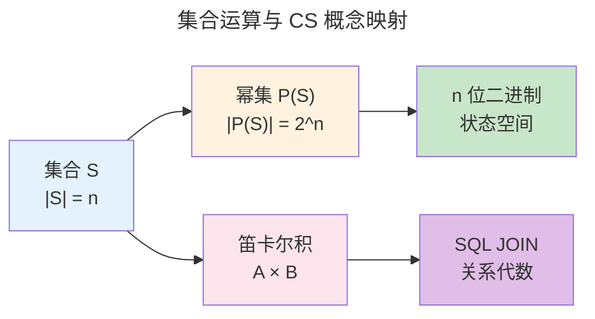
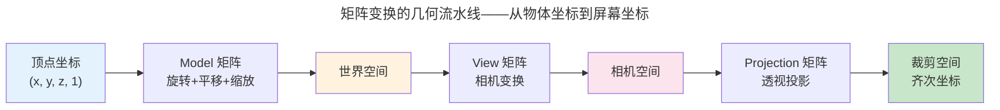

> 数学是硬件设计的语言，逻辑是程序执行的骨架。

计算机科学的每一个核心概念——图灵机、复杂度、密码学、机器学习——都建立在数学的基础之上。本章不是数学教科书的替代品，而是一张"CS 从业者必备的数学速查地图"：从集合论的符号系统，到线性代数的高维直觉，再到概率论的随机思维和信息论的熵度量。每一个概念都配有它在整个知识体系中的直接编程或系统应用。

### 数学与计算的关系

计算机科学中的数学不是证明定理的目的，而是**建模工具**。集合论建模了数据结构——数组是索引到元素的函数、哈希表是键到值的偏函数、SQL 表是关系的集合。线性代数建模了空间变换——3D 渲染的顶点变换、神经网络的层间权重、推荐系统的矩阵分解，本质都是矩阵乘法。概率论建模了不确定性——机器学习从数据中学习概率分布、密码学依赖随机性对抗攻击者、哈希函数用概率保证均匀分布。信息论建模了信息的物理极限——无损压缩的理论下限由熵决定、信道容量的上限由 Shannon 定理限制。

这四种数学工具在 CS 中不孤立存在——一个推荐系统同时用到线性代数（协同过滤的矩阵分解）、概率论（Bayesian 个性化排序）、信息论（交叉熵损失函数）和集合论（候选集去重）。数学是同一套物理现实在不同抽象层的投影，每一层为不同的问题提供最有效的分析语言。

:::note[跨卷链接]
这些数学概念在 [卷六 · 须弥（机器学习基础）](../../06-xumi/01-machine-learning-basics/) 中会变成具体模型的代码实现——数学是建筑的蓝图，代码是建筑的实体。
:::

---

## 集合论：一切描述的语言

**集合**是最基础的数学对象。CS 中几乎一切都可以用集合表示：数据类型是值的集合、关系是元组的集合、语言是字符串的集合。

- **幂集** $\mathcal{P}(S)$：$S$ 的所有子集的集合。若 $|S| = n$，则 $|\mathcal{P}(S)| = 2^n$——这正是 n 位二进制所能表示的所有状态数。一个 4 位寄存器有 $2^4 = 16$ 个可能状态，对应 $\mathcal{P}(\{b_0,b_1,b_2,b_3\})$ 中的 16 个子集。

**幂集的具体构造**。取 $S = \{a, b, c\}$（一个 3 元素集合），它的所有子集是：

$$
\mathcal{P}(S) = \{\emptyset, \{a\}, \{b\}, \{c\}, \{a,b\}, \{a,c\}, \{b,c\}, \{a,b,c\}\}
$$

共 $2^3 = 8$ 个子集。每个子集可以用一个 3 位二进制数表示——第 1 位表示选不选 a，第 2 位选不选 b，第 3 位选不选 c。例如 `101` 对应 $\{a, c\}$。这种"子集 ↔ 二进制数"的一一对应，是计算机中**位掩码**（bitmask）的数学根基——Linux 文件权限 `rwx`（读、写、执行）就是用一个 3 位掩码表示的 8 个子集之一。

- **笛卡尔积** $A \times B$：有序对 $(a, b)$ 的集合——关系型数据库中"表连接"的数学原型。`SELECT * FROM A JOIN B` 的结果集正是 $A \times B$ 中满足 JOIN 条件的子集。

**手算示例**。若 $A = \{1, 2\}$，$B = \{x, y, z\}$，则：

$$
A \times B = \{(1,x), (1,y), (1,z), (2,x), (2,y), (2,z)\}
$$

共 $2 \times 3 = 6$ 个有序对。这正好是 SQL 中 `SELECT * FROM A CROSS JOIN B` 的结果——先做全笛卡尔积（$|A| \times |B|$ 行），再用 WHERE 条件过滤。

---

## 线性代数：高维空间的几何直觉

**矩阵**表示线性变换——保持原点不变、将直线映射为直线的空间变换。矩阵乘法的几何意义：$A \cdot \vec{v}$ 是对向量 $\vec{v}$ 施以变换 $A$。这种变换可以分解为**旋转**（正交矩阵）和**缩放**（对角矩阵）的组合——这就是 SVD（奇异值分解）的几何本质。

**矩阵乘法的逐坐标计算**。以一个 $2 \times 2$ 矩阵作用在二维向量上为例：

$$
\begin{bmatrix} 2 & 1 \\ 0 & 3 \end{bmatrix}
\cdot
\begin{bmatrix} x \\ y \end{bmatrix}
=
\begin{bmatrix} 2x + 1y \\ 0x + 3y \end{bmatrix}
$$

取点 $(1, 1)$，变换后为 $(3, 3)$；取点 $(1, 0)$，变换后为 $(2, 0)$。矩阵第一列 $(2, 0)$ 是单位向量 $(1, 0)$ 的像——它告诉我们"x 轴被拉伸 2 倍"；第二列 $(1, 3)$ 是 $(0, 1)$ 的像——"y 方向被拉伸 3 倍并向右偏移 1"。**矩阵的每一列，都是对应坐标轴的变换结果**。

> CSS 的 `transform: matrix(a, b, c, d, e, f)` 就对应矩阵 $\begin{bmatrix} a & c & e \\ b & d & f \\ 0 & 0 & 1 \end{bmatrix}$。`rotate(45deg)` 和 `scale(1.2)` 不过是把这个矩阵分解为更容易理解的操作——但浏览器内部依然在用矩阵乘法计算每个像素的新位置。

**特征向量**是变换下方向不变的向量，**特征值**是沿该方向的缩放因子：

$$
A \vec{v} = \lambda \vec{v}
$$

PageRank 中网页重要性向量即转移矩阵的主特征向量（$\lambda = 1$ 对应稳态分布）；PCA 降维中主成分即协方差矩阵的前 k 个特征向量张成的子空间——保留方差最大的方向，丢弃方差最小的方向，实现在低维空间中保持数据的主要结构。

---

## 概率论：不确定性的数学

### 贝叶斯定理与机器学习

$$
P(A|B) = \frac{P(B|A) \cdot P(A)}{P(B)}
$$

这一定理是机器学习的理论基石。朴素贝叶斯分类器假设各特征在给定类别下条件独立——这个"朴素"假设虽然在现实中几乎不成立，但在文本分类（垃圾邮件检测）中依然高效准确。原因在于：即使 $P(B|A)$ 的乘积不精确，各类别的**相对排序**依然正确——而分类只需要排序。

**手算一个垃圾邮件分类器**。假设训练数据统计如下：

- 正常邮件的概率 $P(\text{正常}) = 0.7$，垃圾邮件的概率 $P(\text{垃圾}) = 0.3$
- 在正常邮件中，出现"免费"的概率 $P(\text{免费} \mid \text{正常}) = 0.01$
- 在垃圾邮件中，出现"免费"的概率 $P(\text{免费} \mid \text{垃圾}) = 0.3$

现在收到一封包含"免费"的邮件，它是垃圾邮件的概率是多少？

$$
P(\text{垃圾} \mid \text{免费}) = \frac{P(\text{免费} \mid \text{垃圾}) \cdot P(\text{垃圾})}{P(\text{免费})}
$$

$$
P(\text{免费}) = 0.3 \times 0.3 + 0.01 \times 0.7 = 0.09 + 0.007 = 0.097
$$

$$
P(\text{垃圾} \mid \text{免费}) = \frac{0.3 \times 0.3}{0.097} = \frac{0.09}{0.097} \approx 0.928
$$

一封含"免费"的邮件有 92.8% 的概率是垃圾。这就是贝叶斯定理的核心力量——它用**先验知识**（训练数据中的统计规律）更新对**后验概率**（新邮件的类别）的推断。每次新数据到来，贝叶斯公式就是一个从"以前的经验"到"现在的判断"的更新函数。

### 期望与方差

- **期望** $E[X]$：随机变量的平均值——算法平均运行时间分析的基础。快速排序的期望时间 $O(n \log n)$，但最坏情况下 $O(n^2)$——这就是为什么随机化 pivot 如此重要。
- **方差** $Var(X) = E[(X - E[X])^2]$：离散程度——负载均衡中任务分配抖动的度量。Consistent Hashing 将节点数变化时键的重新分配量从 $O(n)$ 降到 $O(1/n)$，本质上是降低了重分配的方差。

---

## 信息论：信息的数学度量

信息论定义了信息的物理极限。**熵**度量一个随机变量的不确定性：

$$
H(X) = -\sum_{x} P(x) \log_2 P(x)
$$

- 均匀分布的熵最大（最不确定）——一枚公平硬币的熵为 1 bit
- 确定事件的熵为零——如果 $P(x)=1$，则 $\log_2 1 = 0$
- 熵是数据压缩的理论极限——霍夫曼编码、算术编码都在逼近某一分布的熵下限

**手算一个分布的熵**。比较两个分布的信息量：

- **偏斜分布**：$P(\text{晴天}) = 0.9$，$P(\text{雨}) = 0.1$
  $$
  H = -(0.9 \log_2 0.9 + 0.1 \log_2 0.1) = -( -0.137 + -0.332 ) \approx 0.47 \text{ bit}
  $$
  ——几乎可以确定是晴天，信息量很小

- **均匀分布**：$P(\text{晴天}) = 0.5$，$P(\text{雨}) = 0.5$
  $$
  H = -(0.5 \log_2 0.5 + 0.5 \log_2 0.5) = -( -0.5 + -0.5 ) = 1.0 \text{ bit}
  $$
  ——完全不确定，需要 1 bit 才能传这个消息

这解释了为什么 [Huffman 编码](https://en.wikipedia.org/wiki/Huffman_coding) 对高频字符用短码（如英语中 `e` 用 3 bit）、对低频字符用长码（如 `z` 用 10 bit）——平均码长在逼近信息熵给出的理论下限。

**KL 散度**（相对熵）度量两个分布的差异：$D_{KL}(P \parallel Q) = \sum P(x) \log \frac{P(x)}{Q(x)}$。在机器学习中，交叉熵损失函数的核心正是 KL 散度——最小化模型预测分布 $Q$ 与真实分布 $P$ 的距离。

---

## 跨卷连接

| 本章概念 | 在 CS 中的直接应用 |
|----------|------------------|
| 集合与笛卡尔积 | [关系型代数的 SQL JOIN](../../04-yuanhai/01-relational-database/) |
| 矩阵乘法的几何变换 | [顶点处理与 MVP 变换](../../05-wanxiang/01-gpu-rendering-pipeline/#顶点处理与-mvp-变换) |
| 特征值分解与 SVD | [PCA 降维与推荐系统的协同过滤](../../06-xumi/01-machine-learning-basics/) |
| 贝叶斯定理 | [朴素贝叶斯分类器的条件独立性假设](../../06-xumi/01-machine-learning-basics/) |
| 信息熵与 KL 散度 | [HTTP/2 帧格式——多路复用的结构化基础](../../03-qiankun/07-application-protocols/#http2-帧格式多路复用的结构化基础) |
| 幂集的指数增长 | [n 位寄存器状态空间——组合逻辑的真值表行数（组合逻辑）](../../01-weichen/02-digital-logic/#组合逻辑) |

:::tip[卷零内部路径]
- [**形式逻辑**](../02-formal-logic/)：数学证明的形式化系统——柯里霍华德同构
- [**计算理论**](../03-theory-of-computation/)：可计算性的数学边界——停机问题的自指悖论
- [**密码学数学**](../06-cryptographic-mathematics/)：有限域与椭圆曲线——安全的代数根基
:::
