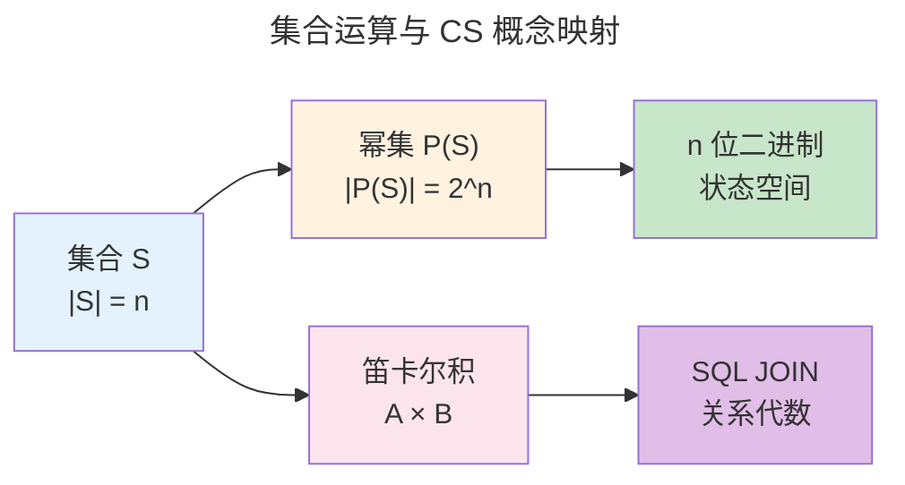
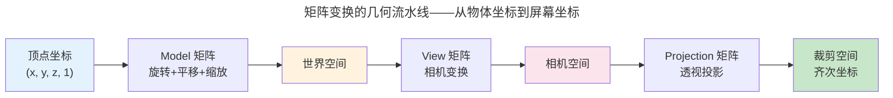

> 数学是硬件设计的语言，逻辑是程序执行的骨架。

计算机科学的每一个核心概念——图灵机、复杂度、密码学、机器学习——都建立在数学的基础之上。本章不是数学教科书的替代品，而是一张"CS 从业者必备的数学速查地图"：从集合论的符号系统，到线性代数的高维直觉，再到概率论的随机思维和信息论的熵度量。每一个概念都配有它在整个知识体系中的直接编程或系统应用。

---

## 集合论：一切描述的语言

**集合**是最基础的数学对象。CS 中几乎一切都可以用集合表示：数据类型是值的集合、关系是元组的集合、语言是字符串的集合。

- **幂集** $\mathcal{P}(S)$：$S$ 的所有子集的集合。若 $|S| = n$，则 $|\mathcal{P}(S)| = 2^n$——这正是 n 位二进制所能表示的所有状态数。一个 4 位寄存器有 $2^4 = 16$ 个可能状态，对应 $\mathcal{P}(\{b_0,b_1,b_2,b_3\})$ 中的 16 个子集。
- **笛卡尔积** $A \times B$：有序对 $(a, b)$ 的集合——关系型数据库中"表连接"的数学原型。`SELECT * FROM A JOIN B` 的结果集正是 $A \times B$ 中满足 JOIN 条件的子集。

---

## 线性代数：高维空间的几何直觉

**矩阵**表示线性变换——保持原点不变、将直线映射为直线的空间变换。矩阵乘法的几何意义：$A \cdot \vec{v}$ 是对向量 $\vec{v}$ 施以变换 $A$。这种变换可以分解为**旋转**（正交矩阵）和**缩放**（对角矩阵）的组合——这就是 SVD（奇异值分解）的几何本质。

**特征向量**是变换下方向不变的向量，**特征值**是沿该方向的缩放因子：

$$
A \vec{v} = \lambda \vec{v}
$$

PageRank 中网页重要性向量即转移矩阵的主特征向量（$\lambda = 1$ 对应稳态分布）；PCA 降维中主成分即协方差矩阵的前 k 个特征向量张成的子空间——保留方差最大的方向，丢弃方差最小的方向，实现在低维空间中保持数据的主要结构。

---

## 概率论：不确定性的数学

### 贝叶斯定理与机器学习

$$
P(A|B) = \frac{P(B|A) \cdot P(A)}{P(B)}
$$

这一定理是机器学习的理论基石。朴素贝叶斯分类器假设各特征在给定类别下条件独立——这个"朴素"假设虽然在现实中几乎不成立，但在文本分类（垃圾邮件检测）中依然高效准确。原因在于：即使 $P(B|A)$ 的乘积不精确，各类别的**相对排序**依然正确——而分类只需要排序。

### 期望与方差

- **期望** $E[X]$：随机变量的平均值——算法平均运行时间分析的基础。快速排序的期望时间 $O(n \log n)$，但最坏情况下 $O(n^2)$——这就是为什么随机化 pivot 如此重要。
- **方差** $Var(X) = E[(X - E[X])^2]$：离散程度——负载均衡中任务分配抖动的度量。Consistent Hashing 将节点数变化时键的重新分配量从 $O(n)$ 降到 $O(1/n)$，本质上是降低了重分配的方差。

---

## 信息论：信息的数学度量

信息论定义了信息的物理极限。**熵**度量一个随机变量的不确定性：

$$
H(X) = -\sum_{x} P(x) \log_2 P(x)
$$

- 均匀分布的熵最大（最不确定）——一枚公平硬币的熵为 1 bit
- 确定事件的熵为零——如果 $P(x)=1$，则 $\log_2 1 = 0$
- 熵是数据压缩的理论极限——霍夫曼编码、算术编码都在逼近某一分布的熵下限

**KL 散度**（相对熵）度量两个分布的差异：$D_{KL}(P \parallel Q) = \sum P(x) \log \frac{P(x)}{Q(x)}$。在机器学习中，交叉熵损失函数的核心正是 KL 散度——最小化模型预测分布 $Q$ 与真实分布 $P$ 的距离。

---

## 跨卷连接

| 本章概念 | 在 CS 中的直接应用 |
|----------|------------------|
| 集合与笛卡尔积 | [关系型代数的 SQL JOIN](../../04-yuanhai/01-relational-database/) |
| 矩阵乘法的几何变换 | [顶点处理与 MVP 变换](../../05-wanxiang/01-gpu-rendering-pipeline/#顶点处理与-mvp-变换) |
| 特征值分解与 SVD | [PCA 降维与推荐系统的协同过滤](../../06-xumi/01-machine-learning-basics/) |
| 贝叶斯定理 | [朴素贝叶斯分类器的条件独立性假设](../../06-xumi/01-machine-learning-basics/) |
| 信息熵与 KL 散度 | [HTTP/2 帧格式——多路复用的结构化基础](../../03-qiankun/07-application-protocols/#http2-帧格式多路复用的结构化基础) |
| 幂集的指数增长 | [n 位寄存器状态空间——组合逻辑的真值表行数（组合逻辑）](../../01-weichen/02-digital-logic/#组合逻辑) |

:::tip[卷零内部路径]
- [**形式逻辑**](../02-formal-logic/)：数学证明的形式化系统——柯里霍华德同构
- [**计算理论**](../03-theory-of-computation/)：可计算性的数学边界——停机问题的自指悖论
- [**密码学数学**](../06-cryptographic-mathematics/)：有限域与椭圆曲线——安全的代数根基
:::
