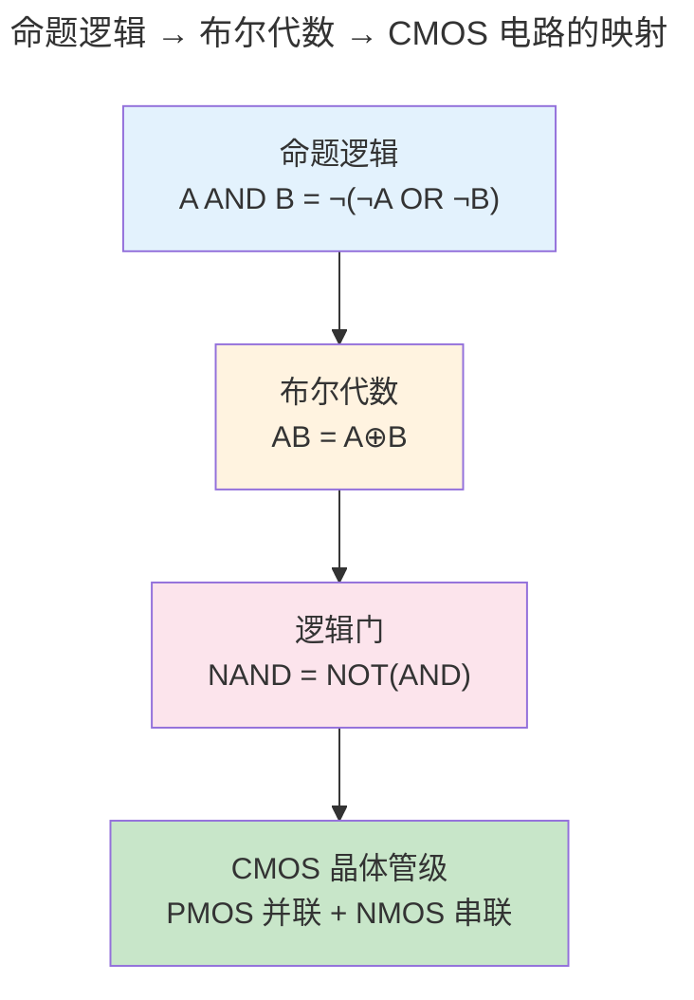
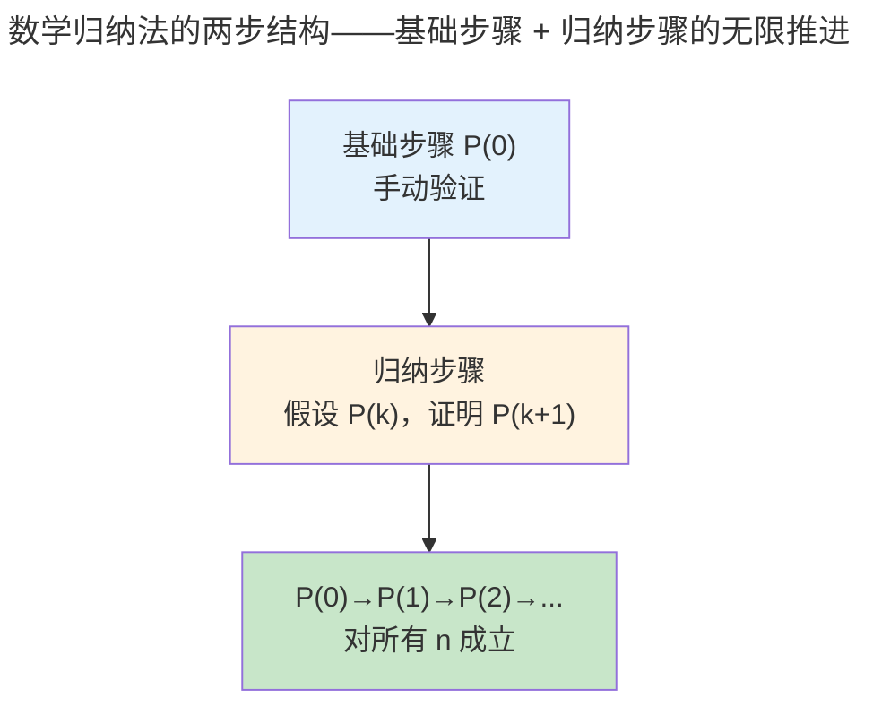
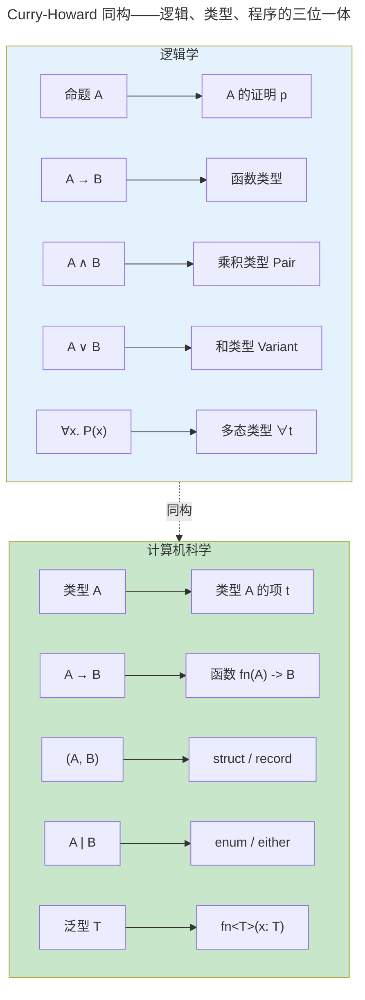

> 从命题到证明，形式化是一切计算的元语言。

程序在 CPU 上执行前，先经过编译器的类型检查。这个类型系统不是随意的语法糖——它的数学根基是**形式逻辑**。命题逻辑提供了布尔代数的真值表，一阶逻辑引入了"对所有"和"存在"的量词，而类型论通过 Curry-Howard 同构将**证明与程序**、**命题与类型**一一对应。

### 日常推理的歧义陷阱

在进入形式系统之前，先看看为什么自然语言的推理不可靠。考虑三个简单的日常推论：

1. **肯定后件的谬误**："如果下雨，地面就会湿。现在地面是湿的。所以下雨了。"——这个推理在逻辑上无效，因为地面湿可能因为洒水车经过。自然语言中我们经常犯这个错误，因为它听起来"合理"——但它不是逻辑必然的。形式逻辑用 $A \to B$ 的真值表精确揭示：当 A 为假、B 为真时，$A \to B$ 为真——但反过来 $B \to A$ 不一定为真。

2. **量词的歧义**："每个男孩都喜欢一个女孩。"——是指每个男孩都有自己喜欢的那个女孩（$ \forall x \exists y.\ \text{Likes}(x, y) $，可能是不同的女孩），还是所有男孩都喜欢同一个人（$ \exists y \forall x.\ \text{Likes}(x, y) $，存在一个女孩被所有男孩喜欢）？自然语言无法区分，但一阶逻辑用量词顺序 $\forall\exists$ vs $\exists\forall$ 精确锁定两种完全不同的含义。

3. **模糊谓词**："从头上拔掉一根头发不会变成秃头。如果拔一根不会，那么拔两根也不会……所以永远拔不成秃头？"自然语言中的"秃头"没有精确的头发数量边界。形式逻辑通过将谓词定义为确定的集合（如"头发数 ≤ 1000"），消除了这种模糊性——边界明确后，悖论消失。

这三种陷阱对应了形式逻辑要解决的三个核心问题：**推理的有效性**（什么是必然结论）、**量词的精确性**（"每个"和"存在"的确切含义）、**谓词的确定性**（每个性质到底对哪些对象成立）。理解这些问题之后，再看形式系统——命题逻辑、一阶逻辑、Curry-Howard 同构——就不是枯燥的符号游戏，而是为解决这些真实的推理陷阱而精心设计的工具。

### 为什么需要形式逻辑

日常推理依赖直觉，但直觉经常出错。考虑这个推论："如果下雨，地面就会湿。现在地面是湿的。所以下雨了。"——这个推理在逻辑上是无效的（地面可能被洒水车弄湿）。自然语言充满歧义，同一个句子在不同语境下可以有不同的真值。形式逻辑通过将推理规则化为无歧义的符号操作，消除了这种模糊性。

形式逻辑对计算机科学之所以根本，是因为**计算本身就是符号操作**。CPU 的 ALU 在执行 `AND` 指令时，它不"理解"真假——它只是按照真值表将一个电压组合映射为另一个电压组合。编译器的类型检查器在验证 `fn(x: i32) -> String` 时，它不"理解"这个函数的意图——它只是按照推理规则检查类型构造是否合法。形式逻辑提供了这种"无需理解、只需操作"的机械推理系统，这正是计算可行的数学保证。

:::note[跨卷链接]
逻辑推理的确定性最终在 [卷一 · 微尘——数字逻辑（组合逻辑）](../../01-weichen/02-digital-logic/#组合逻辑) 中变成物理电路——每一个 AND 门都是一次逻辑"与"的物理实现。
:::

---

## 命题逻辑：布尔代数的数学根基

命题逻辑处理的是"原子命题"和逻辑连接词（与 $\land$、或 $\lor$、非 $\neg$、蕴含 $\to$）。一个复合命题的真值完全由原子命题的真值和连接词的真值表决定——这正是[数字逻辑中组合电路](../../01-weichen/02-digital-logic/)的数学抽象。

### 基本真值表

命题只有两种状态——**真**（T, 1）或**假**（F, 0）。这正好对应计算机中最小的信息单位——**一个比特**。所以命题逻辑其实就是"1 bit 的逻辑运算"。

| A | B | $A \land B$ | $A \lor B$ | $A \to B$ | $\neg A$ |
|---|----|-------------|------------|-----------|---------|
| T | T | T | T | T | F |
| T | F | F | T | F | F |
| F | T | F | T | T | T |
| F | F | F | F | T | T |

**手把手读真值表**：每一行是一个"世界"——A 和 B 的真假组合。最右列告诉你在这个世界里，复合命题的真假。

- $\land$（与）：只有 A 和 B **都**为真时才真——"必须两个条件都满足"
- $\lor$（或）：只要 A 和 B **至少一个**为真就真——"满足任意一个就行"
- $\neg$（非）：反转真假——1 变 0，0 变 1
- $\to$（蕴含）：**初学者最困惑的符号**。$A \to B$ 只在 $A$ 真而 $B$ 假时为假——可以理解为"如果前提成立，结论就必须成立"。当前提不成立时（A 为 F），承诺失效，不管 B 怎样都算真——这叫"空虚真"。

**蕴含的实际意义**。想象编译器说："如果类型推断成功（A），程序就编译通过（B）"。$A \to B$ 为假的那一行（A=T, B=F）就是编译器的 bug——类型推断成功了但程序没编译通过。其余三行都是合理状态：推断成功且编译通过（好！）；推断失败且编译失败（当然）；推断失败但程序偶然编译通过（没走那条路，不算违规）。

**自然演绎的推理规则**。从真值表出发，逻辑学定义了一套"从已知命题推导新命题"的规则系统。其中最核心的两条：

$$
\text{Modus Ponens（肯定前件）：}\quad \frac{A \to B \quad A}{B}
$$

$$
\text{Modus Tollens（否定后件）：}\quad \frac{A \to B \quad \neg B}{\neg A}
$$

Modus Ponens 是正向推理：已知"下雨→地湿"和"下雨了"，推出"地湿"。Modus Tollens 是逆向推理：已知"下雨→地湿"和"地没湿"，推出"没下雨"。这两个规则互为镜像——它们构成了 [计算理论（自动机）](../03-theory-of-computation/) 中 DFA 状态转移的推理基础：每个时钟沿，DFA 都执行一次 Modus Ponens——"如果当前状态是 $q_i$ 且输入是 $a$，则下一状态是 $q_j$"。

### 逻辑等价：同一个意思的不同说法

两个命题逻辑上等价，当且仅当它们在所有可能世界中具有相同的真值——即它们的真值表完全一致。等价变换是化简布尔表达式、优化电路、重构代码条件分支的核心工具。

**最重要的等价关系**：

| 等价形式 | 名称 | 编程意义 |
|---------|------|---------|
| $A \to B \equiv \neg A \lor B$ | 蕴含的析取定义 | `if A { B }` 等价于 `!A \|\| B` |
| $\neg(A \land B) \equiv \neg A \lor \neg B$ | 德摩根律（与） | `!(A && B)` = `!A \|\| !B` |
| $\neg(A \lor B) \equiv \neg A \land \neg B$ | 德摩根律（或） | `!(A \|\| B)` = `!A && !B` |
| $A \land (B \lor C) \equiv (A \land B) \lor (A \land C)$ | 分配律 | 展开嵌套条件 |
| $\neg(\neg A) \equiv A$ | 双重否定 | `!!x` 等价于 `x` |

**手把手做一次等价变换**。将 $A \to (B \to C)$ 化简为仅含 $\land, \lor, \neg$ 的形式：

$$
\begin{aligned}
A \to (B \to C) &\equiv \neg A \lor (B \to C) && \text{（第一次：拆外层蕴含）} \\
&\equiv \neg A \lor (\neg B \lor C) && \text{（第二次：拆内层蕴含）} \\
&\equiv \neg A \lor \neg B \lor C && \text{（结合律：去掉括号）}
\end{aligned}
$$

这三步变换完全机械——每一步只是将 $X \to Y$ 替换为 $\neg X \lor Y$。没有"理解"、没有"直觉"、没有创造力——这正是编译器优化布尔表达式时使用的算法：用重写规则将任何逻辑表达式化为标准形式（合取范式 CNF 或析取范式 DNF），进而判断等价性或可满足性。SAT 求解器在验证 [数字逻辑（组合逻辑）](../../01-weichen/02-digital-logic/#组合逻辑) 的电路等价性时，就是将电路输出函数展开为 CNF，然后调用 SAT 引擎判定两个 CNF 是否等价——这一流程从逻辑等价变换的第 0 步开始。

### 德摩根定律与电路实现

$$
\neg (A \land B) \equiv \neg A \lor \neg B
$$
$$
\neg (A \lor B) \equiv \neg A \land \neg B
$$

这两个定律在 [CMOS 门电路（CMOS 门电路实现）（CMOS 门电路实现）](../../01-weichen/02-digital-logic/#cmos-门电路实现)中直接体现——NAND 门用四个晶体管实现（PMOS 并联 + NMOS 串联），NOR 门用互补拓扑（PMOS 串联 + NMOS 并联）。这种"推-拉"对称关系正是德摩根定律的硅基实现。



### 反证法与数学归纳法：两种基本证明范式

从命题逻辑的推理规则出发，数学家和计算机科学家发展了两套最常用的证明策略。它们不是新的逻辑系统，而是已有推理规则的组合套路。

**反证法（归谬法，Proof by Contradiction）**：要证明命题 $P$，先假设 $\neg P$ 为真，推导出一个矛盾（如 $Q \land \neg Q$），由此反推 $\neg P$ 不可能成立，故 $P$ 必真。

形式化地：若 $\neg P \to (Q \land \neg Q)$ 为重言式，则 $P$ 为真。这之所以有效，是因为蕴含式 $\neg P \to \text{false}$ 在逻辑上等价于 $P$——"如果非 P 导致矛盾，则 P 必须成立"。

欧几里得证明"素数有无穷多个"是反证法的经典示例：
1. 假设素数有限：$\{p_1, p_2, \dots, p_n\}$ 为全部素数
2. 构造 $N = p_1 \times p_2 \times \dots \times p_n + 1$
3. $N$ 不能被任何 $p_i$ 整除（余数总是 1）——所以 $N$ 要么本身是素数，要么有一个不在列表中的素因子
4. 无论哪种情况，都与"$\{p_1, \dots, p_n\}$ 为全部素数"的假设矛盾
5. 故素数有无穷多个

在计算机科学中，反证法用于证明**停机问题的不可判定性**——假设存在通用停机判定器，构造一个自指悖论导致矛盾（参见 [计算理论（停机问题：不可判定的第一道墙）](../03-theory-of-computation/#停机问题不可判定的第一道墙)）。

**数学归纳法（Mathematical Induction）**：要证明性质 $P(n)$ 对所有自然数 $n$ 成立，只需证明两步：

1. **基础步骤**：$P(0)$（或 $P(1)$）成立
2. **归纳步骤**：假设 $P(k)$ 成立（归纳假设），证明 $P(k+1)$ 也成立

形式化地：$P(0) \land (\forall k.\ P(k) \to P(k+1)) \to \forall n.\ P(n)$。归纳法的有效性来源于自然数的良序性——没有无穷递降链。



归纳法是算法正确性证明的标配工具。以归并排序的正确性为例：
- **基础**：长度为 1 的数组天然有序
- **归纳**：假设对长度 < n 的数组 `mergesort` 能正确排序；`mergesort(arr[1..n])` 将数组拆分为两半，分别递归排序（归纳假设保证正确），然后用 `merge` 合并两个有序数组——`merge` 的正确性由循环不变量保证：每一步合并后，结果数组中的元素是输入数组元素的有序排列

在 [Curry-Howard 同构](#curry-howard-同构程序即证明) 中，归纳法对应了**递归函数**的类型——基础步骤对应递归的 base case，归纳步骤对应递归调用。这就是为什么函数式语言中的递归函数必须有 base case：它不仅是终止条件，也是归纳证明的基础步骤。

---

## 一阶逻辑：引入量词

一阶逻辑在命题逻辑的基础上引入了**量词**：$\forall x$（对所有 x）和 $\exists x$（存在 x）。这使形式逻辑可以表达诸如"所有进程最终都会终止"和"存在一个不进入死锁的调度"这样的声明。

**量词的本质——从"一个"到"一群"的升级**。命题逻辑只能谈具体的个体："进程 42 终止了"。一阶逻辑可以谈全体："所有进程都终止了"。这个升级使逻辑的表达能力发生了质的飞跃——从只能查一个数据，到能写 SQL 查询。

| 逻辑语句 | 自然语言 | SQL 等价 |
|---------|---------|---------|
| $\forall x.\ P(x)$ | 所有 x 都满足 P | `SELECT COUNT(*) = 0 FROM T WHERE NOT P` |
| $\exists x.\ P(x)$ | 至少存在一个 x 满足 P | `SELECT COUNT(*) > 0 FROM T WHERE P` |
| $\forall x.\ \exists y.\ R(x,y)$ | 每个 x 都有某个 y 与之配对 | `GROUP BY x HAVING COUNT(y) > 0` |

最后一个模式特别重要：它表达了**函数关系**——每个输入都有输出。这种量化模式在数据库中是外键约束，在编程中是函数类型签名 `fn(A) -> B`，在操作系统（[进程与线程](../../03-qiankun/01-process-and-thread/)）中是"每个进程都有一个唯一的 PID"。

一阶逻辑也是 SQL 的基础——`SELECT * FROM users WHERE age > 18` 的逻辑形式是 $\{x \in \text{users} \mid \text{age}(x) > 18\}$——即**集合构造符号**的直接翻译。`GROUP BY` 是对论域进行等价类划分，聚合函数（`COUNT`, `SUM`）是各等价类上的函数应用。

---

## Curry-Howard 同构：程序即证明

Curry-Howard 同构揭示了逻辑学与计算机科学之间最深刻的联系——它指出**写程序就是构造证明，类型检查就是验证证明**。

**用一个具体例子来理解**。假设我们有一个命题 $A \to B \to A$（如果 A 成立，那么如果 B 成立，A 仍然成立）。在逻辑学中这是一个重言式——永远为真。在编程中，它对应函数类型 `fn(A, B) -> A`。你能写一个这样的函数吗？当然：

```rust
fn first#60;A, B#62;(a: A, _b: B) -> A {
    a  // 扔掉 b，返回 a——"如果 A 成立，无论 B 如何，A 都成立"
}
```

每次你写出一个函数并编译通过，你都在构造一个逻辑证明。编译器验证类型的过程，就是验证你的"证明"（程序）是否真的支持"命题"（类型签名）。如果编译失败——比如你声称返回 `A` 却返回了 `B`——那就是证明有漏洞，正如数学证明不能从错误前提出发推出矛盾结论。



| 逻辑 | 类型论 | 编程实践 |
|------|--------|---------|
| 命题 $A$ | 类型 `A` | 类型声明 |
| 证明 $p$ of $A$ | 项 $t$ : `A` | 表达式 |
| $A \to B$ | 函数类型 `A -> B` | 函数/闭包 |
| $A \land B$ | 乘积类型 (A, B) | Pair / Record / Tuple |
| $A \lor B$ | 和类型 `A \| B` | Variant / Either / enum |
| $\forall \alpha. A$ | 多态类型 `forall a. a -> a` | 泛型 / trait |

> Rust 的 `Result<T, E>` 是 $T \lor E$ 的编程实现——函数返回成功值 T **或** 错误 E。Haskell 的 `Maybe a` 是 $a \lor \bot$——值 a 或什么都没有。这些都不是语言设计者的随意决定，而是 Curry-Howard 同构在类型系统中的必然推论。

---

## 跨卷连接

| 本章概念 | 在 CS 中的直接应用 |
|----------|------------------|
| 命题逻辑与真值表 | [组合逻辑门——AND/OR/NOT 的真值表实现（基本逻辑门与真值表）（基本逻辑门与真值表）](../../01-weichen/02-digital-logic/#基本逻辑门与真值表) |
| 德摩根定律 | [CMOS NAND/NOR 门的互补晶体管拓扑（CMOS 门电路实现）（CMOS 门电路实现）](../../01-weichen/02-digital-logic/#cmos-门电路实现) |
| 一阶逻辑量词 | [SQL WHERE/∀/∃ 语义——集合构造符号的工程实现](../../04-yuanhai/01-relational-database/) |
| 柯里霍华德同构 | [Rust 所有权类型的仿射逻辑基础——借用检查器即证明检查器](../../08-qianli/01-design-patterns-and-principles/) |
| 类型推导（Hindley-Milner） | [编译原理——HM 类型系统的 unification 算法](../05-compiler-theory/) |
| 自然演绎的推理规则 | [定理证明器 Coq/Lean 的 tactic 语言——从证明到程序提取](../05-compiler-theory/) |

:::tip[卷零内部路径]
- [**计算理论**](../03-theory-of-computation/)：自动机与形式语言的逻辑对应——正则语言 = 命题时序逻辑
- [**编译原理**](../05-compiler-theory/)：类型系统在编译器中的完整实现——从 HM 到 Rust trait solver
:::
