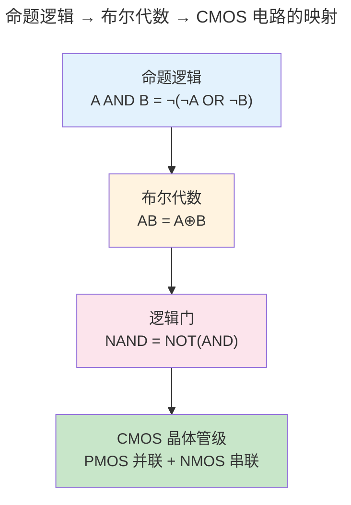
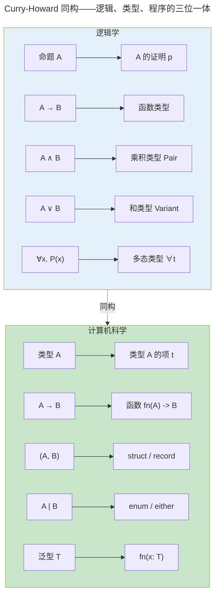

> 从命题到证明，形式化是一切计算的元语言。

程序在 CPU 上执行前，先经过编译器的类型检查。这个类型系统不是随意的语法糖——它的数学根基是**形式逻辑**。命题逻辑提供了布尔代数的真值表，一阶逻辑引入了"对所有"和"存在"的量词，而类型论通过 Curry-Howard 同构将**证明与程序**、**命题与类型**一一对应。

---

## 命题逻辑：布尔代数的数学根基

命题逻辑处理的是"原子命题"和逻辑连接词（与 $\land$、或 $\lor$、非 $\neg$、蕴含 $\to$）。一个复合命题的真值完全由原子命题的真值和连接词的真值表决定——这正是[数字逻辑中组合电路](../../01-weichen/02-digital-logic/)的数学抽象。

### 基本真值表

| A | B | $A \land B$ | $A \lor B$ | $A \to B$ | $\neg A$ |
|---|----|-------------|------------|-----------|---------|
| T | T | T | T | T | F |
| T | F | F | T | F | F |
| F | T | F | T | T | T |
| F | F | F | F | T | T |

### 德摩根定律与电路实现

$$
\neg (A \land B) \equiv \neg A \lor \neg B
$$
$$
\neg (A \lor B) \equiv \neg A \land \neg B
$$

这两个定律在 [CMOS 门电路](../../01-weichen/02-digital-logic/#cmos-门电路实现)中直接体现——NAND 门用四个晶体管实现（PMOS 并联 + NMOS 串联），NOR 门用互补拓扑（PMOS 串联 + NMOS 并联）。这种"推-拉"对称关系正是德摩根定律的硅基实现。

---

## 一阶逻辑：引入量词

一阶逻辑在命题逻辑的基础上引入了**量词**：$\forall x$（对所有 x）和 $\exists x$（存在 x）。这使形式逻辑可以表达诸如"所有进程最终都会终止"和"存在一个不进入死锁的调度"这样的声明。

一阶逻辑也是 SQL 的基础——`SELECT * FROM users WHERE age > 18` 的逻辑形式是 $\{x \in \text{users} \mid \text{age}(x) > 18\}$——即**集合构造符号**的直接翻译。`GROUP BY` 是对论域进行等价类划分，聚合函数（`COUNT`, `SUM`）是各等价类上的函数应用。

---

## Curry-Howard 同构：程序即证明

Curry-Howard 同构揭示了逻辑学与计算机科学之间最深刻的联系——它指出**写程序就是构造证明，类型检查就是验证证明**。

| 逻辑 | 类型论 | 编程实践 |
|------|--------|---------|
| 命题 $A$ | 类型 `A` | 类型声明 |
| 证明 $p$ of $A$ | 项 $t$ : `A` | 表达式 |
| $A \to B$ | 函数类型 `A -> B` | 函数/闭包 |
| $A \land B$ | 乘积类型 (A, B) | Pair / Record / Tuple |
| $A \lor B$ | 和类型 `A \| B` | Variant / Either / enum |
| $\forall \alpha. A$ | 多态类型 `forall a. a -> a` | 泛型 / trait |

> Rust 的 `Result<T, E>` 是 $T \lor E$ 的编程实现——函数返回成功值 T **或** 错误 E。Haskell 的 `Maybe a` 是 $a \lor \bot$——值 a 或什么都没有。这些都不是语言设计者的随意决定，而是 Curry-Howard 同构在类型系统中的必然推论。

---

## 跨卷连接

| 本章概念 | 在 CS 中的直接应用 |
|----------|------------------|
| 命题逻辑与真值表 | [组合逻辑门——AND/OR/NOT 的真值表实现](../../01-weichen/02-digital-logic/#基本逻辑门与真值表) |
| 德摩根定律 | [CMOS NAND/NOR 门的互补晶体管拓扑](../../01-weichen/02-digital-logic/#cmos-门电路实现) |
| 一阶逻辑量词 | [SQL WHERE/∀/∃ 语义——集合构造符号的工程实现](../../04-yuanhai/01-relational-database/) |
| 柯里霍华德同构 | [Rust 所有权类型的仿射逻辑基础——借用检查器即证明检查器](../../08-qianli/01-design-patterns-and-principles/) |
| 类型推导（Hindley-Milner） | [编译原理——HM 类型系统的 unification 算法](../05-compiler-theory/) |
| 自然演绎的推理规则 | [定理证明器 Coq/Lean 的 tactic 语言——从证明到程序提取](../05-compiler-theory/) |

:::tip[卷零内部路径]
- [**计算理论**](../03-theory-of-computation/)：自动机与形式语言的逻辑对应——正则语言 = 命题时序逻辑
- [**编译原理**](../05-compiler-theory/)：类型系统在编译器中的完整实现——从 HM 到 Rust trait solver
:::
