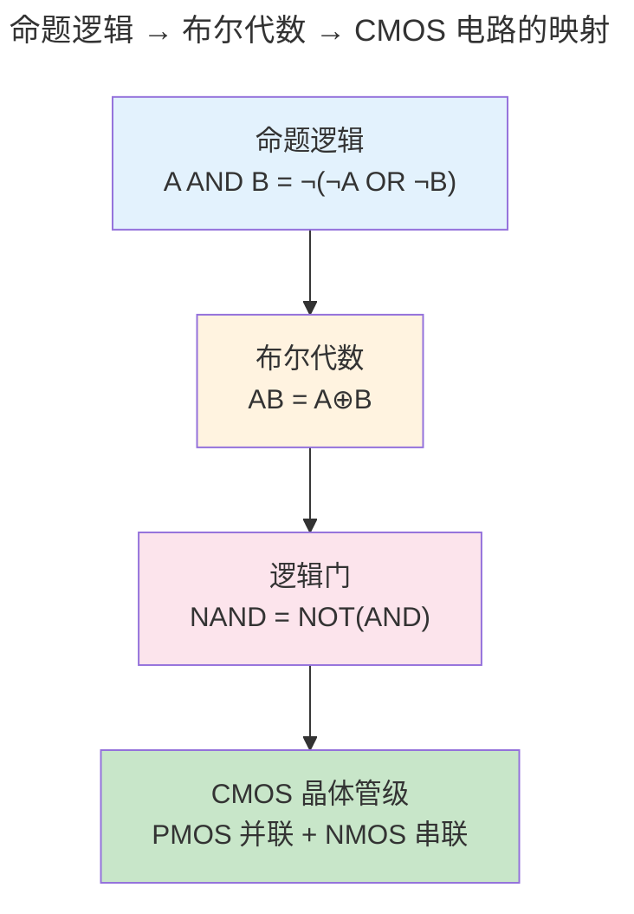
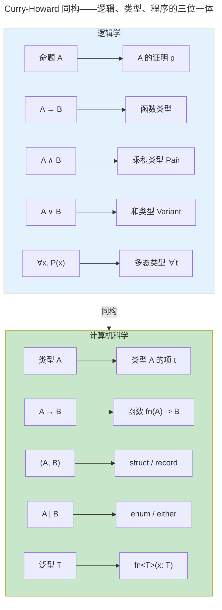

> 从命题到证明，形式化是一切计算的元语言。

程序在 CPU 上执行前，先经过编译器的类型检查。这个类型系统不是随意的语法糖——它的数学根基是**形式逻辑**。命题逻辑提供了布尔代数的真值表，一阶逻辑引入了"对所有"和"存在"的量词，而类型论通过 Curry-Howard 同构将**证明与程序**、**命题与类型**一一对应。

### 为什么需要形式逻辑

日常推理依赖直觉，但直觉经常出错。考虑这个推论："如果下雨，地面就会湿。现在地面是湿的。所以下雨了。"——这个推理在逻辑上是无效的（地面可能被洒水车弄湿）。自然语言充满歧义，同一个句子在不同语境下可以有不同的真值。形式逻辑通过将推理规则化为无歧义的符号操作，消除了这种模糊性。

形式逻辑对计算机科学之所以根本，是因为**计算本身就是符号操作**。CPU 的 ALU 在执行 `AND` 指令时，它不"理解"真假——它只是按照真值表将一个电压组合映射为另一个电压组合。编译器的类型检查器在验证 `fn(x: i32) -> String` 时，它不"理解"这个函数的意图——它只是按照推理规则检查类型构造是否合法。形式逻辑提供了这种"无需理解、只需操作"的机械推理系统，这正是计算可行的数学保证。

:::note[跨卷链接]
逻辑推理的确定性最终在 [卷一 · 微尘——数字逻辑（组合逻辑）](../../01-weichen/02-digital-logic/#组合逻辑) 中变成物理电路——每一个 AND 门都是一次逻辑"与"的物理实现。
:::

---

## 命题逻辑：布尔代数的数学根基

命题逻辑处理的是"原子命题"和逻辑连接词（与 $\land$、或 $\lor$、非 $\neg$、蕴含 $\to$）。一个复合命题的真值完全由原子命题的真值和连接词的真值表决定——这正是[数字逻辑中组合电路](../../01-weichen/02-digital-logic/)的数学抽象。

### 基本真值表

命题只有两种状态——**真**（T, 1）或**假**（F, 0）。这正好对应计算机中最小的信息单位——**一个比特**。所以命题逻辑其实就是"1 bit 的逻辑运算"。

| A | B | $A \land B$ | $A \lor B$ | $A \to B$ | $\neg A$ |
|---|----|-------------|------------|-----------|---------|
| T | T | T | T | T | F |
| T | F | F | T | F | F |
| F | T | F | T | T | T |
| F | F | F | F | T | T |

**手把手读真值表**：每一行是一个"世界"——A 和 B 的真假组合。最右列告诉你在这个世界里，复合命题的真假。

- $\land$（与）：只有 A 和 B **都**为真时才真——"必须两个条件都满足"
- $\lor$（或）：只要 A 和 B **至少一个**为真就真——"满足任意一个就行"
- $\neg$（非）：反转真假——1 变 0，0 变 1
- $\to$（蕴含）：**初学者最困惑的符号**。$A \to B$ 只在 $A$ 真而 $B$ 假时为假——可以理解为"如果前提成立，结论就必须成立"。当前提不成立时（A 为 F），承诺失效，不管 B 怎样都算真——这叫"空虚真"。

**蕴含的实际意义**。想象编译器说："如果类型推断成功（A），程序就编译通过（B）"。$A \to B$ 为假的那一行（A=T, B=F）就是编译器的 bug——类型推断成功了但程序没编译通过。其余三行都是合理状态：推断成功且编译通过（好！）；推断失败且编译失败（当然）；推断失败但程序偶然编译通过（没走那条路，不算违规）。

**自然演绎的推理规则**。从真值表出发，逻辑学定义了一套"从已知命题推导新命题"的规则系统。其中最核心的两条：

$$
\text{Modus Ponens（肯定前件）：}\quad \frac{A \to B \quad A}{B}
$$

$$
\text{Modus Tollens（否定后件）：}\quad \frac{A \to B \quad \neg B}{\neg A}
$$

Modus Ponens 是正向推理：已知"下雨→地湿"和"下雨了"，推出"地湿"。Modus Tollens 是逆向推理：已知"下雨→地湿"和"地没湿"，推出"没下雨"。这两个规则互为镜像——它们构成了 [计算理论（自动机）](../03-theory-of-computation/) 中 DFA 状态转移的推理基础：每个时钟沿，DFA 都执行一次 Modus Ponens——"如果当前状态是 $q_i$ 且输入是 $a$，则下一状态是 $q_j$"。

### 德摩根定律与电路实现

$$
\neg (A \land B) \equiv \neg A \lor \neg B
$$
$$
\neg (A \lor B) \equiv \neg A \land \neg B
$$

这两个定律在 [CMOS 门电路（CMOS 门电路实现）（CMOS 门电路实现）](../../01-weichen/02-digital-logic/#cmos-门电路实现)中直接体现——NAND 门用四个晶体管实现（PMOS 并联 + NMOS 串联），NOR 门用互补拓扑（PMOS 串联 + NMOS 并联）。这种"推-拉"对称关系正是德摩根定律的硅基实现。



---

## 一阶逻辑：引入量词

一阶逻辑在命题逻辑的基础上引入了**量词**：$\forall x$（对所有 x）和 $\exists x$（存在 x）。这使形式逻辑可以表达诸如"所有进程最终都会终止"和"存在一个不进入死锁的调度"这样的声明。

**量词的本质——从"一个"到"一群"的升级**。命题逻辑只能谈具体的个体："进程 42 终止了"。一阶逻辑可以谈全体："所有进程都终止了"。这个升级使逻辑的表达能力发生了质的飞跃——从只能查一个数据，到能写 SQL 查询。

| 逻辑语句 | 自然语言 | SQL 等价 |
|---------|---------|---------|
| $\forall x.\ P(x)$ | 所有 x 都满足 P | `SELECT COUNT(*) = 0 FROM T WHERE NOT P` |
| $\exists x.\ P(x)$ | 至少存在一个 x 满足 P | `SELECT COUNT(*) > 0 FROM T WHERE P` |
| $\forall x.\ \exists y.\ R(x,y)$ | 每个 x 都有某个 y 与之配对 | `GROUP BY x HAVING COUNT(y) > 0` |

最后一个模式特别重要：它表达了**函数关系**——每个输入都有输出。这种量化模式在数据库中是外键约束，在编程中是函数类型签名 `fn(A) -> B`，在操作系统（[进程与线程](../../03-qiankun/01-process-and-thread/)）中是"每个进程都有一个唯一的 PID"。

一阶逻辑也是 SQL 的基础——`SELECT * FROM users WHERE age > 18` 的逻辑形式是 $\{x \in \text{users} \mid \text{age}(x) > 18\}$——即**集合构造符号**的直接翻译。`GROUP BY` 是对论域进行等价类划分，聚合函数（`COUNT`, `SUM`）是各等价类上的函数应用。

---

## Curry-Howard 同构：程序即证明

Curry-Howard 同构揭示了逻辑学与计算机科学之间最深刻的联系——它指出**写程序就是构造证明，类型检查就是验证证明**。

**用一个具体例子来理解**。假设我们有一个命题 $A \to B \to A$（如果 A 成立，那么如果 B 成立，A 仍然成立）。在逻辑学中这是一个重言式——永远为真。在编程中，它对应函数类型 `fn(A, B) -> A`。你能写一个这样的函数吗？当然：

```rust
fn first#60;A, B#62;(a: A, _b: B) -> A {
    a  // 扔掉 b，返回 a——"如果 A 成立，无论 B 如何，A 都成立"
}
```

每次你写出一个函数并编译通过，你都在构造一个逻辑证明。编译器验证类型的过程，就是验证你的"证明"（程序）是否真的支持"命题"（类型签名）。如果编译失败——比如你声称返回 `A` 却返回了 `B`——那就是证明有漏洞，正如数学证明不能从错误前提出发推出矛盾结论。



| 逻辑 | 类型论 | 编程实践 |
|------|--------|---------|
| 命题 $A$ | 类型 `A` | 类型声明 |
| 证明 $p$ of $A$ | 项 $t$ : `A` | 表达式 |
| $A \to B$ | 函数类型 `A -> B` | 函数/闭包 |
| $A \land B$ | 乘积类型 (A, B) | Pair / Record / Tuple |
| $A \lor B$ | 和类型 `A \| B` | Variant / Either / enum |
| $\forall \alpha. A$ | 多态类型 `forall a. a -> a` | 泛型 / trait |

> Rust 的 `Result<T, E>` 是 $T \lor E$ 的编程实现——函数返回成功值 T **或** 错误 E。Haskell 的 `Maybe a` 是 $a \lor \bot$——值 a 或什么都没有。这些都不是语言设计者的随意决定，而是 Curry-Howard 同构在类型系统中的必然推论。

---

## 跨卷连接

| 本章概念 | 在 CS 中的直接应用 |
|----------|------------------|
| 命题逻辑与真值表 | [组合逻辑门——AND/OR/NOT 的真值表实现（基本逻辑门与真值表）（基本逻辑门与真值表）](../../01-weichen/02-digital-logic/#基本逻辑门与真值表) |
| 德摩根定律 | [CMOS NAND/NOR 门的互补晶体管拓扑（CMOS 门电路实现）（CMOS 门电路实现）](../../01-weichen/02-digital-logic/#cmos-门电路实现) |
| 一阶逻辑量词 | [SQL WHERE/∀/∃ 语义——集合构造符号的工程实现](../../04-yuanhai/01-relational-database/) |
| 柯里霍华德同构 | [Rust 所有权类型的仿射逻辑基础——借用检查器即证明检查器](../../08-qianli/01-design-patterns-and-principles/) |
| 类型推导（Hindley-Milner） | [编译原理——HM 类型系统的 unification 算法](../05-compiler-theory/) |
| 自然演绎的推理规则 | [定理证明器 Coq/Lean 的 tactic 语言——从证明到程序提取](../05-compiler-theory/) |

:::tip[卷零内部路径]
- [**计算理论**](../03-theory-of-computation/)：自动机与形式语言的逻辑对应——正则语言 = 命题时序逻辑
- [**编译原理**](../05-compiler-theory/)：类型系统在编译器中的完整实现——从 HM 到 Rust trait solver
:::
