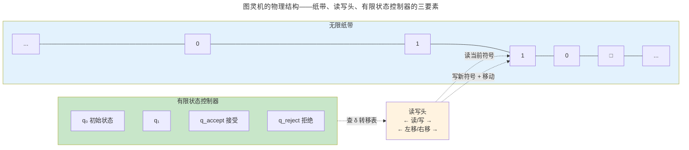
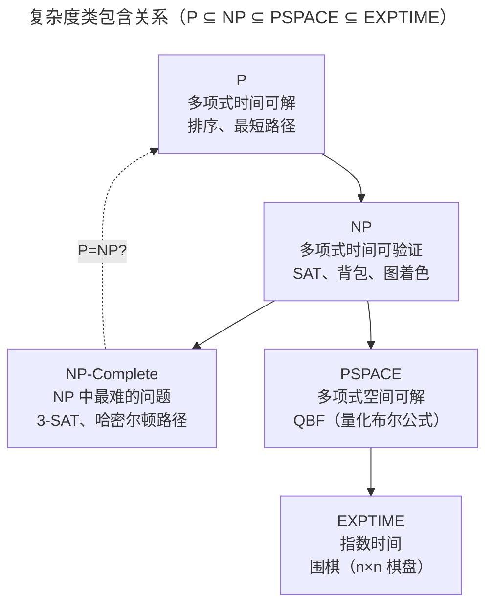
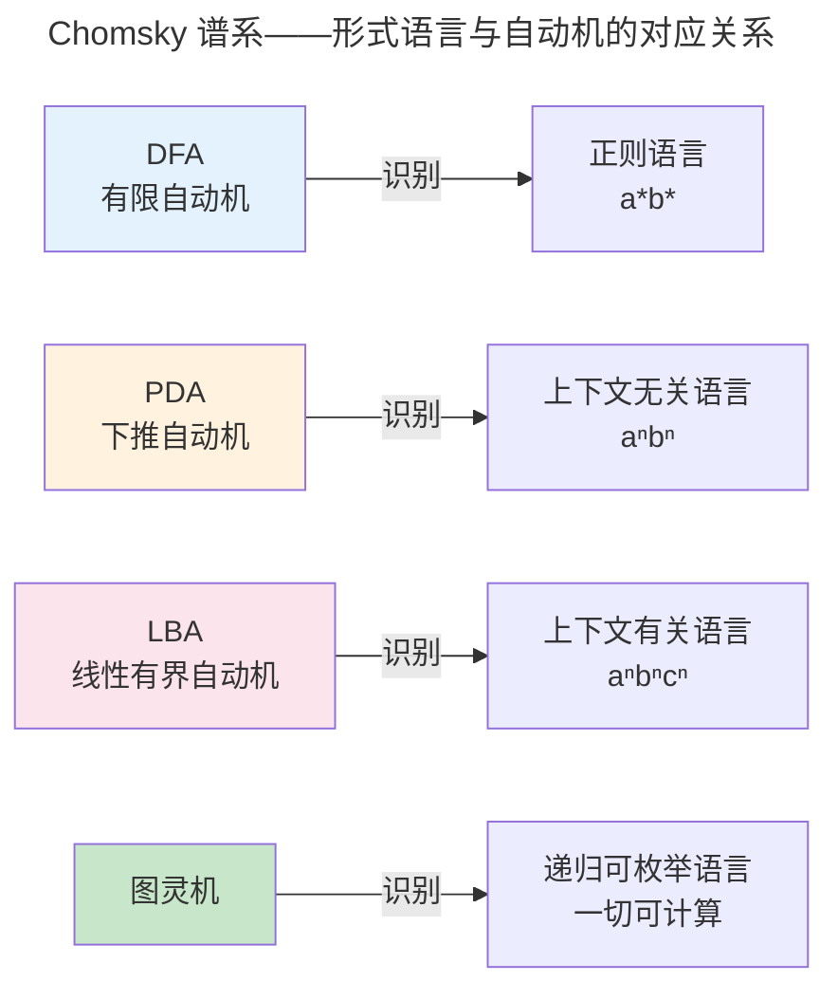

> 哪些问题是可计算的？哪些是可高效计算的？

1936 年，Alan Turing 定义了一种极简的抽象机器——**图灵机**——并证明它能够计算任何"可计算"的函数。同年，Alonzo Church 用 λ 演算得出了相同的结论。Church-Turing 论题断言：图灵机、λ 演算、C++、Rust——它们的能力边界完全相同。

但"可计算"不等于"可高效计算"：排序在 $O(n \log n)$ 内完成，而旅行商问题的最优解在最坏情况下需要指数时间。计算理论正是关于这两个根本问题的学科。

### 计算的机械本质

Turing 在 1936 年的关键洞察是：计算不需要"理解"。一个计算者只需要三种能力——读取当前符号、查阅规则表决定下一步操作、执行操作——就可以完成任何可计算的任务。这个洞察催生了图灵机的形式化定义，但它首先回答了一个哲学问题："智能"可以还原为机械步骤的序列吗？

图灵机的三要素——无限纸带、读写头、有限状态控制器——分别对应现代计算机的三个核心组件：纸带对应内存（在 [内存管理](../../03-qiankun/02-memory-management/) 中由虚拟内存系统将有限的物理内存抽象为无限的地址空间），读写头对应 CPU 的 load/store 单元，状态控制器对应指令译码器和程序计数器。这不是巧合——1945 年 von Neumann 在设计 EDVAC 架构时明确引用了图灵 1936 年的工作，将"程序存储在可修改的内存中"这一概念纳入体系结构设计。

:::note[跨卷链接]
图灵机纸带的"无限内存"在 [卷三 · 乾坤——内存管理](../../03-qiankun/02-memory-management/) 中以虚拟内存的形式成为现实。纸带上的符号就是内存中的字节，读写头的移动就是指针运算。
:::

---

## 图灵机与可计算性

图灵机由一条无限长的纸带、一个读写头和有限状态控制器组成。尽管简单，任何现代编程语言能计算的函数，图灵机都能计算。

### 图灵机的物理直觉

在形式化定义之前，先在脑海中建立图灵机的物理形象。想象一条无限延伸的方格纸带，每个方格里写着一个符号（如 0、1 或空白 □）。一个读写头悬浮在某个方格上，能读取该方格的符号，也能擦写新符号。一个有限状态控制器（像一个简单的电路）根据"当前状态 + 当前符号"查表决定下一步动作：写入什么、向左还是向右移动一格、切换到哪个新状态。



这个结构对应现代计算机的三个核心组件：纸带是内存（[内存管理](../../03-qiankun/02-memory-management/) 中的虚拟地址空间将有限的物理内存抽象为无限纸带），读写头是 CPU 的 load/store 单元，状态控制器是指令译码器 + 程序计数器。图灵在 1936 年设计这台抽象机器时，他抓住了计算中**唯一不可或缺的三个要素**。

### 图灵机的形式化定义

图灵机是一个七元组 $M = (Q, \Sigma, \Gamma, \delta, q_0, q_{accept}, q_{reject})$：

$$
\begin{aligned}
Q &: \text{有限状态集} \\
\Sigma &: \text{输入字母表（不含空白符 } \sqcup \text{）} \\
\Gamma &: \text{纸带字母表（} \Sigma \cup \{\sqcup\} \subseteq \Gamma \text{）} \\
\delta &: Q \times \Gamma \to Q \times \Gamma \times \{L, R\} \quad \text{（转移函数）} \\
q_0 &\in Q \quad \text{（初始状态）} \\
q_{accept} &\in Q \quad \text{（接受状态）} \\
q_{reject} &\in Q \quad \text{（拒绝状态，} q_{accept} \neq q_{reject} \text{）}
\end{aligned}
$$

转移函数 $\delta(q, a) = (q', b, D)$ 的含义：当前状态 $q$，读取纸带符号 $a$，则转移到状态 $q'$，写入符号 $b$，读写头向方向 $D$（$L$ 左移或 $R$ 右移）移动一格。这 7 个参数定义了计算的**全部能力**——图灵完备性只需纸带、有限状态和读写移动。

**玩具图灵机——用肉眼看一次"计算"的过程**。构造一个图灵机，判断输入字符串中 1 的个数是否为偶数。纸带初始状态：`▷ 1 1 0 □ □ ...`（▷ 为起始标记）：

```
状态表（δ 函数）：
  (Even, 1) → (Odd, 1, R)    // 偶数个 1 时读到 1 → 变成奇数，右移
  (Even, 0) → (Accept, 0, -)  // 偶数个 1 时读到 0 → 接受！输入结束
  (Odd, 1)  → (Even, 1, R)   // 奇数个 1 时读到 1 → 变成偶数，右移
  (Odd, 0)  → (Reject, 0, -)  // 奇数个 1 时读到 0 → 拒绝！

执行过程（输入 "110"，即两个 1）：
  状态 Even，读 1 → 状态 Odd，右移
  状态 Odd，读 1  → 状态 Even，右移
  状态 Even，读 0 → 接受！✅
```

这个 4 行状态表就是一台完整的计算机——它不需要加法器、不需要 ALU，只需要"读符号 → 查表 → 写符号 → 移动"的循环。任何 C 程序都可以编译器翻译为这样一个状态表——尽管表的大小会极其庞大。

一个语言 $L$ 是**递归可枚举**的（Recursively Enumerable, RE），当且仅当存在图灵机 $M$ 使得 $M$ 接受 $L$ 中的字符串，且对 $L$ 外的字符串 $M$ 要么拒绝、要么永不停止。若 $M$ 对所有输入都停机，则 $L$ 是**可判定**的（Recursive）。

**RE vs Recursive 的直觉类比**。想象你在一个无限大的图书馆里寻找一本书。
- **可判定**（Recursive）意味着你有一个算法，无论书在不在馆里，算法都会在有限时间内告诉你"找到了"或"不存在"——就像一本完美的目录索引。
- **递归可枚举**（RE）意味着你有一个算法，如果书在馆里，它最终会找到并告诉你；但如果书不在馆里，算法可能永远在书架间徘徊，不告诉你结果——就像你只能在馆里一本一本地翻，翻到了就是找到了，翻不到就永远翻下去。

RE 与 Recursive 的这一鸿沟——"接受" vs "判定"——正是停机问题的数学根基：停机问题是 RE 但不是 Recursive 的（你可以模拟执行程序——如果它停了你会知道，但如果它不停你永远不会确定）。

### 停机问题：不可判定的第一道墙

**停机问题**：给定程序 P 和输入 I，判断 P(I) 是否最终停止。Turing 在 1936 年证明：**没有任何算法能解决停机问题**。

证明核心是自指悖论——假设存在 `doesHalt(P, I)`，构造对抗程序：

```
void paradox(P):
    if doesHalt(P, P):
        while (true) {}  // 如果判定停止，则故意不停止
    else:
        return;          // 如果判定不停止，则故意停止
```

调用 `paradox(paradox)` 导致矛盾——这正是 Gödel 不完备定理在计算领域的投影：**任何足够强大的形式系统，都存在不可判定的命题**。

---

## 复杂度类与 P vs NP



| 类 | 定义 | 典型问题 |
|----|------|---------|
| **P** | 多项式时间可解 | Dijkstra、归并排序、快速傅里叶变换 |
| **NP** | 解可在多项式时间验证 | SAT、旅行商问题、整数分解 |
| **NP-Complete** | NP 中最难：若任一在 P 中，则 P=NP | 3-SAT、子集和、图着色 |
| **PSPACE** | 多项式空间可解 | QBF、围棋（$n \times n$）的完美玩法 |

**验证 vs 求解——P 与 NP 的核心区别**。注意 NP 的定义不是"不能高效求解"，而是"解可以在多项式时间内验证"。以旅行商问题为例：给定一组城市和距离矩阵，找到总距离不超过 K 的访问所有城市恰好一次并返回起点的路径。

- **求解**需要检查所有可能的排列——有 $n!$ 种路径，当 $n=100$ 时远超可观测宇宙中的原子数
- **验证**只需要检查一条给定的路径是否合法并累加距离——$O(n)$ 步即可完成

这就是 NP 的核心性质：验证远比求解容易（在已知的算法下）。P vs NP 问题严格地问：每一个能在多项式时间验证的问题，也一定能在多项式时间求解吗？即 $\text{P} \stackrel{?}{=} \text{NP}$。

大多数复杂度理论家相信 $P \neq NP$，理由是在 50 余年的研究中，未能为任何 NP 完全问题找到多项式算法。但这并非严格证明——对 $P \neq NP$ 的证明，需要排除所有可能的多项式算法的存在性，而算法空间是无限的。如果 $P = NP$ 成立，后果将是戏剧性的：所有基于"计算困难"假设的密码系统（RSA、ECC、Diffie-Hellman）将崩溃，因为它们的底层数学问题都在 NP 中；但同时，蛋白质折叠预测、VLSI 布局优化、最优物流调度等无数工业问题将变得高效可解。

### P 与 NP 的形式定义

复杂度类 P 是多项式时间内可判定的语言类：

$$
P = \{L \mid \exists \text{ TM } M, \exists k \geq 0: M \text{ 在 } O(n^k) \text{ 步内判定 } L\}
$$

NP 是多项式时间内可验证的语言类——解可能难以找到，但候选解可在多项式时间内验证：

$$
NP = \{L \mid \exists \text{ poly-time verifier } V, \exists \text{ poly } p: x \in L \iff \exists y, |y| \leq p(|x|), V(x,y)=1\}
$$

NP 完全性由**多项式时间归约**定义。语言 $A$ 可归约到 $B$（记作 $A \leq_p B$），当且仅当存在多项式时间可计算函数 $f$ 使得：

$$
x \in A \iff f(x) \in B
$$

语言 $L$ 是 NP 完全的，若 $L \in NP$ 且对所有 $L' \in NP$，$L' \leq_p L$。Cook-Levin 定理（1971）证明了 **SAT 是第一个 NP 完全问题**——所有 NP 完全性证明的"种子"都由此出发。

**P vs NP** 是 Clay 数学研究所七大千禧年问题之一。如果 P=NP，密码学将崩溃（整数分解在 NP 中），但蛋白质折叠和调度优化将变得高效。大多数理论计算机科学家相信 $P \neq NP$——但证明仍遥不可及。

### NP-hard 与 NP-complete：不要混淆的两个概念

NP-complete 和 NP-hard 经常被混用，但它们有精确定义的区别：

- **NP-complete**：问题 $L$ 满足两个条件——① $L \in NP$（解可以在多项式时间验证），② $\forall L' \in NP,\ L' \leq_p L$（所有 NP 问题都可归约到它）。3-SAT、哈密尔顿路径、图着色是 NP-complete 的典型代表。
- **NP-hard**：问题 $L$ 只需满足第二个条件——所有 NP 问题可归约到它——但 $L$ 本身不一定在 NP 中。停机问题是 NP-hard 的（所有 NP 问题可归约到它，但它本身不可判定，甚至不在 NP 中——没有多项式时间的验证器）。

所以所有 NP-complete 问题都是 NP-hard，但反过来不成立——NP-hard 包含了不可判定的问题。这个区别对实践很重要：当你遇到一个 NP-hard 问题时，如果它恰好是 NP-complete，你可以用 SAT solver 或近似算法来应对；如果它是不可判定的（如停机问题），你需要换一种思路——静态分析器、类型系统、或语法限制。

### 不可判定性对程序员意味着什么

停机问题不可判定这个事实，直接制约了程序员日常使用的工具：

- **静态分析器永远不完美**。Rust 的 borrow checker、C 的 Clang Static Analyzer、Java 的 NullAway——这些工具在判定"是否存在内存错误"或"是否有空指针引用"时，面对的都是不可判定问题的近似。它们要么接受一些错误程序（漏报），要么拒绝一些正确程序（误报）——不可能同时做到"所有正确程序都通过"且"所有错误程序都拒绝"。这就是为什么 borrow checker 偶尔会让你写看起来正确的代码却编译不过——它在做一个保守近似：宁可误杀，不可漏放。
- **编译优化有边界**。编译器想知道"这段代码是否永远不会执行"（死代码消除）、"这个循环是否会终止"（循环展开的安全性）——这些问题的通用版本都是不可判定的。编译器用**充分条件**（而非等价条件）来近似：如果能证明某些模式必然成立才优化，否则保守地保留原代码。
- **测试不能替代证明**。你可能想知道"这段代码在所有输入下都是正确的"——这是不可判定的。所以你只能测试有限个输入（测试），或写一个覆盖你关心的性质的类型证明（类型系统），或接受一定程度的运行时错误。

这些限制不是工具做得不够好——它们是哥德尔和图灵在 20 世纪 30 年代为所有形式系统设定的天花板。理解了这一层，才能在工程中做出明智的权衡：在哪些地方接受保守近似，在哪些地方投入人力做交互式证明。

---

## 自动机层次：从 DFA 到图灵机



| 自动机 | 存储能力 | 识别语言 | CS 应用 |
|--------|---------|---------|---------|
| **DFA** (确定有限自动机) | 仅当前状态 | 正则语言 | 词法分析器（Lex/FLex） |
| **PDA** (下推自动机) | 栈（LIFO） | 上下文无关语言 | 语法分析器（Yacc/Bison） |
| **LBA** (线性有界自动机) | 有界纸带 | 上下文有关语言 | 类型检查（部分） |
| **图灵机** | 无限纸带 | 递归可枚举语言 | 任何算法 |

### 语言类包含关系

Chomsky 谱系中的语言类呈严格包含关系（在非平凡字母表上）：

$$
\text{Regular} \subsetneq \text{Context-Free} \subsetneq \text{Context-Sensitive} \subsetneq \text{Recursive} \subsetneq \text{RE}
$$

这一层级关系与硬件资源的对应是计算理论最深刻的美学：从 [数字逻辑（有限状态机）](../../01-weichen/02-digital-logic/) 的寄存器到 [进程与线程（栈空间限制）](../../03-qiankun/01-process-and-thread/) 的运行期边界，每一级自动机对应一类硬件的物理边界。

DFA 无法识别 $a^n b^n$（如括号匹配）——因为 DFA 只能用有限状态计数，无法"记住"前面读过多少个 a 以便与 b 的数量匹配。PDA 通过一个栈解决了这个问题：每读一个 a 就 push，每读一个 b 就 pop——这就是编程语言语法分析器的工作原理。

---

## 跨卷连接

| 本章概念 | 在 CS 中的直接应用 |
|----------|------------------|
| 图灵机的无限纸带 | [冯·诺依曼架构——程序即数据的无限内存模型](../../01-weichen/03-microarchitecture/) |
| 停机问题不可判定 | [静态分析边界——Rust borrow checker 的保守近似](../../08-qianli/01-design-patterns-and-principles/) |
| P vs NP | [RSA：大数分解的数学基础](../../07-tianshu/02-asymmetric-cryptography/#rsa大数分解的数学基础) |
| DFA/正则语言 | [词法分析器的 Flex 规则——正则 → NFA → DFA](../05-compiler-theory/) |
| PDA/CFG | [LR 解析器——yacc/bison 的移进-归约冲突解决](../05-compiler-theory/) |
| NP 完全 | [SAT Solver——硬件验证的约束求解引擎](../../01-weichen/02-digital-logic/) |

:::tip[卷零内部路径]
- [**形式逻辑**](../02-formal-logic/)：自动机识别语言 = 命题时序逻辑的可满足性
- [**算法理论**](../04-algorithm-theory/)：NP 完全问题的近似算法与启发式
- [**编译原理**](../05-compiler-theory/)：从 CFG 到 LR 解析表的构造算法
:::
