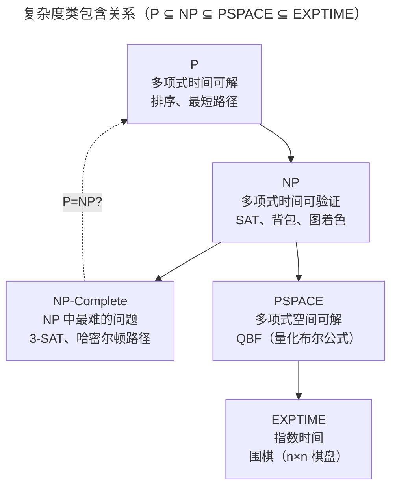
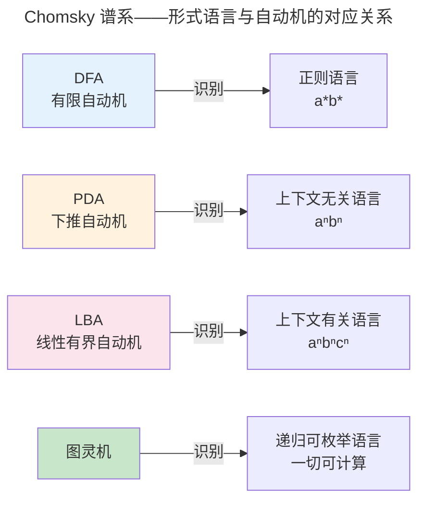

> 哪些问题是可计算的？哪些是可高效计算的？

1936 年，Alan Turing 定义了一种极简的抽象机器——**图灵机**——并证明它能够计算任何"可计算"的函数。同年，Alonzo Church 用 λ 演算得出了相同的结论。Church-Turing 论题断言：图灵机、λ 演算、C++、Rust——它们的能力边界完全相同。

但"可计算"不等于"可高效计算"：排序在 $O(n \log n)$ 内完成，而旅行商问题的最优解在最坏情况下需要指数时间。计算理论正是关于这两个根本问题的学科。

---

## 图灵机与可计算性

图灵机由一条无限长的纸带、一个读写头和有限状态控制器组成。尽管简单，任何现代编程语言能计算的函数，图灵机都能计算。

### 停机问题：不可判定的第一道墙

**停机问题**：给定程序 P 和输入 I，判断 P(I) 是否最终停止。Turing 在 1936 年证明：**没有任何算法能解决停机问题**。

证明核心是自指悖论——假设存在 `doesHalt(P, I)`，构造对抗程序：

```
void paradox(P):
    if doesHalt(P, P):
        while (true) {}  // 如果判定停止，则故意不停止
    else:
        return;          // 如果判定不停止，则故意停止
```

调用 `paradox(paradox)` 导致矛盾——这正是 Gödel 不完备定理在计算领域的投影：**任何足够强大的形式系统，都存在不可判定的命题**。

---

## 复杂度类与 P vs NP



| 类 | 定义 | 典型问题 |
|----|------|---------|
| **P** | 多项式时间可解 | Dijkstra、归并排序、快速傅里叶变换 |
| **NP** | 解可在多项式时间验证 | SAT、旅行商问题、整数分解 |
| **NP-Complete** | NP 中最难：若任一在 P 中，则 P=NP | 3-SAT、子集和、图着色 |
| **PSPACE** | 多项式空间可解 | QBF、围棋（$n \times n$）的完美玩法 |

**P vs NP** 是 Clay 数学研究所七大千禧年问题之一。如果 P=NP，密码学将崩溃（整数分解在 NP 中），但蛋白质折叠和调度优化将变得高效。大多数理论计算机科学家相信 $P \neq NP$——但证明仍遥不可及。

---

## 自动机层次：从 DFA 到图灵机



| 自动机 | 存储能力 | 识别语言 | CS 应用 |
|--------|---------|---------|---------|
| **DFA** (确定有限自动机) | 仅当前状态 | 正则语言 | 词法分析器（Lex/FLex） |
| **PDA** (下推自动机) | 栈（LIFO） | 上下文无关语言 | 语法分析器（Yacc/Bison） |
| **LBA** (线性有界自动机) | 有界纸带 | 上下文有关语言 | 类型检查（部分） |
| **图灵机** | 无限纸带 | 递归可枚举语言 | 任何算法 |

DFA 无法识别 $a^n b^n$（如括号匹配）——因为 DFA 只能用有限状态计数，无法"记住"前面读过多少个 a 以便与 b 的数量匹配。PDA 通过一个栈解决了这个问题：每读一个 a 就 push，每读一个 b 就 pop——这就是编程语言语法分析器的工作原理。

---

## 跨卷连接

| 本章概念 | 在 CS 中的直接应用 |
|----------|------------------|
| 图灵机的无限纸带 | [冯·诺依曼架构——程序即数据的无限内存模型](../../01-weichen/03-microarchitecture/) |
| 停机问题不可判定 | [静态分析边界——Rust borrow checker 的保守近似](../../08-qianli/01-design-patterns-and-principles/) |
| P vs NP | [整数分解——RSA 安全性的计算假设](../../07-tianshu/02-asymmetric-cryptography/) |
| DFA/正则语言 | [词法分析器的 Flex 规则——正则 → NFA → DFA](../05-compiler-theory/) |
| PDA/CFG | [LR 解析器——yacc/bison 的移进-归约冲突解决](../05-compiler-theory/) |
| NP 完全 | [SAT Solver——硬件验证的约束求解引擎](../../01-weichen/02-digital-logic/) |

:::tip[卷零内部路径]
- [**形式逻辑**](../02-formal-logic/)：自动机识别语言 = 命题时序逻辑的可满足性
- [**算法理论**](../04-algorithm-theory/)：NP 完全问题的近似算法与启发式
- [**编译原理**](../05-compiler-theory/)：从 CFG 到 LR 解析表的构造算法
:::
