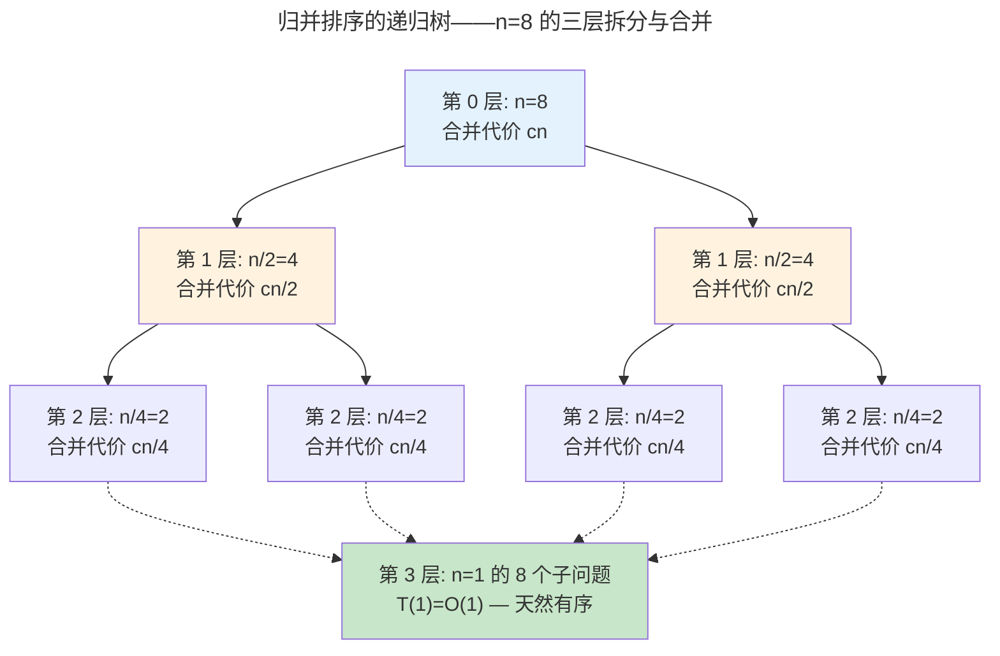
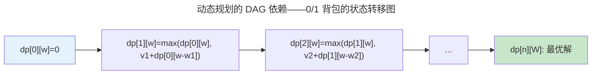

> 算法是一切效率的源泉。

算法是计算机科学的"手艺活"——它不关心"能不能算"（那是计算理论的领域），而是关心"怎么算得更快、用更少的内存"。本章从渐近复杂度分析出发，走过分治、动态规划和贪心三大算法范式，最后以图算法和 NP 完全近似收尾。

### 算法作为步骤序列

算法的形式化定义是**有限步骤的有序序列，将输入转化为输出**——每一步是明确定义的基本操作，序列的每一步后系统状态完全确定，最终步骤产生输出。这个定义排除了"凭直觉做"或"随机尝试"——算法必须是机械可执行的，不需要创造力或洞察力。

算法的效率差异可能跨越多个数量级。以排序为例：对于 $n = 10^6$ 个整数，冒泡排序需要约 $10^{12}$ 次比较（假设每秒 $10^9$ 次，需约 17 分钟），而归并排序只需约 $2 \times 10^7$ 次比较（约 0.02 秒）。同样的输入输出规格，算法选择直接决定了任务是否可行——这就是为什么"算法"而不是"硬件升级"往往是性能优化的第一考虑。

算法分析关注两个维度：**时间复杂度**（执行步数随输入规模的增长趋势）和**空间复杂度**（内存占用的增长趋势）。两者之间存在权衡——用空间换时间是算法设计中最常见的策略。哈希表用额外内存将查找从 $O(n)$ 降到 $O(1)$；动态规划用一张表消除递归树的指数爆炸；缓存用内存容量换取避免重复计算。

:::note[跨卷链接]
算法效率最终兑现为 CPU 的执行时间——[卷一 · 微尘——体系结构（性能方程：衡量体系结构的标尺）](../../01-weichen/03-microarchitecture/#性能方程衡量体系结构的标尺) 中的"指令数"直接由算法选择决定。
:::

---

## 渐近复杂度：为什么常数不重要

Big-O 记号描述算法在最坏情况下随输入规模增长的趋势——它刻意忽略了常数因子和低阶项，因为当 $n \to \infty$ 时，只有增长阶才决定算法能否扩展到大规模数据。

| 复杂度 | $n=10^3$ | $n=10^6$ | $n=10^9$ | 代表算法 |
|--------|---------|---------|---------|---------|
| $O(1)$ | 1 | 1 | 1 | 哈希表查找 |
| $O(\log n)$ | 10 | 20 | 30 | 二分查找、平衡树 |
| $O(n)$ | $10^3$ | $10^6$ | $10^9$ | 线性扫描 |
| $O(n \log n)$ | $10^4$ | $2 \times 10^7$ | $3 \times 10^{10}$ | 归并排序、堆排序 |
| $O(n^2)$ | $10^6$ | $10^{12}$ | INF | 冒泡排序、朴素矩阵乘法 |
| $O(2^n)$ | INF | INF | INF | 旅行商问题暴力搜索 |

### 增长率的直觉：当 n 变大时，谁才是主宰

在进入形式定义之前，先建立对"增长率"的朴素直觉。把每种复杂度想象成一场"谁能更快吃掉 n"的比赛：

- **$O(1)$**：不吃 n。无论 n 多大，它只做一个固定的动作。就像查字典时你直接翻到特定页码——字典变厚不影响你的查找速度。
- **$O(\log n)$**：n 每翻一倍，它才多吃一口。$n$ 从 1000 到 1000000（翻了 1000 倍），$\log_2 n$ 只从 10 涨到 20——几乎感觉不到增长。二分查找就是这种"越翻倍越漠不关心"的性格。
- **$O(n)$**：和 n 一起长。n 变大 10 倍，工作量也变大 10 倍。线性扫描就是如此——你需要看过每个元素才能确定结果。
- **$O(n \log n)$**：比 n 长得快一点，但不是致命的快。归并排序属于这一类——它把 $O(n)$ 的工作重复了 $\log n$ 层。
- **$O(n^2)$**：n 变大 10 倍，工作量变大 100 倍。冒泡排序的嵌套循环就是如此——每个元素要和其他所有元素比较。当 n=10000 时，需要约 1 亿次比较。
- **$O(2^n)$**：n 每加 1，工作量翻倍。这就是"组合爆炸"——n=30 时就需要约 10 亿步，n=100 时超过了宇宙的年龄（以纳秒为单位）。旅行商问题的暴力搜索就属于这一类。

增长率决定了算法的**可扩展性**（scalability）。$O(n^2)$ 的算法在 n=1000 时还能勉强工作，n=1000000 时就完全不可行——这不是硬件不够快，而是增长阶本身判了死刑。这就是为什么算法分析忽略常数因子：当 n 足够大，$1000n$（$O(n)$）终将超越 $n^2$（$O(n^2)$），无论常数多大。

### 渐近记号的形式定义

Big-O 描述的不仅是"最坏情况"，更本质地是一个**数学上界**——它断言当 $n$ 足够大时，$f(n)$ 的增长速度不超过 $g(n)$ 乘以某个常数。

上界 $O$、下界 $\Omega$、紧确界 $\Theta$ 的 $\varepsilon$-$\delta$ 风格定义：

$$
f(n) = O(g(n)) \iff \exists c > 0, n_0 > 0: \forall n \geq n_0,\ f(n) \leq c \cdot g(n)
$$

$$
f(n) = \Omega(g(n)) \iff \exists c > 0, n_0 > 0: \forall n \geq n_0,\ f(n) \geq c \cdot g(n)
$$

$$
f(n) = \Theta(g(n)) \iff f(n) = O(g(n)) \land f(n) = \Omega(g(n))
$$

这些记号构成了一个**函数增长率偏序**。常见复杂度按包含关系排列：

$$
O(1) \subset O(\log n) \subset O(n) \subset O(n \log n) \subset O(n^2) \subset O(n^3) \subset O(2^n) \subset O(n!)
$$

> 注：$O$ 和 $\Omega$ 是集合符号——$f(n) = O(g(n))$ 实际上是 $f(n) \in O(g(n))$ 的惯例简写。

---

## 三大算法范式

### 分治法与主定理

分治法（Divide & Conquer）将问题递归地分解为子问题，解决子问题后合并结果。其时间复杂度由**递归关系**刻画——它是递归算法的"微分方程"：

$$
T(n) = a \cdot T\left(\frac{n}{b}\right) + f(n)
$$

其中 $a \geq 1$ 为子问题数量，$b > 1$ 为每层规模缩减因子，$f(n)$ 为划分和合并的开销。

以归并排序为例：分 $O(1)$、治 $2T(n/2)$、合 $O(n)$，故 $a=2, b=2, f(n) = \Theta(n)$，递归树高度 $\log_2 n$，每层合并 $O(n)$，总计 $O(n \log n)$。

**递归树可视化**。归并排序的递归结构可以直接画出来——每一层是问题的一次对半拆分，合并操作汇总了该层所有子数组的结果：



每一层的合并总代价都是 $cn$（所有子数组合并的总工作量等于原始数组长度）。共 $\log_2 n$ 层，所以总代价 $cn \log_2 n = O(n \log n)$。这棵树是分治法分析的核心工具——当你面对任何递归算法时，画出递归树往往比直接解递推式更快地揭示复杂度。

**主定理（Master Theorem）** 为常见递归关系提供了"查表式"解。对 $T(n) = aT(n/b) + f(n)$，比较 $f(n)$ 与 $n^{\log_b a}$ 的增长关系：

$$
T(n) =
\begin{cases}
\Theta(n^{\log_b a}) & \text{若 } f(n) = O(n^{\log_b a - \varepsilon}),\ \varepsilon > 0 \\[6pt]
\Theta(n^{\log_b a} \log n) & \text{若 } f(n) = \Theta(n^{\log_b a}) \\[6pt]
\Theta(f(n)) & \text{若 } f(n) = \Omega(n^{\log_b a + \varepsilon}),\ \varepsilon > 0,\text{且满足正则条件}
\end{cases}
$$

**直觉**：第一情况——递归树最底层的叶子工作占主导；第二情况——每层工作量相当，总和为层数乘每层工作量；第三情况——根节点的合并工作占主导。主定理与 [存储层次（空间局部性）](../../01-weichen/04-memory-hierarchy/#空间局部性spatial-locality) 中的分块优化有直接对应：当 $b$ 选得使子问题恰好填入缓存行时，$f(n)$ 在合并阶段享受了空间局部性的红利。

| 算法 | $a$ | $b$ | $f(n)$ | $\log_b a$ | 复杂度 | 适用情况 |
|------|:--:|:--:|--------|:----------:|--------|:-------:|
| 归并排序 | 2 | 2 | $\Theta(n)$ | 1 | $\Theta(n \log n)$ | 情况 2 |
| 二分查找 | 1 | 2 | $\Theta(1)$ | 0 | $\Theta(\log n)$ | 情况 2 |
| Strassen 矩阵乘法 | 7 | 2 | $\Theta(n^2)$ | $\approx 2.81$ | $\Theta(n^{2.81})$ | 情况 1 |
| 快速排序（平均） | 2 | 2 | $\Theta(n)$ | 1 | $\Theta(n \log n)$ | 情况 2 |

主定理覆盖不了所有递归（如 $T(n) = T(n-1) + T(n-2) + O(1)$ 的 Fibonacci），此时需要**递归树法**或**代入法**——这两种方法在 [形式逻辑（Curry-Howard 同构——程序即证明）](../02-formal-logic/#curry-howard-同构程序即证明) 中有系统化的根基。

### 动态规划：最优子结构的艺术

DP 的核心是找到**状态转移方程**——当前状态的最优解如何从子状态的最优解推导。



**0/1 背包状态转移方程**：$dp[i][w] = \max(dp[i-1][w], dp[i-1][w-w_i] + v_i)$

**手算一个 0/1 背包**。物品：A（重量 3，价值 4），B（重量 4，价值 5），C（重量 2，价值 3）。背包容量 7。

```
DP 表 (行=物品数，列=容量)：
      容量 0  1  2  3  4  5  6  7
物品 0   [0, 0, 0, 0, 0, 0, 0, 0]   ← 没有物品，价值全 0
物品 A   [0, 0, 0, 4, 4, 4, 4, 4]   ← 容量≥3 时可以装 A
物品 B   [0, 0, 0, 4, 5, 5, 5, 9]   ← 容量 7: max(不装B=4, 装B=5+dp[A][3]=9)
物品 C   [0, 0, 3, 4, 5, 7, 8, 9]   ← 容量 5: max(不装C=5, 装C=3+dp[B][3]=7)
```

最终答案：`dp[3][7] = 9`（装 A + B）。每个格子的决策只有两种可能——**装这个物品**或**不装**——但两种可能的最优自己知（从上一行读），所以每个格子是 $O(1)$ 的计算。这就是动态规划的魔法：用一张表消灭了指数级重复计算。

### 摊还分析：均摊视角的复杂度

并非所有操作都耗时相同——动态数组扩容、并查集的路径压缩、哈希表重哈希等操作的"单次最坏情况"并不能反映长期平均行为。**摊还分析**（Amortized Analysis）关注的是操作序列的**平均每次**代价，而非单次峰值。

三种经典分析方法：

| 方法 | 思路 | 经典应用 |
|------|------|---------|
| **聚合分析** | $n$ 次操作总代价除以 $n$ | 动态数组：扩容 $n$ 次总计 $O(2n)$，均摊 $O(1)$ |
| **记账法** | 廉价操作"预存信用"支付昂贵操作 | 栈的 MultiPop：Push 存储 $O(1)$ 信用 |
| **势能法** | 定义势能函数 $\Phi$，摊还代价 = 实际代价 + $\Delta\Phi$ | 并查集路径压缩、splay 树 |

**动态数组扩容**是理解摊还分析的入门案例。当数组满时，分配 2 倍空间并复制所有元素。单次扩容代价 $O(n)$，但两次扩容间隔随数组增长呈指数增加。用聚合分析：

$$
\text{总代价} = \underbrace{n}_{\text{Push 操作}} + \underbrace{1 + 2 + 4 + \cdots + \frac{n}{2}}_{\text{各次扩容复制}} < n + n = 2n
$$

$$
\text{均摊代价} = \frac{\text{总代价}}{n} = O(1)
$$

势能法提供更优雅的视角。定义势能函数 $\Phi(h) = 2 \cdot \text{size} - \text{capacity}$（size 为元素数，capacity 为数组容量）。普通 Push 时 $\Delta\Phi = 2$，摊还代价 $1 + 2 = 3$；扩容 Push 时实际代价 $n+1$，$\Delta\Phi = 2(n+1) - 2n - (2n - n) = 2 - n$，摊还代价 $(n+1) + (2-n) = 3$——**每次 Push 的摊还代价恒为 $O(1)$**。

摊还分析的思维在分布式系统中同样重要——[共识协议（Raft 的领导者选举摊销）](../../04-yuanhai/04-consensus-protocols/) 中，选举超时的随机化设计就是"牺牲单次选举延迟换取长期稳定性"的摊还决策。

### 贪心算法：局部最优 = 全局最优？

贪心算法每次选择当前最优选项，不回溯。它把事情简化为一个原则：**每一步都做眼前最好的选择，相信这一连串的局部最优最终通向全局最优**。但这个"相信"不是总能兑现的——贪心算法的核心挑战在于**证明**局部最优确实导致了全局最优。

**贪心选择性质**（Greedy Choice Property）：存在一个最优解，它包含贪心算法做出的第一个选择。如果这个性质成立，就可以用归纳法证明整个贪心序列的最优性。

**活动选择问题**是理解贪心算法的最佳入门案例。给定 n 个活动，每个活动有开始时间 $s_i$ 和结束时间 $f_i$。一个教室同一时间只能进行一个活动，目标是安排尽可能多的不冲突活动。

- 贪心策略：每次选择**结束时间最早**且不与已选活动冲突的活动
- 为什么不是"开始时间最早"？因为一个很长的活动可能很早就开始了，霸占教室一整天
- 为什么不是"时长最短"？因为一个短活动可能正好卡在两个长活动之间，选了它就排除了两个长活动
- 为什么"最早结束"有效？因为它为后续活动留下了最多的剩余时间——最大化"未来的可能性"

**交换论证（Exchange Argument）** 是证明贪心选择性质的标准技巧。假设存在一个不包含贪心选择的最优解 $O$——用贪心选择替换 $O$ 中的第一个活动，得到新解 $O'$——证明 $O'$ 仍然是最优的（活动数不变且仍不冲突）。因为贪心选择结束最早，它不会与 $O$ 中的其他活动冲突，替换后活动数不变——所以贪心选择确实出现在某个最优解中。这个证明模式适用于所有满足贪心选择性质的问题。

**Huffman 编码**——每次合并频率最小的两个节点——是最优美的贪心示例之一。它的正确性同样由交换论证保证：如果在最优前缀码中，两个最低频率的叶节点不在同一父节点下，可以将它们交换到同一父节点下而总代价不增加。Huffman 编码之所以有效，是因为问题同时具有**贪心选择性质**和**最优子结构**——不是所有问题都同时满足这两个条件。比如，在图的最短路径问题中，Dijkstra 算法是贪心的（每次选最近的未访问节点），但它的正确性依赖于**所有边权非负**——如果存在负权边，贪心选择性质被破坏，“局部最优"不再通向全局最优。

---

## 图算法速查

| 算法 | 用途 | 复杂度 | 核心思想 |
|------|------|--------|---------|
| **BFS** | 无权图最短路径 | $O(V+E)$ | 队列——逐层扩展 |
| **Dijkstra** | 非负权最短路径 | $O((V+E)\log V)$ | 优先队列 + 松弛 |
| **Bellman-Ford** | 含负权边最短路径 | $O(VE)$ | 全边松弛 V-1 轮 |
| **Kruskal** | 最小生成树 | $O(E \log E)$ | 并查集 + 边排序 |

Dijkstra 不能处理负权边——如果图中存在负权边，已"确定"最短路径的节点可能被后续经过负权边的路径绕过而变得更短。Bellman-Ford 通过 V-1 轮全边松弛解决了这个问题，也是 [RIP 路由协议](../../03-qiankun/05-network-protocol-stack/)使用 Bellman-Ford 而非 Dijkstra 的数学原因。

---

## NP 完全与近似算法

对 NP 完全问题，最优解需要指数时间——除非 P = NP（参见 [计算理论（复杂度类与 P vs NP）](../03-theory-of-computation/#复杂度类与-p-vs-np) 中的讨论）。**近似算法**在多项式时间内找到"足够好"的解——它用可量化的质量损失换取可承受的运行时间。

**近似比**（Approximation Ratio）是衡量近似算法质量的标尺。对于最小化问题，若算法 $A$ 对任意输入 $I$ 满足：

$$
\frac{Cost(A, I)}{Cost(OPT, I)} \leq \rho
$$

其中 $OPT$ 为最优解，则 $A$ 是 $\rho$-近似算法。$\rho$ 越接近 1，近似质量越高。

- **贪心集合覆盖**：每次选覆盖最多未覆盖元素的集合——近似比 $H_d \approx \ln d$（$d$ 为最大集合大小），不可改进至 $(1-\varepsilon)\ln n$ 除非 P = NP
- **Christofides 算法**：旅行商问题（满足三角不等式）——1.5 倍近似，通过最小生成树 + 完美匹配 + 欧拉回路构造，多项式时间内的艺术级保证

近似的极限由**不可近似性**（Inapproximability）界定——许多 NP 完全问题在 $P \neq NP$ 假设下存在近似比的**下界**，即不存在多项式时间的 $(1+\delta)$-近似算法（$\delta$ 为某正常数）。这一结论的证明依赖于 [计算理论（复杂度类与 P vs NP）](../03-theory-of-computation/#复杂度类与-p-vs-np) 中 PCP 定理的深刻结果——PCP 定理断言 NP = PCP($O(\log n), O(1)$)，揭示了局部验证与全局计算的惊人等价。

---

## 跨卷连接

| 算法 | 在系统中的实例 |
|------|-------------|
| Dijkstra 最短路径 | [OSPF 链路状态路由——全网拓扑 + Dijkstra](../../03-qiankun/05-network-protocol-stack/) |
| Bellman-Ford | [RIP 距离向量路由——逐跳 Bellman-Ford 迭代](../../03-qiankun/05-network-protocol-stack/) |
| Huffman 编码 | [HTTP/2 帧格式——多路复用的结构化基础](../../03-qiankun/07-application-protocols/#http2-帧格式多路复用的结构化基础) |
| BFS/DFS | [调度算法：CFS 与 EEVDF](../../03-qiankun/01-process-and-thread/#调度算法cfs-与-eevdf) |
| 动态规划（编辑距离） | [GNU diff——最长公共子序列的文件比较](../../08-qianli/03-devops-practices/) |

:::tip[卷零内部路径]
- [**计算理论**](../03-theory-of-computation/)：P vs NP——为什么近似算法在某些问题上不可避免
- [**编译原理**](../05-compiler-theory/)：寄存器分配——贪心图着色的编译器优化经典应用
:::
