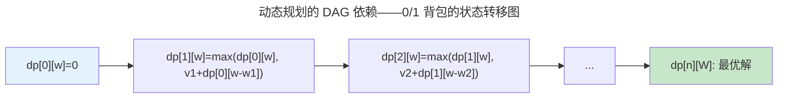

> 算法是一切效率的源泉。

算法是计算机科学的"手艺活"——它不关心"能不能算"（那是计算理论的领域），而是关心"怎么算得更快、用更少的内存"。本章从渐近复杂度分析出发，走过分治、动态规划和贪心三大算法范式，最后以图算法和 NP 完全近似收尾。

---

## 渐近复杂度：为什么常数不重要

Big-O 记号描述算法在最坏情况下随输入规模增长的趋势——它刻意忽略了常数因子和低阶项，因为当 $n \to \infty$ 时，只有增长阶才决定算法能否扩展到大规模数据。

| 复杂度 | $n=10^3$ | $n=10^6$ | $n=10^9$ | 代表算法 |
|--------|---------|---------|---------|---------|
| $O(1)$ | 1 | 1 | 1 | 哈希表查找 |
| $O(\log n)$ | 10 | 20 | 30 | 二分查找、平衡树 |
| $O(n)$ | $10^3$ | $10^6$ | $10^9$ | 线性扫描 |
| $O(n \log n)$ | $10^4$ | $2 \times 10^7$ | $3 \times 10^{10}$ | 归并排序、堆排序 |
| $O(n^2)$ | $10^6$ | $10^{12}$ | INF | 冒泡排序、朴素矩阵乘法 |
| $O(2^n)$ | INF | INF | INF | 旅行商问题暴力搜索 |

---

## 三大算法范式

### 分治法

将问题递归地分为子问题，解决子问题后合并结果。归并排序：分 $O(1)$、治 $2T(n/2)$、合 $O(n)$，递归树高度 $\log n$，每层合 $O(n)$，总计 $O(n \log n)$。

### 动态规划：最优子结构的艺术

DP 的核心是找到**状态转移方程**——当前状态的最优解如何从子状态的最优解推导。

**0/1 背包状态转移方程**：$dp[i][w] = \max(dp[i-1][w], dp[i-1][w-w_i] + v_i)$

### 贪心算法：局部最优 = 全局最优？

贪心算法每次选择当前最优选项，不回溯。**Huffman 编码**——每次合并频率最小的两个节点——是最优美的贪心示例之一。它之所以有效，是因为问题具有**贪心选择性质**和**最优子结构**——不是所有问题都满足这两个条件。

---

## 图算法速查

| 算法 | 用途 | 复杂度 | 核心思想 |
|------|------|--------|---------|
| **BFS** | 无权图最短路径 | $O(V+E)$ | 队列——逐层扩展 |
| **Dijkstra** | 非负权最短路径 | $O((V+E)\log V)$ | 优先队列 + 松弛 |
| **Bellman-Ford** | 含负权边最短路径 | $O(VE)$ | 全边松弛 V-1 轮 |
| **Kruskal** | 最小生成树 | $O(E \log E)$ | 并查集 + 边排序 |

Dijkstra 不能处理负权边——如果图中存在负权边，已"确定"最短路径的节点可能被后续经过负权边的路径绕过而变得更短。Bellman-Ford 通过 V-1 轮全边松弛解决了这个问题，也是 [RIP 路由协议](../../03-qiankun/05-network-protocol-stack/)使用 Bellman-Ford 而非 Dijkstra 的数学原因。

---

## NP 完全与近似算法

对 NP 完全问题，最优解需要指数时间。**近似算法**在多项式时间内找到"足够好"的解：

- **贪心集合覆盖**：每次选覆盖最多未覆盖元素的集合——$O(\log n)$ 近似比
- **Christofides 算法**：旅行商问题（满足三角不等式）——1.5 倍近似，多项式时间内的艺术级保证

---

## 跨卷连接

| 算法 | 在系统中的实例 |
|------|-------------|
| Dijkstra 最短路径 | [OSPF 链路状态路由——全网拓扑 + Dijkstra](../../03-qiankun/05-network-protocol-stack/) |
| Bellman-Ford | [RIP 距离向量路由——逐跳 Bellman-Ford 迭代](../../03-qiankun/05-network-protocol-stack/) |
| Huffman 编码 | [HPACK HTTP/2 头部压缩——静态字典 + Huffman 编码](../../03-qiankun/07-application-protocols/) |
| BFS/DFS | [CFS 调度器的红黑树——BFS 的最左节点选择](../../03-qiankun/01-process-and-thread/) |
| 动态规划（编辑距离） | [GNU diff——最长公共子序列的文件比较](../../08-qianli/03-devops-practices/) |

:::tip[卷零内部路径]
- [**计算理论**](../03-theory-of-computation/)：P vs NP——为什么近似算法在某些问题上不可避免
- [**编译原理**](../05-compiler-theory/)：寄存器分配——贪心图着色的编译器优化经典应用
:::
