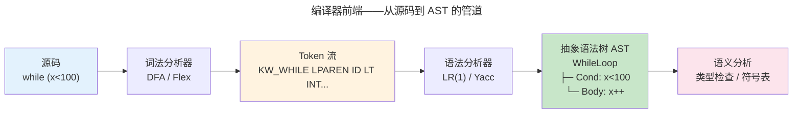

> 从源代码到机器码，编译是高层抽象向低层执行的翻译之道。

编译器是计算机科学最大的"集成项目"——前端是形式语言与自动机理论的直接应用，中间表示是图论和数据流的交汇，后端是对特定 ISA 的深度理解。本章走过词法分析、语法分析、语义检查、LLVM IR 和代码优化的完整链路。

---

## 词法分析：从字符到 Token

词法分析器将源码字符流切分为 token 流。其核心是一个 [DFA 有限自动机](../03-theory-of-computation/#自动机层次从-dfa-到图灵机)——源码字符作为输入，token 类型作为输出。

```
源码:  while (x < 100) { x++; }
Token: [KW_WHILE] [LPAREN] [ID("x")] [LT] [INT(100)] [RPAREN] [LBRACE] [ID("x")] [INC] [SEMI] [RBRACE]
```

Thompson 构造法将正则表达式转化为 NFA，然后通过**子集构造**（subset construction）转化为 DFA——每个 DFA 状态对应 NFA 状态的一个子集。这个转化在最坏情况下会使状态数呈指数增长，但在实践中编程语言的关键字集合通常产生可管理的 DFA。

---

## 语法分析：从 Token 到 AST



两类主流解析算法：

| 方法 | 方向 | 代表工具 | 特点 |
|------|------|---------|------|
| **LL(k)** | 自顶向下 | ANTLR, 手写递归下降 | 直观、错误消息友好 |
| **LR(1)** | 自底向上 | yacc/bison, RustC | 识别更强大的语法类别 |

---

## LLVM IR 与优化管道

LLVM IR 是静态单赋值（SSA）形式的中间表示——每个变量只被赋值一次。SSA 形式使**使用-定义链**（use-def chain）极其简洁：每个值只有一个定义点，优化器可以精确追踪数据流。

### 核心优化 Pass

| 优化 | 效果 | 实现原理 |
|------|------|---------|
| **死代码消除** (DCE) | 删除无用计算 | 后向数据流分析——标记被使用的值 |
| **函数内联** | 消除调用开销 | 将被调用体嵌入调用点，增大优化上下文 |
| **循环向量化** | SIMD 加速循环 | 识别连续内存访问模式，映射到 [AVX/NEON 指令](../../01-weichen/05-instruction-set-architecture/) |
| **常量折叠** | 编译时计算 | `3*4+5` → `17` |
| **循环展开** | 减少分支 | 复制循环体 4-8 次，减少循环计数和跳转 |

---

## 寄存器分配：图着色的经典应用

寄存器分配将无限多的虚拟寄存器映射到有限的物理寄存器（x86-64 有 16 个通用寄存器，ARM64 有 31 个）。核心算法是**图着色**：构造**冲突图**——节点是虚拟寄存器，边表示两个寄存器同时存活（不能分配到同一物理寄存器），然后尝试用 k 种颜色（物理寄存器数）给图着色。如果着色失败，将某些虚拟寄存器**溢出**（spill）到栈上。

Chaitin-Briggs 算法是 GCC 和 LLVM 使用的寄存器分配器，其核心是反复删除度数 < k 的节点并压栈，直到图为空（可着色）或所有节点度数 ≥ k（需要溢出）。

---

## 垃圾回收：自动内存管理

| 算法 | 原理 | 优点 | 缺点 |
|------|------|------|------|
| **标记-清除** | 从根标记可达对象，清除其余 | 不移动对象 | 碎片化 |
| **复制收集** (Cheney) | 活对象复制到新区，旧区整体回收 | 无碎片、分配极快 | 浪费一半内存 |
| **分代收集** | 年轻代高频回收、老年代低频 | 符合"大多数对象早死"规律 | 跨代引用需要写屏障 |

:::tip[跨卷链接]
分代收集利用了与 [CPU Cache 的时间局部性](../../01-weichen/04-memory-hierarchy/#局部性原理预测未来的艺术) 相同的经验规律：刚分配的对象最可能很快变成垃圾（类似刚访问的数据最可能再次被访问）。
:::

---

## 跨卷连接

| 编译技术 | 在系统中的映射 |
|---------|------------|
| DFA 词法分析 | [CPU FSM 控制器——取指/译码/执行状态机](../../01-weichen/02-digital-logic/#时序逻辑) |
| SSA 形式的 use-def 链 | [数据冒险——流水线前递的 def-use 距离分析](../../01-weichen/03-microarchitecture/#流水线冒险打破时空的魔咒) |
| 循环向量化 | [GPU SIMT——Warp 线程束执行 SIMD 指令](../../05-wanxiang/01-gpu-rendering-pipeline/) |
| 寄存器分配的图着色 | [图算法——贪心着色 + 溢出代价模型](../04-algorithm-theory/) |
| 垃圾回收的分代假设 | [Cache 替换策略——LRU 近似（年轻对象 vs 长期存活）](../../03-qiankun/02-memory-management/) |

:::tip[卷零内部路径]
- [**形式逻辑**](../02-formal-logic/)：类型系统与柯里霍华德同构——类型检查即证明验证
- [**计算理论**](../03-theory-of-computation/)：形式语言与自动机——词法/语法分析的理论基础
:::
