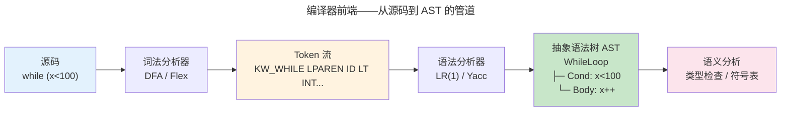
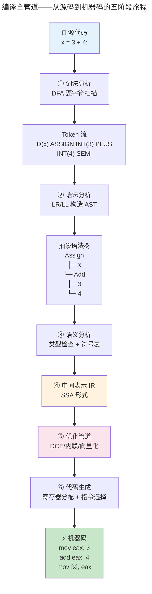

> 从源代码到机器码，编译是高层抽象向低层执行的翻译之道。

编译器是计算机科学最大的"集成项目"——前端是形式语言与自动机理论的直接应用，中间表示是图论和数据流的交汇，后端是对特定 ISA 的深度理解。本章走过词法分析、语法分析、语义检查、LLVM IR 和代码优化的完整链路。

### 编译器与解释器的本质区别

编译器与解释器代表两种截然不同的执行模型。编译器在程序运行前将源代码一次性翻译为目标平台的机器码——这个过程称为**静态编译**（Ahead-of-Time, AOT）。解释器则在程序运行时逐条读取源代码并立即执行，称为**动态解释**。

两者的核心差异在于"翻译成本"的支付时机。编译器将翻译成本集中在构建阶段一次性支付：词法分析、语法分析、语义检查、代码生成全部发生在编译期，运行时直接执行原生的机器指令，没有翻译开销。解释器则将翻译成本平摊到每次执行——每运行一行代码，都需要经过"解析 → 语义分析 → 执行"的循环。所以同一段计算逻辑，C/Rust 编译后的执行速度通常比 Python/JavaScript 解释执行快 1-2 个数量级——这不是语言的优劣，而是执行模型的选择。

但编译执行也有代价：修改一行代码需要重新编译整个模块（增量编译缓解但无法消除这个成本），而解释执行可以立即看到修改效果。这种"开发反馈速度 vs 运行峰值性能"的张力，驱动了 **JIT（Just-In-Time）编译**的出现——Java HotSpot 和 JavaScript V8 在运行时监测热点代码路径（被反复执行的循环或函数），将频繁执行的代码片段动态编译为机器码并缓存。首次执行走解释通道（启动快），热点代码走编译通道（稳态快）——JIT 试图在两种模型间取得平衡。

而从架构视角看，编译器和解释器的代码生成目标也不同。AOT 编译器生成的文件是独立的 ELF/Mach-O/PE 可执行文件，由操作系统的 [进程加载器](../../03-qiankun/01-process-and-thread/) 直接映射到内存执行；解释器/JIT 编译器生成的代码运行在运行时虚拟机内部，由虚拟机管理内存和调度。

:::note[跨卷链接]
编译器产生的机器码最终在 [卷一 · 微尘——指令集架构](../../01-weichen/05-instruction-set-architecture/) 中由 CPU 取指-译码-执行。编译器是高层抽象与硅基执行的桥梁。
:::

---

## 词法分析：从字符到 Token

词法分析器将源码字符流切分为 token 流。其核心是一个 [DFA 有限自动机](../03-theory-of-computation/#自动机层次从-dfa-到图灵机)——源码字符作为输入，token 类型作为输出。

```
源码:  while (x < 100) { x++; }
Token: [KW_WHILE] [LPAREN] [ID("x")] [LT] [INT(100)] [RPAREN] [LBRACE] [ID("x")] [INC] [SEMI] [RBRACE]
```

Thompson 构造法将正则表达式转化为 NFA，然后通过**子集构造**（subset construction）转化为 DFA——每个 DFA 状态对应 NFA 状态的一个子集。这个转化在最坏情况下会使状态数呈指数增长，但在实践中编程语言的关键字集合通常产生可管理的 DFA。

### DFA 最小化：用更少的状态做同样的事

子集构造产生的 DFA 往往存在**等价状态**——多个状态对任何输入序列的行为完全相同（总是同时到达接受状态或非接受状态）。DFA 最小化算法（Hopcroft, 1971）将等价状态合并，得到状态数最少的等价 DFA——这对于词法分析器的性能尤为重要，因为每个状态对应一条跳转指令。

**最小化的核心思想——逐步细化**：

1. 初始划分：将所有状态分为两组——接受状态组和非接受状态组（这两组行为显然不同）
2. 迭代细化：对同一组内的状态，如果对某个输入字符 $a$，它们的转移目标落在**不同的组**中，则将这些状态拆分到不同的新组
3. 重复步骤 2，直到没有组可以再拆分——此时得到的每个组就是一组等价状态，每组合并为一个新状态

以识别整数和标识符的 DFA 为例。子集构造可能产生 12 个状态，但最小化后通常只需要 5-6 个状态——这对应了词法分析器状态跳转表从 12 行降到 6 行，在解析大型源文件时节省了可观的指令缓存空间。Flex 在生成词法分析器的 C 代码时，会自动执行 DFA 最小化——用户看到的结果是紧凑的跳转表，而非原始的 NFA→DFA 展开结果。

DFA 最小化在计算理论与 [存储层次（指令缓存的珍贵）](../../01-weichen/04-memory-hierarchy/) 之间建立了直接的工程联系：少的状态 = 更小的跳转表 = 更好的指令缓存命中率 = 更快的编译速度。

**手把手走一遍词法分析**。以 `x = 3 + 4;` 为例，词法分析器逐字符扫描：

```
位置 0: 读 'x'  → 识别为标识符 [ID("x")]
位置 1: 读 ' '  → 跳过空白
位置 2: 读 '='  → 识别为赋值 [ASSIGN]
位置 4: 读 '3'  → 识别为整数 [INT(3)]
位置 6: 读 '+'  → 识别为加号 [PLUS]
位置 8: 读 '4'  → 识别为整数 [INT(4)]
位置 9: 读 ';'  → 识别为分号 [SEMI]
```

这就是 DFA 的工作方式——每个状态对应"读到哪了"，每次读入一个字符就按转移规则跳到下一个状态。如果读完后落在一个**接受状态**（如"读完了一个标识符"），就产生一个 token 并重置到起始状态；如果落在**非接受状态**，就报告词法错误（如 `@` 不是合法的 token 开头字符）。

---

## 语法分析：从 Token 到 AST



两类主流解析算法：

| 方法 | 方向 | 代表工具 | 特点 |
|------|------|---------|------|
| **LL(k)** | 自顶向下 | ANTLR, 手写递归下降 | 直观、错误消息友好 |
| **LR(1)** | 自底向上 | yacc/bison, RustC | 识别更强大的语法类别 |

**形式语法的 BNF 表示**。编程语言的语法规则可以用**巴科斯-诺尔范式**（BNF）精确描述——它就像语言的"建筑规范"。以算术表达式为例：

$$
\begin{aligned}
\text{Expr} &\to \text{Expr} + \text{Term} \mid \text{Term} \\
\text{Term} &\to \text{Term} \times \text{Factor} \mid \text{Factor} \\
\text{Factor} &\to (\text{Expr}) \mid \text{id} \mid \text{num}
\end{aligned}
$$

这条规则同时编码了**优先级**（$\times$ 在比 $+$ 更深的层级）和**结合性**（左侧递归表示左结合）。解析 `3 + 4 * 5` 时，自底向上的 LR 解析器先归约 `4 * 5` 为一个 Term，再归约 `3 + Term` 为一个 Expr——这正是我们心算时的"先乘除后加减"在形式语法中的机械实现。

**BNF 的工作机制**。每条产生式规则 $A \to \alpha$ 声明"一个 $A$ 可以由 $\alpha$ 替换而来"。解析的过程就是反复应用产生式：

- **推导**（自顶向下）：从起始符号 $\text{Expr}$ 出发，反复将非终结符替换为对应产生式的右部，直到生成的全部是终结符——这是 LL 解析器的视角
- **归约**（自底向上）：从终结符序列（token 流）出发，反复将匹配某产生式右部的子串替换为该产生式的左部非终结符，直到只剩下起始符号——这是 LR 解析器的视角

这种推导和归约的每一步，对应 [形式逻辑（自然演绎的推理规则）](../02-formal-logic/) 中的推理步——产生式就是推理规则，解析就是构造一棵证明树。

**自顶向下 vs 自底向上——两种"建树"策略**：

- **LL（自顶向下）**：从 Expr（根）出发，不停问"下一个 token 是什么？"来决定展开哪条规则。像先画好树根，再逐渐画出枝叶。递归下降解析器本质上就是一个**相互递归的函数调用链**——每个非终结符对应一个函数。
- **LR（自底向上）**：从 token 序列（叶子）出发，不停把连续几个符号"归约"为更上层的非终结符。像先把碎纸片拼成词组，再拼成句子。LR 解析器维护一个**状态栈**，每个状态代表"当前读到了语法规则的哪个位置"——这就是 [计算理论（自动机层次）](../03-theory-of-computation/#自动机层次从-dfa-到图灵机) 中下推自动机的直接应用。

### FIRST 与 FOLLOW 集：LL 解析器的"预判"工具

LL 解析器在每个步骤需要决定"用哪条产生式展开当前非终结符"。这个决策依据是**向前看 k 个 token**——LL(k) 中的 k 就是这个"预判窗口"。LL(1) 是最常用的变体：只看下一个 token 就做决策。

**FIRST 集**告诉你"某个语法符号能产生哪些开头的终结符"：

$$
\text{FIRST}(\alpha) = \{ a \mid \alpha \Rightarrow^* a\beta, a \text{ 是终结符} \}
$$

以算术表达式语法为例：
- $\text{FIRST}(\text{Expr}) = \{\ \text{id},\ \text{num},\ (\ \}$——表达式总以标识符、数字或左括号开头
- $\text{FIRST}(\text{Term}) = \{\ \text{id},\ \text{num},\ (\ \}$——项也是
- $\text{FIRST}(\text{Factor}) = \{\ \text{id},\ \text{num},\ (\ \}$——因子也是

**FOLLOW 集**告诉你"在某个非终结符之后可能出现什么终结符"：

$$
\text{FOLLOW}(A) = \{ a \mid S \Rightarrow^* \alpha A a \beta, a \text{ 是终结符} \}
$$

对于 $\text{Expr}$，它可能出现在行尾（后跟输入结束符 $\$$）或右括号前，所以 $\text{FOLLOW}(\text{Expr}) = \{\ \$,\ )\ \}$。

**为什么需要 FOLLOW？** 当 LL 解析器遇到一个非终结符可以推导出空串（$\varepsilon$）时，FIRST 集不能提供有效信息——这时候就需要看"后面可能出现什么"，即 FOLLOW 集。例如，一个可选的 `else` 分支是否应该被解析，取决于 `}` 出现在哪里。

FIRST 和 FOLLOW 的共同计算是构造 LL 解析表的前置步骤——它们将"这个 token 意味着该走哪条路"的直觉转化为精确的查表操作。构造算法用不动点迭代：反复应用产生式规则更新两个集合，直到不再变化——这本质上是一个数据流分析问题，与 [LLVM IR（SSA 形式）](#llvm-ir-与优化管道) 中的 use-def 链计算有相同的迭代不动点结构。



---

## LLVM IR 与优化管道

### 为什么需要中间表示？

如果编译器直接把 C 翻译成 x86 机器码，那每增加一种新语言（Rust、Swift）或一种新 CPU（ARM、RISC-V），就需要写 $M \times N$ 个编译器——这是组合爆炸。LLVM 的解决方案是引入一个**中间表示**（IR）：所有语言的前端编译到同一个 IR，所有 CPU 的后端从同一个 IR 翻译。这样只需要 $M + N$ 个翻译器。

LLVM IR 是静态单赋值（SSA）形式的中间表示——每个变量只被赋值一次。SSA 形式使**使用-定义链**（use-def chain）极其简洁：每个值只有一个定义点，优化器可以精确追踪数据流。

**SSA 的关键发明：$\phi$ 函数**。当控制流汇合时（如 if-else 之后），同一个变量可能来自不同分支的不同定义。普通代码需要分析"x 的值从哪来"，而 SSA 用一个 $\phi$ 节点显式标注：

$$
\phi(x_1, x_2) = \text{若来自块 B1 则取 } x_1 \text{，若来自块 B2 则取 } x_2
$$

这使每个使用点只依赖一个定义点，数据流分析从"图搜索"降维为"查字典"。$\phi$ 函数的放置策略是 SSA 构造的核心算法问题——Cytron 等人 1991 年的论文将这个问题形式化为**支配边界**（dominance frontier）的计算，是现代编译器优化器的基石。

### 核心优化 Pass

| 优化 | 效果 | 实现原理 |
|------|------|---------|
| **死代码消除** (DCE) | 删除无用计算 | 后向数据流分析——标记被使用的值 |
| **函数内联** | 消除调用开销 | 将被调用体嵌入调用点，增大优化上下文 |
| **循环向量化** | SIMD 加速循环 | 识别连续内存访问模式，映射到 [AVX/NEON 指令](../../01-weichen/05-instruction-set-architecture/) |
| **常量折叠** | 编译时计算 | `3*4+5` → `17` |
| **循环展开** | 减少分支 | 复制循环体 4-8 次，减少循环计数和跳转 |

---

## 寄存器分配：图着色的经典应用

寄存器分配将无限多的虚拟寄存器映射到有限的物理寄存器（x86-64 有 16 个通用寄存器，ARM64 有 31 个）。核心算法是**图着色**：构造**冲突图**——节点是虚拟寄存器，边表示两个寄存器同时存活（不能分配到同一物理寄存器），然后尝试用 k 种颜色（物理寄存器数）给图着色。如果着色失败，将某些虚拟寄存器**溢出**（spill）到栈上。

Chaitin-Briggs 算法是 GCC 和 LLVM 使用的寄存器分配器，其核心是反复删除度数 < k 的节点并压栈，直到图为空（可着色）或所有节点度数 ≥ k（需要溢出）。

### 图着色的工作原理

图着色的正确性保证来自一个简单的观察：如果一个节点的度数小于 k，无论它的邻居们最终分到什么颜色，它一定能从 k 种颜色中找到一种可用的——因为邻居最多占用 k-1 种颜色。所以可以安全地暂缓分配这个节点，先给剩下的图着色，最后再回来分配它。

这个观察导向了 Chaitin-Briggs 算法的核心循环：

1. 若存在度数 < k 的节点，将它从图中移除并压入栈中（暂缓分配）
2. 重复步骤 1，直到图为空（所有节点都暂缓了，说明原始图是可着色的）
3. 从栈中依次弹出节点，每次一定能找到一种可用颜色——因为弹出时该节点的邻居中已分配颜色的不超过 k-1 个
4. 如果某次迭代所有剩余节点的度数都 ≥ k，则选择一个节点标记为 **spill 候选**（将其值存到栈上而非寄存器中），然后继续

以一段具体的程序为例。假设我们用 k=3 个物理寄存器，程序中有 4 个虚拟寄存器 v1-v4，它们的活跃范围（live range）如下：

```
程序片段：
  v1 = 10        // v1 从这行开始存活
  v2 = v1 + 5    // v2 存活，v1 仍存活（v2 的定义引用了 v1）
  v3 = v2 * 2    // v1 不再使用（最后一次引用是上一行），v2 和 v3 同时存活
  v4 = v3 - 1    // v2 不再使用，v3 和 v4 同时存活
  return v4
```

两个虚拟寄存器冲突，当且仅当它们同时存活——即一个寄存器的定义出现在另一个寄存器最后一次使用之前。分析活跃范围：

- v1 与 v2 冲突（v1 的 last-use 在 v2 的定义处：`v2 = v1 + 5` 使用了 v1，v2 也随之存活）
- v2 与 v3 冲突
- v3 与 v4 冲突
- v1 与 v3 不冲突（v1 在 v3 的定义行之前已经不再活跃）

冲突图为一条链 `v1 — v2 — v3 — v4`。按照 Chaitin-Briggs 流程：度数 < 3 的节点（v1 度数 1、v4 度数 1）被反复移除，最终整张图退化为空——可以用 2 种颜色完成分配（v1/v3 同色，v2/v4 同色），实际消耗 2 个物理寄存器。

---

## 垃圾回收：自动内存管理

C/C++ 中 `malloc` 分配的内存在不再需要时，必须由程序员显式调用 `free` 归还——遗漏则导致**内存泄漏**（已分配但不可达的内存持续占用），提前释放后继续使用则导致**悬垂指针**（use-after-free）。Java、Go、Python 等语言用**垃圾回收**（GC）将内存回收自动化：运行时系统定期判别哪些对象已不可达（没有任何指针能追踪到它们），然后回收这些对象占用的内存。

GC 的核心问题是**可达性判定**：给定一组根引用（全局变量、栈上的局部变量、CPU 寄存器中的指针），从这些根出发沿指针图遍历，所有能到达的对象是**活对象**（不能回收），不能到达的是**垃圾**（可以回收）。这本质上是一个有向图的遍历问题——根集作为 BFS/DFS 起点，对象之间的指针作为边。

| 算法 | 原理 | 优点 | 缺点 |
|------|------|------|------|
| **标记-清除** | 从根标记可达对象，清除其余 | 不移动对象 | 碎片化 |
| **复制收集** (Cheney) | 活对象复制到新区，旧区整体回收 | 无碎片、分配极快 | 浪费一半内存 |
| **分代收集** | 年轻代高频回收、老年代低频 | 符合"大多数对象早死"规律 | 跨代引用需要写屏障 |

**GC 的性能代价**。标记-清除在标记阶段需要**停止整个程序**（Stop-The-World, STW）——所有线程暂停，GC 扫描对象图。毫秒级的 STW 对 Web 服务器意味着请求延迟的抖动。Go 语言从 1.5 起引入了并发标记 + 写屏障，将 STW 从 ~100ms 降到了亚毫秒——这是一个精妙的并发安全与实时性之间的工程权衡。

:::tip[跨卷链接]
分代收集利用了与 [CPU Cache 的时间局部性（局部性原理：预测未来的艺术）](../../01-weichen/04-memory-hierarchy/#局部性原理预测未来的艺术) 相同的经验规律：刚分配的对象最可能很快变成垃圾（类似刚访问的数据最可能再次被访问）。
:::

### 类型推导：Hindley-Milner 系统

编译器在语义分析阶段需要确定每个表达式的类型。程序显式声明了部分类型（如 `x: i32`），但大量中间表达式的类型需要编译器**自动推导**——这就是类型推导（Type Inference）的任务。

**Hindley-Milner（HM）类型系统**是 ML 语言家族（OCaml、Haskell、Rust 的部分类型推导）使用的经典框架。它的核心算法是**统一（Unification）**——将类型看作带有类型变量的表达式树，通过求解一组类型方程来确定所有类型变量的具体值。

用一个简单例子理解。给定函数：

```rust
fn apply(f, x) {
    return f(x);  // f 的类型？x 的类型？返回值的类型？
}
```

HM 的推导过程：

1. 为每个未知类型引入**类型变量**：$f: \alpha$，$x: \beta$，返回值：$\gamma$
2. 从 `f(x)` 这个函数调用产生约束：$\alpha$ 必须是函数类型 $\beta \to \gamma$
3. 所以 $\alpha = \beta \to \gamma$——类型变量 $\alpha$ 被统一为函数类型
4. 最终推导出 `apply` 的类型为 $\forall \alpha\ \beta.\ (\alpha \to \beta) \to \alpha \to \beta$——"对所有类型 $\alpha$ 和 $\beta$，输入一个 $\alpha \to \beta$ 的函数和一个 $\alpha$ 的值，返回 $\beta$"

统一算法的关键是**出现检查（Occurs Check）**——禁止类型变量出现在自己的定义中（如 $\alpha = \alpha \to \beta$ 会导致无限递归类型，HM 系统拒绝这种循环）。这一限制保证了统一过程一定终止。

Rust 的类型推导比 HM 更复杂——它还需要处理生命周期（lifetime）、trait bound 和所有权关系。Rust 的 trait solver 将 trait 约束转化为一阶逻辑中的 Horn 子句，用类似 Prolog 的搜索策略求解——这是 [Curry-Howard 同构（程序即证明）](../02-formal-logic/#curry-howard-同构程序即证明) 在工业编译器中的大规模应用。

---

## 跨卷连接

| 编译技术 | 在系统中的映射 |
|---------|------------|
| DFA 词法分析 | [CPU FSM 控制器——取指/译码/执行状态机（时序逻辑）](../../01-weichen/02-digital-logic/#时序逻辑) |
| SSA 形式的 use-def 链 | [数据冒险——流水线前递的 def-use 距离分析（流水线冒险：打破时空的魔咒）](../../01-weichen/03-microarchitecture/#流水线冒险打破时空的魔咒) |
| 循环向量化 | [GPU 并行架构](../../05-wanxiang/01-gpu-rendering-pipeline/#gpu-并行架构) |
| 寄存器分配的图着色 | [图算法——贪心着色 + 溢出代价模型](../04-algorithm-theory/) |
| 垃圾回收的分代假设 | [Cache 替换策略——LRU 近似（年轻对象 vs 长期存活）（分段 vs 分页）](../../03-qiankun/02-memory-management/#分段-vs-分页) |

:::tip[卷零内部路径]
- [**形式逻辑**](../02-formal-logic/)：类型系统与柯里霍华德同构——类型检查即证明验证
- [**计算理论**](../03-theory-of-computation/)：形式语言与自动机——词法/语法分析的理论基础
:::
