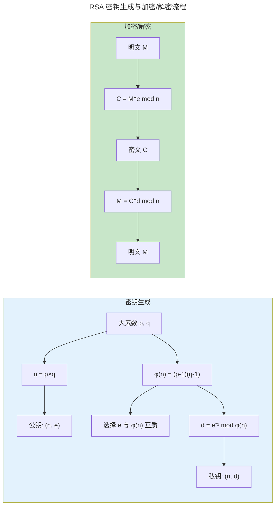
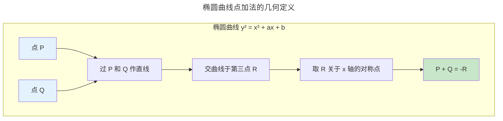

> 密码学的数学根基，为卷七 · 天枢提供理论工具。

现代密码学建立在几个"已知困难"的数学问题之上：大数分解、离散对数、椭圆曲线上的标量乘法。这些问题共享一个特征：正向计算高效（如计算 $g^x \bmod p$），逆向计算极其困难（如从 $g^x \bmod p$ 求出 $x$）。本章聚焦于这些数学结构——模运算、有限域、椭圆曲线——为[卷七 · 天枢](../../07-tianshu/)的对称/非对称加密和数字签名提供理论根基。

### 单向函数与计算不对称性

密码学的安全根基是**单向函数**（One-Way Function）——计算 $f(x)$ 容易，但从 $y = f(x)$ 恢复 $x$ 在计算上不可行。这不是"没人找到方法"，而是基于一个更强的断言：在某些被广泛研究的数学问题上，所有已知的算法在最坏情况下都需要指数级时间，且经过数十年密码分析社区的检验无人能攻克。

单向函数的存在性至今未得到严格证明——它蕴含 $P \neq NP$（因为单向函数的反函数求值是一个 NP 问题，如果 P=NP 则所有 NP 问题都在多项式时间可解）。因此密码学界的安全信念基于一个未经证明但被广泛采信的假设。这使密码学带有一种特殊的理论气质：系统设计在经验安全性上经过了充分的攻击测试，但其最终的数学安全性取决于一个尚未被证明的计算复杂性猜想。

具体而言，RSA 的安全性归约到**大整数分解的困难性**：已知 $n = p \times q$（$p$ 和 $q$ 是大素数），恢复 $p$ 和 $q$ 的最好经典算法是数域筛法，复杂度约为 $\exp(O((\log n)^{1/3}(\log \log n)^{2/3}))$——这是**亚指数级**但非多项式级。ECC 的安全性归约到**椭圆曲线离散对数问题**（ECDLP）——目前最好的经典算法仍是指数级 $O(\sqrt{n})$（Pollard's rho），无已知的亚指数算法。因此 256 位 ECC 密钥提供约 128 位的安全强度，而 RSA 需要 3072 位模数才能达到同等安全水平。

:::note[跨卷链接]
具体的加密算法实现在 [卷七 · 天枢——对称加密](../../07-tianshu/01-symmetric-cryptography/) 和 [卷七 · 天枢——非对称加密](../../07-tianshu/02-asymmetric-cryptography/) 中展开——本章只讲数学结构本身。
:::

---

## 模运算：循环世界的算术

模运算构成一个**环**——支持加法、减法和乘法。当模数为素数时，它升级为**域**——除法也有定义（通过扩展欧几里得算法求乘法逆元）。

模 $n$ 加法群 $\mathbb{Z}_n$ 是一个循环群——所有元素都可以通过对生成元反复做加法得到。这为密码学中的离散对数问题提供了代数基础：给定 $g$ 和 $g^x \bmod p$，求 $x$ 即是在 $\mathbb{Z}_p^*$ 这个乘法循环群上计算离散对数。当模数是一个 2048 位的素数时，这个任务在经典计算模型下被认为不可行。

**小数字 RSA——用你能验算的数字理解原理**。选两个小素数 $p=3, q=11$，则 $n = 33$，$\phi(n) = (3-1)(11-1) = 20$：

$$
\text{选 } e=3 \text{（与 20 互质），} d = 3^{-1} \bmod 20 = 7 \text{（因为 } 3 \times 7 = 21 \equiv 1 \pmod{20}\text{）}
$$

加密消息 $M = 4$：$C = 4^3 \bmod 33 = 64 \bmod 33 = 31$
解密：$M = 31^7 \bmod 33 = 27512614111 \bmod 33 = 4$

加密只需要 3 次乘法，解密却涉及 7 次幂——但在不知道 $p$ 和 $q$ 的情况下从 $31^e = 4$ 反推 $e$ 即离散对数问题。真正的 RSA 用 2048 bit 的 $n$ 让暴力搜索完全不可行。

RSA 加密的核心操作是模幂运算：

$$
C = M^e \bmod n
$$

正向（加密）计算高效——快速幂算法只需 $O(\log e)$ 次模乘法。逆向（解密）需要 $d = e^{-1} \bmod \phi(n)$——这需要知道 $\phi(n) = (p-1)(q-1)$，即需要因数分解 $n = pq$。

---

## 有限域：AES 的代数舞台

AES 加密的核心运算——SubBytes、MixColumns——都在 **$GF(2^8)$**（256 个元素的有限域）上进行。这个域的元素是 8 位字节，加法和乘法遵循多项式运算规则。

MixColumns 操作的数学本质是一个 $4 \times 4$ 矩阵在 $GF(2^8)$ 上的乘法：

$$
\begin{bmatrix} 02 & 03 & 01 & 01 \\ 01 & 02 & 03 & 01 \\ 01 & 01 & 02 & 03 \\ 03 & 01 & 01 & 02 \end{bmatrix}
\cdot
\begin{bmatrix} s_0 \\ s_1 \\ s_2 \\ s_3 \end{bmatrix}
$$

其中 `02` 乘法的"加倍"操作基于 $GF(2^8)$ 的不可约多项式 $x^8 + x^4 + x^3 + x + 1$——选择这个特定多项式是因为它有良好的扩散性质（所有系数在合理范围内最小）。

有限域 $GF(2^8)$ 的必要性来自加密的精确性要求。实数运算在 IEEE 754 下产生舍入误差——`0.1 + 0.2 ≠ 0.3`。但密码学不允许这种不确定性：解密时的每一位必须与加密时完全一致，一个 bit 的偏差就导致解密失败。有限域通过将运算封闭在一个包含恰好 256 个元素的代数结构中，保证了每个运算结果都是精确且确定的——不存在舍入、不存在逼近、不存在浮点异常的传播。AES 的 SubBytes 查表操作和 MixColumns 矩阵乘法都发生在这个 256 元素的封闭算术中。

---

## 椭圆曲线密码学（ECC）

椭圆曲线上的点与一个"无穷远点"构成一个**加法群**。群运算规则的几何定义：

ECC 的安全性基于**椭圆曲线离散对数问题**（ECDLP）：已知 $P$ 和 $Q = kP$（即 $k$ 个 $P$ 相加），求 $k$。这个问题被认为比 RSA 的因数分解更难——256 位 ECC 密钥 ≈ 3072 位 RSA 密钥的安全强度。这就是为什么 Bitcoin 和 Ethereum 使用 secp256k1 曲线，TLS 1.3 和 WireGuard 偏爱 Curve25519。

ECC 比 RSA 更高效的根源在于攻击算法的复杂度差异。RSA 面临的数域筛法是亚指数级 $\exp(O((\log n)^{1/3}(\log \log n)^{2/3}))$，这意味着随着模数增大，攻击复杂度增长相对平缓——因此 RSA 需要不断增大模数以维持安全。而 ECC 的离散对数问题在一般曲线上已知的最好经典攻击是 Pollard's rho 算法，复杂度为 $O(\sqrt{n})$——这是**完全指数级**的增长趋势。所以 ECC 可以用短得多的密钥达到与 RSA 相同的安全强度，在 [TLS 1.3 握手延迟（TLS 1.3：1-RTT 握手的极简主义）](../../03-qiankun/07-application-protocols/#tls-131-rtt-握手的极简主义) 中直接转化为更快的握手和更少的带宽消耗。

---

## 格密码：后量子时代的希望

量子计算机（Shor 算法）可以高效解决整数分解和离散对数——这使 RSA 和 ECC 在量子时代不再安全。**格密码**基于格上的困难问题——最短向量问题（SVP）和带错误学习问题（LWE）——目前没有已知的高效量子算法。

NIST 在 2024 年正式标准化的后量子密码算法中，**Kyber**（密钥封装，基于 Module-LWE）和 **Dilithium**（数字签名，基于 Module-LWE/SIS）都是格密码方案。它们的数学安全性源于**高维格的几何复杂性与代数结构化之间的平衡**。

---

## 跨卷连接

| 数学结构 | 密码学应用 | 卷七章节 |
|---------|---------|---------|
| 模运算与大数分解 | RSA——$C = M^e \bmod n$ | [RSA：大数分解的数学基础](../../07-tianshu/02-asymmetric-cryptography/#rsa大数分解的数学基础) |
| $GF(2^8)$ 多项式乘法 | AES SubBytes + MixColumns | [AES：当代对称加密之王](../../07-tianshu/01-symmetric-cryptography/#aes当代对称加密之王) |
| 椭圆曲线点加群 | ECDSA——$R = kG$ 签名 | [数字签名](../../07-tianshu/03-hash-and-signature/#数字签名) |
| 离散对数 | Diffie-Hellman——$g^{ab}$ 共享密钥 | [DH 密钥交换协议](../../07-tianshu/02-asymmetric-cryptography/) |
| LWE 格问题 | Kyber 密钥封装 | [后量子密码标准化](../../07-tianshu/02-asymmetric-cryptography/) |

:::tip[卷零内部路径]
- [**数学基础**](../01-mathematical-foundations/)：线性代数——格密码的向量空间与 LWE 的矩阵形式
- [**算法理论**](../04-algorithm-theory/)：快速幂 $O(\log e)$——RSA 和 ECC 标量乘法的性能基础
:::
