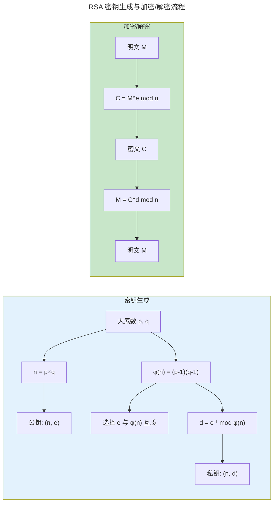
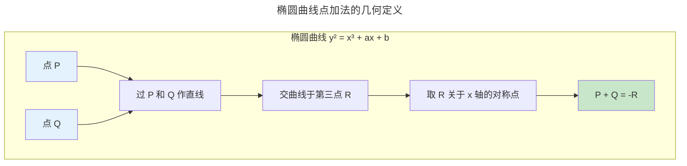

> 密码学的数学根基，为卷七 · 天枢提供理论工具。

现代密码学建立在几个"已知困难"的数学问题之上：大数分解、离散对数、椭圆曲线上的标量乘法。这些问题共享一个特征：正向计算高效（如计算 $g^x \bmod p$），逆向计算极其困难（如从 $g^x \bmod p$ 求出 $x$）。本章聚焦于这些数学结构——模运算、有限域、椭圆曲线——为[卷七 · 天枢](../../07-tianshu/)的对称/非对称加密和数字签名提供理论根基。

---

## 模运算：循环世界的算术

模运算构成一个**环**——支持加法、减法和乘法。当模数为素数时，它升级为**域**——除法也有定义（通过扩展欧几里得算法求乘法逆元）。

RSA 加密的核心操作是模幂运算：

$$
C = M^e \bmod n
$$

正向（加密）计算高效——快速幂算法只需 $O(\log e)$ 次模乘法。逆向（解密）需要 $d = e^{-1} \bmod \phi(n)$——这需要知道 $\phi(n) = (p-1)(q-1)$，即需要因数分解 $n = pq$。

---

## 有限域：AES 的代数舞台

AES 加密的核心运算——SubBytes、MixColumns——都在 **$GF(2^8)$**（256 个元素的有限域）上进行。这个域的元素是 8 位字节，加法和乘法遵循多项式运算规则。

MixColumns 操作的数学本质是一个 $4 \times 4$ 矩阵在 $GF(2^8)$ 上的乘法：

$$
\begin{bmatrix} 02 & 03 & 01 & 01 \\ 01 & 02 & 03 & 01 \\ 01 & 01 & 02 & 03 \\ 03 & 01 & 01 & 02 \end{bmatrix}
\cdot
\begin{bmatrix} s_0 \\ s_1 \\ s_2 \\ s_3 \end{bmatrix}
$$

其中 `02` 乘法的"加倍"操作基于 $GF(2^8)$ 的不可约多项式 $x^8 + x^4 + x^3 + x + 1$——选择这个特定多项式是因为它有良好的扩散性质（所有系数在合理范围内最小）。

---

## 椭圆曲线密码学（ECC）

椭圆曲线上的点与一个"无穷远点"构成一个**加法群**。群运算规则的几何定义：

ECC 的安全性基于**椭圆曲线离散对数问题**（ECDLP）：已知 $P$ 和 $Q = kP$（即 $k$ 个 $P$ 相加），求 $k$。这个问题被认为比 RSA 的因数分解更难——256 位 ECC 密钥 ≈ 3072 位 RSA 密钥的安全强度。这就是为什么 Bitcoin 和 Ethereum 使用 secp256k1 曲线，TLS 1.3 和 WireGuard 偏爱 Curve25519。

---

## 格密码：后量子时代的希望

量子计算机（Shor 算法）可以高效解决整数分解和离散对数——这使 RSA 和 ECC 在量子时代不再安全。**格密码**基于格上的困难问题——最短向量问题（SVP）和带错误学习问题（LWE）——目前没有已知的高效量子算法。

NIST 在 2024 年正式标准化的后量子密码算法中，**Kyber**（密钥封装，基于 Module-LWE）和 **Dilithium**（数字签名，基于 Module-LWE/SIS）都是格密码方案。它们的数学安全性源于**高维格的几何复杂性与代数结构化之间的平衡**。

---

## 跨卷连接

| 数学结构 | 密码学应用 | 卷七章节 |
|---------|---------|---------|
| 模运算与大数分解 | RSA——$C = M^e \bmod n$ | [RSA 非对称加密](../../07-tianshu/02-asymmetric-cryptography/) |
| $GF(2^8)$ 多项式乘法 | AES SubBytes + MixColumns | [AES 对称加密的 S-Box 设计](../../07-tianshu/01-symmetric-cryptography/) |
| 椭圆曲线点加群 | ECDSA——$R = kG$ 签名 | [ECDSA/EdDSA 数字签名](../../07-tianshu/03-hash-and-signature/) |
| 离散对数 | Diffie-Hellman——$g^{ab}$ 共享密钥 | [DH 密钥交换协议](../../07-tianshu/02-asymmetric-cryptography/) |
| LWE 格问题 | Kyber 密钥封装 | [后量子密码标准化](../../07-tianshu/02-asymmetric-cryptography/) |

:::tip[卷零内部路径]
- [**数学基础**](../01-mathematical-foundations/)：线性代数——格密码的向量空间与 LWE 的矩阵形式
- [**算法理论**](../04-algorithm-theory/)：快速幂 $O(\log e)$——RSA 和 ECC 标量乘法的性能基础
:::
