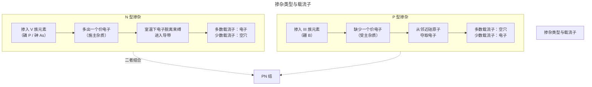
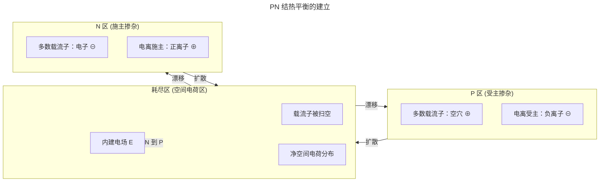
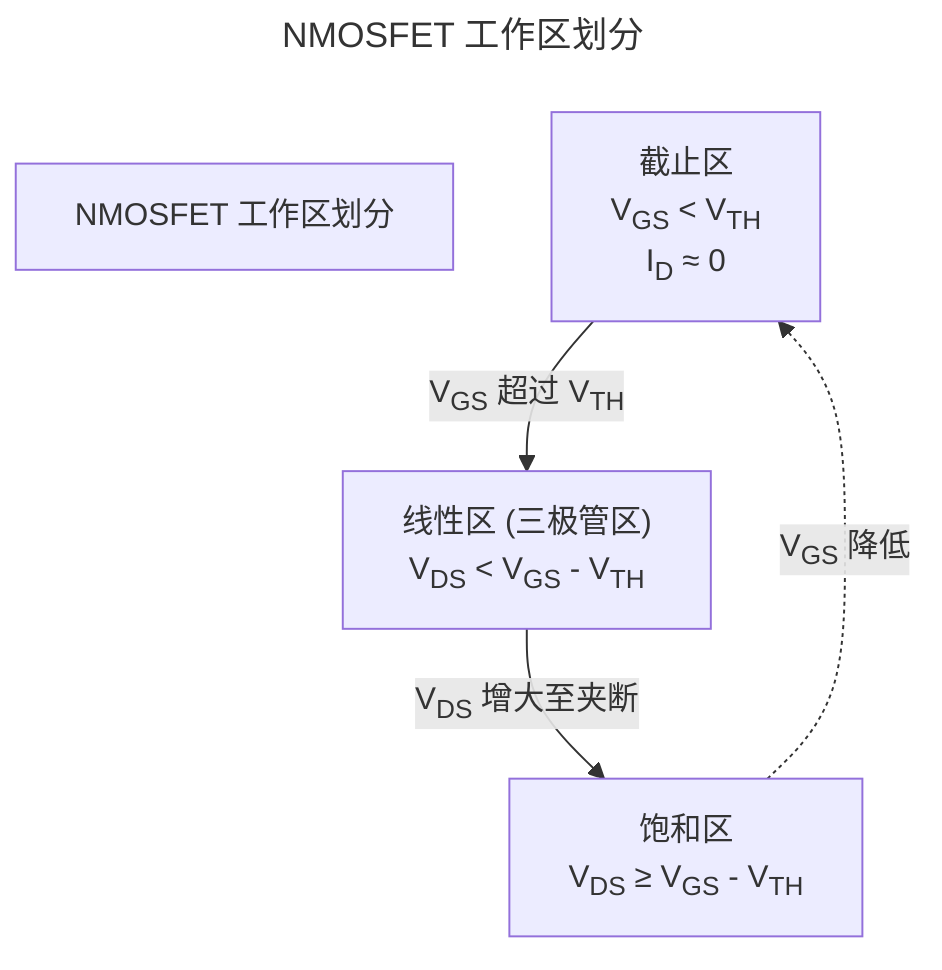
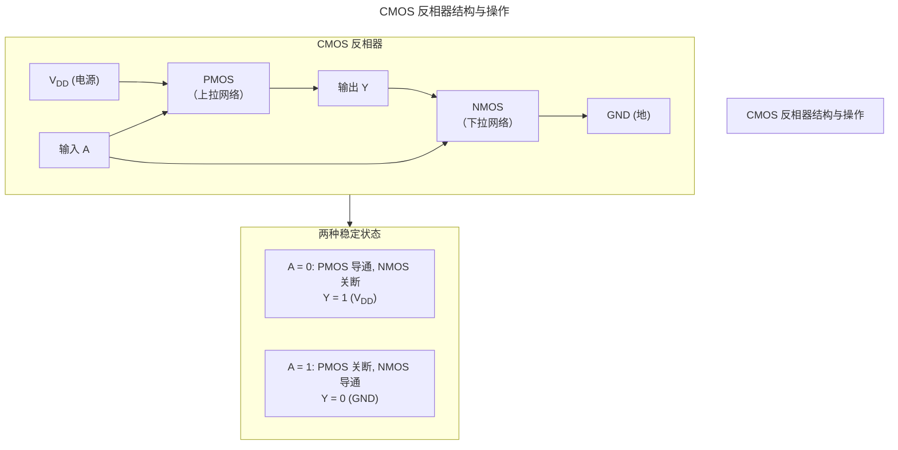
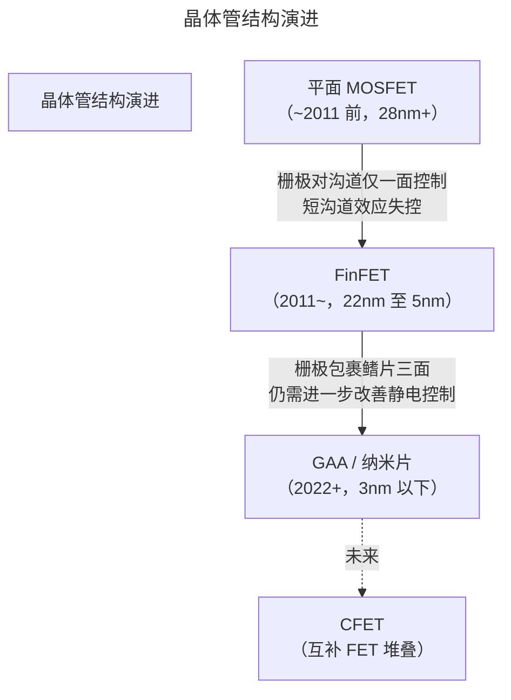

> 一切计算的物理起点。

## 能带理论与掺杂

在量子力学的图景中，孤立原子的电子占据分立的能级。当大量原子周期性排列形成晶体时，这些分立能级展宽为连续的能量区间——**能带**。固体的导电行为，取决于电子填充能带的方式。

### 三个关键能带

```
能量 ↑
      ┌────────────────── 导带 (Conduction Band)
      │  ← 电子可自由移动
──────┤  Ec (导带底)
      │
      │  禁带 (Band Gap) Eg
      │
──────┤  Ev (价带顶)
      │  ← 电子被束缚
      └────────────────── 价带 (Valence Band)
```

- **价带**：在绝对零度下被电子完全占据的最高能带。电子被共价键束缚，无法自由移动。
- **导带**：价带之上的空能带。进入导带的电子成为自由载流子，参与导电。
- **禁带**：价带顶与导带底之间的能量间隙，宽度记为 $E_g$。

三种材料的区别只在于 $E_g$ 的大小：

| 材料类型 | $E_g$ (室温) | 典型代表 | 导电机制 |
|----------|-------------|----------|----------|
| 导体 | $\sim 0\ \mathrm{eV}$（重叠） | 铜、铝 | 导带与价带重叠，电子始终自由 |
| 半导体 | $0.1 \sim 2.0\ \mathrm{eV}$ | 硅 $1.12\ \mathrm{eV}$，锗 $0.67\ \mathrm{eV}$ | 热激发可使少量电子跃迁至导带 |
| 绝缘体 | $> 3\ \mathrm{eV}$ | SiO₂ $\sim 9\ \mathrm{eV}$ | 室温热能量远不足以使电子跃迁 |

$$
n_i(T) \propto T^{3/2} \exp\left(-\frac{E_g}{2kT}\right)
$$

上式给出了本征半导体的载流子浓度 $n_i$ 与温度和禁带宽度的关系。硅在室温 (300K) 下 $n_i \approx 1.5 \times 10^{10}\ \mathrm{cm}^{-3}$——相较硅的原子密度 (约 $5\times 10^{22}\ \mathrm{cm}^{-3}$)，纯净硅中每万亿个原子才贡献一对电子-空穴对，导电能力极为有限。

### 掺杂：半导体的灵魂

`掺杂` 是半导体技术的核心思想：向本征半导体中**精确注入杂质原子**，使其导电率可控地提高数个数量级。



掺杂浓度通常在 $10^{14} \sim 10^{20}\ \mathrm{cm}^{-3}$ 量级。施主/受主能级距离导带底/价带顶仅约 $0.05\ \mathrm{eV}$，远小于硅的禁带宽度，因此室温热能 ($kT \approx 0.026\ \mathrm{eV}$) 足以使其电离。

:::tip[跨卷链接]
掺杂浓度的精确控制直接影响 [MOSFET](/01-weichen/01-semiconductor-physics/#mosfet-结构与-iv-特性) 的阈值电压，进而决定 [数字逻辑电路](/01-weichen/02-digital-logic/) 的开关速度和功耗。在 [卷六 · 须弥](/06-xumi/) 中讨论的存算一体架构，其物理基础正源于对掺杂分布的纳米级调控。
:::

## PN 结与耗尽区

将 P 型半导体与 N 型半导体接触——PN 结是一切半导体器件的基础。

### 热平衡下的 PN 结



在接触瞬间，巨大的载流子浓度梯度驱动**扩散**：P 区的空穴向 N 区扩散，N 区的电子向 P 区扩散。扩散后的载流子发生复合，在界面附近留下不可移动的电离杂质离子——P 侧为负离子，N 侧为正离子。这层几乎不含自由载流子的区域称为**耗尽区** (Depletion Region)。

耗尽区内的空间电荷建立**内建电场**，方向从 N 指向 P。该电场驱动**漂移**电流，与扩散电流方向相反。热平衡时，扩散与漂移的动态平衡建立了内建电势：

$$
V_{bi} = \frac{kT}{q} \ln\left(\frac{N_A N_D}{n_i^2}\right)
$$

其中 $N_A$、$N_D$ 分别为受主和施主掺杂浓度。对典型硅 PN 结，$V_{bi} \approx 0.6 \sim 0.9\ \mathrm{V}$。

耗尽区宽度由泊松方程决定：

$$
W = \sqrt{\frac{2\epsilon_s}{q} \left(\frac{1}{N_A} + \frac{1}{N_D}\right) V_{bi}}
$$

### 偏置状态

| 偏置 | 外加电场方向 | 耗尽区宽度 | 势垒高度 | 电流 | 物理本质 |
|------|-------------|-----------|----------|------|----------|
| 零偏 | 无 | $W_0$ | $qV_{bi}$ | 0 | 扩散 = 漂移 |
| 正向偏置 ($V > 0$) | 与内建电场相反 | 变窄 | $q(V_{bi} - V)$ | **指数增长** | 扩散压倒漂移 |
| 反向偏置 ($V < 0$) | 与内建电场相同 | 变宽 | $q(V_{bi} + |V|)$ | 极小（反向饱和） | 漂移压倒扩散 |

### 肖克莱方程

理想 PN 结的 I-V 特性由肖克莱 (Shockley) 方程描述：

$$
I = I_S \left[ \exp\left(\frac{qV}{nkT}\right) - 1 \right]
$$

- $I_S$：反向饱和电流，通常在 $10^{-9} \sim 10^{-15}\ \mathrm{A}$ 量级
- $n$：理想因子，$1 \leq n \leq 2$
- $V_T = \frac{kT}{q} \approx 26\ \mathrm{mV}$ (室温)：热电压

**正向偏置**：$V > 0$ 时，指数项主导，电流急剧上升。硅 PN 结的"导通电压"约为 $0.7\ \mathrm{V}$。

**反向偏置**：$V < 0$ 且 $|V| \gg \frac{kT}{q}$ 时，$I \approx -I_S$，电流由少子漂移贡献，极小且几乎恒定。

**反向击穿**：当反向电压超过临界值时，发生两种击穿机制：

| 机制 | 条件 | 温度系数 | 物理过程 |
|------|------|----------|----------|
| 齐纳击穿 | 重掺杂，低压 ($<5\ \mathrm{V}$) | 负 | 高电场直接撕裂共价键（量子隧穿） |
| 雪崩击穿 | 轻掺杂，高压 ($>5\ \mathrm{V}$) | 正 | 载流子碰撞电离产生连锁倍增效应 |

:::caution[击穿并非总是灾难]
齐纳击穿被有意用于[齐纳二极管]中——通过精确控制掺杂浓度，制造出在特定电压下稳定击穿的基准电压源。但对于 MOSFET 的栅氧化层，击穿意味着器件永久损坏。
:::

## MOSFET 结构与 I-V 特性

[`MOSFET`](/glossary/#m)（金属-氧化物-半导体场效应晶体管）是现代数字集成电路的基本构建单元。一块指甲盖大小的芯片中，集成了数十亿个这样的器件。

### 基本结构（以 NMOS 为例）

```
        源极 (Source)    栅极 (Gate)      漏极 (Drain)
            │                │                │
        ┌───┴───┐    ┌──────┴──────┐    ┌───┴───┐
        │  N⁺   │    │   金属/多晶硅  │    │  N⁺   │
        └───┬───┘    └──────┬──────┘    └───┬───┘
            │               │               │
     ═══════╪═══════════════╪═══════════════╪═══════ SiO₂ (栅氧层)
            │               │               │
    ┌───────┴───────────────┴───────────────┴───────┐
    │                 P 型衬底 (Substrate)           │
    └───────────────────────┬───────────────────────┘
                            │
                    衬底接触 (Body)
```

NMOS 的源极和漏极是两个 N⁺ 重掺杂区，嵌入在 P 型衬底中。栅极通过一层极薄的 SiO₂（栅氧化层）与衬底隔离。这一 **金属栅极—氧化层—半导体衬底** 的三明治结构，正是 "MOS"（Metal-Oxide-Semiconductor）名称的来源。

**四端电压定义**（以源极为参考）：

| 端电压 | 符号 | 作用 |
|--------|------|------|
| 栅-源电压 | $V_{GS}$ | 控制沟道导电性的核心电压 |
| 漏-源电压 | $V_{DS}$ | 驱动载流子从源到漏的横向电场 |
| 衬-源电压 | $V_{BS}$ | 通常接地 ($V_{BS} = 0$)，影响阈值电压（衬偏效应） |

:::note[衬偏效应 (Body Effect)]
当源极与衬底之间存在反向偏压 $V_{SB} > 0$（即衬底相对于源极为负电位）时，耗尽层展宽，需要更大的栅极电压才能建立反型层——**阈值电压随 $V_{SB}$ 增大而升高**：

$$
V_{TH} = V_{TH0} + \gamma\left(\sqrt{2\phi_F + V_{SB}} - \sqrt{2\phi_F}\right)
$$

其中 $\gamma = \frac{\sqrt{2\epsilon_s q N_A}}{C_{ox}}$ 为衬偏系数，$V_{TH0}$ 是 $V_{SB} = 0$ 时的阈值电压。

衬偏效应在以下场景中不可忽略：
- **传输管逻辑**：NMOS 传输管在传递高电平时，源极电位升高导致 $V_{SB} > 0$，阈值电压随之增大，信号衰减加剧
- **堆叠晶体管**：NAND/NOR 门中串联晶体管的上方器件存在显著的衬偏效应，需要调整尺寸以补偿
- **模拟电路**：衬偏效应用于动态调节阈值，是实现体效应调制电路的基础
:::

### 沟道形成与阈值电压

当 $V_{GS} = 0$ 时，源-漏之间是两个背靠背的 PN 结，无论 $V_{DS}$ 的极性如何，总有一个 PN 结反偏，电流近乎为零。

当 $V_{GS}$ 逐渐增大（对 NMOS 为正电压），栅极上的正电荷排斥 P 型衬底中的空穴，在栅氧化层下的衬底表面形成**耗尽层**。当 $V_{GS}$ 超过**阈值电压** $V_{TH}$ 时，表面电势足以将衬底局部的少数载流子（电子）吸引到表面，形成一个 N 型导电沟道——**反型层** (Inversion Layer)。

$$
V_{TH} = V_{FB} + 2\phi_F + \frac{\sqrt{2\epsilon_s q N_A (2\phi_F)}}{C_{ox}}
$$

其中 $V_{FB}$ 为平带电压，$\phi_F$ 为费米势，$C_{ox} = \epsilon_{ox} / t_{ox}$ 为单位面积栅氧电容。**栅氧厚度 $t_{ox}$ 是工艺节点中最关键的参数之一**——它越薄，$C_{ox}$ 越大，$V_{TH}$ 越容易达到，开关速度越快，但同时栅极漏电（隧穿电流）也越大。

### I-V 特性与工作区



**截止区** ($V_{GS} < V_{TH}$)：

$$
I_D \approx 0
$$

沟道未形成，MOSFET 近似为断开的开关。

**线性区** ($V_{GS} > V_{TH}$，$V_{DS} < V_{GS} - V_{TH}$)：

$$
I_D = \mu_n C_{ox} \frac{W}{L} \left[ (V_{GS} - V_{TH}) V_{DS} - \frac{V_{DS}^2}{2} \right]
$$

沟道连续，MOSFET 表现为电压控制的电阻。当 $V_{DS} \ll V_{GS} - V_{TH}$ 时，$I_D \approx \mu_n C_{ox} \frac{W}{L} (V_{GS} - V_{TH}) V_{DS}$，呈线性关系。

**饱和区** ($V_{GS} > V_{TH}$，$V_{DS} \geq V_{GS} - V_{TH}$)：

$$
I_D = \frac{1}{2} \mu_n C_{ox} \frac{W}{L} (V_{GS} - V_{TH})^2 (1 + \lambda V_{DS})
$$

当 $V_{DS}$ 增大至 $V_{GS} - V_{TH}$ 时，沟道在漏端被**夹断** (Pinch-off)。此后 $I_D$ 几乎与 $V_{DS}$ 无关，仅取决于 $V_{GS}$——晶体管进入恒流源模式，这正是数字电路中 MOSFET 作为放大/开关单元的工作状态。

关键参数：
- $\mu_n$：电子迁移率（对 PMOS 则为 $\mu_p$，空穴迁移率约为电子的 $1/3$）
- $W/L$：宽长比，版图设计师控制驱动能力的核心参数
- $\lambda$：沟道长度调制系数
- $g_m = \frac{\partial I_D}{\partial V_{GS}}$：跨导，将栅压变化转换为漏极电流变化的能力

### NMOS vs PMOS

| 特性 | NMOS | PMOS |
|------|------|------|
| 载流子 | 电子 | 空穴 |
| 迁移率 $\mu$ | 高 (~$1350\ \mathrm{cm}^2/V\cdot s$) | 低 (~$450\ \mathrm{cm}^2/V\cdot s$) |
| 开通条件 | $V_{GS} > V_{THN}$ (正电压) | $V_{SG} > |V_{THP}|$ (负栅压) |
| 导通性能 | 强（相同尺寸下电流约 2~3 倍） | 弱 |
| 传递 | 强 0 | 强 1 |

由于空穴迁移率低，PMOS 需要约 2~3 倍的栅宽才能达到与 NMOS 相同的驱动电流——这就是为什么在 CMOS 版图中，PMOS 通常比 NMOS 大。

:::note[历史注记]
在 CMOS 成为主流之前，NMOS 逻辑一度独占鳌头——所有晶体管都是 NMOS，上拉电阻由耗尽型负载管实现。CMOS 的胜利在于其近乎为零的静态功耗，详见下一节。
:::

## CMOS 反相器与功耗

[`CMOS`](/glossary/#c)（互补金属氧化物半导体）将 NMOS 和 PMOS 配对，实现了数字逻辑的理想开关特性。

### 反相器：CMOS 的基本单元



CMOS 的优雅之处在于：**在任何稳态下，VDD 和 GND 之间总有一个晶体管关断**，没有直流电流通路。这是超大规模集成电路能集成数十亿晶体管而不烧毁的物理基础。

### 电压传输特性 (VTC)

```
Vout ↑
VDD ┤                        ╭────
    │                       ╱
    │                      ╱
    │                     ╱
    │                    ╱  ← 过渡区 (两管同时导通)
VDD/2┤ - - - - - - - - ╱- - - - 阈值点: Vin = Vout = Vth
    │                 ╱
    │                ╱
    │               ╱
    │──────────────╱
  0 ┼─────────────┴────┬──────────────→ Vin
    0                 VDD/2            VDD
    │←── 输出高 ──→│← 过渡区 →│←── 输出低 ──→│
```

VTC 曲线揭示了几个关键指标：

| 参数 | 定义 | 理想值 | 含义 |
|------|------|--------|------|
| $V_{OH}$ | 输出高电平 | $V_{DD}$ | 输出"1"时的最低电压 |
| $V_{OL}$ | 输出低电平 | $0$ | 输出"0"时的最高电压 |
| $V_{IH}$ | 输入高电平 | 略低于 $V_{DD}$ | 被识别为"1"的最低输入电压 |
| $V_{IL}$ | 输入低电平 | 略高于 $0$ | 被识别为"0"的最高输入电压 |
| $NM_H$ | 高电平噪声容限 | $V_{OH} - V_{IH}$ | 对噪声干扰的容忍能力 |
| $NM_L$ | 低电平噪声容限 | $V_{IL} - V_{OL}$ | 同上 |

CMOS 的再生特性确保信号经过多级反相器后不会退化——这是构建任意复杂数字逻辑的前提。

### 功耗分析

CMOS 电路的功耗分为三大来源：

$$
P_{total} = P_{dynamic} + P_{short\_circuit} + P_{static}
$$

#### 1. 动态功耗（开关功耗）

每一次 $0 \rightarrow 1$ 的输出翻转，都需要通过 PMOS 对负载电容 $C_L$ 充电（从 VDD 抽取能量）；$1 \rightarrow 0$ 翻转时，$C_L$ 上的能量通过 NMOS 对地放电。每个周期中 VDD 消耗的总能量为 $C_L V_{DD}^2$。

$$
P_{dynamic} = \alpha \cdot C_L \cdot V_{DD}^2 \cdot f
$$

- $\alpha$：活动因子（每个时钟周期发生翻转的概率，典型值 $0.01 \sim 0.3$）
- $C_L$：负载电容（栅电容 + 互连线电容 + 漏极扩散电容）
- $f$：时钟频率

这是 CMOS 功耗中占比最大的部分——也是 `DVFS`（动态电压频率调节）技术的理论基础：降低 $V_{DD}$ 和 $f$ 可获得立方级的功耗优化。

#### 2. 短路功耗（直通功耗）

输入信号翻转时，NMOS 和 PMOS 会在过渡区短暂同时导通，形成从 VDD 到 GND 的直流通路。良好设计的反相器中，短路功耗通常占动态功耗的 $< 10\%$。

#### 3. 静态功耗（漏电功耗）

即使 MOSFET 处于"关断"状态（$V_{GS} = 0$），仍有微小的漏电流：

| 漏电机制 | 来源 | 工艺节点影响 |
|----------|------|-------------|
| 亚阈值漏电 | $V_{GS}$ 略低于 $V_{TH}$ 时仍有少量载流子扩散 | 随 $V_{TH}$ 降低而指数增长 |
| 栅极隧穿 | 电子量子隧穿穿过超薄栅氧化层 | 随 $t_{ox}$ 减小而指数增长 |
| 结漏电 | 源/漏与衬底 PN 结反向偏置时的少子漂移 | 随掺杂浓度升高而增大 |

$$
I_{subthreshold} \propto \exp\left(\frac{V_{GS} - V_{TH}}{nV_T}\right)
$$

在先进工艺节点（7nm 以下），静态功耗已从"可忽略"变为设计核心约束——手机待机功耗、数据中心芯片热预算都受其限制。

:::danger[功耗墙]
2005 年前后，时钟频率的指数增长戛然而止——不是因为无法制造更快的晶体管，而是因为功耗密度已接近核反应堆级别。这终结了 Dennard 缩放定律，开启了多核时代。详见 [体系结构](/01-weichen/03-microarchitecture/) 章节。
:::

## 工艺节点与 FinFET/GAA

### 摩尔定律的物理极限

戈登·摩尔在 1965 年的观察——芯片上晶体管数量每 18-24 个月翻一番——驱动半导体工业走过了半个世纪。这一趋势的物理基础是 **Dennard 缩放**：每一代工艺节点将晶体管尺寸缩小为原来的 $0.7$ 倍，面积减半，延迟降低 $30\%$，功耗下降 $50\%$（频率不变时）。

但在沟道长度缩减至数十纳米时，**短沟道效应** (Short-Channel Effects) 开始破坏晶体管的理想行为：

1. **DIBL** (漏致势垒降低)：漏极电场穿透到源端，降低源-沟道势垒，使 $V_{TH}$ 随 $V_{DS}$ 增大而降低
2. **亚阈值摆幅退化**：关断不再"干净"，漏电随 $V_{TH}$ 缩放指数增长
3. **速度饱和**：高电场下载流子速度不再随电场线性增长

:::note[45nm 节点的救命稻草：HKMG 与应变硅]
在沟道长度从 90nm 缩减到 45nm 的过程中，传统 SiO₂ 栅氧化层已薄至 $\sim 1.2\ \mathrm{nm}$——仅约 5 个原子层厚度。量子隧穿导致的栅极漏电急剧上升，继续减薄 SiO₂ 已不可行。45nm 节点引入两项关键突破为平面晶体管续命：

- **HKMG (High-K Metal Gate)**：用高介电常数材料（如 HfO₂, $k \approx 25$）替代 SiO₂ ($k \approx 3.9$)，在更厚的物理厚度下实现相同的栅电容 $C_{ox} = \epsilon_0 k / t_{ox}$，大幅抑制栅极隧穿电流。
- **应变硅 (Strained Silicon)**：通过 SiGe 源漏嵌入在沟道中引入单轴压应力以提升空穴迁移率，或覆盖 SiN 薄膜引入张应力以提升电子迁移率——在无需缩放电压的前提下增强驱动电流。

这两项技术为摩尔定律续命了约十年，直至平面晶体管的静电完整性在 28nm 以下彻底崩溃，三维 FinFET 结构应运而生。
:::

### FinFET：从平面到 3D



**FinFET** 的核心思想是将沟道从平面"立起来"——形成一个垂直的硅鳍片 (Fin)，栅极从三面包裹鳍片：

- 栅极对沟道的静电控制显著增强，有效抑制了短沟道效应
- 亚阈值摆幅接近理想的 $60\ \mathrm{mV/dec}$
- 鳍片高度提供额外的有效宽度，在更小平面面积下获得更大驱动电流

Intel 在 2011 年（22nm）率先引入 FinFET，标志着三维晶体管的商业化起点。TSMC 和 Samsung 随后跟进，FinFET 统治了 22nm 到 5nm 数个工艺代。

### GAA：四面围栅

当工艺推进到 3nm 以下，FinFET 的三面栅也力不从心。**GAA** (Gate-All-Around) 技术将沟道做成纳米片/纳米线堆叠，栅极**完全包围**沟道：

**GAA 的关键优势：**

| 特性 | FinFET | GAA 纳米片 |
|------|--------|-----------|
| 栅极包覆面数 | 3 面 | 4 面 (全包围) |
| 静电控制 | 良好 | 优越 |
| 纳米片宽度可调性 | 离散（鳍片数 × 固定高度） | **连续可调**（片宽可自由设计） |
| 驱动电流密度 | 取决于鳍片数量 | 更优（堆叠纳米片增加有效宽度） |
| 工艺复杂性 | 成熟 | 极高（多层外延、选择性刻蚀） |

Samsung 在 2022 年率先量产 GAA 工艺（3nm），TSMC 计划在 2nm 节点引入 GAA。每一代工艺的迭代，都是在量子力学极限的边缘精确舞蹈。

:::tip[跨卷链接]
工艺节点对计算的影响远不止时钟频率：
- 更低 $V_{DD}$ → 开关功耗下降，使 [嵌入式系统](/02-jiezi/) 中的能量采集供电成为可能
- 更高晶体管密度 → 为 [GPU 并行计算](/05-wanxiang/01-gpu-rendering-pipeline/) 和 [AI 加速器](/06-xumi/02-deep-learning/) 提供海量计算单元
- 漏电功耗上升 → 驱动了存算一体、近存储计算（NDP）等 [体系结构创新](/01-weichen/03-microarchitecture/)
:::

### 工艺节点名不副实

值得注意的是，自 28nm 之后，工艺节点的名称已不再对应任何真实的物理尺寸。"7nm" 并非指沟道长度 7nm，而是一个与上一代相比密度提升的**营销等效标签**。真实的栅极间距、金属间距等参数因厂商和工艺而异，这使得不同代工厂的"同节点"工艺在密度和性能上可能有显著差异——选型时需仔细审阅 `PDK`（工艺设计套件）的实际参数。

---

## 小结

从能带理论到 GAA 晶体管，半导体物理的演进是一条持续跨越抽象层次的路径：

```
能带理论 → 掺杂 → PN 结 → MOSFET → CMOS → 工艺节点 → 数十亿晶体管
(量子)   (统计)  (器件)  (开关)    (逻辑)  (制造)    (系统)
```

理解这些底层物理规律，不是为了在每次写代码时想到它们——而是要知道，每一次 `if` 语句的执行，每一次内存读取，背后都有数十亿个 FinFET 在皮秒级精度上协同开关。这种从物理到抽象的纵深理解，是[体系结构](/01-weichen/03-microarchitecture/)和[操作系统](/03-qiankun/)学习不可绕过的基础。
