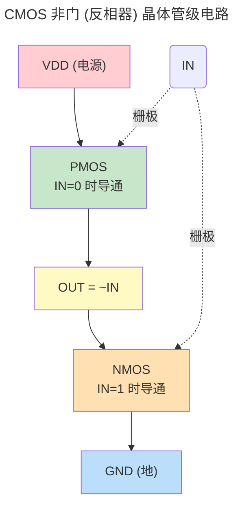
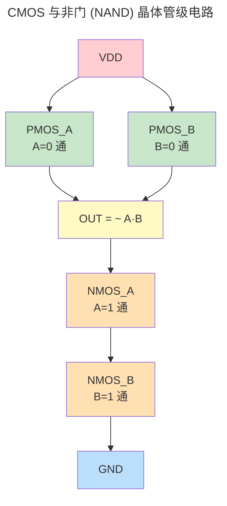
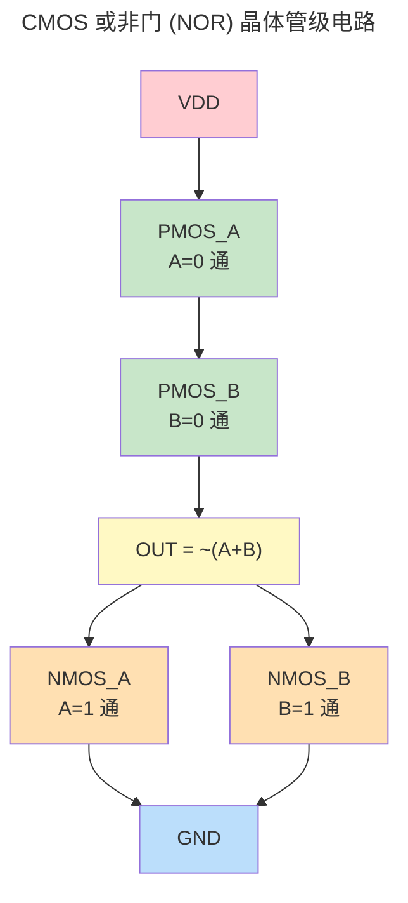
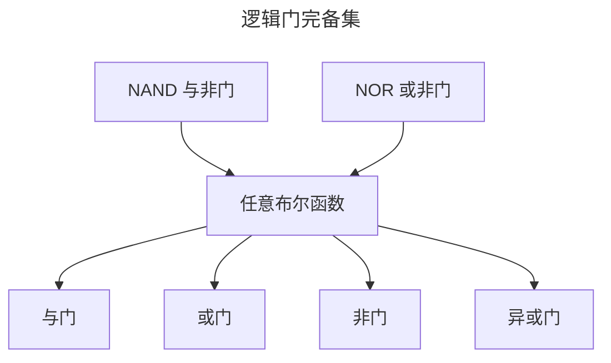
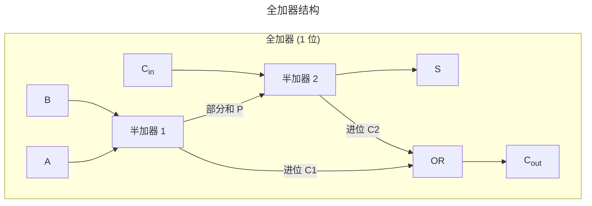
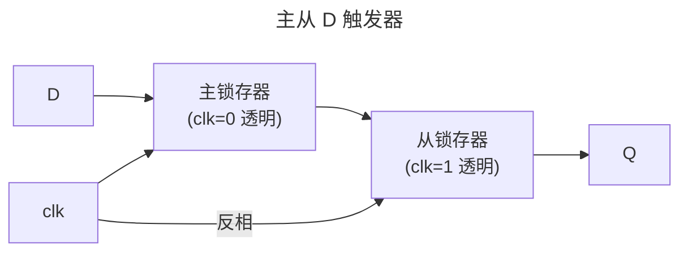
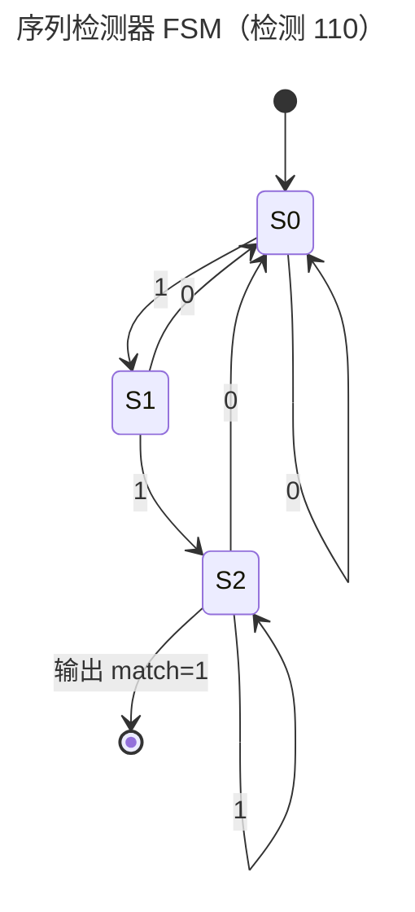

> 0 与 1 的几何学。

在上一章中，我们追踪了电子从能带跃迁到 [MOSFET](../01-semiconductor-physics/) 沟道形成的全部旅程。当 MOSFET 在导通与关断之间切换时，它只产生两种有意义的电压状态——高电平 (1) 与低电平 (0)。当数十亿个这样的开关以精确的几何关系排列时，0 与 1 便构成了一门足以描述任意计算的语言。

本章正是这门**语言的语法书**——从布尔逻辑到状态机，揭示组合电路与时序电路如何将硅片的物理开关编织为可计算的逻辑。

---

## 布尔代数与逻辑门

### 布尔代数基础

1854 年，乔治·布尔 (George Boole) 在《思维规律的研究》中提出了仅用两个值（真/假）和三种基本运算（与、或、非）的代数体系。近百年后，克劳德·香农 (Claude Shannon) 在他的硕士论文中证明：[布尔代数](../../glossary/#b)恰好描述了继电器开关电路的行为——这一洞见奠定了数字电路的理论基础。

布尔代数定义在集合 $\{0, 1\}$ 上，包含以下基本运算：

| 运算 | 表达式 | 读法 | 电路类比 |
|------|--------|------|----------|
| 与 (AND) | $Y = A \cdot B$ | "A 且 B" | 串联开关 |
| 或 (OR) | $Y = A + B$ | "A 或 B" | 并联开关 |
| 非 (NOT) | $Y = \overline{A}$ | "非 A" | 常闭触点的反相 |

核心恒等式（所有运算在 $\{0, 1\}$ 上成立）：

$$
\begin{aligned}
\text{同一律}&: A + 0 = A,\quad A \cdot 1 = A \\
\text{互补律}&: A + \overline{A} = 1,\quad A \cdot \overline{A} = 0 \\
\text{交换律}&: A + B = B + A,\quad A \cdot B = B \cdot A \\
\text{分配律}&: A \cdot (B + C) = A \cdot B + A \cdot C \\
\text{吸收律}&: A + A \cdot B = A,\quad A \cdot (A + B) = A
\end{aligned}
$$

### 基本逻辑门与真值表

CMOS 工艺将布尔运算实现为物理门电路。下表汇总了七种基本逻辑门：

| 门 | IEEE 符号 | 布尔表达式 | 真值表 (AB → Y) |
|----|-----------|-----------|-----------------|
| 非门 (NOT) | $\triangleright \circ$ | $Y = \overline{A}$ | 0→1, 1→0 |
| 与门 (AND) | $\triangleright$ | $Y = A \cdot B$ | 00→0, 01→0, 10→0, 11→1 |
| 或门 (OR) | $\triangleright$ | $Y = A + B$ | 00→0, 01→1, 10→1, 11→1 |
| 与非门 (NAND) | $\triangleright \circ$ | $Y = \overline{A \cdot B}$ | 00→1, 01→1, 10→1, 11→0 |
| 或非门 (NOR) | $\triangleright \circ$ | $Y = \overline{A + B}$ | 00→1, 01→0, 10→0, 11→0 |
| 异或门 (XOR) | $\triangleright$ | $Y = A \oplus B$ | 00→0, 01→1, 10→1, 11→0 |
| 同或门 (XNOR) | $\triangleright \circ$ | $Y = \overline{A \oplus B}$ | 00→1, 01→0, 10→0, 11→1 |

每个逻辑门的 CMOS 实现都是上一章所述反相器的变体——将上拉网络 (PMOS) 和下拉网络 (NMOS) 配置为串联或并联组合。

### CMOS 门电路实现

理解逻辑门的关键不在于记忆真值表，而在于看清晶体管网络如何用**开关的串并联**表达布尔逻辑。以下是三种核心门电路的晶体管级原理图。

#### 非门（反相器）：一切 CMOS 门的母体

非门是 CMOS 逻辑的原子单元。它只有两个晶体管——一个 PMOS 作为上拉、一个 NMOS 作为下拉，共享输入栅极和输出端：



工作原理：当 $IN = 0$ 时，PMOS 导通、NMOS 截止，输出通过 PMOS 被上拉到 VDD（逻辑 1）；当 $IN = 1$ 时，PMOS 截止、NMOS 导通，输出通过 NMOS 被下拉到 GND（逻辑 0）。**关键特性：无论输入是 0 还是 1，VDD 到 GND 之间始终没有直流通路**——这是 CMOS 低静态功耗的根本原因。

#### 与非门（NAND）：并联上拉、串联下拉

NAND 是数字电路中使用频率最高的门，因为它的面积最小、速度最快。其 CMOS 实现将两个 PMOS **并联**（只要任一输入为 0，上拉网络就导通），两个 NMOS **串联**（必须两个输入都为 1，下拉网络才导通）：



仔细观察：上拉网络中两个 PMOS **并联**——只要 A 或 B 有一个为 0，对应的 PMOS 导通，OUT 就被拉高。下拉网络中两个 NMOS **串联**——必须 A 和 B 同时为 1，两个 NMOS 都导通，OUT 才被拉低。这恰好实现了 $\overline{A \cdot B}$（与非）的逻辑。

#### 或非门（NOR）：串联上拉、并联下拉

NOR 的结构与 NAND 恰好**对偶**（Duality）——上拉网络改为两个 PMOS 串联，下拉网络改为两个 NMOS 并联：



上拉网络中两个 PMOS **串联**——必须 A 和 B 同时为 0，两个 PMOS 都导通，OUT 才被拉高。下拉网络中两个 NMOS **并联**——只要 A 或 B 有一个为 1，对应的 NMOS 导通，OUT 就被拉低。这恰好实现了 $\overline{A + B}$（或非）的逻辑。

#### CMOS 门设计规则：对偶原理

从上述三个门可以提炼出 CMOS 门电路设计的**普适规则**：

| 网络 | 晶体管类型 | 串联实现 | 并联实现 |
|------|-----------|---------|---------|
| **上拉网络** (PUN) | PMOS | AND 功能（全 0 才导通） | OR 功能（任一 0 即导通） |
| **下拉网络** (PDN) | NMOS | AND 功能（全 1 才导通） | OR 功能（任一 1 即导通） |

上拉网络与下拉网络始终保持**对偶**关系：一个用串联的地方，另一个用并联。这保证了 CMOS 门在任何输入组合下，VDD 到 GND 之间都不会形成短路路径——**上拉网络和下拉网络绝不会同时导通**。

:::tip[与门和或门的实现]
AND 和 OR 没有独立的 CMOS 实现——它们是在 NAND 和 NOR 后面各自串联一个反相器（NOT）构成的：

- **AND = NAND + NOT**：先与非，再取反
- **OR = NOR + NOT**：先或非，再取反

这也是为什么实际数字电路中看到最多的是 NAND 和 NOR，而非"纯粹"的 AND 和 OR。每多加一个反相器，就意味着多两个晶体管和大约一个门延迟。
:::

:::note[与上一章的衔接]
上述 PMOS/NMOS 开关行为的物理原理——沟道形成、阈值电压、导通电阻——请回顾[半导体物理](../../01-weichen/01-semiconductor-physics/#mosfet-结构与-i-v-特性)中 MOSFET 的相关讨论。数字逻辑设计者通常将晶体管视为理想开关，但高速电路设计中必须考虑[亚阈值泄漏和短沟道效应](../../01-weichen/01-semiconductor-physics/#cmos-反相器与功耗)对功耗和可靠性的影响。
:::



### 德摩根定律与完备集

德摩根定律是连接 AND 与 OR 世界的关键桥梁：

$$
\overline{A \cdot B} = \overline{A} + \overline{B}, \qquad \overline{A + B} = \overline{A} \cdot \overline{B}
$$

这两条定律揭示了：任何布尔表达式都可以只用 **NAND** 或只用 **NOR** 门实现——这就是**功能完备集** (Functionally Complete Set) 的概念。

**实例**：用 NAND 构建 NOT、AND、OR：

| 目标门 | NAND 实现 |
|--------|----------|
| NOT | $\mathrm{NAND}(A, A) = \overline{A}$ |
| AND | $\mathrm{NAND}(\mathrm{NAND}(A, B), \mathrm{NAND}(A, B)) = A \cdot B$ |
| OR | $\mathrm{NAND}(\mathrm{NAND}(A, A), \mathrm{NAND}(B, B)) = A + B$ |

这并非理论趣味——在实际 VLSI 设计中，NAND 门因 NMOS 串联结构天然比 NOR 门（PMOS 串联）更快且面积更小，因此数字标准单元库中 NAND 的使用频次远高于 NOR。

:::tip[跨卷链接]
NAND 功能完备性是 [编译器](../../00-lingxi/05-compiler-theory/) 中中间表示 (IR) 规范化的灵感来源——所有控制流都可以归约为条件跳转与顺序执行，正如所有逻辑都可以归约为 NAND。在 [体系结构](../03-microarchitecture/) 中，逻辑优化（Logic Synthesis）的起点正是将 RTL 描述转换为 NAND2 网表。
:::

---

## 组合逻辑

[组合逻辑](../../glossary/#w-x-y-z)电路的特点是：**输出仅取决于当前输入，与历史状态无关**。它在数学上等价于一个纯布尔函数 $Y = f(X)$。

### 半加器与全加器

加法是数字系统中最基本的算术运算。在最低层，1 位加法由两类电路实现：

| 加器类型 | 输入 | 输出 | 公式 |
|----------|------|------|------|
| 半加器 (Half Adder) | A, B | S (和), $C_{out}$ (进位) | $S = A \oplus B$, $C_{out} = A \cdot B$ |
| 全加器 (Full Adder) | A, B, $C_{in}$ | S, $C_{out}$ | $S = A \oplus B \oplus C_{in}$, $C_{out} = AB + C_{in}(A \oplus B)$ |

全加器可由两个半加器和一个 OR 门级联构成：



### 行波进位与超前进位

将 N 个全加器级联，即构成 **N 位加法器**。最简单的方案是**行波进位加法器** (Ripple Carry Adder, RCA)：低位进位 $C_{out}$ 直接连接高位 $C_{in}$。

RCA 的致命弱点在于**进位传播延迟**——最坏情况下，进位必须从最低位逐级"涟漪"到最高位：

$$
t_{delay,RCA} = N \times t_{carry}
$$

对 64 位加法器而言，这意味着单次加法可能需要数十个门延迟。**超前进位加法器** (Carry Lookahead Adder, CLA) 通过并行化进位计算解决了这个问题。

定义每一位的**生成** (Generate) 和**传播** (Propagate) 信号：

$$
g_i = A_i \cdot B_i,\qquad p_i = A_i \oplus B_i
$$

- $g_i = 1$ 表示第 $i$ 位**必定**产生进位（无论进位输入为何）
- $p_i = 1$ 表示第 $i$ 位**可以传播**进位输入的进位

任意位的进位输出可展开为仅依赖 $g_i$、$p_i$ 和 $C_{in}$ 的两级逻辑：

$$
\begin{aligned}
C_1 &= g_0 + p_0 \cdot C_{in} \\
C_2 &= g_1 + p_1 \cdot g_0 + p_1 \cdot p_0 \cdot C_{in} \\
C_3 &= g_2 + p_2 \cdot g_1 + p_2 \cdot p_1 \cdot g_0 + p_2 \cdot p_1 \cdot p_0 \cdot C_{in} \\
C_4 &= g_3 + p_3 \cdot g_2 + p_3 \cdot p_2 \cdot g_1 + p_3 \cdot p_2 \cdot p_1 \cdot g_0 + \cdots
\end{aligned}
$$

所有进位可以在 $\sim \log_2 N$ 级门延迟内并行计算。现代 CPU 的加法器通常采用混合方案——CLA 块 + 块间行波进位，在速度与面积之间取得平衡。

### 多路选择器与译码器

除算术运算外，组合逻辑还需要**数据路由**能力：

**多路选择器 (Multiplexer, MUX)**：根据选择信号 $S$ 从多个输入中挑选一个输出。

| 选择信号 | 输出 |
|----------|------|
| $S = 0$ | $Y = D_0$ |
| $S = 1$ | $Y = D_1$ |

2-to-1 MUX 的布尔表达式：$Y = \overline{S} \cdot D_0 + S \cdot D_1$。MUX 的一个深刻特性是——任意 $n$ 变量布尔函数都可以用一个 $2^n$-to-1 MUX 实现（将真值表直接映射到数据输入端）。这是 FPGA 中查找表 (LUT) 的理论依据。

**译码器 (Decoder)**：$n$-to-$2^n$ 译码器将 $n$ 位二进制输入转换为 $2^n$ 条独热 (one-hot) 输出线。3-to-8 译码器是 [存储层次](../04-memory-hierarchy/) 中 SRAM 地址译码的基础——字线 (Word Line) 的激活正是译码器的直接应用。

### ALU 设计

[`ALU`](../../glossary/#a) (算术逻辑单元) 是数据路径的核心，其本质是一个多功能的组合逻辑块。典型的 1 位 ALU 切片包含：

1. **算术单元**：1 位全加器
2. **逻辑单元**：AND / OR / XOR / NOT 按位运算
3. **多功能选择**：MUX 根据操作码选择输出

将 $N$ 个 1 位 ALU 切片级联（配合进位链），即构成 $N$ 位 ALU。在 [体系结构](../03-microarchitecture/) 中我们将看到，ALU 的操作码来自指令译码，而状态标志（零标志 ZF、进位标志 CF、溢出标志 OF）则馈入条件分支逻辑。

---

## 时序逻辑

组合逻辑没有记忆——输出在输入变化后立即更新。但计算需要**状态**：程序计数器需要记住下一条指令的地址，寄存器需要保持操作数，有限状态机需要追踪当前步骤。这些都需要**[时序逻辑](../../glossary/#s)**——输出不仅取决于当前输入，还取决于历史状态。

### 锁存器

[锁存器](../../glossary/#s)是电平敏感的记忆元件。当使能信号有效时，输出跟随输入变化；使能无效时，输出保持。

**SR 锁存器**（用两个交叉耦合的 NOR 门实现）：

| S | R | Q | $\overline{Q}$ | 状态 |
|---|---|----|-----------------|------|
| 0 | 0 | 保持 | 保持 | 记忆 |
| 0 | 1 | 0 | 1 | 复位 |
| 1 | 0 | 1 | 0 | 置位 |
| 1 | 1 | 0 | 0 | **禁止**（非互补，且退出时状态不确定） |

SR 锁存器的根本问题在于输入约束 ($SR \neq 11$) 容易在瞬态中被违反。**D 锁存器**通过将 D 同时馈入 S 和反相后的 $\overline{D}$ 馈入 R，从根本上消除了这一问题——输出 Q 总在使能有效时等于 D。

### 触发器

[触发器](../../glossary/#c)与锁存器的关键区别：触发器在**时钟边沿**采样输入，而非电平透明。

**D 触发器 (D Flip-Flop, DFF)** 是最广泛使用的边沿触发存储元件。其经典结构为主从配置——两个 D 锁存器 + 一个反相器：



- **clk = 0**：主锁存器透明，输入端 D 被采样进入主锁存器；从锁存器保持
- **clk ↑ 上升沿**：主锁存器锁存 D 的值；从锁存器变为透明，将值输出到 Q

结果：输出 Q 仅在时钟上升沿更新，且更新值为上升沿前一瞬间的 D。这称为**边沿触发**，是现代同步数字系统的基石。

:::caution[锁存器与触发器的选用]
在 FPGA/ASIC 标准设计流程中，**应避免在综合中意外推断出锁存器**——Verilog 中 `always @(*)` 块内未在所有分支中赋值的变量会被综合为锁存器，导致时序分析复杂化。触发器是同步设计中唯一推荐的存储单元。
:::

### 寄存器与计数器

**[寄存器](../../glossary/#q-r)**是共享同一时钟的 $N$ 个 D 触发器的集合，用于存储多位数（8/16/32/64 位）。寄存器是 [体系结构](../03-microarchitecture/) 中**寄存器文件**的基本单元——CPU 的 32 个通用寄存器，本质上是 32 个 64 位寄存器阵列。

**移位寄存器**通过将每个触发器的 Q 输出连接到下一个触发器的 D 输入实现。其典型应用包括：
- **串并转换**：串行数据逐位移入，并行读出
- **CRC 校验**：线性反馈移位寄存器 (LFSR) 实现高效冗余校验
- **伪随机数生成**：LFSR 的反馈配置决定生成序列的周期

**计数器**是最基本的时序-算术混合电路。一个 $N$ 位二进制计数器由 $N$ 个 D 触发器和加法逻辑组成：

$$
Q_{next} = Q_{current} + 1
$$

每个时钟沿，计数器状态从全 0 递增到全 1，然后循环。计数器是**程序计数器 (PC)** 和**时钟分频器**的核心。

### 有限状态机

[有限状态机](../../glossary/#w-x-y-z) (Finite State Machine, FSM) 将时序逻辑提升为**行为建模**工具。任何具有明确状态转移规则的序列控制问题，都可以建模为 FSM。

FSM 由五要素定义：$\langle S, \Sigma, \delta, s_0, F \rangle$
- $S$：有限状态集合
- $\Sigma$：输入字母表
- $\delta: S \times \Sigma \to S$：状态转移函数
- $s_0$：初始状态
- $F$：终止状态集合（可选）



两种经典 FSM 模型：

| 模型 | 输出确定方式 | 特点 |
|------|-------------|------|
| **Moore** | 输出仅取决于当前状态 | 输出与输入异步无关，时序干净 |
| **Mealy** | 输出取决于当前状态 + 当前输入 | 状态更少（同功能下），但输出可能携带输入毛刺 |

:::note[状态编码]
FSM 的状态用二进制编码存储在触发器中。三种常见编码方案：
- **二进制编码**：$\log_2 N$ 个触发器，面积最优
- **独热编码 (One-Hot)**：$N$ 个触发器，组合逻辑最简单，速度最快
- **格雷编码**：相邻状态仅 1 位变化，降低状态转移时的毛刺风险

独热编码因其简单的次态译码逻辑在高速 FPGA 设计中占主导地位，付出的代价是触发器数量增倍。
:::

:::tip[跨卷链接]
有限状态机是贯穿整个计算栈的通用建模语言：
- [网络协议栈](../../03-qiankun/05-network-protocol-stack/)：TCP 连接的状态转移（CLOSED → LISTEN → ESTABLISHED → ...）是 FSM
- [编译器](../../00-lingxi/05-compiler-theory/)：词法分析器将正则表达式编译为 DFA，是 FSM 的最高效实现
- [共识协议](../../04-yuanhai/04-consensus-protocols/)：Raft 的角色转移（Follower → Candidate → Leader）是 FSM
:::

---

## 时钟与同步

同步数字系统的核心假设是：**所有时序元件在同一时钟边沿同时更新**。这一假设在实际芯片上需要极其精密的工程才能近似实现。

### 建立时间与保持时间

D 触发器对输入信号有严格的时序约束——违反[建立时间](../../glossary/#j-k)或[保持时间](../../glossary/#b)将导致亚稳态：

```text
          ↑ 时钟上升沿
          |
    D ────╪════  数据必须在这段时间内保持稳定
          |<-->| t_su  (Setup, 建立时间 — 时钟沿之前)
          |<-------->| t_hold (Hold, 保持时间 — 时钟沿之后)
          |
    Q ────╪══════  输出在 t_clk-q 之后更新
          |<--->| t_clk-q (Clock-to-Q 延迟)
```

| 参数 | 含义 | 违反后果 | 28nm 典型值 |
|------|------|----------|------------|
| $t_{su}$ | 时钟沿前数据必须稳定的最短时间 | 输出不确定（亚稳态） | ~20 ps |
| $t_{hold}$ | 时钟沿后数据必须保持的最短时间 | 亚稳态或数据穿透 | ~5 ps |
| $t_{clk-q}$ | 时钟沿到输出更新的延迟 | 限制最大频率 | ~40 ps |

系统级时序约束——**时钟周期必须满足**：

$$
T_{clk} \geq t_{clk-q} + t_{comb,max} + t_{su} + t_{skew}
$$

其中 $t_{comb,max}$ 是两级触发器间组合逻辑的最长路径延迟，$t_{skew}$ 是时钟到达不同触发器的时间差（时钟偏斜）。

### 亚稳态

当建立或保持时间被违反时，触发器可能进入**[亚稳态](../../glossary/#w-x-y-z)** (Metastability)——输出悬停在 $V_{DD}/2$ 附近，既不等于 0 也不等于 1，且恢复时间不可预测。

亚稳态**无法完全消除**（这是同步器自身的物理属性），但可以通过工程手段将其发生概率降至可接受水平。衡量亚稳态容忍度的关键指标是 **MTBF** (Mean Time Between Failures)：

$$
MTBF = \frac{e^{t_r / \tau}}{T_w \cdot f_c \cdot f_d}
$$

其中 $t_r$ 是允许的恢复时间，$\tau$ 是触发器的再生时间常数，$f_c$ 和 $f_d$ 分别是时钟和数据变化频率。从公式可以看出：**多等一个时钟周期（增大 $t_r$），MTBF 指数级提升**。

**两级同步器 (Two-Flop Synchronizer)** 是最通用、最经济的亚稳态防护方案：

```text
  异步输入 D ──→ [DFF1] ──→ [DFF2] ──→ 同步域使用
                  ↑          ↑
                 clk        clk
```

第一个触发器可能进入亚稳态，但第二个触发器在其输出端额外等待了完整的一个时钟周期 ($T_{clk}$) 才采样——这 $T_{clk}$ 的额外恢复时间，足以使亚稳态的解析概率趋近于 1。

:::danger[同步器的局限性]
两级同步器仅适用于**单比特控制信号**的跨时钟域传递。对于多比特数据总线，由于各比特可能在不同的时钟沿被解析，简单的两级同步会导致数据一致性灾难（采样到部分旧值 + 部分新值的中间状态）。多比特 CDC 需要 FSM 握手协议或异步 FIFO。
:::

### 时钟域交叉

现代 SoC 包含数十个独立的时钟域——CPU 核、GPU、DRAM 控制器、外设各在不同的频率下运行。时钟域交叉 (Clock Domain Crossing, CDC) 是芯片验证中最容易出错的环节之一。

三种主要 CDC 技术：

| 技术 | 适用场景 | 延迟 | 面积 |
|------|----------|------|------|
| 两级同步器 | 单比特控制信号 | 2 周期 | 极小 |
| 握手协议 | 低速控制数据传输 | 数周期 | 小 |
| 异步 FIFO | 高速数据流 | ~3 周期 | 大（需双端口 SRAM + 格雷码指针） |

异步 FIFO 中的格雷码指针确保相邻地址仅 1 位变化——同步器即使采到旧值或新值，也绝不会采到中间状态（如 $011 \to 100$ 可能被误采为 $111$）。

---

## 硬件描述语言入门

数字逻辑的设计和验证已不再使用原理图，而是通过**硬件描述语言** (HDL) 完成。[Verilog](../../glossary/#u-v) 和 VHDL 是最主流的两种 HDL——它们看起来像编程语言，但**描述的是硬件结构**而非执行序列。

:::note[HDL ≠ 编程语言]
这是初学者最易混淆的一点。Verilog 中的 `=` （阻塞赋值）和 `<=` （非阻塞赋值）对应的是**导线连接**和**触发器**，而非变量的顺序更新。写 Verilog 时，头脑中应始终**画电路**——每行代码都是在实例化一个或一组硬件单元。
:::

### 组合逻辑建模

组合逻辑使用 `assign` 连续赋值语句描述——它等价于导线与逻辑门的直接连接：

```verilog
// 2-to-1 多路选择器
module mux2to1 (
    input  wire a,      // 数据输入 0
    input  wire b,      // 数据输入 1
    input  wire sel,    // 选择信号
    output wire y       // 输出
);
    assign y = sel ? b : a;  // 连读赋值：y 始终反映右边表达式
endmodule
```

`assign` 的语义是**连续驱动**——右边任何变量变化，输出立即（在经过一个逻辑门延迟后）更新。综合工具将其映射为门级网表。

对于包含运算的组合逻辑，`always @(*)` 块提供更丰富的表达能力：

```verilog
// 4 位 ALU
module alu_4bit (
    input  wire [3:0]  a, b,
    input  wire [1:0]  op,   // 00: ADD, 01: AND, 10: OR, 11: XOR
    output reg  [3:0]  result
);
    always @(*) begin
        case (op)
            2'b00: result = a + b;
            2'b01: result = a & b;
            2'b10: result = a | b;
            2'b11: result = a ^ b;
        endcase
    end
endmodule
```

`always @(*)` 暗示综合工具：这是一个纯组合逻辑块——**所有输入都应出现在敏感列表中**。

### 时序逻辑建模

时序逻辑使用 `always @(posedge clk)` 描述——它告诉综合工具：块内的赋值对应时钟上升沿触发的 D 触发器：

```verilog
// N 位可复位计数器
module counter #(
    parameter WIDTH = 8
) (
    input  wire             clk,
    input  wire             rst_n,    // 低有效复位
    output reg  [WIDTH-1:0] count
);
    always @(posedge clk or negedge rst_n) begin
        if (!rst_n)
            count <= 0;               // 异步清零（rst_n 下降沿立即触发）
        else
            count <= count + 1;
    end
endmodule
```

这里 `<=` 是**非阻塞赋值**——所有非阻塞赋值在时钟边沿**并发生效**，准确模拟了 D 触发器的行为。

:::caution[阻塞 vs 非阻塞赋值的黄金法则]
在时序逻辑中**始终使用** `<=`（非阻塞赋值）。`=` （阻塞赋值）在 `always @(posedge clk)` 中的行为与硬件不符——它可能导致综合前后的仿真行为不一致（综合与仿真失配是验证工作中最可怕的噩梦）。
:::

---

## 小结

数字逻辑是硅片物理与计算抽象之间的第一个**确定性桥梁**：

```
物理层           MOSFET 导通/关断 → 高/低电平
  ↓
逻辑层           布尔代数 → 组合/时序逻辑
  ↓
功能层           状态机 → 控制单元 → 数据路径
  ↓
抽象层           硬件描述语言 → 逻辑综合 → 寄存器传输级 (RTL)
  ↓
体系结构          指令执行 → 流水线 → 超标量 → ...
```

理解数字逻辑，不是为了手画门电路，而是为了理解**计算是如何从物理约束中涌现的**——每一纳秒的时序收敛、每一次亚稳态的防御、每一个状态机的巧思，都是数十亿晶体管协同工作的契约。

在下一章 [体系结构](../03-microarchitecture/) 中，我们将看到这些逻辑门如何组织成能执行指令的机器，以及流水线、分支预测、乱序执行如何将数字逻辑的物理极限推向极致。

:::tip[跨卷链接]
数字逻辑的影响远不止芯片设计：
- [FPGA 原型验证](../../02-jiezi/01-bare-metal/) 直接操控查找表 (LUT) 级逻辑
- [GPU 着色器核心](../../05-wanxiang/01-gpu-rendering-pipeline/) 包含大量定制的组合逻辑单元
- [AI 加速器](../../06-xumi/02-deep-learning/) 的脉动阵列 (Systolic Array) 本质上是高度优化的 MAC (乘累加) 组合-时序混合逻辑
:::
