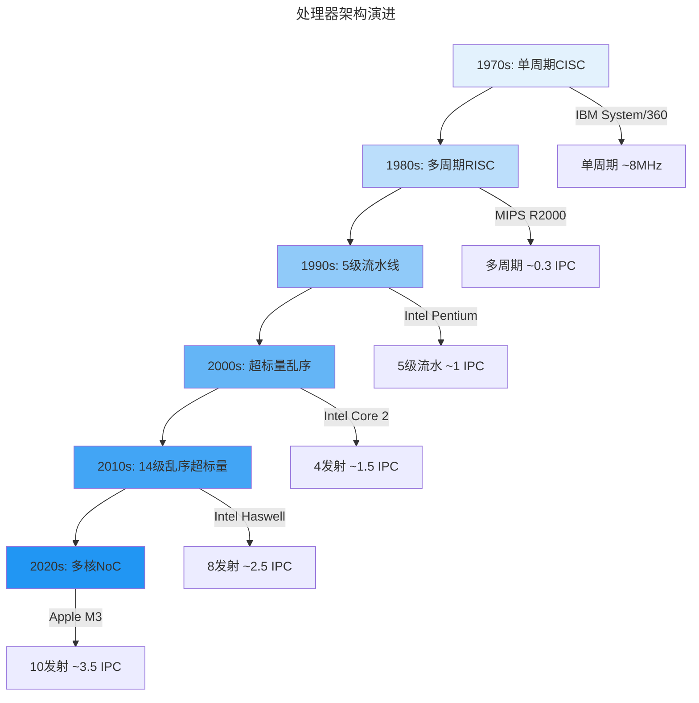
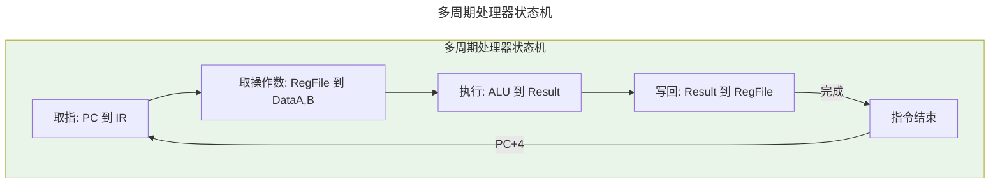
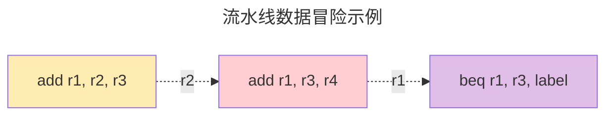
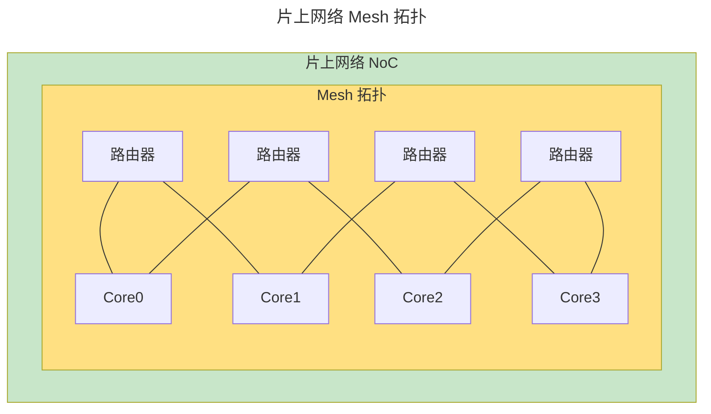
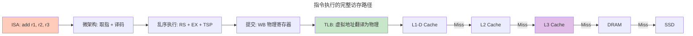

> 将指令集变为硅片的艺术。

从数字逻辑的 0/1 世界，到硅片上流动的电子河流，再回到程序员熟悉的 `a = b + c` —— **体系结构**（Microarchitecture）正是连接抽象与物理的魔法层。它将指令集架构（ISA）的优雅承诺，翻译为晶体管开关的精确舞蹈。

---

## 从 ISA 到微架构：一场翻译的战争

:::note[ISA 是法律，微架构是执行法律的人]
指令集架构（[ISA](/glossary/#i)）如 x86、ARM、RISC-V 定义了程序员可见的抽象——寄存器、内存、整数运算。但 ISA 只是**法律条文**；**微架构**则是运行这些条文的机器，它决定：
:::

- **单周期 vs 多周期**：一条加法用 1 个时钟周期，还是 5 个？
- **流水 vs 非流水**：像流水线车间一样顺序执行，还是每道菜做完再做下一道？
- **顺序 vs 乱序**：严格按照指令顺序，还是谁先算完谁先走？
- **单核 vs 多核**：一个大脑，还是一群大脑？

ISA 给程序员承诺：`add r1, r2, r3` 完成需要 1 纳秒。但微架构必须实现一个电路，其实际速度可能是 0.2ns（超标量乱序处理器）或 5ns（单周期五级流水线）。**微架构是 ISA 的"编译器"，将抽象承诺编译为物理现实。**

### 性能对比表格

| 特性 | 单周期 | 多周期 | 5级流水线 | 乱序超标量 |
|------|--------|--------|-----------|------------|
| **IPC** | 1 | 0.25 | 1 | 2.5-3.0 |
| **延迟** | 1周期 | N周期 | N周期 | N周期 |
| **面积** | 大 | 中 | 中 | 大 |
| **功耗** | 低 | 中 | 中 | 高 |

### 现代处理器架构演进



---

## 单周期处理器：用面积换速度

将 **CISC 指令集（如 x86）中的每一条指令，编译为硬件电路的精确时序**，在 1 个时钟周期内完成。这是 **ISA 的"忠实用户"路径**——绝不偷工减料。

### 核心电路结构

以 `add r1, r2, r3`（r1 ← r2 + r3）为例，电路包括：

- **寄存器堆**：32 个寄存器（R0-R31），每个寄存器 32 位 ×1bit 深度
- **[`ALU`](/glossary/#a)（算术逻辑单元）**：32 位加法器，源自 [数字逻辑](/01-weichen/02-digital-logic/) 中的组合逻辑块
- **写回寄存器端口**：写使能、写地址、写数据

时钟周期必须足够长，让**最慢信号路径**稳定。这个最慢路径就是：

$
t_{clock} \geq t_{register\_read} + t_{ALU} + t_{register\_write} + t_{setup}
$

在典型 65nm 工艺下，这条关键路径约需 **400ps**，理论极限频率约：

$
f = \frac{1}{t_{clock}} = \frac{1}{400 \times 10^{-12}} \approx 2.5\ \text{GHz}
$

但实际上，单周期处理器的关键路径还包括取指访存（通常远慢于 ALU），因此实际频率受限于指令缓存访问延迟。这也是为什么单周期设计仅适用于低性能场景。

### 优点与局限

- **设计简单**：状态机仅一种状态，控制逻辑最少
- **延迟可预测**：所有指令严格 **1 周期**（`add`、`sub`、`mul`、`div` 全部统一——但乘法器和除法器的长延迟会拖慢整个时钟）
- **致命缺陷**：每周期仅执行 1 条指令（IPC=1），且时钟周期由**最慢指令**决定——一条 `div` 可能让所有指令都慢下来

:::tip[历史启示]
60 年代的 **IBM 7094**（~0.7 MHz，单周期 CISC）和今天的 **ARM Cortex-M0+**（50 MHz，用于 Arduino/STM32 等微控制器）都采用单周期设计——面积仅需 ~40k 门，**单周期是物联网设备的最佳选择**，因为面积和成本比峰值性能更重要。这是 [卷二 · 芥子](/02-jiezi/) 中裸机编程的硬件基础。
:::

---

## 多周期处理器：用时间换面积

:::note[多周期的本质]
单周期 = 为每条指令建一条"高速公路"；多周期 = 建一座"城市"，一条路反复使用。
:::

将 **ISA 指令拆分为多个子状态（micro-ops）**，每个时钟周期只完成一个子状态。一条 `add` 指令需要 4 个周期：

| 时钟周期 | 控制信号 | ALU 操作 | 说明 |
|---------|---------|---------|------|
| C1 | `PC` → `IR` | 无 | 取指 |
| C2 | `PC+4` | `IR[rd]` | 取寄存器 |
| C3 | `PC+4` | `IR[rs] + IR[rd]` | 加法 |
| C4 | `PC+4` | `R[IR[rd]] ← sum` | 写回寄存器 |

**每条指令共享同一个加法器和寄存器堆**，面积约为单周期的 **1/3 到 1/5**。代价是：

- **延迟增加**：一条 `add` 需要 4 周期
- **代码体积增加**：一条复杂指令变成 10+ 微码（如 x86 `div` 指令需要 10+ 周期）
- **吞吐量**：IPC = 1/4 = 0.25



**早期 RISC 处理器（如 MIPS R2000）普遍采用多周期方案**——面积限制优先于性能。

---

## 流水线处理器：将时间维度展开为空间

### 五级流水线：工业级标准

将一条指令的执行时间 **拆分为 5 个级**，每周期推进一级。**每周期每条流水线级贡献 1 个数据**。

经典 **5-stage pipeline**：

| 级（Stage） | 功能 | 输出 |
|------------|------|------|
| **IF**（取指） | 从 PC 地址取指令 | 指令 |
| **ID**（译码） | 从寄存器堆读寄存器 | 寄存器值 |
| **EX**（执行） | ALU 执行（加法/乘法） | 结果 |
| **MEM**（访存） | 从/写入数据内存 | 数据 |
| **WB**（写回） | 将结果写回寄存器 | - |

**理想性能**：每周期 1 条指令出流水线 → **IPC=1**，**CPI=1**

### 流水线冒险：打破时空的魔咒

流水线的核心危险：**指令间的数据依赖**。



#### 数据冒险（Data Hazard）

- **读后写（RAW）**：I1 写 r1，I2 读 r1 —— I2 的 ID 阶段必须在 I1 的 WB 阶段之后
- **写后写（WAW）**：I1 写 r1，I2 写 r1 —— I2 的 WB 必须在 I1 之后
- **写后读（WAR）**：I1 写 r1，I2 读 r1 —— I2 的 ID 必须在 I1 的 WB 之前（仅多核）

**硬件解决方案**：

- **寄存器重命名**：消除 WAR/WAW 依赖
- **旁路（Bypassing）**：`add` 结果直接送给 `sub`，避免等待 WB
- **停顿（Stall）**：插入气泡，确保依赖关系

#### 分支冒险（Control Hazard）

```asm
beq r1, r3, label  # 分支预测：猜"取 label 的指令"
label: add r1, r2, r3
```

- **静态分支预测**：无条件预测 **取分支目标** —— 若预测错误，清空流水线（flush），代价 = 3-10 周期
- **动态分支预测**（2010s 主流）：
  - **局部历史（Local History）**：记录上次分支预测结果
  - **全局历史（Global History）**：TAGE 预测器使用多张不同历史长度的表（最长可达数百分支），结合近期分支模式 `[B,T,T,B,T,...]` 进行预测
  - **饱和计数器（SATC）**：记录"连续取目标次数" $count = min(4, max(0, last-1))$

:::tip[分支预测准确率]
现代高性能处理器的动态分支预测准确率通常在 **96-99%** 之间。例如 Intel Golden Cove（12 级乱序）和 AMD Zen 4 使用 TAGE + 感知器混合预测器，SPEC CPU 基准测试中达到约 98% 的准确率。但要注意：每 1% 的误预测率乘以 ~15 周期的误预测惩罚，意味着有效 CPI 增加约 0.15——在高 IPC 设计中，分支预测仍是最大的单点性能瓶颈之一。
:::

#### 结构冒险（Structural Hazard）

- **寄存器堆端口冲突**：单端口读寄存器堆（1 周期读 1 数据），双周期流水线（ID + WB）冲突
- **[缓存](/glossary/#c)冲突**：L1 数据缓存单端口，IF + MEM 同时访问冲突

**硬件解决方案**：
- **寄存器堆设计**：2 读 1 写端口（标准设计），每端口 32 位 ×1bit
- **缓存旁路**：IF 不访内存（缓存命中率为 97%）

---

## 超标量（Superscalar）：将流水线横向复制

:::tip[单线程吞吐率]
单周期处理器：IPC=1（1 指令/周期）。5 级[流水线](/glossary/#p)：IPC=1（1 指令/周期）。超标量乱序：IPC=2.5~3.0（2-3 指令/周期）。
:::

**超标量**：将流水线 **横向复制 2-4 份**，每周期发射多条指令。

```
周期 0:  IF0 ID0 EX0   IF1 ID1 EX1   IF2 ID2 EX2
周期 1:          ID0 EX0  WB0   ID1 EX1  WB1   IF3 ID3 EX3
周期 2:             EX0  WB0   WB0   ID1 EX1  WB1   IF4 ID4 EX4
```

**挑战**：如何控制"哪条指令在哪个周期发射"？这要求 **硬件乱序执行**。

---

## 乱序执行（Out-of-Order Execution）：Tomasulo 算法的巅峰

:::tip[Tomasulo 算法（1966）]
在单周期超标量处理器（如 VAX 11/780）中，Robert Tomasulo 提出了 **寄存器栈（Register Stack）** 和 **预约站（Reservation Stations）**，实现了乱序执行、无需编译器重排——这是现代处理器性能飞跃的奠基性思想。
:::

### 寄存器重命名：杀死 WAR/WAW 依赖

硬件维护 **物理寄存器数组**（P0-P31），ISA 寄存器是虚拟的。

```asm
    addi r1, r2, 1   # 物理：addi P4, P5, 1
    sub  r3, r1, 5   # 编译器：物理映射 P5 = P1
    mul  r4, r2, 5   # 物理：P6 = P5（重命名避免 WAW）
```

**乱序执行器**：
- 将 `addi` 的结果写入 **物理寄存器 P4**，不立即写回 ISA 寄存器
- 当物理寄存器 P4 被 `sub` 或 `mul` 使用时，**自动重命名**

### 预约站（Reservation Station, RS）

每条乱序指令（如 `add`）发射到 **RS**，等待所有操作数就绪：

```
预约站 RS1:  add  rd=P4  ra=P5  rb=P14  status=wait(ra,P5)
预约站 RS2:  sub  rd=P5  ra=P4  rb=P21  status=wait(ra,P4)
预约站 RS3:  mul  rd=P6  ra=P14  rb=P10  status=run
```

**调度**：
- 每个周期，**RS 内最早完成操作数就绪的指令，首先发射到 EX 阶段**
- 结果通过 **Register Stack** 写入物理寄存器（乱序完成，顺序写回）

### TSP（Tomasulo 同步协议）

```
EX 阶段：
  每条指令从 RS 取 op1, op2
  根据指令类型，决定操作（加/乘/除/浮点）

完成写回：
  若结果类型 = float，通过 寄存器栈 的 物理寄存器索引 写回
  若结果类型 = int，通过 寄存器栈 写回物理寄存器

乱序写回保证顺序性：
  寄存器堆按 ISA 顺序编号（0-31），物理寄存器是"临时仓库"。
  指令完成写回后，物理寄存器 P4 中的值永远等于 ISA r1 中的值。
```

---

## 推测取指与分支预测

:::tip[推测取指（Speculative Fetch）]
在前端流水线中，取指单元依赖**分支预测器**提前猜测下一条指令的地址，使流水线在分支结果确认前持续填充——这是维持高 IPC 的关键。若预测错误，后续指令的副作用必须被回滚。
:::

### 静态预测

- **顺序取指**：始终取 `PC + 4`，遇到分支时停顿等待解析
- **静态分支预测**：编译时或硬件预设规则（如"向后跳转预测为 taken"），无需运行时历史

### 动态预测（现代处理器主流）

基于**运行时分支历史**进行预测：

```
取指阶段：
  分支目标缓冲 (BTB)     返回地址栈 (RAS)
         ↓                    ↓
      [分支指令?]          [函数返回?]
         ↓                    ↓
  分支预测器 (TAGE/感知器)  RAS 弹出目标地址
         ↓
  下一 PC → 取指 → 译码 → ...
```

**预测错误恢复**：
- **分支误预测**（准确率 96-99%）：清空 ROB 中推测状态，从正确路径重新取指——典型代价 10-20 周期
- **缓存 miss**：IF 阶段暂停，等待缓存行填充
- **异常（interrupt）**：清空流水线，保存状态，跳转到 ISR

---

## 推测执行与回滚：赌性编程

:::tip[推测执行本质]
**硬件推测**：乱序执行，预测分支目标。**硬件回滚**：若分支预测错误，清空后续指令，恢复寄存器堆/缓存状态（仅保留已提交指令）。这正是 2018 年 Spectre/Meltdown 漏洞的温床——推测执行的副作用会留下可观测的缓存痕迹，详见 [卷七 · 天枢](/07-tianshu/05-system-security/)。
:::

### 硬件推测执行

```
周期 0:  取指：beq r1, r3, label
周期 1:  分支预测：预测"取 label"（SATC）
周期 2:  乱序取指：取 label 的指令 → add r1, r2, r3
周期 3:  乱序译码：从 PC+4 取指令 → sub r1, r2, 0
周期 4:  乱序执行：add 完成，写回 P4
周期 5:  分支实际：r1=r3？→ 预测"取 PC+4"（错误！）
周期 6:  flush 流水线：清除 IF 到周期 6 的所有指令
周期 7:  取指：从 PC+4 取指令
```

**性能代价**：每预测错误 1 次，损失 4 周期（flush）。

### 回滚（Rollback）机制

```
乱序执行寄存器：
  P4: 0x5 (from add r1, r2, r3)
  P5: 0x100 (from sub r1, r2, 0)
  P6: ? (pending)

分支错误：beq 实际取 PC+4（预测 label 错误）
回滚：
  清空 P6（未提交的指令）
  恢复 P5=0x100（未提交）
  恢复 P4=0x0（提交）
  PC 取正确路径：PC ← label
```

---

## 多核与片上网络（NoC）：单颗芯片上的"微尘世界"

### 多核设计

```
      L1-I    L1-D
    ┌──────┐  ┌────────┐
    │ Core0│  │ Core0  │
    │ID/EX │  │L2-Cache│
    │L1-D  │  │L2-Cache│
    └──────┘  └────────┘

    ┌──────┐  ┌────────┐
    │ Core1│  │ Core1  │
    │ID/EX │  │L2-Cache│
    │L1-D  │  │L2-Cache│
    └──────┘  └────────┘

        ↓       ↓
    ┌───────────────┐
    │   L2 / L3     │
    └───────────────┘
```

**性能**：4 核 IPC 总和 ≈ 1.5× 单核 IPC  
**功耗**：4 核 TDP = 4 × 单核 TDP

### 片上网络（Network-on-Chip, NoC）

[片上网络](/glossary/#n)（NoC）用路由器+链路的网格替代共享总线，让核间通信带宽随核数近线性扩展。



**NoC vs Bus**：

| 特性 | Bus | NoC |
|------|-----|-----|
| **带宽** | 单总线（100-1000MB/s） | 多条独立链路（10-50GB/s） |
| **延迟** | 全核共享总线（高延迟） | 点对点（低延迟） |
| **可扩展性** | 单总线（线性扩展） | Mesh/Grid（对数扩展） |
| **功耗** | 总线切换（高） | 链路切换（低） |
| **面积** | 小 | 大（NoC 路由 40% 面积） |

**2025 年主流 NoC**：
- **ARM（X-Prime Mesh）**：4 核 × 4 网格 = 20 个路由器
- **Intel (Core Ultra 200V NoC)**：24 核心 + 24 核外延（超线程）
- **Apple M3 NoC**：12 核 + 12 核外延 + L3 缓存

---

## 跨卷连接：从逻辑到缓存

### 体系结构 ↔ 数字逻辑（卷一 · 微尘）

- [数字逻辑](/01-weichen/02-digital-logic/)：触发器的延迟（~200ps @ 65nm）决定流水线级数上限（5-14 级）
- [数字逻辑](/01-weichen/02-digital-logic/)：加法器延迟（400ps @ 0.18μm）决定单周期时钟（2.5GHz）
- [数字逻辑](/01-weichen/02-digital-logic/)：[锁存器](/glossary/#s)比[触发器](/glossary/#c)节省约 30% 面积，是多周期处理器的基石

### 体系结构 ↔ 存储器层次（卷一 · 微尘）



图中从 [TLB](/glossary/#t) 往下的整条访存路径，正是下一章 [存储层次](/01-weichen/04-memory-hierarchy/) 的主题：L1/L2/L3 [缓存](/glossary/#c)如何用局部性原理将 DRAM 的百纳秒延迟压缩到纳秒级。其中 [MMU](/glossary/#m) 的虚拟地址翻译，在 [卷三 · 内存管理](/03-qiankun/02-memory-management/) 中有操作系统视角的展开。

### 体系结构 ↔ AI Agent（卷六 · 须弥）

- [AI Agent](/06-xumi/05-ai-agents/)：大模型推理需要**向量单元（Vector ALU）**而非标量加法器，SIMD/张量核是吞吐率的来源
- [深度学习](/06-xumi/02-deep-learning/)：Transformer 解码器需要**高带宽缓存层次**存储 KV 缓存，访存往往成为瓶颈
- 多核 Agent 协同需要**多核同步原语**（锁、屏障），详见 [卷三 · 同步原语](/03-qiankun/04-synchronization/)

---

## 本章总结

| 特性 | 延迟（单周期指令） | 吞吐率（IPC） | 面积 |
|------|------------------|--------------|------|
| **单周期** | 1 | 1 | 低 |
| **多周期** | N | 1/N | 低 |
| **5 级流水线** | N | ~1 | 中 |
| **14 级乱序超标量** | N | 2.5-3.0 | 高 |

**核心公式**：

> $
> \text{CPU Time} = \text{Instructions} \times \text{CPI} \times \text{Cycle Time}
> $
>
> 其中 $CPI$ 受缓存缺失和分支误预测的影响：
>
> $
> CPI = CPI_{ideal} + MissRate_{L1} \times MissPenalty_{L1} + MissRate_{branch} \times MissPenalty_{branch}
> $

**设计趋势**：
1. **单周期** → **多周期** → **流水线** → **超标量乱序**
2. **静态分支预测** → **动态分支预测**（GShare → TAGE → 感知器）
3. **单核** → **多核** → **Chiplet** → **3D IC**

**下一站**：《04 存储层次》——将缓存的"延迟魔术"拆解为硅片上的电阻/电容延迟。

:::tip[跨卷链接]
**卷内**：[半导体物理](/01-weichen/01-semiconductor-physics/) → [数字逻辑](/01-weichen/02-digital-logic/) → **体系结构** → [存储层次](/01-weichen/04-memory-hierarchy/) → [指令集架构](/01-weichen/05-instruction-set-architecture/)

**跨卷**：流水线冒险与 [同步原语](/03-qiankun/04-synchronization/) 中的内存屏障；推测执行的安全隐患详见 [系统安全](/07-tianshu/05-system-security/)（Spectre/Meltdown）；SIMD/张量核为 [深度学习](/06-xumi/02-deep-learning/) 提供算力基础。
:::
