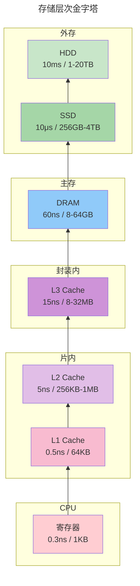
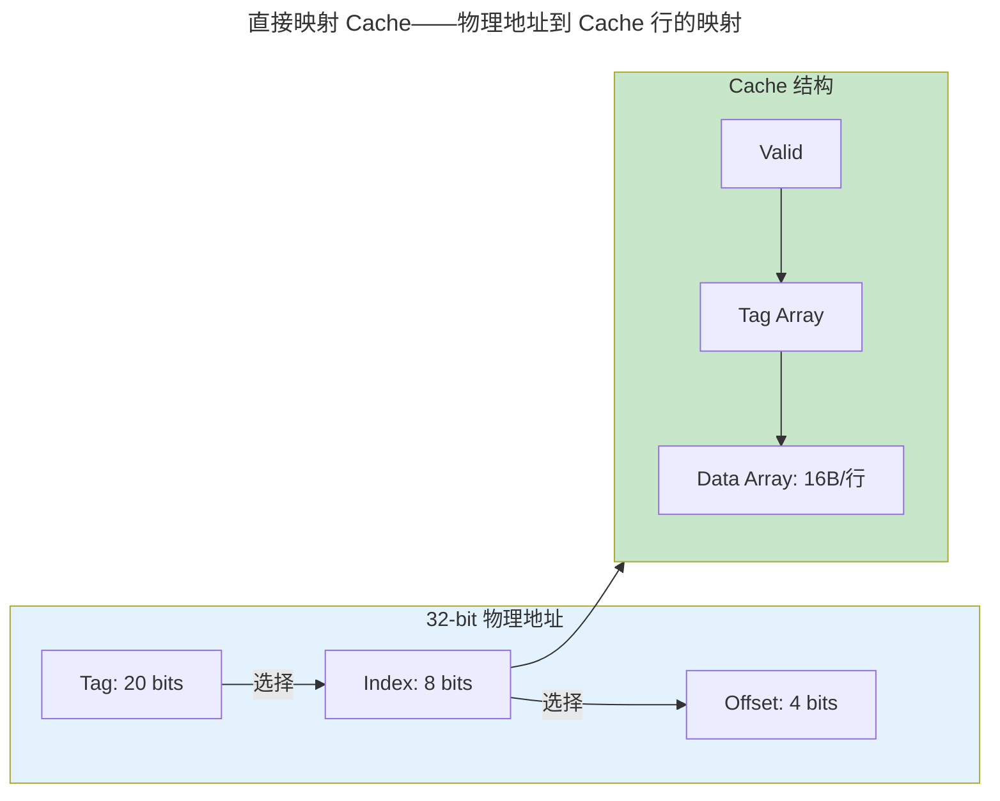
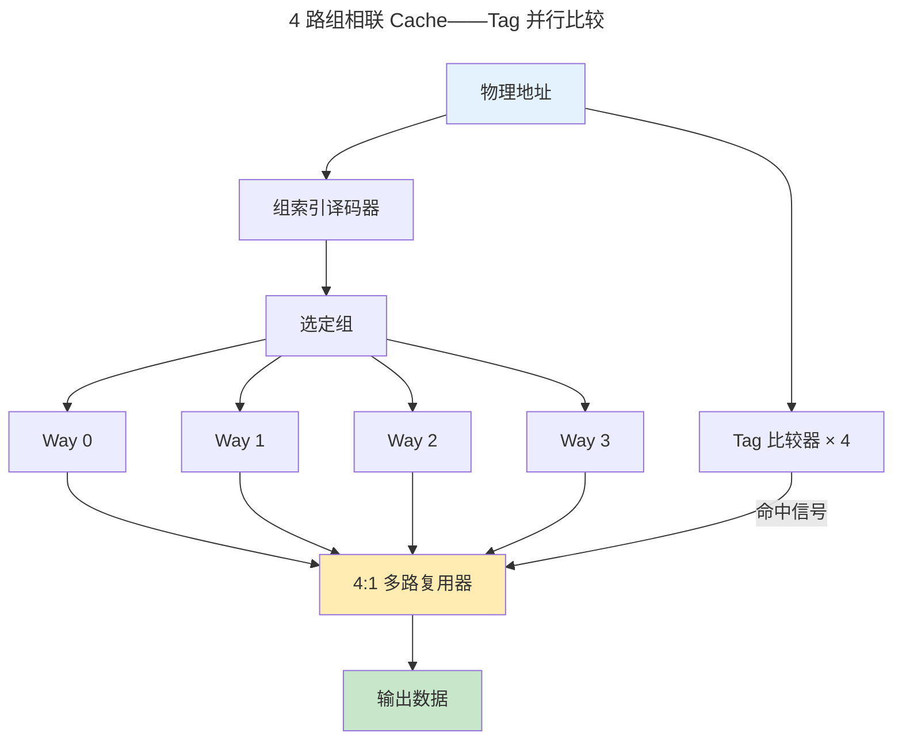
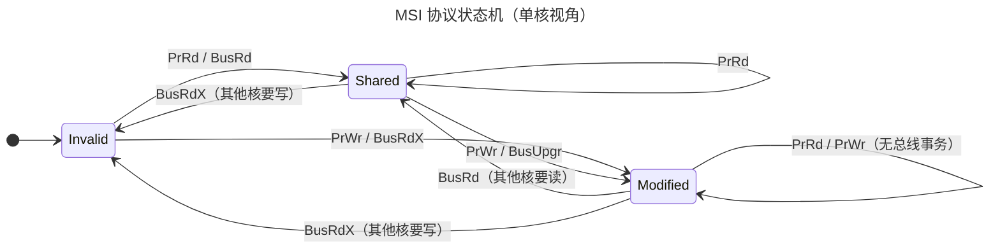
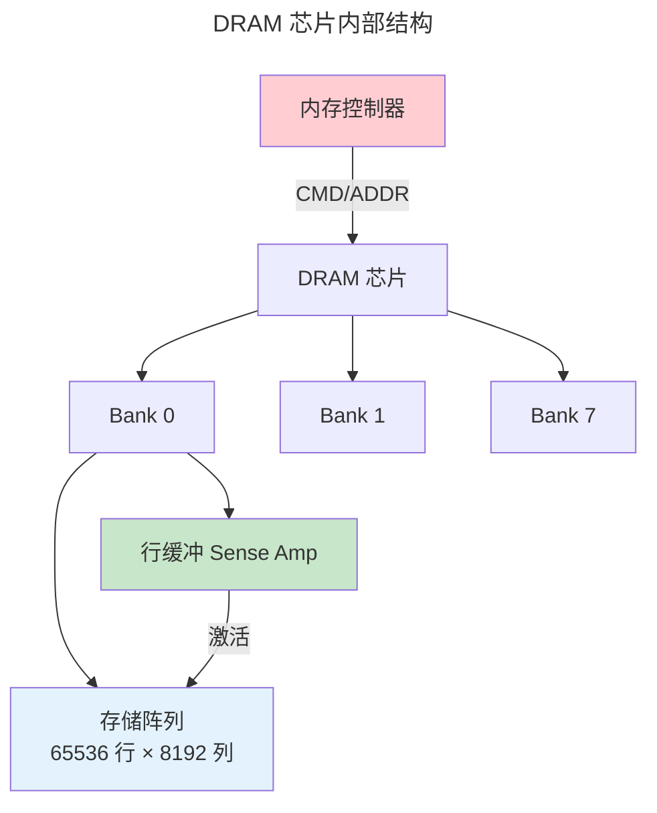

> 速度与容量的永恒博弈——从纳秒级 Cache 到微秒级 SSD，存储层次用金字塔优雅地弥合了 CPU 与存储器之间数百倍的速度鸿沟。

自冯·诺依曼架构诞生以来，"**存储墙**"（Memory Wall）始终是计算机体系结构的核心难题：CPU 每 0.3ns 完成一次加法，但访问主存需要 50-100ns——相差超过 **200 倍**。存储层次（Memory Hierarchy）正是用**局部性原理**和**多级缓存**在这条鸿沟上架起的桥梁。

## 局部性原理：预测未来的艺术

存储层次之所以有效，源于程序行为的两个经验规律：

### 时间局部性（Temporal Locality）

**刚被访问的数据，短期内很可能再次被访问。**

典型场景：循环中的指令和变量。

```c
int sum = 0;           // sum 在循环内反复读写
for (int i = 0; i < N; i++) {
    sum += a[i];       // a[i] 连续访问，但每个元素只读一次
}
```

`sum` 具有强时间局部性——每次迭代都读它，总计 N 次访问。相比之下，`a[i]` 的每个元素仅被访问一次，时间局部性为零。

### 空间局部性（Spatial Locality）

**访问某个地址后，其邻近地址很可能随后被访问。**

典型场景：
- **顺序代码执行**：`PC+4` 即下一条指令
- **数组遍历**：`a[0], a[1], a[2], ...` 地址连续
- **结构体字段**：`struct { int x; int y; }` 中 x 和 y 相邻存放

> 这两个原理不仅是 [Cache 设计](#cache-组织形式容量速度与复杂度的三角博弈) 的基石，也深刻影响着操作系统的 [页面置换算法](../../03-qiankun/02-memory-management/) 和数据库的 [缓冲池管理](../../04-yuanhai/02-storage-engine/)。

## 存储金字塔：每一纳秒都有代价



| 层级 | 典型容量 | 延迟 | 带宽 | 每比特成本（相对） |
|------|---------|------|------|-----------------|
| 寄存器 | ~1 KB | 0.3 ns | ~100 GB/s | — |
| L1 Cache | 32-64 KB | 0.5 ns | ~200 GB/s | 极高 |
| L2 Cache | 256KB-1MB | 5 ns | ~100 GB/s | 高 |
| L3 Cache | 8-32 MB | 15 ns | ~50 GB/s | 中 |
| DRAM | 8-64 GB | 60 ns | ~50 GB/s | 低 |
| SSD | 256GB-4TB | 10 μs | ~5 GB/s | 很低 |
| HDD | 1-20 TB | 10 ms | ~200 MB/s | 极低 |

> 从 L1 到 HDD，延迟跨了 **7 个数量级**，而容量跨了 **9 个数量级**。这就是"存储墙"的量化全貌。

**核心指标：AMAT**

平均访存时间（Average Memory Access Time）是评估存储层次效率的黄金公式：

$$
AMAT = HitTime_{L1} + MissRate_{L1} \times MissPenalty_{L1}
$$

其中 $MissPenalty_{L1}$ 又可展开为对 L2 的访问：

$$
MissPenalty_{L1} = HitTime_{L2} + MissRate_{L2} \times MissPenalty_{L2}
$$

:::tip[直观理解]
假设 L1 命中率 95%、命中时间 0.5ns、缺失惩罚 10ns（L2 命中时间），则：
$AMAT = 0.5 + 0.05 \times 10 = 1.0\ \text{ns}$
——虽然 L1 本身只要 0.5ns，但 5% 的缺失率就让平均时间翻倍。这就是为什么 Cache 命中率哪怕提升 1% 都价值巨大。
:::

## Cache 组织形式：容量、速度与复杂度的三角博弈

### 直接映射（Direct-Mapped）

**思路**：每个内存块恰好映射到唯一的 Cache 行。

$$
\text{Cache Line Index} = (\text{Memory Address} \gg \text{Offset Bits}) \bmod \text{NumLines}
$$



- **优点**：硬件简单，功耗低，查找快（并行比较 Tag + 有效位）
- **缺点**：冲突缺失（Conflict Miss）严重——两个不同地址映射到同一行时互相驱逐，即使 Cache 整体有空闲行也无能为力

### 组相联（Set-Associative）

**思路**：将 Cache 划分为若干"组"，每组容纳 2-16 个"路"（Way）。每个内存块映射到唯一组，但组内的**任意路**都可存放。



现代处理器的典型配置：

| 处理器 | L1-D | L1-I | L2 | L3 |
|--------|------|------|----|----|
| Apple M3 | 128KB / 8-way | 192KB / 8-way | 16MB 共享 / 16-way | — |
| Intel Raptor Lake | 48KB / 12-way | 32KB / 8-way | 2MB / 核 / 10-way | 36MB 共享 / 12-way |
| AMD Zen 4 | 32KB / 8-way | 32KB / 8-way | 1MB / 核 / 8-way | 32MB 共享 / 16-way |

:::note[三 C 模型：Cache Miss 的三种成因]
- **强制缺失（Compulsory Miss）**：首次访问某地址，不可避免（也叫"冷缺失"）
- **容量缺失（Capacity Miss）**：Cache 太小，装不下工作集
- **冲突缺失（Conflict Miss）**：组不够多，两个地址争用同一组——增大相联度可缓解
:::

### 替换策略：有限空间内的最优决策

当 Cache 组满时，需要**踢出一个旧块**来腾挪空间。替换策略直接影响缺失率。

| 策略 | 原理 | 实现复杂度 | 近似命中率 |
|------|------|----------|-----------|
| **LRU**（Least Recently Used） | 踢出最久未使用的块 | 高（需维护访问时间戳） | 最优（理论） |
| **PLRU**（Pseudo-LRU） | 二叉树近似 LRU | 中（每路 1 bit） | 95-98% LRU |
| **RRIP**（Re-Reference Interval Prediction） | 预测"近期不会再被访问"的块 | 低（每块 2 bits） | 优于 LRU（扫描模式） |
| **随机（Random）** | 随机选一个踢出 | 极低 | 80-90% LRU |

> RRIP 是现代 x86 处理器的首选——它能识别"扫描型"访问（如矩阵遍历），这类模式下 LRU 反而会踢出即将重用的数据。

## 写策略：数据一致性的根源

当 CPU **写**一个 Cache 命中的数据时，需要决定何时以及如何将新值传播到下层存储。

| 策略 | 命中时 | 缺失时 | 典型场景 |
|------|--------|--------|---------|
| **写直达（Write-Through）** | 同时写 Cache 和下级 | 写不分配（Write No-Allocate） | 简单嵌入式、L1-D→L2 |
| **写回（Write-Back）** | 只写 Cache，标记 dirty | 写分配（Write Allocate） | x86 L1/L2/L3 |

**写回 vs 写直达的实际选择**：

- L1-D → L2：**写回**（避免每写一次都触发 L2 访问，功耗和带宽代价太高）
- L2 → L3：**写回**
- L3 → DRAM：**写回** + 脏行驱逐（Eviction）

写回策略引入了**脏位（Dirty Bit）**——当脏行被替换时，必须写回下级；干净行则可直接丢弃。

:::caution[写策略与 Cache 一致性]
写回策略在多核环境下引入了数据一致性问题——核心 A 的 L1 中修改了地址 X，核心 B 的 L1 仍持有 X 的旧值。这就是 [Cache 一致性协议](#cache-一致性协议多核世界的交通规则) 要解决的核心矛盾。
:::

## Cache 一致性协议：多核世界的交通规则

当多个核心的私有 Cache 缓存同一内存地址时，任一核心的写操作必须**全局可见**——Cache 一致性协议就是保证这一点的硬件机制。

### MSI：三态基线



**三个状态的语义**：

| 状态 | 含义 | 其他核有副本？ | 本核可写？ |
|------|------|:---:|:---:|
| **M**（Modified） | 已修改，**独占且脏** | 否 | 是 |
| **S**（Shared） | 与内存一致，可能被多核共享 | 是 | 否，写前需升级 |
| **I**（Invalid） | 无效，读/写均需总线事务 | — | — |

### MESI：引入 Exclusive 态优化"读转写"

MSI 的问题是：当一个核从 I 读入 S 后，若要写，必须先发 **BusUpgr**（升级）事务告知其他核失效——即使该数据实际上从没被其他核缓存过。MESI 引入 **Exclusive** 态来解决这一冗余：

- **E（Exclusive）**：数据干净且**独占**。读入时若总线嗅探（Snoop）确认无其他副本，直接进入 E 态。
- 从 E 态写 → 静默转为 M 态，**无需任何总线事务**！

> MESI 是现代 x86 和 ARM 的标配协议，相比 MSI 节省了约 20-30% 的总线事务。

:::tip[跨卷链接：一致性与并发]
Cache 一致性与操作系统的 [内存模型与同步原语](../../03-qiankun/04-synchronization/) 紧密相关——`volatile` 关键字、`std::atomic` 和内存屏障最终都映射到硬件一致性协议之上。
:::

## DRAM 内部结构：一个单元的微观世界

DRAM 不是一块"扁平的随机访问存储"。它的内部是严格层次化的：



**DRAM 访问的三步舞**：

1. **ACTIVATE（激活）**：将整行（8KB）从存储阵列读入行缓冲，耗时 **15ns**
2. **READ/WRITE**：从行缓冲中读取所需列（64B），耗时 **15ns**
3. **PRECHARGE（预充电）**：将行缓冲写回阵列，恢复比特线，耗时 **15ns**

> 一次完整的随机访问 = ACTIVATE + READ + PRECHARGE ≈ **45ns**。但如果连续访问同一行（**Row Buffer Hit**），只需 15ns 的 READ。

:::note[为什么 DRAM 需要刷新？]
DRAM 用**电容**存电荷代表 1/0，电容会通过泄漏电流逐渐放电。JEDEC 标准要求每 64ms 内所有行必须刷新一次（REF 命令）。刷新操作会使 Bank 短暂不可用，占约 3-5% 的总带宽——这是 DRAM 比 SRAM 慢的根本物理原因。相关物理原理见 [DRAM 内部结构](#dram-内部结构一个单元的微观世界)。
:::

## SSD 与闪存翻译层

NAND 闪存与 DRAM 在物理层面有根本差异：

| 特性 | DRAM | NAND 闪存 |
|------|------|----------|
| 读写单位 | 字节（按行） | 页（4-16KB） |
| 擦除单位 | 不需要 | 块（数百页，MB 级） |
| 原地更新 | 是 | **否——必须先擦除再写** |
| 写入前必须 | — | 擦除整个块 |
| 寿命 | 无限 | 有限 P/E 周期（数百～数千次） |

由于"**不能原地覆盖**"这一物理约束，SSD 需要**闪存翻译层（FTL, Flash Translation Layer）** 将操作系统的逻辑扇区映射到 NAND 的物理页：

$$
\text{逻辑页号} \xrightarrow{\text{FTL 映射表}} \text{物理块号}:\text{物理页号}
$$

### 垃圾回收与写放大

当 SSD 需要写新数据但目标块已被部分占用时：

1. **选一个块**，将其中的所有**有效页**拷贝到新块
2. **擦除**整个旧块
3. 将新数据写入新块

这一过程称为**垃圾回收（Garbage Collection）**。代价是**写放大（Write Amplification）**：

$$
\text{写放大} = \frac{\text{NAND 实际写入量}}{\text{主机请求写入量}}
$$

典型写放大在 **1.5-4×** 之间——操作系统每写 1GB，NAND 可能实际被写 4GB。这是 SSD 寿命的主要消耗源。

### 磨损均衡（Wear Leveling）

每个 NAND 块的 **P/E 周期**有限（MLC ~10K, TLC ~3K, QLC ~1K）。FTL 通过**磨损均衡**确保所有块的擦除次数大致均匀，防止"热点"块过早失效。

:::caution[SSD 性能陷阱]
SSD 在"空盘"时写入快（直接写空闲块），但随着使用率升高和碎片增多，每次写入都需触发 GC，性能可能骤降 **50-80%**。企业级 SSD 通过**预留空间（Over-Provisioning，约 7-28%）** 缓解此问题。
:::

---

## 跨卷连接

:::tip[卷内路径]
[半导体物理](../01-semiconductor-physics/) → [数字逻辑](../02-digital-logic/) → [体系结构](../03-microarchitecture/) → **存储层次** → [指令集架构](../05-instruction-set-architecture/)
:::

:::note[跨卷桥梁]
- **卷三 · 乾坤**：虚拟内存的 [页表遍历](../../03-qiankun/02-memory-management/) 每次 TLB Miss 都转化为存储层次深处的多次访存——页表本身也是 DRAM 中的 Cache 行。
- **卷四 · 渊海**：数据库的 [缓冲池管理](../../04-yuanhai/02-storage-engine/) 是 Cache 替换策略在软件层的大规模复现——LRU-K 算法直接借鉴了 CPU Cache 的 LRU 近似。
- **卷六 · 须弥**：[深度学习训练](../../06-xumi/02-deep-learning/) 中矩阵乘法 $C = A \times B$ 的 Cache 优化（分块、数据布局重排）是 AI 编译器（如 TVM/XLA）的核心优化。
- **卷八 · 千里**：[性能分析](../../08-qianli/02-system-design/) 中 `perf stat` 的 `cache-misses` 事件、`cache-references` 事件直接映射到本章的 AMAT 公式和缺失分类。
:::
