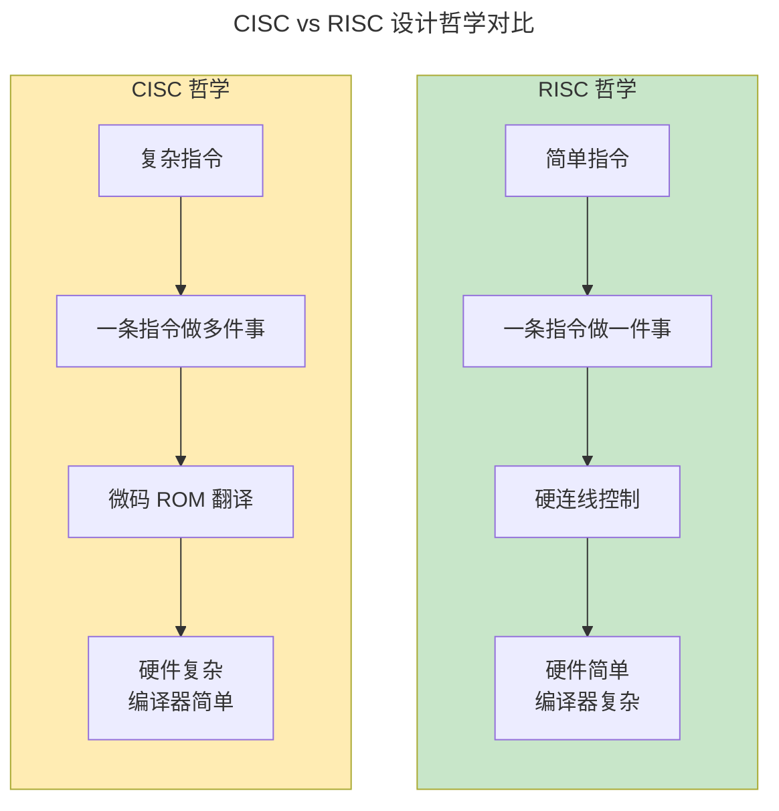
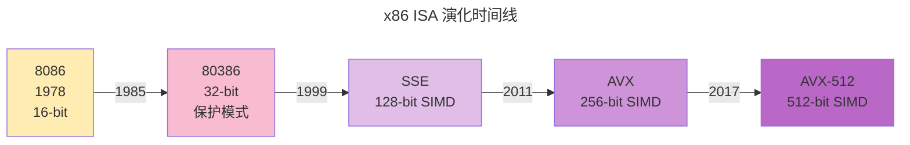
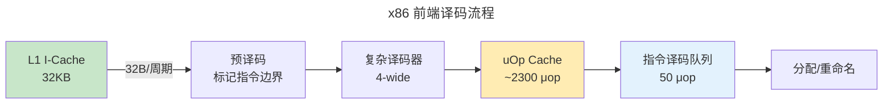

> 软件与硬件之间的契约——ISA 定义了程序员可见的"机器"，编译器面向它生成代码，[微架构](../03-microarchitecture/) 在它的约束下实现性能。

ISA（Instruction Set Architecture）是计算机系统中最持久的抽象层。x86 诞生于 1978 年，至今仍在每一台 PC 和服务器中运行；ARM 从 1985 年的桌面尝试起步，最终统治了移动与嵌入式世界；RISC-V 作为"开源的 x86/ARM 替代品"，正在从学术界走向商业芯片。

## CISC 与 RISC：两套哲学的五十年对决

ISA 设计的根本分歧可以归结为一个问题：**硬件应该多"聪明"？**



| 维度 | CISC（Complex Instruction Set） | RISC（Reduced Instruction Set） |
|------|------|------|
| 指令长度 | 可变（1-15 字节） | 固定（4 字节，ARM Thumb 为 2 字节） |
| 典型代表 | x86-64 | RISC-V, ARMv8, MIPS |
| 寻址模式 | 10+ 种（寄存器、立即数、基址+变址+位移等） | 2-3 种（寄存器+立即数） |
| 内存访问 | 算术指令可直接访存 | **仅 Load/Store 指令访存** |
| 寄存器数量 | 16 个（x86-64 为 16 个通用寄存器） | 32 个 |
| 微架构影响 | 需微码翻译 + uOp Cache | 简单译码，适合流水线与超标量 |
| 代码密度 | 高（一条 CISC 指令 = 3-5 条 RISC 指令） | 低，但有压缩指令（RISC-V C 扩展 / ARM Thumb） |

### 历史转折：Intel P6 的启示

1995 年，Intel Pentium Pro 做了一件"背叛" CISC 的事：内部将 x86 指令**动态翻译为 RISC-like 微操作（μop）**，然后在一个**超标量乱序 RISC 核**上执行。

这证明了 RISC 在微架构层面的优越性，但也保留了 x86 的生态兼容性——此后所有高性能 x86 处理器都采用了类似设计。**ISA 是软件看到的表面，而内部执行管线的"真实语言"是 μop**。

:::note[有趣的历史细节]
RISC 的概念由 David Patterson（UC Berkeley, RISC-I）和 John Hennessy（Stanford, MIPS）在 1980 年代提出。2018 年两人因"开创了系统化、量化的处理器设计方法"共同获得图灵奖。Patterson 后来成为 RISC-V 的联合创始人，Hennessy 成为 Google/Alphabet 董事长。
:::

## RISC-V 指令集：开放生态的崛起

RISC-V 是 UC Berkeley 于 2010 年启动的开源 ISA，由 RISC-V International 基金会维护。它的设计原则是 **"模块化、可扩展、无历史包袱"**。

### 寄存器文件

RISC-V 定义 **32 个通用寄存器（x0-x31）**，每个 64 位（RV64）：

| 寄存器 | ABI 名称 | 用途 | 调用约定 |
|--------|---------|------|---------|
| x0 | `zero` | 硬连线 0（写入被丢弃） | — |
| x1 | `ra` | 返回地址 | Caller 保存 |
| x2 | `sp` | 栈指针 | Callee 保存 |
| x5-x7 | `t0-t2` | 临时变量 | Caller 保存 |
| x8-x9 | `s0-s1` | 帧指针 / 保存寄存器 | Callee 保存 |
| x10-x17 | `a0-a7` | 函数参数 / 返回值 | Caller 保存 |
| x18-x27 | `s2-s11` | 保存寄存器 | Callee 保存 |

### 基础整数指令格式

RISC-V 定义了 **6 种基础指令格式**，全部 32 位宽：

| 格式 | 结构（从左到右） | 用途 |
|------|------|------|
| **R-type** | funct7[7] · rs2[5] · rs1[5] · funct3[3] · rd[5] · opcode[7] | 寄存器-寄存器运算 |
| **I-type** | imm[12] · rs1[5] · funct3[3] · rd[5] · opcode[7] | 立即数运算、Load |
| **S-type** | imm[7] · rs2[5] · rs1[5] · funct3[3] · imm[5] · opcode[7] | Store |
| **B-type** | imm[7] · rs2[5] · rs1[5] · funct3[3] · imm[5] · opcode[7] | 条件分支 |
| **U-type** | imm[20] · rd[5] · opcode[7] | LUI / AUIPC |
| **J-type** | imm[20] · rd[5] · opcode[7] | JAL |

**设计洞察**：注意 R-type、I-type、S-type 的 **rs1、rs2、rd、funct3 字段出现在相同的比特位置**——这不是巧合，而是有意为之。固定的字段位置让译码器可以盲读寄存器地址，无需先解码指令类型。这是 RISC-V 对流水线译码效率的刻意优化。

### 特权级与标准扩展

RISC-V 采用**分级特权模型**：

| 级别 | 名称 | 用途 | 类比 x86 |
|------|------|------|---------|
| M-mode | Machine | 固件 / 底层中断 | — (x86 无此级) |
| S-mode | Supervisor | 操作系统内核 | Ring 0 |
| U-mode | User | 用户程序 | Ring 3 |

**标准扩展模块**（按需组合）：

| 扩展 | 含义 | 示例指令 |
|------|------|---------|
| I | 整数基础 | `add`, `lw`, `beq` |
| M | 乘除法 | `mul`, `div`, `rem` |
| A | 原子操作 | `lr.w`, `sc.w`（用于实现锁） |
| F / D | 单/双精度浮点 | `fadd.s`, `fmadd.d` |
| C | 压缩指令（16 位） | `c.add`, `c.lw` |

> 芯片设计者可以声明自己的处理器为 "RV64IMAC"——即 RV64 基础 + 乘除 + 原子 + 压缩指令。这种**模块化**是 RISC-V 区别于 x86"全有或全无"模式的核心优势。

## x86 演化史：兼容性至上的五十年

### 从 8086 到 x86-64



x86 设计中最令人敬畏（也最令人头疼）的特质是**二进制兼容性**——1978 年的 8086 机器码至今仍可在最新的 Intel Core Ultra 上运行。

**关键扩展时间线**：

- **80386（1985）**：引入 32 位保护模式、分页虚拟内存——奠定了现代操作系统的基础
- **MMX（1997）**：首款 SIMD 扩展，8 个 64 位寄存器（复用浮点寄存器堆）
- **SSE（1999-2004）**：128 位 SIMD，独立寄存器文件 XMM0-XMM7（后继扩至 16 个）
- **AVX（2011）**：256 位 SIMD，三操作数格式 `c = a + b`（取代两操作数 `a = a + b`）
- **AVX-512（2017）**：512 位 SIMD，32 个 ZMM 寄存器，掩码寄存器

### x86-64 的微架构秘密

现代 x86 CPU 内部：

1. **译码**：复杂 x86 指令 → 1-4 个 μop（由硬件 ROM + 译码器生成）
2. **uOp Cache**（DSB, Decoded Stream Buffer）：缓存已译码的 μop 序列，跳过复杂译码——命中率约 80%
3. **乱序执行**：μop 被调度到多个执行单元（Intel 约 8-12 发射宽度）



## ARM 设计哲学：能效为先的帝国

ARM 不卖芯片，只卖**IP 授权**。这使它成为从 IoT 传感器到超算的所有领域的 ISA——设计者可以围绕 ARM 核心定制芯片的外围。

### A / R / M 三级体系

| Profile | 目标 | 特点 | 代表核心 |
|---------|------|------|---------|
| **Cortex-A** | 高性能应用处理器 | 超标量乱序、MMU、多级 Cache | Apple M3, Snapdragon 8 Gen 3 |
| **Cortex-R** | 实时处理器 | 顺序执行、MPU、低中断延迟 | 汽车 MCU、基站 |
| **Cortex-M** | 微控制器 | 面积极小、仅 Thumb 指令 | STM32、Arduino |

### ARMv8/v9 的 ISA 亮点

- **A64 指令集**：干净的全新 64 位 ISA，抛弃了 32 位 ARM 模式的包袱
- **条件执行（Predication）**：几乎每条指令都可条件执行（`addne` = "如果不相等则加"），省去短分支
- **加载/存储对（LDP/STP）**：一次 Load 两个寄存器，提高 ILP
- **SVE/SVE2**（Scalable Vector Extension）：可变向量长度（128-2048 位），一条指令适配不同硬件

:::tip[跨卷连接：ARM 与嵌入式]
Cortex-M 的 [中断向量表与 NVIC](../../02-jiezi/01-bare-metal/) 是卷二《芥子》裸机编程的硬件基础——32 个优先级、6 周期中断延迟的设计直接影响了 FreeRTOS 等 RTOS 的调度策略。
:::

## 汇编与调用约定：ISA 与软件的接口

ISA 不仅定义指令，还定义了**调用约定（ABI, Application Binary Interface）**——规定函数调用时参数如何传递、栈如何管理。

### RISC-V 函数调用的全生命周期

```asm
# 调用者（Caller）
addi sp, sp, -16       # 栈增长（向下 16 字节）
sd   ra, 8(sp)         # 保存返回地址
li   a0, 42            # 第一个参数
li   a1, 17            # 第二个参数
call func              # jal ra, func

# 被调用者（Callee）
func:
  addi sp, sp, -32     # 分配栈帧
  sd   s0, 24(sp)       # 保存 callee-saved 寄存器
  sd   s1, 16(sp)
  add  s0, a0, a1      # s0 = a0 + a1（实际计算）
  mv   a0, s0           # 返回值放入 a0
  ld   s1, 16(sp)       # 恢复寄存器
  ld   s0, 24(sp)
  addi sp, sp, 32       # 释放栈帧
  ret                   # jalr zero, ra, 0
```

**关键约定**：

- `a0-a7` 传递前 8 个整数参数，多余参数通过栈传递
- `s0-s11` 是 **callee-saved**：被调用者若要用它们，必须事先保存、事后恢复
- `ra` 是 caller-saved：`call` 指令会自动写入返回地址

### x86-64 System V ABI 对比

| 维度 | RISC-V LP64 | x86-64 System V |
|------|------------|-----------------|
| 参数寄存器 | a0-a7（8 个） | rdi, rsi, rdx, rcx, r8, r9（6 个） |
| 返回值 | a0, a1 | rax, rdx |
| 栈对齐 | 16 字节 | 16 字节（call 前 +8 = 对齐） |
| 红色区域 | 无 | 128 字节（`rsp` 之下） |

> **红色区域（Red Zone）**：x86-64 ABI 允许函数直接使用 `rsp` 之下的 128 字节，而无需移动栈指针——这对叶函数（不调用其他函数的函数）非常高效。RISC-V 不支持此特性。

---

## 跨卷连接

:::tip[卷内路径]
[半导体物理](../01-semiconductor-physics/) → [数字逻辑](../02-digital-logic/) → [体系结构](../03-microarchitecture/) → [存储层次](../04-memory-hierarchy/) → **指令集架构**
:::

:::note[跨卷桥梁]
- **卷三 · 乾坤**：操作系统的 [系统调用（系统调用入口：从 EL0 到 EL1 的硬件路径）](../../03-qiankun/01-process-and-thread/#系统调用入口从-el0-到-el1-的硬件路径)（`ecall` / `syscall` 指令）本质是 ISA 级特权模式切换——从 U-mode 切换到 S-mode。
- **卷二 · 芥子**：RISC-V 的 M-mode 和 Core-Local Interrupt Controller 是 [裸机中断处理](../../02-jiezi/01-bare-metal/) 的硬件基础。
- **卷六 · 须弥**：[深度学习推理引擎](../../06-xumi/02-deep-learning/)（如 ONNX Runtime）将计算图编译为 x86 AVX-512、ARM NEON 或 RISC-V V 扩展的 SIMD 指令——ISA 的向量能力直接决定了 AI 推理的性能上限。
- **卷七 · 天枢**：ARM 的 TrustZone 和 RISC-V 的 PMP（Physical Memory Protection）是 [可信执行环境](../../07-tianshu/05-system-security/)（TEE）的 ISA 级安全基石。
:::
