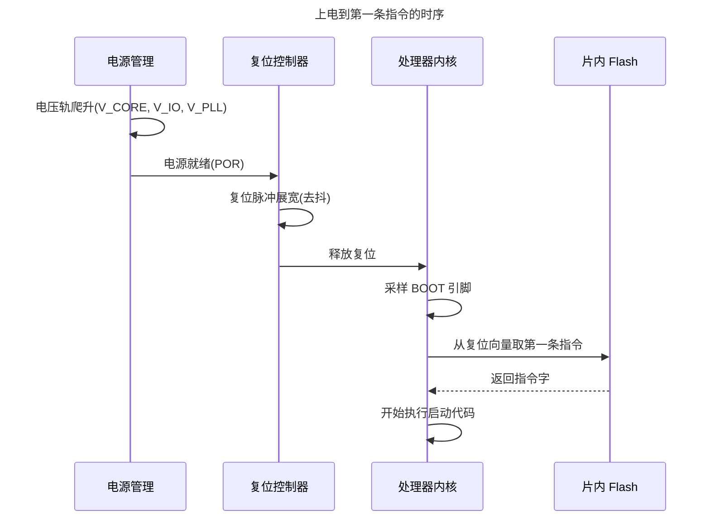
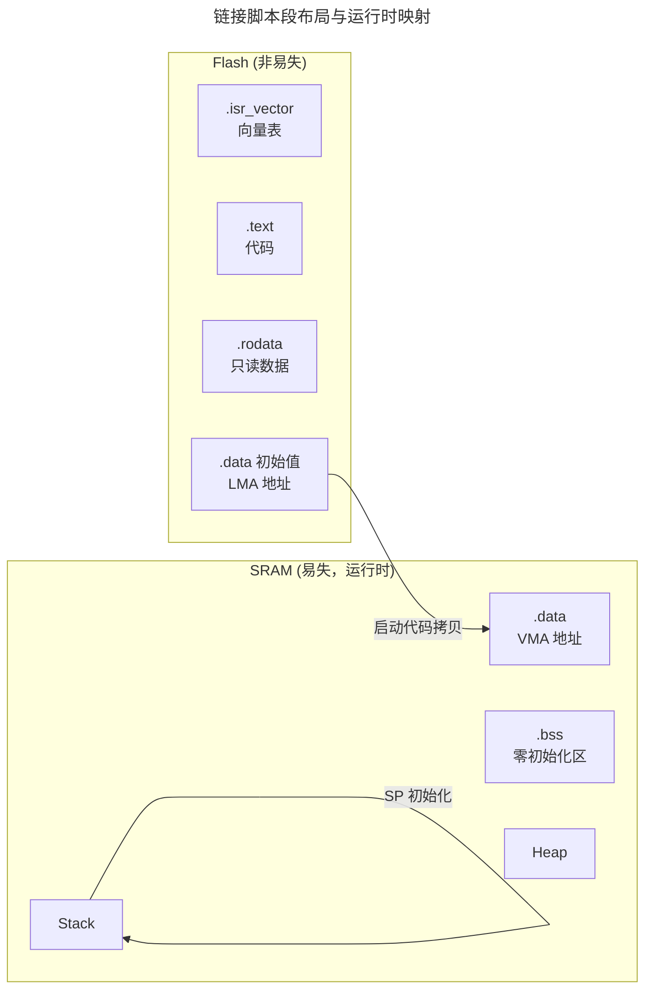
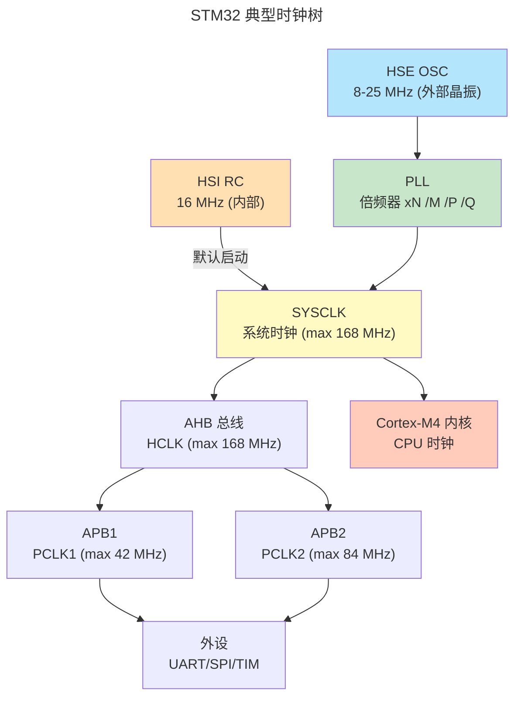
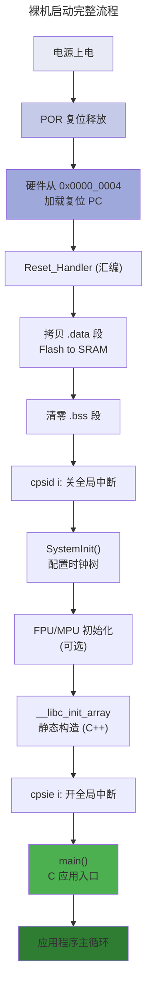

> 没有操作系统的世界，一切从零开始。

当电源接通的一瞬间，处理器内部数十亿晶体管从混沌中苏醒。没有操作系统来分配内存、没有调度器来管理时间、没有文件系统来组织存储——只有一个冰冷的程序计数器，固执地指向某个硬编码的地址。**裸机编程**，就是在这个原始起点上，用一砖一瓦亲手搭建软件运行所需的一切。

本章从复位向量出发，走过链接脚本的内存布局、栈和 BSS 段的初始化、C 运行时的桥梁，最终抵达异常向量表和时钟树的配置——这是一条从硅片电子跃迁到 `main()` 函数调用的完整路径。

---

## 复位向量：一切开始的地方

### 上电时序的物理现实

按下电源键的瞬间，并非所有电路同时就绪。电源管理芯片首先检测各电压轨——$V_{CORE}$（核心电压）、$V_{IO}$（IO 电压）、$V_{PLL}$（锁相环电压）——只有当所有电压稳定在容差范围内，复位控制器才会释放系统复位信号。这一过程通常耗时数毫秒，在高可靠性系统中甚至需要数百毫秒。



:::note[上电复位 vs 系统复位]
POR（Power-On Reset）是芯片首次通电时触发的全系统复位，所有寄存器回到出厂默认值。而系统复位（System Reset）可能由看门狗超时、外部复位引脚或调试器触发，部分寄存器（如时钟配置）可能保留。
:::

### 复位向量的三种形态

不同架构对"第一条指令从哪里取"有不同答案：

| 架构 | 复位向量地址 | 第一条指令内容 | 典型示例 |
|------|-------------|---------------|----------|
| **ARM Cortex-M** | `0x0000_0004`（或通过 VTOR 重映射） | 初始 SP 值在 `0x0000_0000`，复位 PC 在 `0x0000_0004` | STM32, NXP Kinetis |
| **RISC-V** | `0x0000_1000`（Machine Mode） | 直接跳转到启动代码 | SiFive FE310, ESP32-C3 |
| **x86** | `0xFFFF_FFF0`（实模式） | 一条 JMP 指令，跳转到 BIOS | Intel/AMD 处理器 |
| **MIPS** | `0xBFC0_0000`（虚拟地址，对应物理 `0x1FC0_0000`） | 启动 ROM 中的第一条指令 | PIC32 |

ARM Cortex-M 的设计最为巧妙：它不直接让 PC 指向某个地址，而是将向量表的前两个字分别定义为**初始栈指针**和**复位 PC**。硬件自动执行：

```
SP ← [0x0000_0000]    // 从向量表加载初始栈指针
PC ← [0x0000_0004]    // 跳转到复位处理函数
```

这保证了即便在第一条指令执行之前，栈已经可用——中断随时可能到来。

:::tip[跨卷链接]
复位向量的硬件行为依赖于[数字逻辑](../../01-weichen/02-digital-logic/#时序逻辑)中的触发器与状态机设计。处理器内部的复位状态机本质上就是一个 FSM（有限状态机），其状态的正确翻转取决于[建立时间与保持时间](../../01-weichen/02-digital-logic/#建立时间与保持时间)是否被满足。
:::

---

## 裸机编程的架构全景：不止 Cortex-M

前面的讨论以 ARM Cortex-M 为主线——它是 MCU 裸机编程的事实标准。但在更广阔的嵌入式世界里，ARM64、RISC-V 和 x86 各有自己的一套裸机哲学。下表从裸机程序员的视角，对比四大架构的关键差异。

### 四架马车对比

| 维度 | ARM Cortex-M | ARM64 (AArch64) | RISC-V | x86/x64 |
|------|-------------|-----------------|--------|---------|
| **特权级模型** | Thread + Handler（2 级） | EL0 ~ EL3（4 级） | M / S / U（最多 3 级） | Ring 0 ~ 3（4 级） |
| **裸机入口特权级** | Thread 或 Handler 模式 | 通常 EL3 → EL1 | Machine Mode（M-mode） | Ring 0（实模式下无保护） |
| **启动入口** | 向量表 SP+PC（`0x0000_0000` / `0x0000_0004`） | 从定义好的地址直接执行（Linux boot protocol：跳转地址由 Bootloader 传入） | `mtvec` CSR 指向复位地址（典型 `0x0000_1000` 或 `0x8000_0000`） | `0xFFFF_FFF0` 取第一条指令 → BIOS/UEFI → Bootloader |
| **异常模型** | NVIC：向量化、自动入栈、尾链 | GICv3/v4：中断路由分发、多核亲和性 | CLINT（本地）+ PLIC（平台级）分层模型 | 实模式 IVT → 保护模式 IDT + 本地 APIC |
| **内存管理** | 可选 MPU，无 MMU | 强制 MMU（TLB + 页表） | 可配：仅物理（M-mode）或 Sv39/Sv48 虚拟内存 | 分段 → 分页，启动时先关 MMU |
| **裸机栈设置** | 向量表第一字 = 初始 SP，硬件自动加载 | 软件显式设置 `SP_ELx` 寄存器 | 软件显式写入 `sp`（x2）寄存器 | 软件设置 `ESP` / `RSP` |
| **典型裸机场景** | STM32 / NXP Kinetis / TI TM4C | 手机 SoC 固件、嵌入式 Linux Boot | ESP32-C3 / GD32VF103 / 学术定制 SoC | PC BIOS/UEFI、服务器固件 |
| **工具链** | `arm-none-eabi-gcc` | `aarch64-none-elf-gcc` | `riscv64-unknown-elf-gcc` | `gcc -m32/-m64` + `nasm` |

### 特权级：裸机程序员的立足之地

裸机编程的起点，就是芯片上电后所处的最高特权级。不同架构对这个起点的命名不同，但语义一致——**一切开放，没有限制**。

- **ARM Cortex-M**：上电后处于 Thread 模式 + 特权访问级别。如果后续触发异常，CPU 切换到 Handler 模式，二者都是特权级——所以 Cortex-M 的"用户态"概念很弱，需要 MPU 才能实现隔离。
- **ARM64**：上电即 EL3（最高特权级，Secure Monitor），固件配置后切换到 EL2（Hypervisor）或 EL1（OS Kernel），最终 EL0 交给用户程序。裸机程序员在 EL3 或 EL1 操作，直接读写所有系统寄存器。
- **RISC-V**：上电后在 Machine Mode（M-mode，最高特权级），可以访问所有 CSR（控制状态寄存器）、配置物理内存保护（PMP）。裸机程序可以永远留在 M-mode，或初始化后将异常委托给 Supervisor Mode。
- **x86**：上电后在 16 位实模式——没有页表保护，任何代码可以访问任何物理地址。UEFI 固件负责切换到 32 位保护模式或 64 位长模式，建立页表后才启用 Ring 0-3 特权分层。

:::note[裸机编程的"特权"不是安全特性，而是功能特性]
在裸机场景下，高特权级的目的不是为了"保护系统免受用户程序破坏"——因为没有用户程序。它的意义在于：**高特权级可以访问控制寄存器（如时钟、PLL、异常向量基地址），而这些寄存器在低特权级被硬件阻止访问**。裸机程序员之所以站在最高特权级，是为了拥有配置硬件的一切权限。
:::

### 为什么 Cortex-M 是裸机教学的首选

从上述对比可以看出，Cortex-M 的设计对裸机程序员最为友好：

1. **硬件自动入栈**：无需手写汇编保存上下文，`cpsid i` / `cpsie i` 两条指令开关中断
2. **统一物理地址**：没有 MMU，`0x2000_0000` 就是 SRAM，`0x0800_0000` 就是 Flash——没有地址翻译的认知负担
3. **NVIC 硬件向量跳转**：不需要软件读取中断号再 `switch` 分发
4. **两段式特权模型**：比 ARM64 的四级 EL、x86 的四环结构简单得多

这也是本卷以 Cortex-M 为教学主线的理由——先用它把裸机编程的核心概念建立起来，后续遇到 ARM64、RISC-V、x86 时，只需理解差异在哪。

---

## 链接脚本：给二进制一张地图

裸机程序的第一步不是写代码，而是**画地图**。链接脚本（Linker Script）告诉链接器：代码放在哪里？数据放在哪里？栈从哪里开始？这些决定直接影响程序的正确性和性能。

### 内存布局的物理约束

典型的 ARM Cortex-M 微控制器（如 STM32F407）拥有以下物理内存：

```
┌─────────────────────── 0x2000_0000 (SRAM, 128KB)
│  .bss  (未初始化全局变量)
│  .data (已初始化全局变量)
│  Heap  (动态分配，向上增长)
│  ...
│  Stack (向下增长)
├─────────────────────── 0x1FFF_FFFF
│        (保留区)
├─────────────────────── 0x0800_0000 (Flash, 1MB)
│  .text      (代码段)
│  .rodata    (只读数据，如字符串常量)
│  .vector    (向量表)
└─────────────────────── 0x0800_0000
│  .isr_vector
└─ 0x0000_0000 (通过 VTOR 别名到 Flash/SRAM)
```

:::caution[链接脚本与硬件必须一致]
链接脚本中声明的 `SRAM ORIGIN` 和 `LENGTH` 必须与芯片 Datasheet 精确匹配。一个常见陷阱是：芯片实际有 128KB SRAM，但链接脚本声明为 64KB——链接器不会报错，只会在运行时栈溢出后产生难以调试的 HardFault。
:::

### 段布局的精妙之处

每个段（Section）有特定的使命：

| 段名 | 位置 | 内容 | 初始化者 | 运行时访问 |
|------|------|------|----------|-----------|
| `.isr_vector` | Flash 起始 | 异常向量表 | 编程器烧录 | 硬件自动读取 |
| `.text` | Flash | 编译后的机器码 | 编程器烧录 | CPU 取指（只读） |
| `.rodata` | Flash | 字符串常量、const 全局变量 | 编程器烧录 | 只读 |
| `.data` | Flash（初始值）→ SRAM（运行时） | 已初始化的全局/静态变量 | 启动代码拷贝 | 读写 |
| `.bss` | SRAM | 未初始化/零初始化的全局/静态变量 | 启动代码清零 | 读写 |
| `.heap` | SRAM（`.bss` 之后） | malloc 动态分配区 | CRT0 初始化 | 读写 |
| `.stack` | SRAM 顶部 | 函数调用栈 | 硬件/启动代码设置 SP | 读写 |

关键在于 `.data` 段的**双重存在**：初始值存储在 Flash 中（`_sidata`），而运行时位于 SRAM 中（`_sdata`）。启动代码的责任之一就是将 Flash 中的初始值逐字节拷贝到 SRAM。



---

## 启动代码：用汇编搭建 C 语言的舞台

在 `main()` 函数的第一行 C 代码执行之前，有一段短小精悍的汇编序言——这就是启动代码（Startup Code），常被称为 CRT0（C Runtime Zero）。

### CRT0 的五步舞

ARM Cortex-M 的典型启动流程（以 STM32 为例）：

```armasm
.section .isr_vector, "a"
g_pfnVectors:
    .word _estack             /* 向量表[0]: 初始栈顶 */
    .word Reset_Handler       /* 向量表[1]: 复位处理函数 */
    .word NMI_Handler         /* 向量表[2]: NMI */
    .word HardFault_Handler   /* 向量表[3]: HardFault */
    /* ... 更多异常/中断向量 ... */

.section .text.Reset_Handler, "ax"
.globl Reset_Handler
Reset_Handler:
    /* 第一步: 将 .data 段从 Flash 拷贝到 SRAM */
    ldr r0, =_sidata          /* Flash 中的数据初始值起始地址 */
    ldr r1, =_sdata           /* SRAM 中的 .data 起始地址 */
    ldr r2, =_edata           /* SRAM 中的 .data 结束地址 */
    b   LoopCopyDataInit
CopyDataInit:
    ldr r3, [r0], #4          /* 从 Flash 加载 4 字节，r0 后移 */
    str r3, [r1], #4          /* 存入 SRAM，r1 后移 */
LoopCopyDataInit:
    cmp r1, r2
    bcc CopyDataInit          /* r1 < r2 则继续 */

    /* 第二步: 清零 .bss 段 */
    ldr r0, =_sbss
    ldr r1, =_ebss
    movs r2, #0
    b   LoopFillZerobss
FillZerobss:
    str r2, [r0], #4
LoopFillZerobss:
    cmp r0, r1
    bcc FillZerobss

    /* 第三步: 关闭全局中断（确保 SystemInit 原子执行） */
    cpsid i

    /* 第四步: 配置时钟树 */
    bl  SystemInit

    /* 第五步: 跳转到 C 世界 */
    bl  __libc_init_array   /* 调用静态构造函数（C++） */
    bl  main                /* 终于抵达 main() */
    bx  lr                  /* main 返回后执行（通常不会） */
```

:::note[为什么用汇编而非 C？]
启动代码必须用汇编编写，因为：
1. **C 编译器假设栈已就绪**——但 SP 刚刚设置，编译器生成的 prologue（如 `push {lr}`）依赖栈
2. **C 编译器可能使用 `.bss` 变量**——但它们尚未清零，读取到的是随机值
3. **部分寄存器操作（如 `cpsid i` 关中断）没有 C 语言的直接对应**
:::

### BSS 清零：看不见的陷阱

C 标准规定未显式初始化的全局和静态变量必须为零。但芯片上电后 SRAM 的内容是随机值——任何在清零前读取 BSS 变量的代码都会产生 Bugs。一个经典的灾难场景是：

```c
static int system_state;  // 期望为 0 = INIT, 但 SRAM 残余可能是 0xDEADBEEF

// 在 SystemInit() 中（bss 尚未清零！）
if (system_state == INIT) {
    configure_pll();  // 永远不会执行！
}
```

:::danger[SRAM 残余数据的安全风险]
SRAM 在上电后并非"干净的零"，而是随机的热噪声残余。在安全关键系统中，未经清零的 SRAM 可能残留前次运行的密钥或敏感数据。正确的做法不仅是清零 BSS，还要在启动早期对整个 SRAM 执行一次**安全擦除**——这对于通过 CC EAL 认证的产品是强制要求。
:::

### 栈指针初始化的深层逻辑

链接脚本中 `_estack` 通常设为 `ORIGIN(SRAM) + LENGTH(SRAM)`——即 SRAM 的最顶端。为什么？

ARM Cortex-M 使用**满递减栈**（Full Descending Stack），SP 指向最后一个已使用的栈槽。压栈时 SP 先减后存，出栈时先读后增。将 SP 初始化为 SRAM + 1 的位置（即超出 SRAM 的地址）意味着第一次压栈时 SP 减到 SRAM 的最后一个字——恰好利用了全部可用 SRAM。

```
SRAM_TOP = SRAM_BASE + SRAM_SIZE    (例如 0x2000_0000 + 0x20000 = 0x2002_0000)
初始 SP = SRAM_TOP                   (0x2002_0000)
第一次 PUSH {r0}:
    SP ← SP - 4 = 0x2001_FFFC       (SRAM 最后一个字)
    [SP] ← r0
```

:::tip[跨卷链接]
栈的增长方向由 ISA 的[调用约定](../../01-weichen/05-instruction-set-architecture/#汇编与调用约定isa-与软件的接口)定义。ARM 的 AAPCS 规定使用满递减栈，而 x86 的 `PUSH` 指令同样是递减。了解 ISA 层面的设计决策，有助于理解为什么链接脚本中 `_estack` 设在 SRAM 顶端而非底端。类似地，进程在操作系统中的[虚拟地址空间布局](../../03-qiankun/02-memory-management/)也需要在用户栈和内核栈之间划出隔离带。
:::

---

## SystemInit：唤醒时钟树

在 `main()` 之前最后一步关键操作是配置系统时钟。芯片出厂时通常以低速内部 RC 振荡器（如 HSI 16 MHz）运行——这是最安全但也最慢的默认配置。`SystemInit()` 的职责是将系统切换到高速外部晶振，并配置 PLL 倍频到目标频率。

### 时钟树的层次结构



### PLL 配置的关键公式

PLL 的输出频率由输入时钟和三个分频系数决定：

$$
f_{PLL} = \frac{f_{IN} \times N}{M \times P}
$$

对于典型的 168 MHz 配置（HSE = 8 MHz）：

$$
f_{PLL} = \frac{8\ \mathrm{MHz} \times 336}{8 \times 2} = 168\ \mathrm{MHz}
$$

其中 $M=8$（将 8 MHz 分频到 PLL 所需的 1 MHz 输入），$N=336$（倍频系数），$P=2$（将 VCO 输出 336 MHz 分频至 168 MHz）。

### 时钟切换的原子操作

从 HSI 切换到 PLL 必须遵循严格顺序，任何一步出错都可能导致处理器锁死：

1. **使能 HSE**，等待 `HSERDY` 标志位——外部晶振起振需要数毫秒
2. **配置 PLL 系数**（M/N/P/Q），使能 PLL，等待 `PLLRDY` 标志
3. **配置 Flash 等待周期**——系统频率升高后，Flash 访问延迟需要更多等待周期
4. **配置 AHB/APB 预分频器**——确保各总线频率不超标
5. **切换 SYSCLK 源为 PLL**，等待 `SWS` 状态位确认

:::caution[先调 Flash 延迟，后切时钟]
这是一个经典的**顺序依赖陷阱**：如果先切到高速 PLL，再配置 Flash 等待周期，CPU 取指时 Flash 响应不足，将读到错误指令并立即 HardFault。正确顺序是：Flash 延迟先配置，时钟源后切换。
:::

---

## 异常向量表：中断时代的序幕

虽然完整的中断机制将在[下一章](../02-interrupts/)展开，但向量表是裸机启动的必经之路。ARM Cortex-M 的向量表结构如下：

| 位置 | 向量 | 类型 | 优先级 |
|------|------|------|--------|
| `+0x00` | 初始 SP 值 | （非向量） | — |
| `+0x04` | Reset | 异常 | -3（最高） |
| `+0x08` | NMI | 异常 | -2 |
| `+0x0C` | HardFault | 异常 | -1 |
| `+0x10` | MemManage | 异常 | 可配置 |
| `+0x14` | BusFault | 异常 | 可配置 |
| `+0x18` | UsageFault | 异常 | 可配置 |
| `+0x3C` | SVCall | 异常 | 可配置 |
| `+0x40` | 外部中断 #0 | 中断 | 可配置 |
| `...` | ... | 中断 | ... |

在启动代码中，通常为所有向量提供**弱定义**（Weak Definition）的默认处理函数——它们都是无限循环或复位处理。应用程序只需实现自己关心的 ISR 函数名，链接器会自动覆盖弱定义。

```c
// 默认的弱定义：所有未实现的中断最终陷入这里
void __attribute__((weak)) Default_Handler(void) {
    while (1) {
        // 调试器可以在这里设断点来捕获意外中断
    }
}

// 应用程序只需实现同名函数即可覆盖
void SysTick_Handler(void) {
    // 每 1ms 触发一次的系统滴答时钟
    tick_count++;
}
```

:::tip[跨卷链接]
向量表机制与[处理器体系结构](../../01-weichen/03-microarchitecture/#推测取指与分支预测)中的异常处理硬件密切相关。当 CPU 流水线检测到中断请求时，它会冲刷流水线、保存上下文、然后跳转到向量表中对应入口——这与分支预测失败后流水线冲刷是同一套硬件机制。而在操作系统层面，[中断处理](../../03-qiankun/01-process-and-thread/)进一步抽象为信号和上下文切换的底层支持。
:::

---

## 裸机中断的上下半部设计

向量表将中断信号路由到 ISR，但 ISR 本身的架构同样关键。裸机编程的黄金法则是**ISR 必须短**——原因在 [中断延迟分析](../02-interrupts/#中断延迟分析从信号到达-isr-第一行代码) 中已量化：ISR 的每一微秒都是对同优先级和更低优先级中断的延迟惩罚。

裸机程序员将中断处理逻辑拆分为两部分：

| 部分 | 执行位置 | 约束 | 负责 |
|------|---------|------|------|
| **上半部**（Top Half） | ISR 本体（硬中断上下文） | < 5 μs，不可阻塞，不可睡眠 | 读状态寄存器、清中断标志、拷贝数据到环形缓冲、置标志位通知主循环 |
| **下半部**（Bottom Half） | 主循环（`main()` 或 RTOS 任务） | 可阻塞，可调用复杂函数 | 协议解析、数据处理、Flash 写入、外设重配置 |

```c
// 上半部 —— ISR（< 5 μs）
void UART_RX_IRQHandler(void) {
    if (UART->SR & UART_SR_RXNE) {
        rx_buf[rx_head++] = UART->DR;          // 仅取走数据
        rx_head %= BUF_SIZE;
        new_data_ready = true;                 // 通知主循环
    }
}

// 下半部 —— 主循环
void process_uart_data(void) {
    if (new_data_ready) {
        parse_protocol(rx_buf);     // 可慢，不会阻塞中断
        new_data_ready = false;
    }
}
```

这一模式向上延伸为操作系统的 [tasklet 与 workqueue 机制](../../03-qiankun/01-process-and-thread/#中断下半部taskletworkqueue-与-threaded-irq)——Linux 内核将"上半部/下半部"思想系统化为软中断、tasklet、workqueue 三级。裸机程序员写的 `new_data_ready = true` 标志位，就是操作系统中 `raise_softirq()` 的微观前身。

---

## 完整的启动流程图

将上述所有步骤串联起来，得到裸机启动的完整画面：



---

## 跨卷连接

裸机编程是连接硬件物理与软件抽象的**第一座桥梁**。每一行启动代码背后，都站立着深层的跨卷原理：

| 本章概念 | 依赖的底层原理 | 支撑的上层抽象 |
|----------|---------------|---------------|
| 复位向量 | [时序逻辑与触发器](../../01-weichen/02-digital-logic/#时序逻辑) | [操作系统启动](../../03-qiankun/01-process-and-thread/) |
| 链接脚本内存布局 | [存储器层次](../../01-weichen/04-memory-hierarchy/) | [虚拟内存管理](../../03-qiankun/02-memory-management/) |
| 栈指针初始化 | [ISA 调用约定](../../01-weichen/05-instruction-set-architecture/#汇编与调用约定isa-与软件的接口) | [进程上下文切换](../../03-qiankun/01-process-and-thread/) |
| 时钟树配置 | [MOSFET 开关速度与功耗](../../01-weichen/01-semiconductor-physics/#cmos-反相器与功耗) | [调度器时钟滴答](../../03-qiankun/01-process-and-thread/) |
| 异常向量表 | [流水线冲刷与异常入口](../../01-weichen/03-microarchitecture/#推测取指与分支预测) | [中断子系统](../../03-qiankun/01-process-and-thread/) |
| BSS 安全擦除 | [SRAM 存储单元](../../01-weichen/04-memory-hierarchy/) | [进程地址空间隔离](../../03-qiankun/02-memory-management/) |

:::tip[卷二内部路径]
- [**中断与异常**](../02-interrupts/)：向量表之下的中断控制器硬件
- [**RTOS 基础**](../03-rtos-fundamentals/)：裸机之上构建实时调度
- [**外设驱动**](../04-peripheral-drivers/)：用裸机代码操作 GPIO/SPI/I²C
- [**低功耗设计**](../05-low-power-design/)：时钟树的反向操作——关断不需要的时钟域
:::
