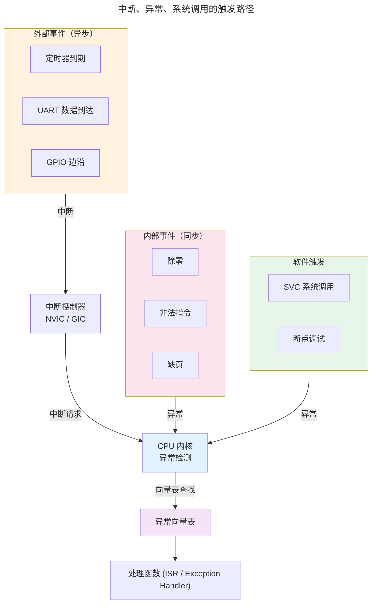
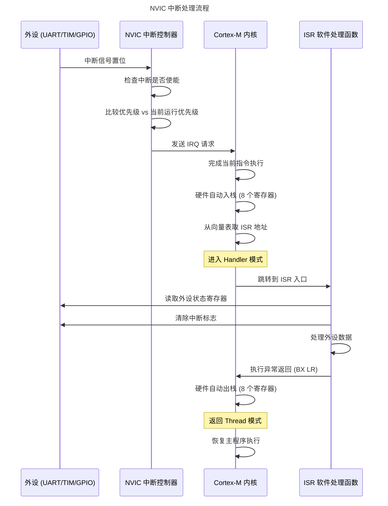
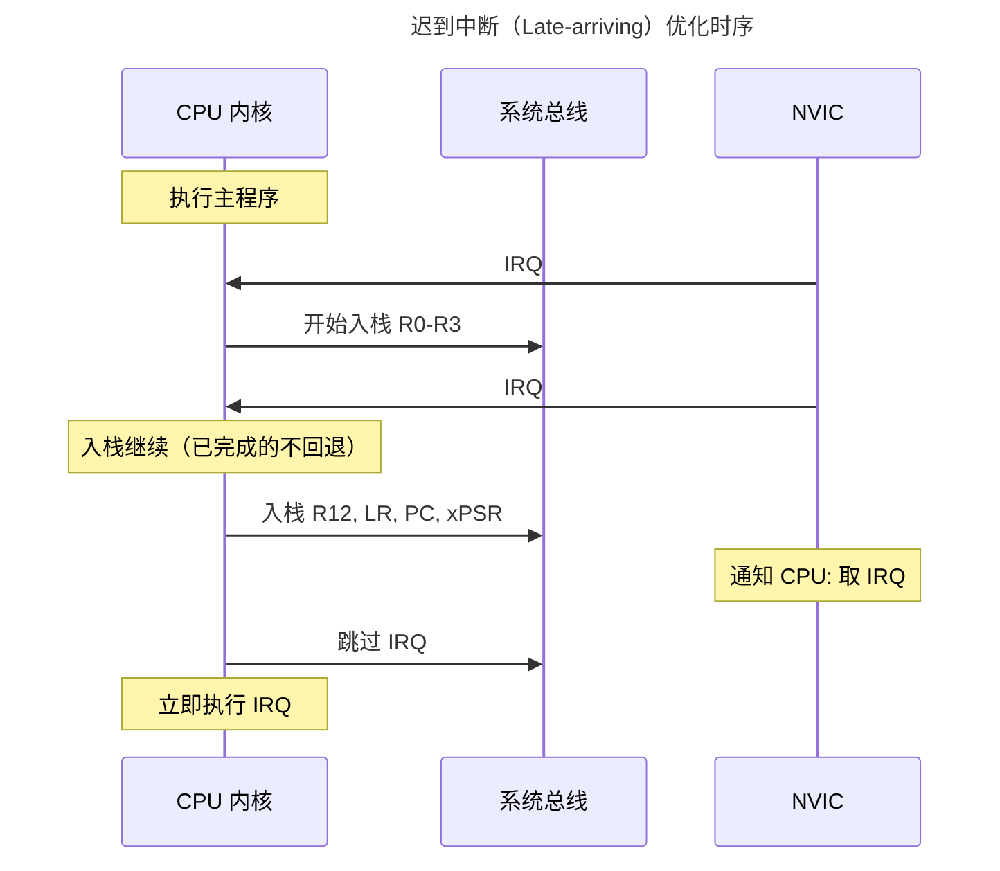
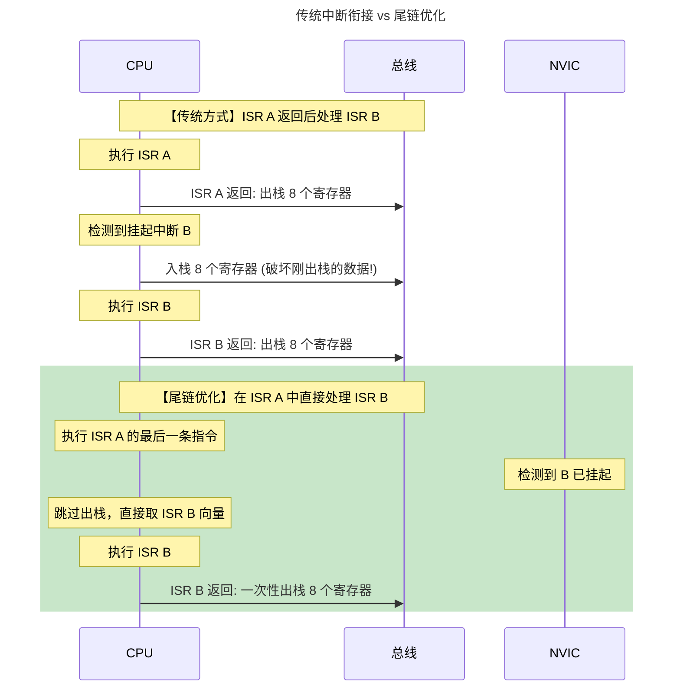
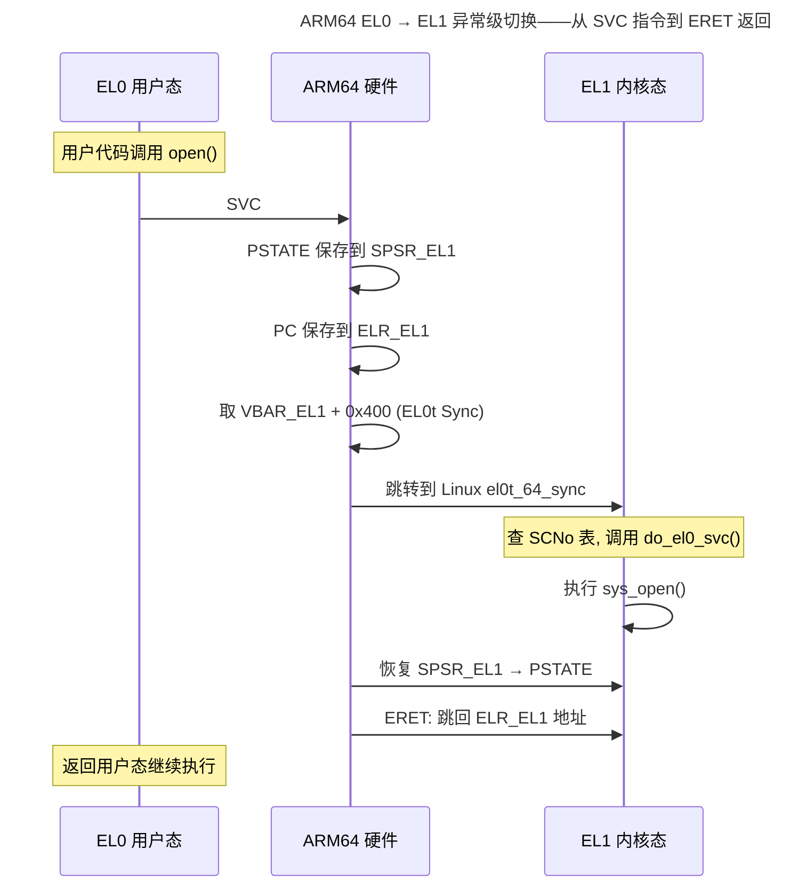
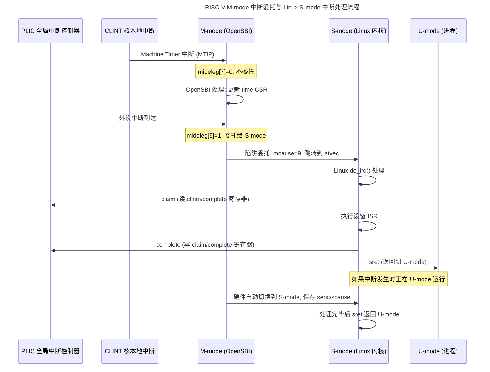

> 异步世界的有序响应。

裸机程序的主循环看似在独立运行，实则被一张无形的网笼罩——这张网的每个节点都是一个中断源：定时器到期的滴答、UART 接收寄存器的满标志、DMA 传输完成的脉冲、外部 GPIO 引脚的电平跳变。主循环的任何位置、任何时刻，都可能被打断，CPU 必须立即转去处理更紧急的事务，处理完毕后再若无其事地返回。

这就是**中断系统**——嵌入式领域的异步编程核心。它既是最强大的实时性工具，也是最棘手的 Bug 来源。本章将从硬件信号一路追踪到软件响应，剖析中断控制器、向量表、优先级嵌套与尾链优化，以及影响系统实时性的延迟链。

---

## 中断、异常与系统调用：三类非常规控制流

在深入硬件之前，必须廓清三个容易混淆的概念。

### 定义边界

| 类别 | 触发源 | 同步/异步 | 可屏蔽 | 典型示例 |
|------|--------|----------|--------|----------|
| **中断**（Interrupt） | 外部硬件设备 | 异步（与当前指令流无关） | 多数可以 | 定时器到期、UART 接收、GPIO 边沿 |
| **异常**（Exception） | CPU 内部执行指令时 | 同步（与当前指令强相关） | 不可屏蔽 | 除零、非法指令、缺页 |
| **系统调用**（System Call） | 软件主动触发 | 同步（程序主动请求） | 属于异常的一种 | `SVC #0`（ARM）、`ecall`（RISC-V） |



### 同步异常的生命周期

以 ARM Cortex-M 的除零异常（UsageFault）为例，看看硬件在异常触发时做了什么：

1. **检测**：ALU 在执行 `SDIV r0, r1, r2` 时发现 r2 = 0
2. **挂起**：UsageFault 标志位被硬件置位
3. **入栈**（Stacking）：硬件自动将 8 个寄存器（r0-r3, r12, LR, PC, xPSR）压入当前栈
4. **取向量**：从向量表偏移 `0x18` 处加载 UsageFault_Handler 地址到 PC
5. **更新 LR**：LR 被设为特殊值 `0xFFFF_FFF1`（表示异常返回时应恢复 MSP 并切换到 Handler 模式）

**整个过程由硬件自动完成，无需任何软件介入。** 这正是 Cortex-M 实现低中断延迟的核心设计理念。

:::note["异常"在 ARM 语境下的双重含义]
ARM 文档中 "Exception" 是一个广义术语，涵盖所有导致处理器离开主程序流的硬件事件——包括中断（IRQ）、故障（Fault）、系统调用（SVCall）和调试事件。狭义的"异常"（如 UsageFault、BusFault）特指由指令执行错误触发的同步事件。本章遵循 ARM 官方术语：**中断**指 IRQ（异步、可屏蔽），**异常**指 Fault/Syscall（同步或不可屏蔽）。
:::

---

## 中断控制器：硬件仲裁者

中断源的数量远多于 CPU 的中断输入引脚。一块典型的 Cortex-M4 微控制器可能有一百多个中断源——UART、SPI、I²C、Timer、DMA、ADC、USB、CAN——但 CPU 只有一个 IRQ 输入。**中断控制器**（Interrupt Controller）的作用是将这些信号汇聚、仲裁、然后按优先级逐一提交给 CPU。

### NVIC：贴身侍卫

ARM Cortex-M 系列内置的 NVIC（Nested Vectored Interrupt Controller）与处理器内核紧密耦合，主要特性：

- **多达 240 个可配置优先级的中断**（实现定义）
- **不可屏蔽中断**（NMI）：优先级固定为 -2，任何情况都能抢占
- **优先级分组**：将 8 位优先级寄存器分为组优先级（抢占）和子优先级（排队）
- **向量地址直接硬件生成**：无需软件读取状态寄存器来判断中断源
- **尾链**（Tail-chaining）和**迟到**（Late-arriving）优化

NVIC 的寄存器映射（以 ARMv7-M 为例）：

| 寄存器 | 地址偏移 | 功能 |
|--------|---------|------|
| `NVIC_ISER[0..7]` | `0xE000_E100` | 中断使能置位（写 1 有效） |
| `NVIC_ICER[0..7]` | `0xE000_E180` | 中断使能清除（写 1 有效） |
| `NVIC_ISPR[0..7]` | `0xE000_E200` | 中断挂起置位 |
| `NVIC_ICPR[0..7]` | `0xE000_E280` | 中断挂起清除 |
| `NVIC_IABR[0..7]` | `0xE000_E300` | 中断活跃位（只读） |
| `NVIC_IPR[0..59]` | `0xE000_E400` | 中断优先级（每 8 位一个中断） |



### GIC：多核世界的仲裁官

对于更复杂的多核系统（如 Cortex-A 系列），ARM 提供 GIC（Generic Interrupt Controller）。GICv3 的架构分为三层：

- **Distributor**：全局中断使能、优先级、目标 CPU 路由
- **Redistributor**：每核私有的 SGI（软件触发中断）和 PPI（私有外设中断）管理
- **CPU Interface**：每核与处理器核心的直接接口，包含中断确认和优先级屏蔽寄存器

GIC 的复杂度远高于 NVIC，特别是**中断亲和性**（Affinity Routing）——一个中断可以路由到特定核、一组核、或所有核。这是嵌入式系统与大型 SoC（如手机应用处理器）之间中断架构的关键分野。

:::tip[跨卷链接]
NVIC 和 GIC 的优先级仲裁使用硬件比较器，其设计基于[数字逻辑](../../01-weichen/02-digital-logic/#组合逻辑)中的比较器电路。GIC 的中断路由表本质上是一种**内容可寻址存储器**——与 [Cache 的组相联结构（组相联（Set-Associative））（组相联（Set-Associative））](../../01-weichen/04-memory-hierarchy/#组相联set-associative)在硬件实现上有相似之处。
:::

---

## 四大中断控制器对比：NVIC vs GIC vs PLIC vs APIC

前面的 NVIC 和 GIC 代表了 ARM 生态的两极——一个为嵌入式 MCU 贴身设计，一个为多核 SoC 路由分发。但裸机编程的视野不应止于 ARM。RISC-V 的 PLIC + CLINT 分层模型和 x86 的 APIC 体系，代表了截然不同的设计哲学。下表覆盖四套机制的裸机编程视角差异。

### 一表纵览

| 维度 | NVIC (ARM Cortex-M) | GIC (ARM Cortex-A) | PLIC + CLINT (RISC-V) | APIC (x86 现代) |
|------|---------------------|---------------------|----------------------|-----------------|
| **定位** | 单核 MCU，深度耦合内核 | 多核 SoC，解耦路由与内核 | 开放标准，平台级 + 核本地分层 | 多核 PC/服务器，每核一个本地 APIC |
| **中断源数量** | 最多 240（实现定义） | 最多 1020（SPI）+ 每核 16 PPI | PLIC：最多 1024 全局 + CLINT：每核软件/定时器 | 最多 256（I/O APIC 汇总后分发） |
| **优先级位宽** | 3-8 位（实现定义，典型 4 位 = 16 级） | 5-8 位（GICv3：8 位 = 256 级） | PLIC：3-8 位可配（典型 5 位 = 32 级） | LAPIC 任务优先级寄存器 + 向量优先级（隐式） |
| **向量机制** | 硬件直接取向量地址，免软件分发 | 中断确认时返回中断 ID，软件查表分发 | CLINT 直接向量；PLIC 返回中断 ID，软件分发 | IDT 向量号直接索引（256 条目，前 32 保留给异常） |
| **多核支持** | 无（单核） | 原生：中断路由到指定核、一组核或所有核 | PLIC 支持多核（每个 Hart 独立使能/阈值） | 原生：I/O APIC 广播/单播到 LAPIC，核间 IPI |
| **硬件入栈** | 自动（8 个寄存器） | 部分自动，需软件配合 | 无硬件自动入栈，全部由软件保存/恢复 | 自动压栈（SS/RSP/EFLAGS/CS/RIP + 可选错误码） |
| **尾链/迟到优化** | 支持 | GICv3 部分支持（软件端优化） | 无（中断 ID 需软件确认） | 无（EOI 机制抑制尾链优化） |
| **中断亲和性** | N/A（单核） | GICv3：`MPIDR` 精确路由到指定核 | PLIC：每个 Hart 有独立的中断使能位 | LAPIC ID + Destination Format Register |
| **裸机层访问方式** | 内存映射寄存器（`0xE000_E100` 起） | 内存映射（Distributor + CPU Interface） | 内存映射（PLIC + CLINT MMIO） | 内存映射（LAPIC 基地址，典型 `0xFEE0_0000`） |
| **典型裸机场景** | STM32 定时器 IRQ、UART RX 中断 | 树莓派 3/4 Timer IRQ、GIC-400 裸机编程 | HiFive 系列、ESP32-C3 外设中断 | 自制 OS 内核中断处理、BIOS 中断服务 |

### 设计哲学的分野

四套机制代表了四种截然不同的设计哲学：

**NVIC — 简约即速度**：NVIC 放弃了多核、放弃了复杂路由，将全部硅片面积押注在"单核响应速度"上。硬件入栈、尾链、迟到中断优化——每一个设计决策都在压缩中断延迟。它的哲学是：**如果你只需要一个核，就把这个核的响应速度做到极致**。

**GIC — 为多核而生的路由网络**：GIC 的复杂度不在响应速度，而在分发决策。当一个中断到来时，GIC 需要回答：哪个核最空闲？哪个核的优先级屏蔽最低？这个中断应该路由到一个核还是广播到所有核？它的哲学是：**多核世界的中断，本质上是消息路由问题**。

**PLIC + CLINT — 开放的乐高积木**：RISC-V 有意将中断控制器拆为两层——CLINT 负责每核本地的软件中断和定时器中断，PLIC 负责全局外设中断。这种分层让 SoC 设计者可以只选配需要的部分。它的哲学是：**不预设复杂度，让平台设计者自己组合**。

**APIC — 二十年兼容性的重量级遗产**：x86 的中断体系是层层叠加的历史结果——8259 PIC 的双片级联、I/O APIC、本地 APIC、x2APIC。每个阶段都保留了对前一阶段的兼容。它的哲学是：**向后兼容的代价由硬件复杂度承担**。

:::tip[跨卷链接]
中断控制器的选择直接影响操作系统的[中断处理架构](../../03-qiankun/01-process-and-thread/)。Linux 内核为不同中断控制器提供了统一的 irqchip 抽象层：NVIC 对应 `irq-nvic`，GIC 对应 `irq-gic-v3`，PLIC 对应 `irq-plic`，APIC 对应 `ioapic` + `lapic`。理解硬件差异是理解内核 irqchip 驱动的前提。
:::

---

## 向量表与 ISR 入口：从硬件到软件的一跃

向量表在[上一章](../01-bare-metal/#异常向量表中断时代的序幕)中已有介绍。这里聚焦于中断发生时，硬件到软件过渡的精确时序。

### 入栈帧的解剖

Cortex-M 在进入异常时，硬件自动将以下寄存器推入栈中：

```
高地址  ┌────────────┐
       │   xPSR     │ ← 程序状态寄存器（含异常号）
       ├────────────┤
       │   PC       │ ← 返回地址（被打断的指令）
       ├────────────┤
       │   LR       │ ← 链接寄存器（原值）
       ├────────────┤
       │   R12      │
       ├────────────┤
       │   R3       │
       ├────────────┤
       │   R2       │
       ├────────────┤
       │   R1       │
低地址  └────────────┘
       │   R0       │
       └────────────┘ ← SP (异常进入后)
```

**LR 的特殊编码**在异常进入时被硬件修改，用于标识返回时的状态：

| LR 值 | 含义 |
|-------|------|
| `0xFFFF_FFF1` | 返回到 Handler 模式，使用 MSP |
| `0xFFFF_FFF9` | 返回到 Thread 模式，使用 MSP |
| `0xFFFF_FFFD` | 返回到 Thread 模式，使用 PSP（带 OS 时） |

执行 `BX LR` 时，硬件检测到 EXC_RETURN 值，自动触发出栈并恢复原模式。这就是为什么 ISR 可以像普通函数一样用 `BX LR` 返回——LR 已被硬件替换为"魔法值"。

### 迟到中断优化

如果高优先级中断在低优先级中断的**入栈阶段**到达，NVIC 支持"迟到"（Late-arriving）优化：



关键优势：**高优先级中断不需要等待低优先级中断的 ISR 执行**——它直接在入栈完成后取走了自己的向量。这比先执行低优先级 ISR、再被抢占的传统嵌套模型节省了数十个时钟周期。

---

## 中断嵌套与优先级：谁先来谁后到

### 优先级分组：组优先级 vs 子优先级

NVIC 提供 8 位优先级配置（实现定义的位数，典型为 4 位 = 16 级）。通过 `AIRCR.PRIGROUP` 将这 8 位划分为**组优先级**（抢占优先级）和**子优先级**（亚组优先级）：

| PRIGROUP | 组优先级位 | 子优先级位 | 抢占级数 | 亚组级数 |
|----------|-----------|-----------|---------|---------|
| 0 | [7:1] (7 bits) | [0] (1 bit) | 128 | 2 |
| 4 | [7:4] (4 bits) | [3:0] (4 bits) | 16 | 16 |
| 7 | [7] (1 bit) | [6:0] (7 bits) | 2 | 128 |

抢占规则：
1. **组优先级更高（数字更小）的中断可以抢占正在执行的 ISR**
2. **组优先级相同的中断按子优先级排队，但不会相互抢占**
3. **硬件自动处理嵌套的入栈/出栈**

### 嵌套场景的栈帧链

考虑以下场景：CPU 正在执行主程序，IRQ #10（优先级 0x80）到达。在其 ISR 执行期间，更高优先级的 IRQ #5（优先级 0x40）到达。

```
主程序栈:
  SP → [主程序栈帧]

IRQ #10 到达（优先级 0x80）:
  硬件入栈 → SP 下移 8 个字
  SP → [主程序栈帧] [IRQ #10 的入栈帧 ... ]
  执行 IRQ #10 ISR ...

IRQ #5 到达（优先级 0x40 > 0x80）:
  硬件再次入栈 → SP 再次下移 8 个字
  SP → [主程序栈帧] [IRQ #10 帧] [IRQ #5 的入栈帧 ... ]
  执行 IRQ #5 ISR ...

IRQ #5 返回 (BX LR → 0xFFFF_FFF1):
  硬件出栈 8 个字
  SP → [主程序栈帧] [IRQ #10 帧]
  继续执行 IRQ #10 ISR ...

IRQ #10 返回:
  硬件出栈 8 个字
  SP → [主程序栈帧]
  继续执行主程序
```

:::danger[栈溢出的多米诺骨牌]
每层中断嵌套消耗 8 × 4 = 32 字节栈空间。在极端场景下——例如高频率定时器中断嵌套在低优先级通信 ISR 之上，再加上主程序本身的调用深度——栈溢出几乎不可避免。Cortex-M 的 HardFault 仅能检测栈顶被写穿后触发的 MPU 违例，在此之前栈已向堆区蔓延并破坏数据。**裸机程序中栈大小需要手动估算**——计算最大调用深度 + 最大嵌套层数 + 安全余量，然后通过链接脚本显式分配。
:::

---

## 尾链：Cortex-M 的零开销中断衔接

当 CPU 正在执行一个 ISR，同时另一个中断正在挂起时，传统做法是 ISR 返回后进行标准的入栈-取向量-执行序列。NVIC 的**尾链**（Tail-chaining）优化完全跳过了不必要的入栈和出栈步骤。



尾链将两个连续中断的衔接开销从 $2 \times (12 + 12) = 48$ 个时钟周期降低到**仅 6 个时钟周期**。这是 Cortex-M 实时性能的关键支柱之一。

:::note[尾链与迟到中断的区别]
- **尾链**：ISR A 正在执行，B 挂起但**不抢占**（优先级低于或等于 A），A 返回后 B 免入栈直接执行
- **迟到中断**：A 的入栈正在执行，B（更高优先级）到达，NVIC 在入栈完成后直接取 B 的向量而非 A
:::

---

## 中断延迟分析：从信号到达 ISR 第一行代码

中断延迟（Interrupt Latency）是实时系统的核心性能指标。它定义为从外设中断信号置位到 ISR 第一条指令开始执行的时间间隔。

### 延迟构成

ARM Cortex-M 的典型中断延迟为 **12 个时钟周期**（零等待状态内存），但这只是最理想场景。实际延迟由以下部分构成：

$$
t_{latency} = t_{sync} + t_{stacking} + t_{vector\_fetch} + t_{bus\_wait}
$$

| 分量 | 含义 | 典型值 | 变化因素 |
|------|------|--------|---------|
| $t_{sync}$ | 中断信号同步到 CPU 时钟域 | 1-2 周期 | 时钟域差异 |
| $t_{stacking}$ | 硬件入栈 8 个寄存器 | 8-12 周期 | 内存等待状态 |
| $t_{vector\_fetch}$ | 从向量表取 ISR 地址 | 1-3 周期 | Flash 等待状态、Cache 命中 |
| $t_{bus\_wait}$ | 总线被占用造成的等待 | 不定 | DMA 传输、其他总线主控 |

### 中断屏蔽的隐形延迟

最隐蔽的延迟来源是**临界区**——主程序或低优先级 ISR 关闭了全局中断（`cpsid i` 或 `__disable_irq()`）：

```c
__disable_irq();  // 进入临界区
// 假设这段代码执行了 5μs
volatile uint32_t *p = shared_buffer;
*p = new_value;
__enable_irq();   // 退出临界区

// 在这 5μs 内，所有中断都被延迟——包括 100ns 级别的定时器
```

**最坏情况中断延迟**（Worst-Case Interrupt Latency）等于最长临界区持续时间 + 同优先级/更高优先级 ISR 的最长执行时间 + 硬件入栈时间。实时系统设计的关键约束，就是控制这个最坏情况不超过系统要求。

### 测量中断延迟的实用方法

可靠的延迟测量不能依赖打印日志（`printf` 本身就可能关闭中断），需要硬件时间戳：

```c
// 方法一: DWT 周期计数器（Cortex-M3/M4/M7）
volatile uint32_t latency;
void TIM2_IRQHandler(void) {
    latency = DWT->CYCCNT - captured_cycle;  // 记录延迟
    TIM2->SR &= ~TIM_SR_UIF;                  // 清除中断标志
}

// 在触发中断之前：
captured_cycle = DWT->CYCCNT;  // 采样当前周期计数
TIM2->EGR |= TIM_EGR_UG;       // 软件触发定时器中断
```

```c
// 方法二: GPIO 翻转 + 逻辑分析仪
// 在 GPIO 引脚上输出触发信号和 ISR 入口信号
void TIM2_IRQHandler(void) {
    GPIOA->BSRR = GPIO_BSRR_BS5;  // PA5 置高（ISR 入口）
    // ... ISR 主体 ...
    GPIOA->BSRR = GPIO_BSRR_BR5;  // PA5 置低（ISR 出口）
}
```

用逻辑分析仪测量触发信号边沿到 PA5 上升沿的时间差——这是最精确的中断延迟测量方案。

:::tip[跨卷链接]
中断延迟分析向上延伸为操作系统的[实时调度理论](../../03-qiankun/01-process-and-thread/)。Linux 的 `PREEMPT_RT` 补丁本质上就是将内核中的长临界区拆分为可抢占片段，以控制最坏情况调度延迟——这与裸机中断延迟分析是完全同构的问题。而 DWT 周期计数器的底层实现，则与[处理器流水线（流水线处理器：将时间维度展开为空间）（流水线处理器：将时间维度展开为空间）](../../01-weichen/03-microarchitecture/#流水线处理器将时间维度展开为空间)的硬件性能计数器（Performance Monitor Unit）共享相同的微架构基础设施。
:::

---

## 实践：编写健壮的 ISR

裸机 ISR 的正确编写方式与普通函数截然不同。以下是核心原则。

### 原则一：ISR 必须短

ISR 的每一微秒执行时间，都是对同优先级和更低优先级中断的延迟惩罚。一般规则：

| 中断类型 | 推荐最大执行时间 | 策略 |
|----------|-----------------|------|
| 定时器滴答 | < 1 μs | 仅更新计数器，复杂任务放主循环 |
| UART 接收 | < 10 μs | 取自接收寄存器，放入环形缓冲区 |
| DMA 完成 | < 5 μs | 更新缓冲区指针，启动下一传输 |
| 按钮消抖 | < 100 μs | 记录时间戳，消抖计算放主循环 |

### 原则二：volatile 的两面性

所有在 ISR 和主程序之间共享的变量必须声明为 `volatile`，但这还不够：

```c
volatile uint32_t g_tick_count;

// ISR 中: 安全
void SysTick_Handler(void) {
    g_tick_count++;  // 单周期 load-modify-store，原子？
}

// 看起来原子，但在 Cortex-M0/M0+ 上:
// LDR r0, [g_tick_count]  // 4 字节加载
// ADDS r0, #1
// STR r0, [g_tick_count]  // 4 字节存储
// 如果 ISR 在 LDR 和 STR 之间抢占主程序——
// 主程序的旧值盖写了 ISR 的新值！
```

对于非原子的读-改-写操作，必须在访问时关闭中断：

```c
__disable_irq();
g_tick_count++;     // 临界区保护
__enable_irq();
```

或使用 `ldrex/strex` 独占访问指令（Cortex-M3+）。

### 原则三：避免函数调用深度

ISR 中的每次函数调用都会压栈 LR。嵌套调用会迅速消耗栈空间。将 ISR 逻辑划分为：
- **上半部**（ISR 本体）：做最少工作——读状态、清标志、拷贝数据到缓冲区、置标志位
- **下半部**（主循环处理）：做复杂计算、协议解析、写 Flash

```c
// ISR —— 上半部（< 5 μs）
void UART_RX_IRQHandler(void) {
    if (UART->SR & UART_SR_RXNE) {
        rx_buf[rx_head] = UART->DR;               // 取走数据
        rx_head = (rx_head + 1) % BUF_SIZE;
        UART->SR &= ~UART_SR_RXNE;                 // 清标志
        new_data_ready = true;                     // 通知主循环
    }
}

// 主循环 —— 下半部
void process_uart_data(void) {
    if (new_data_ready) {
        parse_protocol(rx_buf);  // 可以慢，不会阻塞中断
        new_data_ready = false;
    }
}
```

:::danger[ISR 中的阻塞操作]
以下操作在 ISR 中是**绝对禁止**的：
- 等待外设标志位的忙循环（`while (!(UART->SR & UART_SR_TXE));`）
- `printf` 或任何依赖中断的日志输出（可能死锁）
- 调用 RTOS 的阻塞 API（如 `xSemaphoreTake(sem, portMAX_DELAY)`）
- Flash 擦除/写入（暂停所有指令取指）
- 浮点运算（如果没有使能 FPU 上下文自动保存，会破坏主程序的浮点寄存器）
:::

---

## ARM64 异常级与 RISC-V 特权模式：从 MCU 到 SoC 的关键一跃

前面 NVIC/GIC/PLIC/APIC 的对比覆盖了**中断控制器**的差异，但"中断触发后 CPU 跳到哪个特权级、哪个向量、如何返回"——这些问题由 CPU 的**异常级架构**决定。ARM64 的 Exception Level 和 RISC-V 的 Privilege Mode 是两种截然不同的设计。

### ARM64 异常级：EL0 与 EL1 的切换

ARM64 定义了四个异常级（Exception Level），数字越大权限越高：

| 异常级 | 简称 | 典型用途 |
|--------|------|---------|
| **EL0** | 用户态 | 应用程序、普通进程 |
| **EL1** | 内核态 | Linux 内核、设备驱动 |
| **EL2** | 虚拟化管理器 | Hypervisor（KVM/Xen） |
| **EL3** | 安全监控器 | Secure Monitor（ARM TrustZone） |

每次异常级切换，硬件自动完成一对操作——**保存上下文**到 EL1 专用寄存器，然后**跳转**到向量表。



关键寄存器：

- **VBAR_EL1**：向量基址寄存器，指向异常向量表（4 组 × 4 条目 = 16 条目，每组对应 EL0/EL1 不同栈指针组合）
- **SPSR_EL1**：保存进入异常前的 PSTATE（条件标志、异常屏蔽位、当前 EL）
- **ELR_EL1**：保存异常返回地址（对应 Cortex-M 的 LR 特殊编码）
- **ESR_EL1**：异常综合寄存器，记录异常类别（EC）、具体原因（ISS）

ARM64 的向量表**按异常来源类型细分**——同步异常（SVC/数据中止/未定义指令）、IRQ、FIQ、SError——四条独立向量入口。这比 NVIC 的"取向量地址→跳转"更复杂，但允许多核场景下不同核注册不同处理函数。

:::tip[跨卷链接]
ARM64 异常级的 `SPSR → PSTATE` 保存/恢复机制，与 [进程上下文切换中的寄存器保存（上下文切换：昂贵的角色转换）（上下文切换：昂贵的角色转换）](../../03-qiankun/01-process-and-thread/#上下文切换昂贵的角色转换) 是同构操作——差异在于前者是**硬件自动完成**（数十纳秒），后者是**软件遍历 `task_struct->thread`**（微秒级）。这也是 [裸机编程](../01-bare-metal/) 中 ARMv8-A 与 Cortex-M 的最大差异——裸机 AArch64 程序需要自己初始化 VBAR_EL1 和 SP_EL1，相当于手工搭建操作系统的异常地基。
:::

### RISC-V M-mode 中断委托机制

RISC-V 定义了三种主要特权模式（从高到低）：

| 模式 | 缩写 | 典型用途 | 类比 ARM64 |
|------|------|---------|-----------|
| **Machine** | M-mode | 固件（OpenSBI）、最底层陷阱处理 | EL3 |
| **Supervisor** | S-mode | 操作系统内核（Linux） | EL1 |
| **User** | U-mode | 用户进程 | EL0 |

RISC-V 的精妙之处在于**中断/异常委托**（Delegation）机制——M-mode 固件可以通过写入 `medeleg`/`mideleg` CSR 将某些异常/中断"下放"给 S-mode 处理。Linux 启动时 OpenSBI 将绝大部分异常委托给 S-mode，自身仅保留 Machine Timer 等少数中断。

核心 CSR 寄存器体系：

| 寄存器 | 级别 | 功能 |
|--------|------|------|
| `mstatus.MIE` | M-mode | 全局机器模式中断使能（进入异常时自动保存到 MPIE） |
| `mie` / `mip` | M-mode | M-mode 中断使能位 / 中断挂起位（MTIP/MSIP/MEIP） |
| `mcause` | M-mode | 异常原因寄存器（Interrupt=1 时最高位置位，Exception Code 标识来源） |
| `mtvec` | M-mode | 陷阱向量基址（支持 BASE + 4 × cause 的直接模式或单一入口的向量模式） |
| `stvec` | S-mode | 监管模式陷阱向量基址（Linux 设置 `stvec` 而非 `mtvec`——因为异常已委托） |
| `medeleg` / `mideleg` | M-mode | 异常委托 / 中断委托寄存器（某位置 1 = 该异常委托给 S-mode） |

Mermaid 对比 ARM64 GIC 中断流向和 RISC-V PLIC + CLINT 中断流向：



#### M-mode vs S-mode 中断关键差异

| 特性 | M-mode 中断 | S-mode 中断 |
|------|-----------|-----------|
| 向量基址寄存器 | `mtvec` | `stvec` |
| 返回指令 | `mret` | `sret` |
| 异常 PC 保存 | `mepc` | `sepc` |
| 中断使能 | `mstatus.MIE` | `sstatus.SIE` |
| 典型使用者 | OpenSBI / 裸机固件 | Linux 内核 |
| 是否可以委托 | N/A（最高级） | 可进一步委托给 U-mode（不常见） |

:::note[为什么 RISC-V 需要 M-mode？]
ARM64 的 Secure Monitor（EL3）和 Hypervisor（EL2）是**可选**的——单内核系统可以只有 EL0/EL1。但 RISC-V 的 M-mode 是**强制存在**的最高特权级——每个 RISC-V Hart 至少需要 M-mode 来初始化 CSR、设置 `medeleg`、然后跳转到 S-mode。这就好比在一栋楼里 ARM64 说"地下室可以不要，一到三楼够用了"，而 RISC-V 说"每栋楼必须有一个地下室，哪怕只放总电闸"。这一约束简化了固件生态——OpenSBI 只需关注 M-mode，所有 RISC-V Linux 的 M-mode 层完全一致。
:::

---

## 跨卷连接

中断系统是嵌入式领域的"脊椎"，向下延伸至硬件的每一个晶体管，向上支撑操作系统的全部调度逻辑：

| 本章概念 | 依赖的底层原理 | 支撑的上层抽象 |
|----------|---------------|---------------|
| 中断信号同步 | [亚稳态与时钟域交叉（时钟域交叉）（时钟域交叉）](../../01-weichen/02-digital-logic/#时钟域交叉) | 分布式系统的时间同步 |
| NVIC 优先级比较器 | [数字比较器电路](../../01-weichen/02-digital-logic/#组合逻辑) | [实时调度类：SCHED_FIFO / SCHED_RR（实时调度类：SCHED_FIFO / SCHED_RR / SCHED_DEADLINE）](../../03-qiankun/01-process-and-thread/#实时调度类sched_fifo--sched_rr--sched_deadline) |
| 向量表硬件取指 | [Cache 组织形式与命中率](../../01-weichen/04-memory-hierarchy/#cache-组织形式容量速度与复杂度的三角博弈) | [缺页中断处理（缺页中断处理：do_page_fault 的决策树）（缺页中断处理：do_page_fault 的决策树）](../../03-qiankun/02-memory-management/#缺页中断处理do_page_fault-的决策树) |
| 尾链优化 | [流水线冒险与停顿](../../01-weichen/03-microarchitecture/#流水线冒险打破时空的魔咒) | [上下文切换优化：惰性 FPU 与 PCID](../../03-qiankun/01-process-and-thread/#上下文切换优化惰性-fpu-与-pcid) |
| 中断延迟测量 | [硬件性能计数器：DWT 与 PMU（硬件性能计数器：DWT、PMU 与 perf）（硬件性能计数器：DWT、PMU 与 perf）](../../01-weichen/03-microarchitecture/#硬件性能计数器dwtpmu-与-perf) | 操作系统性能剖析工具（perf） |
| 上半部/下半部模式 | [裸机中断的上下半部设计](../../02-jiezi/01-bare-metal/#裸机中断的上下半部设计) | [中断下半部：tasklet、workqueue 与 threaded IRQ](../../03-qiankun/01-process-and-thread/#中断下半部taskletworkqueue-与-threaded-irq) |
| ARM64 异常级 EL0↔EL1 切换 | [ARM64 寄存器与 PSTATE](../../01-weichen/05-instruction-set-architecture/#armv8v9-的-isa-亮点) | [系统调用入口：EL0 → EL1 硬件路径（系统调用入口：从 EL0 到 EL1 的硬件路径）（系统调用入口：从 EL0 到 EL1 的硬件路径）](../../03-qiankun/01-process-and-thread/#系统调用入口从-el0-到-el1-的硬件路径) |
| RISC-V M-mode 中断委托 | [RISC-V 特权级与 CSR](../../01-weichen/05-instruction-set-architecture/#特权级与标准扩展) | [RISC-V 特权级启动链：OpenSBI → S-mode（RISC-V 特权级启动链：OpenSBI 到 S-mode）（RISC-V 特权级启动链：OpenSBI 到 S-mode）](../../03-qiankun/01-process-and-thread/#risc-v-特权级启动链opensbi-到-s-mode) |

:::tip[卷二内部路径]
- [**裸机编程**](../01-bare-metal/)：向量表的初始化与放置
- [**RTOS 基础**](../03-rtos-fundamentals/)：从中断到任务唤醒的调度链
- [**外设驱动**](../04-peripheral-drivers/)：UART/SPI/Timer 中断的实际应用
- [**低功耗设计**](../05-low-power-design/)：WFI/WFE 指令与中断唤醒
:::
