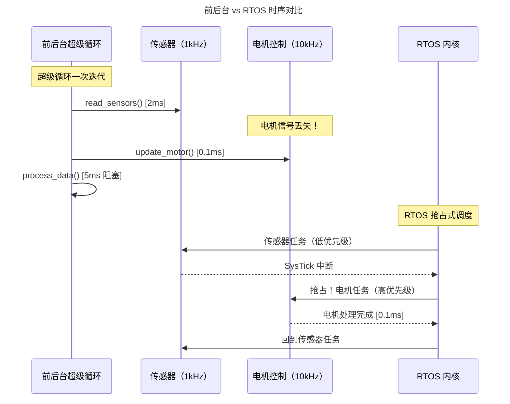
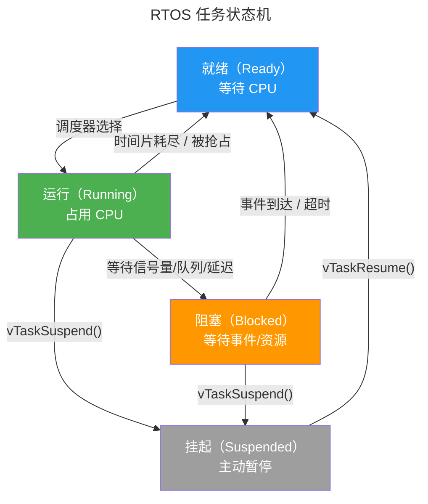
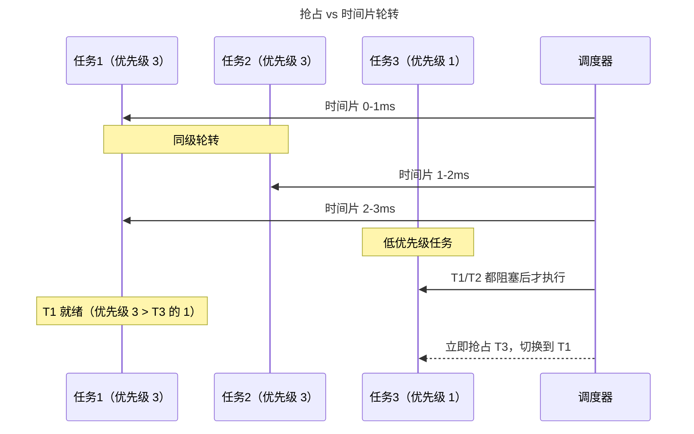
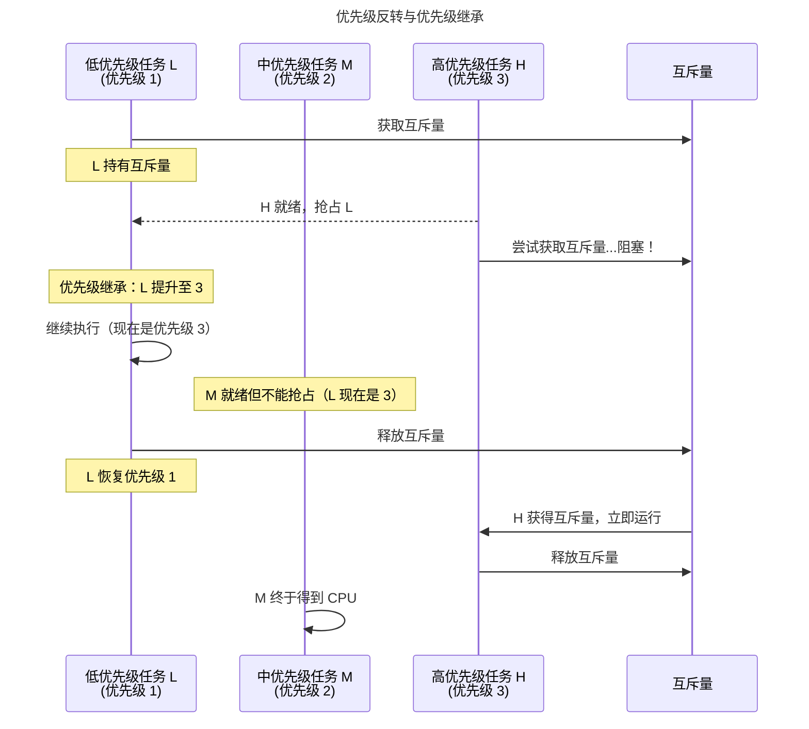
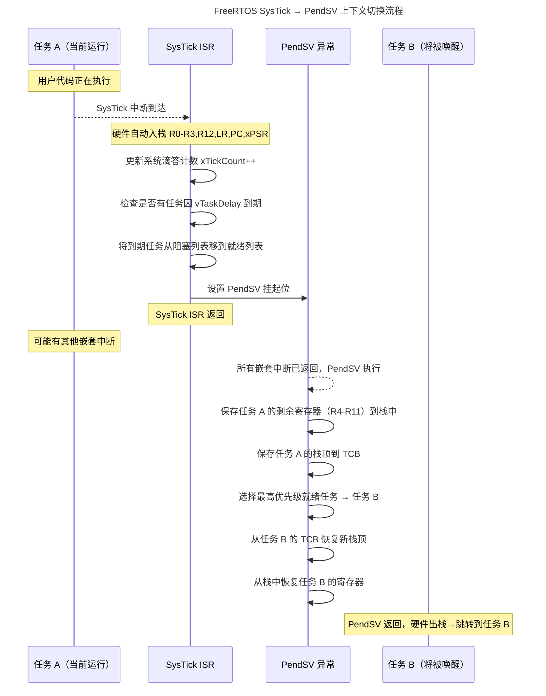

> 实时不是"快"，是"准时"。

裸机编程的世界里，我们用一个超级循环统治一切：读传感器、处理数据、写执行器，然后回到循环起点。这套前后台系统简单可靠，但当系统需要同时处理三个不同频率的传感器、一个每分钟校准一次的 RTC、以及一个 10kHz 的电机控制 PWM 时，超级循环的脆弱性暴露无遗——任何一处阻塞，整个系统停摆。

**实时操作系统**（RTOS，Real-Time Operating System）在裸机之上引入了一个新的抽象层：**任务**。每个任务独立运行、独立调度，由内核保证最高优先级的就绪任务始终占用 CPU。它不是让程序跑得更快，而是让系统**在最坏情况下仍然准时响应**。本章从超级循环的局限出发，逐步构建 RTOS 的核心大厦：任务模型、调度器、同步原语、消息传递、内存管理，最后以 FreeRTOS 的源码剖析收尾。

---

## 前后台系统 vs RTOS：准时性的分野

### 超级循环的三大死穴

前后台系统（Foreground/Background System）的结构极其简单：

```c
int main(void) {
    SystemInit();
    while (1) {
        read_sensors();    // 可能阻塞在 I²C 等待
        process_data();    // 可能因浮点运算耗时
        update_actuator(); // 可能因 DMA 未完成自旋
    }
}
```

这套架构在简单场景下工作良好，但存在三个致命缺陷：

1. **最差情况执行时间无法保证**：如果 `process_data()` 偶然触发了长浮点运算，整个循环周期被拉长，10kHz 电机控制信号丢失。前后台系统的响应时间取决于**循环内最长的代码路径**。

2. **优先级无法表达**：所有任务共享同一个循环，紧急的刹车信号和无关紧要的 LED 闪烁必须排队。代码结构上无法让高优先级任务"插队"。

3. **阻塞操作瘫痪整个系统**：`read_sensors()` 中一个 I²C 外设未就绪的自旋等待，会冻结包括紧急停止在内的所有功能。

### RTOS 的核心承诺

RTOS 通过**抢占式多任务**解决了这三个问题。下图对比了相同场景下前后台与 RTOS 的时序差异：



:::note[前后台 vs RTOS 的量化边界]
通常的经验法则是：当系统需要同时处理 3 个以上不同频率的周期性任务，或任何任务有硬实时截止期（hard deadline）时，就应该考虑 RTOS。前后台系统的响应时间抖动（jitter）随循环长度线性增长，而 RTOS 的中断延迟抖动与循环长度无关——只取决于内核临界区的最长屏蔽时间。
:::

---

## 任务模型：内核的最小调度单元

### 任务控制块（TCB）

在 RTOS 中，每个任务由一个**任务控制块**（TCB, Task Control Block）描述。TCB 是 PCB（[进程控制块](../../03-qiankun/01-process-and-thread/)）的嵌入式简化版——没有页表指针（因为 MCU 通常无 MMU），没有文件描述符表（因为没有文件系统），只保留调度器运作所需的**最小信息集**：

| 字段 | 类型 | 用途 |
|------|------|------|
| `pxTopOfStack` | `StackType_t *` | 任务栈顶指针（上下文切换的锚点） |
| `uxPriority` | `UBaseType_t` | 任务优先级（数值越大优先级越高） |
| `xStateListItem` | `ListItem_t` | 状态链表节点（嵌入就绪/阻塞/挂起列表） |
| `xEventListItem` | `ListItem_t` | 事件链表节点（嵌入信号量/队列等待列表） |
| `uxTCBNumber` | `UBaseType_t` | 任务编号（调试用） |
| `pcTaskName` | `char[]` | 任务名称（最多 `configMAX_TASK_NAME_LEN` 字符） |

TCB 的精妙之处在于 `xStateListItem` 和 `xEventListItem` 的**双链表嵌入**设计：同一个 TCB 既可以挂在就绪列表（等待 CPU），也可以同时挂在信号量的等待列表（等待资源）。当信号量被释放时，内核从事件列表中取出 TCB，检查其优先级——如果高于当前运行任务，立即触发抢占。

### 任务状态机

RTOS 任务在四种状态之间切换，状态转移由调度器和同步原语共同驱动：



关键设计决策：

- **运行态是单态**：同一时刻只有一个任务处于 Running。这是单核 MCU 的物理限制——多核 RTOS（如 ESP32-S3 双核 FreeRTOS）每个核各有自己的 Running 任务。
- **阻塞态由内核管理**：任务不能自行从 Blocked 切换到 Ready——必须由中断、超时或其他任务释放资源后由内核完成转移。
- **挂起态是"隐身"模式**：挂起的任务对调度器不可见，不消耗任何 CPU 时间，也不会被唤醒——直到显式调用 `vTaskResume()`。

:::tip[跨卷链接]
任务状态机的实现依赖于 [ARM Cortex-M 的 NVIC 与 PendSV](../../01-weichen/05-instruction-set-architecture/#arm-设计哲学能效为先的帝国) 异常机制。PendSV 是 Cortex-M 为操作系统量身定制的异常——可挂起、可屏蔽、优先级可配置为最低，使上下文切换在所有硬件中断处理完毕后才执行。
:::

---

## 调度器：优先级抢占与时间片

### 抢占式优先级调度

RTOS 调度器的核心算法极为简单，但正是这种简单性保证了实时系统的可分析性：

**始终选择优先级最高的就绪任务运行。**

这个算法有三个关键推论：

1. **运行的任务一定是当前最高优先级的就绪任务**（否则调度器会立即切换）。
2. **只要高优先级任务就绪，低优先级任务不会得到任何 CPU 时间**（饥饿是设计意图，不是 Bug——这正是"实时"的含义）。
3. **低优先级任务可能永远得不到执行**——程序员必须确保高优先级任务会定期阻塞（等待信号量或调用 `vTaskDelay()`）。

### 时间片轮转：同级任务的公平性

当多个**相同优先级**的任务就绪时，抢占式调度不再区分先后。此时 RTOS 启用**时间片轮转**（Round-Robin Scheduling）：每个任务运行一个时间片（通常 1ms，由 `configTICK_RATE_HZ` 决定），然后切换到同级链表上的下一个任务。



### 可调度性分析：Rate Monotonic 的数学保证

RTOS 的调度不是"尽力而为"——它可以用数学证明系统的可调度性。对于周期性任务集，**Rate Monotonic Scheduling**（RMS）给出了充分条件：

$$
U = \sum_{i=1}^{n} \frac{C_i}{T_i} \leq n \cdot (2^{1/n} - 1)
$$

其中 $C_i$ 是任务 $i$ 的最差执行时间，$T_i$ 是其周期。当 $n$（任务数）增大时，利用率上限趋近于 $\ln 2 \approx 0.693$：

$$
\lim_{n \to \infty} n \cdot (2^{1/n} - 1) = \ln 2 \approx 69.3\%
$$

这意味着：如果所有任务的 CPU 利用率之和不超过 69.3%，RMS 保证所有截止期都能满足。这是实时系统理论的**基石定理**，由 Liu 和 Layland 在 1973 年证明。

:::caution[RMS 的假设条件]
RMS 的充分条件建立在以下假设之上：所有任务独立、周期固定、截止期等于周期、最差执行时间恒定、上下文切换开销为零。实际系统中，应预留 10-20% 的 CPU 余量应对中断开销和测量误差。
:::

---

## 信号量与互斥量：同步的两种哲学

### 信号量：从 ISR 到任务的桥梁

信号量是 RTOS 中最基础的同步原语，常见三种形态：

| 类型 | 计数值范围 | 典型场景 |
|------|-----------|----------|
| **二值信号量** | 0 或 1 | ISR 通知任务"数据已就绪" |
| **计数信号量** | 0 ~ N | 管理有限资源池（如 4 个 DMA 通道） |
| **互斥量**（Mutex） | 0 或 1（带所有权） | 保护共享资源，支持优先级继承 |

二值信号量的经典模式——**ISR 到任务的延迟中断处理**：

```c
/* 全局二值信号量 */
SemaphoreHandle_t xDataReady = NULL;

/* UART 接收中断 */
void UART_RX_ISR(void) {
    BaseType_t xHigherPriorityTaskWoken = pdFALSE;
    /* 从 UART 数据寄存器读取字节存入缓冲区 */
    rx_buffer[rx_index++] = UART->DR;
    /* 通知任务数据已就绪 */
    xSemaphoreGiveFromISR(xDataReady, &xHigherPriorityTaskWoken);
    /* 如果唤醒了更高优先级任务，触发上下文切换 */
    portYIELD_FROM_ISR(xHigherPriorityTaskWoken);
}

/* 数据处理任务 */
void vDataProcessorTask(void *pvParameters) {
    for (;;) {
        /* 阻塞等待数据就绪——不消耗 CPU */
        if (xSemaphoreTake(xDataReady, portMAX_DELAY) == pdTRUE) {
            process_packet(rx_buffer);
        }
    }
}
```

`portYIELD_FROM_ISR(xHigherPriorityTaskWoken)` 是这段代码的精华：它不在 ISR 内部强制切换（那会破坏中断嵌套），而是将切换请求推迟到所有嵌套中断返回之后，由 [PendSV 异常](../../01-weichen/05-instruction-set-architecture/#arm-设计哲学能效为先的帝国) 执行实际切换。

### 互斥量与优先级继承

互斥量与二值信号量的关键区别在于**所有权**：只有获取互斥量的任务才能释放它。这直接关联到实时系统中最臭名昭著的问题——**优先级反转**。

经典场景：高优先级任务 H 等待低优先级任务 L 释放互斥量，但中优先级任务 M 抢占了 L——结果 H 被 M 间接阻塞，违反优先级顺序。

**优先级继承协议**（Priority Inheritance Protocol）的解决方案：当 H 因互斥量阻塞在 L 上时，内核**临时将 L 的优先级提升到 H 的级别**，防止 M 抢占 L。一旦 L 释放互斥量，优先级恢复原值。



:::tip[跨卷链接]
优先级继承协议的理论基础是卷三[同步原语](../../03-qiankun/04-synchronization/)中死锁避免与优先级反转的完整分析。信号量的底层实现依赖于 [RISC-V A 扩展的原子指令](../../01-weichen/05-instruction-set-architecture/#cisc-与-risc两套哲学的五十年对决)（`lr.w` / `sc.w`）或 ARM 的 `LDREX` / `STREX` 排他加载/存储。
:::

---

## 消息队列与事件组：任务间的数据流动

### 消息队列：拷贝传递的"信使"

FreeRTOS 的队列设计与其他 RTOS 有一个关键差异——**数据拷贝而非指针传递**。当你调用 `xQueueSend()` 时，内核将数据**逐字节拷贝**到队列的内部缓冲区。这一设计有两个深远影响：

1. **发送方可以立即释放局部变量**——数据已经安全存放在队列中
2. **队列是 ISR 与任务之间唯一安全的数据通道**——无需担心 ISR 修改了任务正在读取的共享内存

队列操作的核心 API：

| 操作 | 任务调用 | ISR 调用 | 行为 |
|------|---------|---------|------|
| 发送（可阻塞） | `xQueueSend()` | — | 队列满时阻塞等待空间 |
| 发送（不可阻塞） | `xQueueSendToBack()` | `xQueueSendToBackFromISR()` | 队列满时立即返回错误 |
| 发送（插队） | `xQueueSendToFront()` | `xQueueSendToFrontFromISR()` | 发送到队列头部（紧急消息） |
| 接收 | `xQueueReceive()` | `xQueueReceiveFromISR()` | 队列空时阻塞等待数据 |
| 覆写 | `xQueueOverwrite()` | `xQueueOverwriteFromISR()` | 队列满时覆盖最旧数据（长度为 1 的队列专用） |

### 事件组：广播式的条件同步

当任务需要等待**多个事件中的任意一个**或**全部**时，消息队列力不从心。事件组（Event Group）用一个 24 位掩码（`EventBits_t`）解决了这个场景：

```c
/* 等待事件位 0 和位 2 同时置位 */
EventBits_t uxBits = xEventGroupWaitBits(
    xEventGroup,
    BIT0 | BIT2,           /* 等待的位 */
    pdTRUE,                /* 等待后清除 */
    pdTRUE,                /* 等待全部位（AND）*/
    portMAX_DELAY          /* 永久阻塞 */
);

/* ISR 中设置事件位 */
BaseType_t xHigherPriorityTaskWoken;
xEventGroupSetBitsFromISR(xEventGroup, BIT0, &xHigherPriorityTaskWoken);
```

事件组的精髓在于 `pdTRUE` 的第三个参数：它使任务可以阻塞在**位掩码的 AND 条件**上——这在消息队列中是做不到的。一个任务等待"UART 数据就绪 AND DMA 传输完成"，两个事件可能来自完全不同的 ISR。

:::danger[事件组的非持久性]
与信号量不同，事件组的位在被等待消费后自动清除（如果 `xClearOnExit` 为 `pdTRUE`）。这可能导致**事件丢失**：如果一个事件在任务开始等待之前就被设置，它会被保留。但如果任务等待 `BIT0 | BIT1`，BIT0 到达后任务还没有等到 BIT1 就超时退出，BIT0 可能已被清除——需要仔细设计等待策略。
:::

---

## 内存管理：嵌入式世界的五条路线

FreeRTOS 提供了五种内存管理策略（`heap_1` 至 `heap_5`），因为嵌入式系统没有虚拟内存，没有 `malloc()` 的奢侈——每字节 SRAM 都必须精心规划。

| 策略 | 分配方式 | 是否可释放 | 特点 | 适用场景 |
|------|---------|-----------|------|----------|
| **heap_1** | 简单增长 | 否 | 无碎片，最简单 | 只创建不删除任务的应用 |
| **heap_2** | 最佳匹配 | 是（不合并相邻块） | 快速分配，但碎片随时间恶化 | 创建/删除大小相近的任务 |
| **heap_3** | 封装标准 `malloc/free` | 是 | 依赖编译器 libc 实现 | 需要线程安全的 malloc |
| **heap_4** | 首次匹配 + 合并相邻空闲块 | 是 | 有效抵抗碎片 | **推荐用于大多数应用** |
| **heap_5** | 同 heap_4，跨多个非连续内存区 | 是 | 支持多块 SRAM（如片内+片外） | 复杂内存拓扑的 SoC |

heap_4 的核心设计——**空闲块链表 + 相邻合并**：

- 每个空闲内存块头部包含大小和下一个空闲块的指针
- 释放内存时，检查相邻块是否也是空闲的——如果是，合并为更大的块
- 分配时采用**首次匹配**（first-fit）：遍历链表，返回第一个满足大小要求的空闲块

```c
/* heap_4 内存块结构（简化）*/
typedef struct A_BLOCK_LINK {
    struct A_BLOCK_LINK *pxNextFreeBlock; /* 下一个空闲块 */
    size_t xBlockSize;                     /* 块大小（含头部） */
} BlockLink_t;
```

:::caution[堆栈溢出的隐形杀手]
RTOS 没有 MMU 来检测栈溢出——当你调用 `xQueueSend()` 时，内核可能恰好需要一个深层调用链，而你的任务栈已经踩进了相邻 TCB 的内存。FreeRTOS 提供 `configCHECK_FOR_STACK_OVERFLOW` 编译选项（两种检测级别），但最高效的手段是在开发阶段将栈填充为已知魔数（如 `0xA5`），然后周期性扫描栈底检查魔数完整性。
:::

---

## FreeRTOS 核心剖析：调度器的呼吸

### 调度器的启动：从 `main()` 到第一个任务

`vTaskStartScheduler()` 是 FreeRTOS 中最浪漫的函数——它一旦调用，就**永远不会返回**。它启动了整个系统的"呼吸"：

1. 创建空闲任务（`prvIdleTask`）——优先级 0，确保 CPU 始终有事可做
2. 如果启用 `configUSE_TIMERS`，创建定时器服务任务
3. 初始化 SysTick 定时器为 `1 / configTICK_RATE_HZ` 秒（典型 1ms）
4. 调用 `xPortStartScheduler()`（平台相关）：
   - 设置 PendSV 和 SysTick 为最低优先级
   - 从就绪列表中选择最高优先级任务
   - 从该任务的栈中**恢复所有寄存器**——包括 PC
   - 执行 `svc 0` 或 `bx lr` 指令，**硬件跳转到第一个任务的入口函数**

关键洞察：调度器**不是通过函数调用启动第一个任务的**。它是通过操作栈帧，让 PendSV 异常返回时的硬件出栈过程"误以为"自己正在从一个普通异常中恢复——而实际恢复的是任务的完整上下文。这种"伪造的异常返回"是 Cortex-M RTOS 设计的精髓。

### SysTick 心跳与 PendSV 上下文切换

RTOS 的"心跳"由 SysTick 定时器中断驱动。每个 SysTick 中断的处理流程如下：



:::note[为什么用 PendSV 而非直接在 SysTick 中切换？]
如果直接在 SysTick ISR 中切换任务，切换过程会阻塞其他同等或更高优先级的中断——违反实时系统的中断延迟承诺。将实际切换推迟到**最低优先级**的 PendSV，确保在所有中断处理完毕后才执行上下文切换，同时避免了在中断嵌套中切换任务的复杂性。
:::

### 空闲任务：CPU 的"静默呼吸"

`prvIdleTask` 看似空无一物，实则承担着关键职责：

- 释放被删除任务的内存（TCB + 栈）——任务不能释放自己的栈
- 如果启用 `configUSE_TICKLESS_IDLE`，进入低功耗模式
- 如果不启用抢占式调度，在此进行任务切换（合作式调度）

```c
static portTASK_FUNCTION(prvIdleTask, pvParameters) {
    for (;;) {
        /* 检查是否有待删除的任务 */
        prvCheckTasksWaitingTermination();

        #if (configUSE_PREEMPTION == 0)
            /* 合作式调度——任务主动让出 CPU */
            taskYIELD();
        #endif

        #if (configUSE_TICKLESS_IDLE == 1)
            /* 进入低功耗模式（见低功耗章节） */
            prvSleep();
        #endif
    }
}
```

---

## 跨卷连接

RTOS 是裸机之上、操作系统之下的承上启下层。它将第二章的中断向量表、第三章的裸机 ISR 抽象为任务、信号量和调度器，为卷三的完整操作系统奠定了实时性的核心思想：

| 本章概念 | 依赖的底层原理 | 支撑的上层抽象 |
|----------|---------------|---------------|
| 任务状态机 | [中断控制器与 NVIC 向量跳转](../02-interrupts/#中断控制器硬件仲裁者) | [进程调度与 CFS](../../03-qiankun/01-process-and-thread/) |
| 抢占式调度 | [流水线刷新与异常入口](../../01-weichen/03-microarchitecture/#流水线冒险打破时空的魔咒) | [Linux 实时调度类 SCHED_FIFO](../../03-qiankun/01-process-and-thread/) |
| 信号量与优先级继承 | [RISC-V 原子指令（lr.w/sc.w）](../../01-weichen/05-instruction-set-architecture/#cisc-与-risc两套哲学的五十年对决) | [同步原语与死锁预防](../../03-qiankun/04-synchronization/) |
| 消息队列 | [SRAM 存储单元与写策略](../../01-weichen/04-memory-hierarchy/#cache-组织形式容量速度与复杂度的三角博弈) | [管道与 IPC](../../03-qiankun/01-process-and-thread/) |
| 动态内存管理 | [存储金字塔与 SRAM/Flash 边界](../../01-weichen/04-memory-hierarchy/#存储金字塔每一纳秒都有代价) | [虚拟内存管理](../../03-qiankun/02-memory-management/) |
| PendSV 上下文切换 | [Cortex-M NVIC 与优先级分组](../02-interrupts/#中断嵌套与优先级谁先来谁后到) | [Linux 上下文切换与内核栈](../../03-qiankun/01-process-and-thread/) |

:::tip[卷二内部路径]
- [**裸机编程**](../01-bare-metal/)：启动代码、时钟树——RTOS 的硬件基础
- [**中断与异常**](../02-interrupts/)：NVIC、PendSV——调度器的硬件支柱
- [**外设驱动**](../04-peripheral-drivers/)：GPIO/UART/SPI/I²C/DMA——RTOS 任务的交互对象
- [**低功耗设计**](../05-low-power-design/)：Tickless 模式——RTOS 空闲任务的延伸
:::
