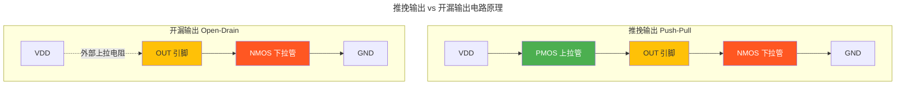
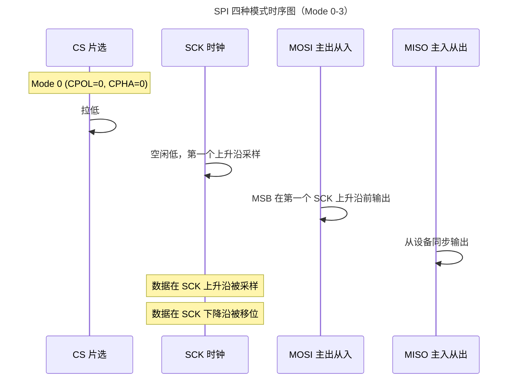
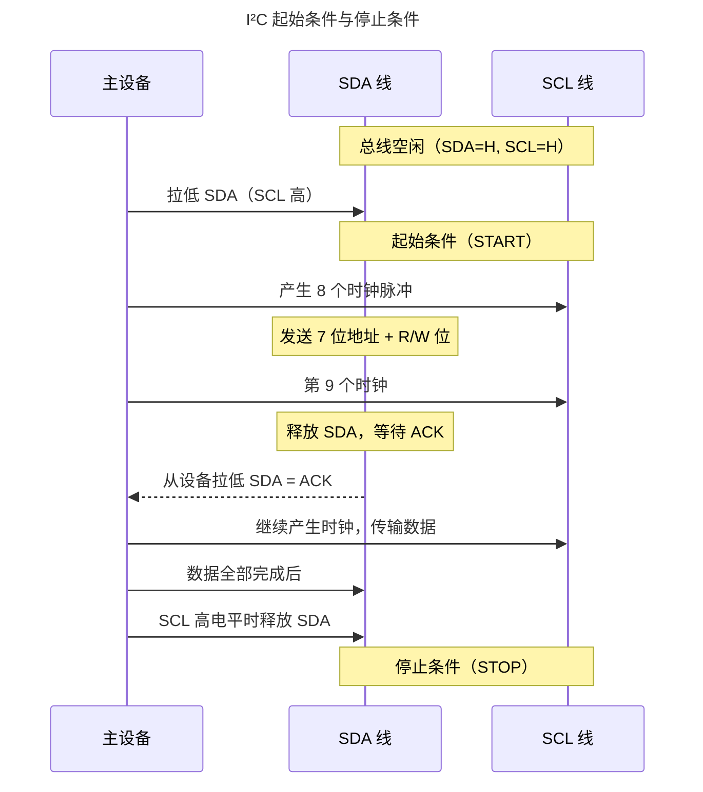
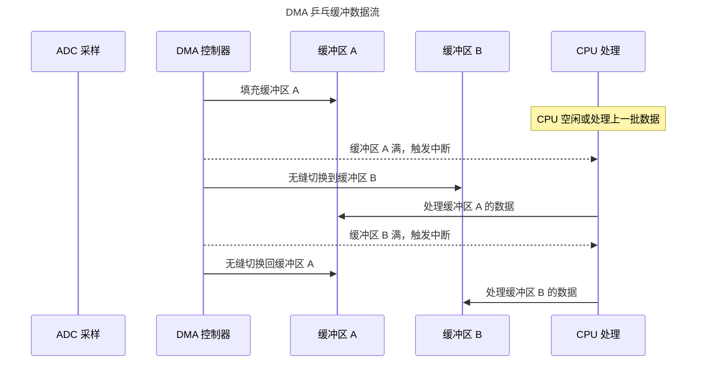

> 芯片与世界的对话接口。

处理器核心是一个封闭的运算世界——ALU 在寄存器间搬运数据，分支预测器在流水线中投机猜测，Cache 在 SRAM 和 CPU 之间缓冲指令流。但这一切都不为外界所知。要让芯片产生实际影响，它必须通过**外设**与物理世界对话：一根 GPIO 引脚拉高让 LED 发光、UART 帧在示波器上展开为比特序列、SPI 时钟线以 50MHz 的频率驱动传感器采样、I²C 总线的两根线承载着温度、湿度和加速度数据。

**外设驱动**是裸机程序员最常编写的代码——它位于寄存器地址和应用程序之间，将硬件手册中的比特字段翻译为可读的函数调用。本章从 GPIO 的推挽电路出发，走过 UART/SPI/I²C 三大通信协议，最终抵达 DMA 的零拷贝数据搬运哲学。

---

## GPIO：数字世界的触角

### 推挽与开漏：两种驱动器哲学

GPIO（General Purpose Input/Output）是最基础的外设，但其输出驱动器的电路拓扑决定了它能做什么、不能做什么。两种驱动器设计并存于几乎所有 MCU 的 GPIO 模块中：



| 特性 | 推挽输出 | 开漏输出 |
|------|---------|---------|
| **输出高电平** | PMOS 导通，VDD 直接驱动 | 依赖外部上拉电阻拉高 |
| **输出低电平** | NMOS 导通，拉到 GND | NMOS 导通，拉到 GND |
| **驱动能力** | 对称强驱动（source + sink） | 非对称（sink 强，source 弱） |
| **电平转换** | 需要 level shifter | 只需改变上拉电压即可实现 |
| **线与（Wired-AND）** | 不能（两个推挽输出短接会烧毁） | 天然支持（多设备共享总线） |
| **典型应用** | LED 驱动、普通数字输出 | I²C 总线、1-Wire、电平转换 |

开漏输出的"线与"特性是 I²C 总线的电路基础——多个设备共享同一根线，任何一个设备拉低即可将总线拉低，所有设备释放后上拉电阻将总线恢复为高电平。

### GPIO 寄存器操作实例

以 STM32F4 系列为例，点亮 PA5 引脚的 LED：

```c
/* 1. 使能 GPIOA 时钟（挂在 AHB1 总线） */
RCC->AHB1ENR |= RCC_AHB1ENR_GPIOAEN;

/* 2. 配置 PA5 为通用输出模式 */
GPIOA->MODER   &= ~(0x3 << (5 * 2));  /* 清除模式位 */
GPIOA->MODER   |=  (0x1 << (5 * 2));  /* 01 = 通用输出 */

/* 3. 配置输出类型为推挽（默认，无需修改） */
GPIOA->OTYPER  &= ~(0x1 << 5);        /* 0 = 推挽 */

/* 4. 配置输出速度 */
GPIOA->OSPEEDR |=  (0x2 << (5 * 2));  /* 10 = 50MHz */

/* 5. 无上拉/下拉 */
GPIOA->PUPDR   &= ~(0x3 << (5 * 2));  /* 00 = 浮空 */

/* 6. 输出高电平——点亮 LED */
GPIOA->BSRR = (0x1 << 5);
```

最后一步使用 `BSRR`（Bit Set/Reset Register）而非直接写 `ODR`，原因在于**原子性**：`BSRR` 的低 16 位写 1 置位、高 16 位写 1 复位，单条写指令同时完成置位和复位，无需读-改-写序列——这对于 GPIO 引脚在中断和主循环间共享时至关重要。

:::caution[ODR 的读-改-写陷阱]
直接操作 `GPIOA->ODR |= (0x1 << 5)` 需要处理器执行三个步骤：读 ODR → 修改位 5 → 写回 ODR。如果在这三个步骤之间发生中断，且 ISR 也修改了同一个 ODR 的其他位，ISR 的修改会被主循环的写回覆盖——这就是经典的**读写竞争**。`BSRR` 通过硬件保证写操作是互斥的。
:::

---

## UART：跨越时间的异步对话

### 帧格式与波特率

UART（Universal Asynchronous Receiver/Transmitter）是最古老的串行通信协议之一，其核心设计思想是**无时钟线的异步通信**——发送方和接收方各自使用独立的时钟源，通过对起始位的下降沿同步来对齐采样点。

典型的 UART 帧（8N1 配置——8 数据位、无校验、1 停止位）：

- **起始位**：1 bit，逻辑低（将空闲高电平拉到低）
- **数据位**：5-9 bits，LSB 先发
- **校验位**（可选）：奇校验或偶校验
- **停止位**：1-2 bits，逻辑高

波特率由以下公式设定：

$$
BaudRate = \frac{f_{CK}}{N \times USARTDIV}
$$

其中 $f_{CK}$ 是 USART 外设时钟（通常来自 APB 总线），$N$ 是过采样倍数（通常 16 或 8），$USARTDIV$ 是波特率分频器寄存器的值。以 $f_{CK} = 84\text{MHz}$、目标波特率 115200 为例：

$$
USARTDIV = \frac{84 \times 10^6}{16 \times 115200} \approx 45.57
$$

整数部分 45 存入 `BRR` 寄存器的高位，小数部分 $0.57 \times 16 \approx 9$ 存入低位。实际波特率误差为：

$$
\text{Error} = \frac{|45.57 - 45.5625|}{45.57} \times 100\% \approx 0.02\%
$$

只要误差低于 3%，UART 就能可靠通信。

### 中断驱动的收发架构

轮询模式在波特率较低时 CPU 浪费严重（9600bps 下每字节 CPU 等待约 1ms），中断驱动是 UART 驱动的标准范式：

```c
/* 环形缓冲区——ISR 与任务之间的无锁通道 */
#define RX_BUF_SIZE 256
static volatile uint8_t rx_buf[RX_BUF_SIZE];
static volatile uint16_t rx_head = 0;
static volatile uint16_t rx_tail = 0;

/* UART 接收中断（RXNE：接收缓冲区非空） */
void USART1_IRQHandler(void) {
    if (USART1->SR & USART_SR_RXNE) {
        uint8_t data = USART1->DR;          /* 读 DR 自动清除 RXNE */
        uint16_t next = (rx_head + 1) % RX_BUF_SIZE;
        if (next != rx_tail) {              /* 缓冲区未满 */
            rx_buf[rx_head] = data;
            rx_head = next;
        }
        /* 缓冲区满——静默丢弃（生产代码应触发错误处理） */
    }
}

/* 非阻塞读取——任务从环形缓冲区消费 */
int uart_read_byte(uint8_t *byte) {
    if (rx_head == rx_tail) return -1;      /* 缓冲区空 */
    *byte = rx_buf[rx_tail];
    rx_tail = (rx_tail + 1) % RX_BUF_SIZE;
    return 0;
}
```

:::tip[跨卷链接]
环形缓冲区的无锁设计依赖于[中断与异常的 NVIC 入栈机制](../02-interrupts/#向量表与-isr-入口从硬件到软件的一跃)：Cortex-M 硬件在 ISR 入口自动保存 R0-R3、R12、LR、PC、xPSR 到栈中，因此 ISR 中使用的 `rx_head` 修改不会与主循环中 `rx_tail` 的修改产生数据竞争——二者操作的是缓冲区的**不同端**。但对于多任务共享的环形缓冲区，仍需信号量保护。
:::

---

## SPI：高速同步的时钟舞蹈

### 四种模式的本质

SPI（Serial Peripheral Interface）是全双工同步串行总线，通过**时钟极性**（CPOL）和**时钟相位**（CPHA）的组合产生四种工作模式：

| 模式 | CPOL | CPHA | 空闲时钟电平 | 采样边沿 | 数据移位边沿 |
|------|------|------|-------------|---------|------------|
| **Mode 0** | 0 | 0 | 低 | 上升沿 | 下降沿 |
| **Mode 1** | 0 | 1 | 低 | 下降沿 | 上升沿 |
| **Mode 2** | 1 | 0 | 高 | 下降沿 | 上升沿 |
| **Mode 3** | 1 | 1 | 高 | 上升沿 | 下降沿 |



CPOL 和 CPHA 的组合之所以存在，是因为不同外设芯片对时序有不同的要求：有些在时钟上升沿采样数据、有些在下降沿；有些要求数据在时钟的第一个边沿之前就稳定。选择错误的模式是 SPI 调试中最常见的低级错误——结果往往是读出全是 `0xFF` 或 `0x00`。

:::note[SPI 主从模式的硬件本质]
SPI 的主设备控制 SCK 时钟线，从设备只能在收到 SCK 时才能发送数据。这意味着**从设备不能主动发起通信**——如果从设备有数据要发送，它必须等待主设备发起一次传输（即使主设备只是发送空字节来"拉取"数据）。这就是为什么许多 SPI 外设需要一个额外的 IRQ 引脚来通知主机"数据就绪"。
:::

### 多设备拓扑：片选线的意义

SPI 的片选信号（CS, Chip Select，也称 SS, Slave Select）解决了总线共享问题：

- **独立片选**（最常见）：每个从设备一条 CS 线，主机通过拉低对应的 CS 来选中通信目标
- **菊花链**（Daisy Chain）：从设备的 MISO 连接到下一个从设备的 MOSI，形成闭合环路——所有设备共享同一条 CS，数据依次流过每个设备

独立片选模式中，GPIO 引脚作为 CS 的软件管理（也称"软件片选"）比硬件 NSS 更灵活——可以在传输完成后保持 CS 低电平，实现跨多个字节的连续 SPI 事务（如读取 SD 卡的多字节命令响应）。

---

## I²C：双线承载万物的哲学

### 开漏 + 上拉 = 多主仲裁的电路基础

I²C（Inter-Integrated Circuit）仅用两根线——SCL（时钟）和 SDA（数据）——承载了几乎所有低速外设的通信需求。它的物理层设计是一个优雅的工程折衷：

- **开漏输出 + 外部上拉电阻**：任何设备只能将总线拉低，不能主动拉高。总线的高电平完全由外部上拉电阻提供。
- **线与逻辑**：如果任何一个设备拉低 SDA，总线就是低电平；只有所有设备都释放时，总线才恢复高电平。

这个简单的电路设计直接支持了两个高级特性——**时钟拉伸**（Clock Stretching）和**多主仲裁**（Multi-Master Arbitration）。

### 起始条件、停止条件与应答位

I²C 的每个事务由以下信号定义边界：



关键时序规则：
- **起始条件**：SCL 高电平时，SDA 从高到低的跳变
- **停止条件**：SCL 高电平时，SDA 从低到高的跳变
- **数据位**：SCL 低电平时 SDA 可以变化，SCL 高电平时 SDA 必须稳定
- **应答位**：第 9 个时钟脉冲，接收方拉低 SDA 表示 ACK，释放 SDA 表示 NACK

### 多主仲裁：谁先说话谁赢

当两个主设备同时尝试启动通信时，I²C 的仲裁机制异常简洁：**逐位比较 SDA 电平**。主设备在发送每一位后，读取 SDA 的实际电平。如果发送的是高电平（释放 SDA）但读到的是低电平（有其他设备在拉低），该主设备**立即认输**，切换到从设备模式，静默等待下一个停止条件。

这个设计的精妙之处在于：**仲裁失败的主设备不会破坏获胜方的数据**。因为 I²C 的逻辑规则是"低电平胜出"——发送 0（拉低）的一方自然覆盖发送 1（释放）的一方。仲裁失败方在其尝试发送 1 而读到 0 的瞬间自动退出，完全不影响正在进行的传输。

:::danger[I²C 上拉电阻的黄金范围]
上拉电阻值决定了 I²C 总线的最大速度和最大电容负载。过大的电阻使上升沿过慢（RC 时间常数），限制通信速率；过小的电阻使低电平时 sink 电流过大，可能超过设备的驱动能力。标准模式（100kHz）的典型值为 $4.7\text{k}\Omega$，快速模式（400kHz）为 $2.2\text{k}\Omega$，快速+模式（1MHz）可能需要降到 $1\text{k}\Omega$ 以下。
:::

---

## DMA：解放 CPU 的数据搬运工

### 传输模式与地址增量

**直接存储器访问**（DMA，Direct Memory Access）是嵌入式领域最接近"硬件多线程"的技术。DMA 控制器独立于 CPU 运行，直接在存储器与外设之间搬运数据，CPU 只需在传输完成后处理中断即可。

DMA 传输的三种基本模式：

| 模式 | 源地址 | 目标地址 | 触发源 | 典型场景 |
|------|--------|---------|--------|----------|
| **外设到存储器** | 外设数据寄存器（固定） | SRAM 缓冲区（递增） | 外设请求（如 UART RX） | UART 接收 DMA |
| **存储器到外设** | SRAM 缓冲区（递增） | 外设数据寄存器（固定） | 外设请求（如 SPI TX） | SPI DMA 发送 |
| **存储器到存储器** | 源地址（递增） | 目标地址（递增） | 软件触发 | 内存块拷贝、缓冲翻转 |

### 乒乓缓冲与分散-聚集

DMA 支持两种高级传输模式，将 CPU 从数据搬运中进一步解放：

**乒乓缓冲**（Ping-Pong Buffer）：分配两个大小相等的缓冲区，DMA 填充 Buffer A 时，CPU 处理 Buffer B 的数据；A 满后触发中断，DMA 无缝切换到 B，CPU 转而处理 A。此模式使 CPU 处理与 DMA 传输完全重叠，适合连续数据流（如 ADC 采样、音频 CODEC）。

**分散-聚集**（Scatter-Gather）：DMA 从一个描述符链表中读取多组"源地址-目标地址-传输长度"三元组，连续执行多段传输而无需 CPU 介入。适用场景：网络协议栈中，将分散的包头、负载、包尾组装为一个连续的 DMA 传输。



### DMA 与 Cache 一致性的冲突

这是带 Cache 的 MCU（如 Cortex-M7）上最隐蔽的陷阱。当 DMA 写入 SRAM 的某个地址后，CPU 读取同一地址时，**可能从 Cache 中读到旧数据**——因为 CPU 的写回 Cache 不知道 DMA 已经修改了 SRAM 的内容。

解决步骤：

1. **DMA 写入 → CPU 读取**：CPU 在读取前执行 `SCB_CleanInvalidateDCache_by_Addr(buffer, size)`——使 Cache 中的对应行无效，强制从 SRAM 重新加载。
2. **CPU 写入 → DMA 读取**：CPU 在启动 DMA 前执行 `SCB_CleanDCache_by_Addr(buffer, size)`——将 Cache 中的脏数据写回 SRAM，确保 DMA 看到最新数据。

```c
/* 正确的外设 DMA 接收流程（Cortex-M7） */
void start_adc_dma(uint16_t *buffer, size_t size) {
    /* 1. 确保 DMA 目标缓冲区内没有脏 Cache 行 */
    SCB_CleanInvalidateDCache_by_Addr(buffer, size * sizeof(uint16_t));

    /* 2. 配置并启动 DMA */
    DMA1_Stream0->M0AR = (uint32_t)buffer;
    DMA1_Stream0->NDTR = size;
    DMA1_Stream0->CR  |= DMA_SxCR_EN;  /* 使能 DMA */
}

/* DMA 完成中断 */
void DMA_IRQHandler(void) {
    /* 3. DMA 传输完成——CPU 读取前使 Cache 无效 */
    SCB_CleanInvalidateDCache_by_Addr(adc_buffer, BUFFER_SIZE * sizeof(uint16_t));

    /* 4. 现在 CPU 读取 adc_buffer 的数据是最新的 */
    process_adc_data(adc_buffer);
}
```

:::tip[跨卷链接]
DMA 与 Cache 的一致性问题是[存储层次的写策略（写策略：数据一致性的根源）（写策略：数据一致性的根源）](../../01-weichen/04-memory-hierarchy/#写策略数据一致性的根源)在嵌入式场景的直接体现。写回 Cache 使用脏位延迟写回 SRAM，而 DMA 绕过 Cache 直接访问 SRAM——二者之间没有硬件一致性协议（MOESI/MESI 常见于多核系统，但极少出现在 MCU 中）。嵌入式程序员必须通过软件显式管理一致性，这是 MCU 领域与桌面/服务器领域的关键差异之一。
:::

---

## 跨卷连接

外设驱动是芯片与物理世界的接口层，向下依赖于半导体物理和数字逻辑的电平定义，向上为操作系统的设备驱动模型和网络协议栈提供了硬件抽象的基础：

| 本章概念 | 依赖的底层原理 | 支撑的上层抽象 |
|----------|---------------|---------------|
| GPIO 推挽/开漏电路 | [CMOS 门电路——PMOS + NMOS 互补拓扑（CMOS 门电路实现）（CMOS 门电路实现）](../../01-weichen/02-digital-logic/#cmos-门电路实现) | [设备树与驱动模型](../../03-qiankun/) |
| UART 异步帧同步 | [时钟域交叉与亚稳态](../../01-weichen/02-digital-logic/#时钟域交叉) | [串行通信协议栈（SLIP/PPP）](../../03-qiankun/07-application-protocols/) |
| SPI 四种模式（CPOL/CPHA） | [建立时间与保持时间](../../01-weichen/02-digital-logic/#建立时间与保持时间) | [高速外设驱动架构（SDIO、QSPI）](../../03-qiankun/) |
| I²C 线与仲裁 | 开漏输出物理层 | [多主总线与分布式锁](../../04-yuanhai/03-distributed-fundamentals/) |
| DMA 零拷贝传输 | [SRAM 带宽与总线矩阵仲裁](../../01-weichen/04-memory-hierarchy/#存储金字塔每一纳秒都有代价) | [文件系统零拷贝 I/O](../../03-qiankun/03-filesystem/) |
| DMA-Cache 一致性 | [写回 Cache 脏位与写策略](../../01-weichen/04-memory-hierarchy/#写策略数据一致性的根源) | [内核态 DMA 缓冲与用户态隔离](../../03-qiankun/02-memory-management/) |

:::tip[卷二内部路径]
- [**裸机编程**](../01-bare-metal/)：时钟树使能——外设模块工作的前提
- [**中断与异常**](../02-interrupts/)：外设 ISR——从硬件标志位到软件响应的桥梁
- [**RTOS 基础**](../03-rtos-fundamentals/)：信号量与队列——外设数据在任务间的流转
- [**低功耗设计**](../05-low-power-design/)：时钟门控——停止外设时钟以节省功耗
:::
