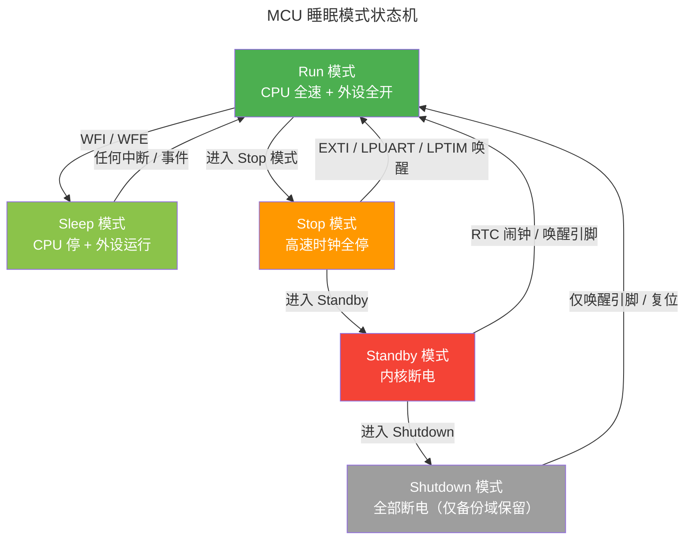
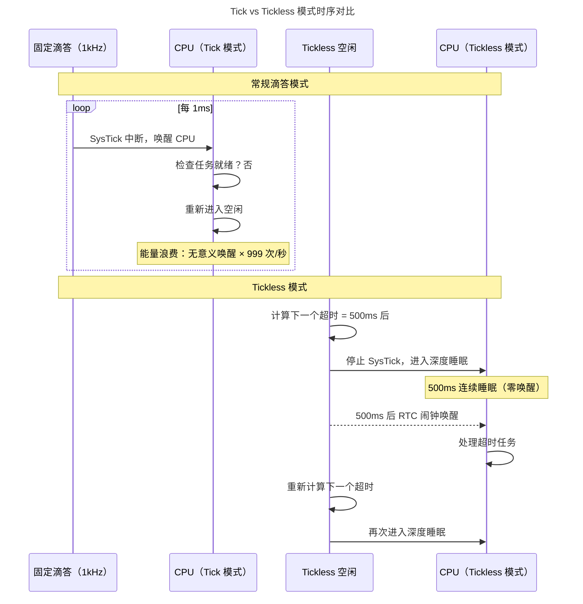

> 节能不是附加功能，是设计哲学。

一块纽扣电池驱动的温度传感器需要在玉米地里工作三年。一块太阳能供电的野生动物追踪器必须在连续的阴雨天维持定位和数据上传。一只植入宠物体内的 RFID 芯片要从皮肤下微弱的射频场中获取全部运行能量。这些场景共享同一个约束：**能量预算极度有限**。

低功耗设计不是事后优化——它是**贯穿硬件选型、电路设计、软件架构的系统工程**。本章从 MOSFET 的物理漏电流出发，追踪功耗在芯片内部的三大来源；然后深入 MCU 的睡眠模式分层，剖析时钟门控和电源门控的硬件机制；最后探讨嵌入式软件领域最优雅的节能方案——Tickless 空闲模式。

---

## 功耗的三大来源：物理定律的账单

### 动态功耗：充放电的必然代价

CMOS 电路每次翻转，都必须对负载电容充放电。这是数字电路功耗的主要来源，其公式为：

$$
P_{dynamic} = \alpha \cdot C \cdot V_{DD}^2 \cdot f
$$

其中：

| 参数 | 含义 | 典型数量级 | 设计师可控制？ |
|------|------|-----------|--------------|
| $\alpha$ | 活动因子（每个时钟周期发生翻转的门比例） | 0.1 ~ 0.3 | 是（时钟门控、架构优化） |
| $C$ | 负载电容（栅极电容 + 互连线电容） | fF ~ pF | 部分（工艺节点决定下限） |
| $V_{DD}$ | 电源电压 | 1.2V ~ 3.3V | 是（DVFS 动态调压） |
| $f$ | 时钟频率 | kHz ~ GHz | 是（降频、分频、停时钟） |

关键洞察：**电压的平方项** $V_{DD}^2$ 意味着将电压从 3.3V 降到 1.8V，动态功耗降低 $(3.3/1.8)^2 \approx 3.4$ 倍——这是 DVFS（动态电压频率调节）技术的物理基础。但电压不能无限降低：晶体管的阈值电压 $V_{th}$ 决定了逻辑翻转的最低下限。

### 静态功耗：关不掉的漏电流

即使时钟停止、所有门都不翻转，晶体管仍然在悄悄地消耗能量——这是**静态功耗**，主要来自亚阈值漏电流：

$$
I_{sub} \propto \frac{W}{L} \cdot e^{(V_{GS} - V_{th}) / (n \cdot V_T)}
$$

其中 $W/L$ 是晶体管的宽长比，$V_{th}$ 是阈值电压，$V_T$ 是热电压（室温约 26mV）。当 $V_{GS} = 0$（晶体管关断），仍有微弱的亚阈值电流从漏极流向源极——这个电流随温度**指数增长**，在 85°C 时可较室温增加数十倍。

### 浪涌电流：启动瞬间的电流尖峰

当芯片从深度睡眠中唤醒，所有时钟域同时启动，电源轨必须在一瞬间为数百个模块的电容充电——这就是**浪涌电流**（Inrush Current）。如果不加以控制，浪涌电流可能触发电源管理芯片的过流保护，或在电池供电场景中导致电压瞬间跌落至复位阈值以下。

:::tip[跨卷链接]
CMOS 功耗的物理根源在于[MOSFET 的亚阈值漏电机制（MOSFET 结构与 I-V 特性）（MOSFET 结构与 I-V 特性）](../../01-weichen/01-semiconductor-physics/#mosfet-结构与-i-v-特性)。当栅极电压 $V_{GS}$ 低于阈值电压但高于 0 时，沟道并未完全关断——载流子仍然以扩散方式从源极飘移到漏极，形成指数衰减的亚阈值电流。先进工艺节点（如 7nm、5nm）中，这一漏电流已成为总功耗的主要成分，推动了 FinFET 和 GAA（Gate-All-Around）晶体管架构的诞生。
:::

---

## 睡眠模式：阶梯式的能量妥协

几乎所有现代 MCU 都提供了多个睡眠深度，在功耗和唤醒延迟之间做出权衡。以 STM32L4 超低功耗系列为例：

| 模式 | 功耗（典型） | 唤醒时间 | CPU 状态 | SRAM 保留 | 唤醒源 |
|------|-------------|----------|---------|-----------|--------|
| **Run（运行）** | ~100 μA/MHz | — | 全速运行 | 全保留 | — |
| **Sleep（睡眠）** | ~30 μA/MHz | 0 μs | CPU 时钟停，外设运行 | 全保留 | 任何中断 |
| **Low-power Run** | ~8 μA（@ 2MHz） | — | 低速运行 | 全保留 | — |
| **Low-power Sleep** | ~4.5 μA | 3 μs | CPU 时钟停 | 全保留 | 任何中断 |
| **Stop 1** | ~4.6 μA | 4.5 μs | 大部分时钟停 | 全保留 | EXTI, I²C, USART, LPUART, LPTIM |
| **Stop 2** | ~1.3 μA | 5 μs | 所有高速时钟停 | 全保留 | EXTI, I²C, LPUART, LPTIM |
| **Standby** | ~0.28 μA | 50 μs | 内核断电 | 仅备份域 | RTC, 唤醒引脚, 复位 |
| **Shutdown** | ~0.033 μA | 200 μs | 全部断电 | 仅备份域 | 仅唤醒引脚, 复位 |



### 模式选择的决策逻辑

**Sleep** 几乎零成本（唤醒时间 0），适合等待外设事件——如 UART 数据到达或 SPI 传输完成——的微秒级空闲窗口。

**Stop** 以 5μs 的唤醒代价换取两个数量级的功耗下降。适合 ADC 采样之间的毫秒级间隔、BLE 连接事件之间的空隙。Stop 模式的关键约束是**高速内部振荡器（HSI/HSE）停止**——所有依赖高速时钟的外设（SPI、I²C、USART 标准模式）必须用低速时钟源（LSI/LSE）替代或切换到 LPUART/LPTIM。

**Standby** 以 50μs 唤醒时间和 SRAM 全部丢失为代价，将功耗推到纳安级。适合小时级以上的休眠周期——如每小时醒来一次采集传感器数据并通过 NB-IoT 上传。Standby 唤醒后，程序从复位向量重新执行，唯一能跨 Standby 保留数据的区域是备份域寄存器（通常几十字节）。

:::note[WFI vs WFE 的选择]
ARM Cortex-M 提供两条进入低功耗的指令：`WFI`（Wait For Interrupt）和 `WFE`（Wait For Event）。`WFI` 只能被中断唤醒，`WFE` 可以被事件唤醒（包括外设事件、另一个核的 `SEV` 指令）。在多核 MCU 中，`WFE` 用于实现自旋锁的节能版本——代替忙等循环中的 `while (lock)`，核心在 `WFE` 状态下几乎不消耗动态功耗，直到 `SEV` 事件通知它锁已释放。
:::

---

## 时钟门控与电源门控：硬件级的精细降耗

### 时钟门控：停掉无用的翻转

动态功耗公式 $P = \alpha C V^2 f$ 中最有效的降耗手段不是降频，而是**彻底停止翻转**——让 $\alpha = 0$。时钟门控（Clock Gating）通过在时钟路径上插入与门，在不使用某个模块时将时钟信号固定在低电平：

- **外设级时钟门控**：软件通过写 `RCC->AHB1ENR` 等寄存器来控制。例如，不使用的 TIM5 定时器可以关闭其时钟——不仅停止计数，连定时器内部的所有触发器都不再翻转。
- **CPU 自动时钟门控**：Cortex-M 内核在 `WFI` 状态下自动停止 CPU 时钟，但 NVIC、SysTick 和调试模块仍在运行，可以被中断唤醒。

时钟门控的粒度决定了降耗效率——有些 MCU 可以精确到**单个外设模块**，有些只能到**总线级别**（如整个 APB1 或 AHB1）。

### 电源门控：断电才是终极节能

时钟门控停止了翻转，但晶体管仍然漏电。更彻底的方案是**电源门控**（Power Gating）——用高阈值电压的"休眠晶体管"将整个电源域与 VDD 断开：

```
VDD ──┬──[Sleep Transistor]──┬── 模块 A 的电源域
       │                      │
       └──[Sleep Transistor]──┴── 模块 B 的电源域
```

当休眠晶体管关断时，通往整个模块的电源通路被物理切断——漏电流降至接近于零。代价是：

1. **唤醒延迟**：重新接通电源后，需要等待电压稳定和模块初始化（通常几十微秒到几毫秒）
2. **状态丢失**：断电后所有寄存器、SRAM 内容全部丢失（除非使用保留 SRAM——由独立电源域供电的专用 SRAM 块）
3. **面积开销**：休眠晶体管需要占用芯片面积，且导通时有额外电阻

---

## 唤醒源与延迟权衡：帕累托最优前沿

唤醒源的选择决定了系统的最低功耗下限和最高响应速度。下表对比了常见唤醒源的特性：

| 唤醒源 | 功耗开销 | 唤醒延迟 | 精度 | 典型应用 |
|--------|---------|---------|------|----------|
| **GPIO 外部中断** | 纳安级 | 0 ~ 5 μs | 取决于外部信号 | 按键唤醒、传感器就绪信号 |
| **RTC 闹钟** | 数百纳安 | 取决于 RTC 时钟 | ±1 秒（32kHz LSI）/ ±1 ppm（32.768kHz LSE） | 周期性数据采集上报 |
| **LPUART 地址匹配** | 微安级 | 数微秒 | — | 主从通信中的从设备唤醒 |
| **比较器 / 模拟看门狗** | 数百纳安 | 数微秒 | 取决于阈值设定 | 电池电压监控、温度阈值告警 |
| **NFC / 射频场唤醒** | 0（能量来自外部场） | 取决于场强 | — | 无电池 RFID、NFC 标签 |

### 唤醒延迟的预算分析

从唤醒事件到应用程序的第一行代码，延迟由多个阶段累加：

$$
t_{wakeup} = t_{regulator} + t_{oscillator} + t_{reset} + t_{boot}
$$

- $t_{regulator}$：内部 LDO 电压调节器重新建立稳定输出（Stop 模式通常 3~5 μs，Standby 模式因内核断电需完整的启动序列，约 50 μs）
- $t_{oscillator}$：高速振荡器从停振到稳定输出——HSI 通常 2~4 μs，HSE 因外部晶体起振较慢约 1~3 ms
- $t_{reset}$：如果从 Standby 唤醒，处理器经历完整上电复位序列（采样 BOOT 引脚、加载选项字节）
- $t_{boot}$：固件启动代码执行——初始化时钟树、恢复外设状态、重新填充 SRAM

在低功耗传感器节点设计中，$t_{wakeup}$ 的每一微秒都是能量预算的一部分——唤醒期间处理器在 Run 模式下消耗的全功率，如果唤醒过于频繁，节省的睡眠功耗可能被启动开销完全抵消。

---

## Tickless 空闲模式：软件节能的极致

### 滴答定时器的能量浪费

传统 RTOS 的 SysTick 定时器以固定频率（通常 1kHz）产生中断，即使系统处于空闲状态——没有任何任务需要运行——CPU 仍然每毫秒被唤醒一次，执行调度器检查，确认没有任务就绪，然后再次进入空闲。

这种"滴答唤醒"的功耗浪费在电池供电系统中不可接受：如果一个系统 99% 的时间在空闲，但它仍然每毫秒被唤醒一次，那么**绝大部分能量都消耗在无意义的唤醒上**。

### Tickless 的核心理念

**Tickless 空闲模式**（Tickless Idle）改变了这一范式：当 RTOS 检测到所有任务都在等待超时或事件时，空闲任务计算距下一个超时事件的剩余时间，然后**完全关闭 SysTick**，进入深度睡眠直到那个时刻：



### FreeRTOS Tickless 实现

FreeRTOS 的 Tickless 通过 `portSUPPRESS_TICKS_AND_SLEEP()` 宏实现，核心逻辑：

```c
#if configUSE_TICKLESS_IDLE == 1
void vPortSuppressTicksAndSleep(TickType_t xExpectedIdleTime) {
    /* 1. 确保 xExpectedIdleTime 至少为 2 个滴答
     *    否则进睡眠的进出开销大于省下的功耗 */
    if (xExpectedIdleTime > 2) {
        /* 2. 停止 SysTick */
        portNVIC_SYSTICK_CTRL_REG &= ~portNVIC_SYSTICK_ENABLE_BIT;

        /* 3. 配置 RTC 闹钟在 (~xExpectedIdleTime) 后唤醒 */
        vRtcSetAlarm(xExpectedIdleTime);

        /* 4. 进入深度睡眠（WFI / Stop / Standby） */
        vPortEnterDeepSleep();

        /* 5. 被唤醒后，重新校准 SysTick */
        portNVIC_SYSTICK_CTRL_REG |= portNVIC_SYSTICK_ENABLE_BIT;
    }
}
#endif
```

**Tickless 的实际效果**：在一个典型的 BLE 温湿度传感器中，连接间隔为 100ms，每次连接事件处理耗时约 2ms。在常规 Tick 模式下，CPU 在 98ms 的空闲期间被唤醒约 98 次（1kHz SysTick）。启用 Tickless 后，CPU 在 98ms 内**只被唤醒一次**（或零次——如果连接事件本身由 RTC 闹钟触发）。

:::caution[Tickless 的陷阱]
Tickless 模式下，`vTaskDelay()`、`xQueueReceive(..., timeout)` 等阻塞调用的超时精度取决于 RTC 而非 SysTick。RTC 的时钟源通常是 32.768kHz 晶振，分辨率约 30.5 μs——对于毫秒级超时完全足够，但对于需要微秒级精度的实时任务，Tickless 的 RTC 唤醒后重新校准可能引入抖动。
:::

---

## 跨卷连接

低功耗设计不是孤立的软件技巧——它是半导体物理、数字电路设计和实时操作系统三层协同的结果。每一毫瓦的节省，背后都是一门跨卷的学问：

| 本章概念 | 依赖的底层原理 | 支撑的上层抽象 |
|----------|---------------|---------------|
| 动态功耗 $P = \alpha C V^2 f$ | [CMOS 反相器充放电与负载电容（CMOS 反相器与功耗）（CMOS 反相器与功耗）](../../01-weichen/01-semiconductor-physics/#cmos-反相器与功耗) | [DVFS 动态调频调压策略](../../03-qiankun/) |
| 亚阈值漏电流 | [MOSFET 亚阈值区与短沟道效应](../../01-weichen/01-semiconductor-physics/#mosfet-结构与-i-v-特性) | [先进工艺节点的功耗墙](../../01-weichen/01-semiconductor-physics/) |
| 睡眠模式分层 | [时钟树与 PLL 配置](../01-bare-metal/#systeminit唤醒时钟树) | [操作系统电源管理（ACPI S-State）](../../03-qiankun/02-memory-management/) |
| 时钟门控 | [数字逻辑的时钟分配网络](../../01-weichen/02-digital-logic/#时序逻辑) | [调度器空闲任务与 CPU 停机](../../03-qiankun/01-process-and-thread/) |
| Tickless 空闲模式 | [SysTick 滴答定时器](../03-rtos-fundamentals/#systick-心跳与-pendsv-上下文切换) | [Linux NO_HZ / 动态滴答内核](../../03-qiankun/01-process-and-thread/) |
| 唤醒延迟预算 | [PLL 锁定时间与振荡器起振](../../01-weichen/02-digital-logic/#组合逻辑) | [操作系统电源状态的延迟 QoS](../../03-qiankun/01-process-and-thread/) |

:::tip[卷二内部路径]
- [**裸机编程**](../01-bare-metal/)：时钟树配置与 PLL 管理——功耗优化的硬件基础
- [**中断与异常**](../02-interrupts/)：唤醒检测与 ISR 延迟——睡眠模式与实际响应
- [**RTOS 基础**](../03-rtos-fundamentals/)：空闲任务与 Tickless 实现——软件节能的核心
- [**外设驱动**](../04-peripheral-drivers/)：外设时钟使能与低功耗 UART——外设级的功耗管理
:::
