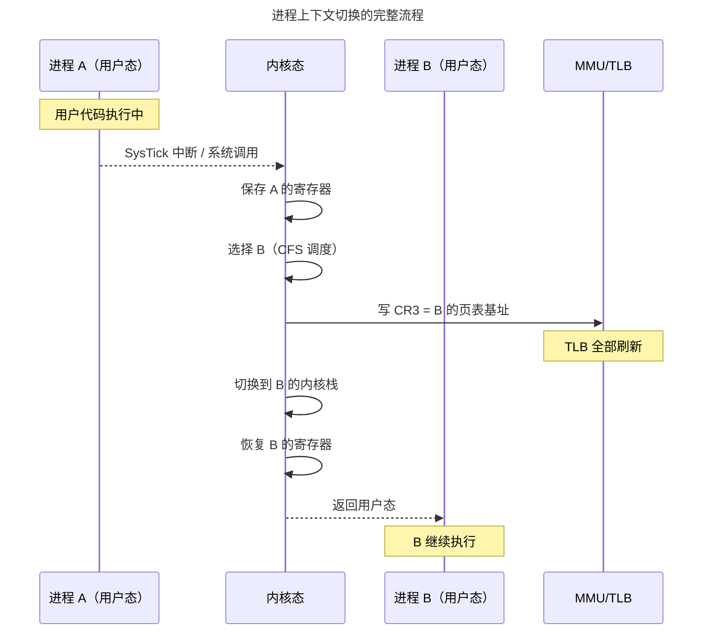

> 操作系统调度万物的基本单位。

如果裸机编程是在一张白纸上用汇编描画整个世界，那么操作系统内核的诞生标志着一个根本性的跃迁——**进程**。进程不是程序本身，而是程序在运行时的动态投影：它的地址空间、它的文件描述符、它的栈和堆、它在 CPU 寄存器中的瞬间切片。

本章从进程模型的基石——PCB——出发，走过线程与轻量级进程的分野，解剖上下文切换的昂贵代价，深入 Linux 的 CFS 调度器和 IPC 通信机制。

---

## 进程模型与 PCB：内核中的任务档案

在 Linux 中，PCB 就是 `task_struct`——内核中最复杂的结构体之一：

| 分类 | 包含字段 | 用途 |
|------|---------|------|
| **调度信息** | `prio`, `se`, `rt`, `policy` | CFS 的红黑树节点、实时优先级 |
| **内存描述符** | `mm_struct *mm` | 页表指针、VMA 链表、地址空间边界 |
| **文件系统** | `fs_struct *fs`, `files_struct *files` | 当前工作目录、打开文件描述符表 |
| **信号处理** | `sigpending`, `sighand` | 挂起信号位图、信号处理函数表 |
| **身份标识** | `pid`, `tgid`, `cred` | 进程 ID、线程组 ID、UID/GID 权限 |

PCB 的精妙之处在于 `mm_struct` 和 `files_struct` 的**引用计数共享**。当 `clone()` 创建线程时，新线程的 `task_struct` 中的 `mm` 指针直接指向同一个 `mm_struct`——这就是线程比进程"轻量"的本质：线程共享地址空间，不需要切换页表。

---

## 上下文切换：昂贵的角色转换

进程上下文切换是操作系统中最频繁也最昂贵的操作。一次完整的切换包括：

1. **保存硬件上下文**：寄存器保存到 `task_struct->thread`
2. **切换页表**：CR3 指向新进程的页表基地址——TLB 全部失效
3. **切换内核栈**：SP 指向新进程的内核栈
4. **切换 FPU 状态**（延迟切换）：x86 使用 TS 标志位延迟恢复浮点寄存器
5. **恢复硬件上下文**：从新进程的 `task_struct` 恢复寄存器

**切换开销量化**：保存/恢复寄存器 ~0.1 μs，切换页表 ~0.5 μs（TLB flush），TLB 预热 0.5-5 μs，Cache 冷启动 5-50 μs。线程切换省去了"切换页表 + TLB flush"的全套开销——这就是高并发服务器大量使用线程池的原因。

---

## 调度算法：CFS 与 EEVDF

Linux CFS 的哲学：**让每个进程获得与其权重成正比的 CPU 时间**。核心数据结构是一棵按 `vruntime` 排序的红黑树：

$$
\Delta vruntime = \Delta t_{actual} \times \frac{1024}{weight}
$$

调度器始终选择红黑树最左节点（`vruntime` 最小）的进程运行。nice 值 -20 的进程权重约 88761，nice +19 仅约 15——极端情况下 CPU 分配差距近 6000 倍。

Linux 6.6 引入的 EEVDF 在 CFS 基础上增加了**虚拟截止期**概念——每个进程声明期望的时间片，调度器计算虚拟截止期，选择截止期最近的进程运行——解决了 CFS 的延迟抖动。

---

## 进程间通信

| 机制 | 数据单位 | 典型场景 |
|------|---------|---------|
| **管道**（Pipe） | 字节流（64KB 缓冲区） | Shell 管道 `cat \| grep` |
| **消息队列**（POSIX MQ） | 带优先级的离散消息 | 嵌入式任务间通信 |
| **共享内存** | 字节数组 | 高频大数据（零拷贝！） |
| **信号**（Signal） | 1 bit 通知 | SIGINT (Ctrl+C)、SIGKILL |
| **Unix Socket** | 字节流/数据报 | 前后端本地通信 |

---

## 跨卷连接

| 本章概念 | 依赖的底层原理 | 支撑的上层抽象 |
|----------|---------------|---------------|
| PCB 与 task_struct | [RTOS TCB 的最小信息集](../02-jiezi/03-rtos-fundamentals/#任务控制块tcb) | [容器与 K8s Pod](../../08-qianli/02-system-design/) |
| 上下文切换页表更新 | [TLB 结构与地址翻译](../../01-weichen/04-memory-hierarchy/#cache-组织形式) | [Hypervisor VMCS 切换](../02-jiezi/01-bare-metal/) |
| CFS 红黑树 | [RISC-V M-mode 中断](../02-jiezi/02-interrupts/) | [分布式任务调度](../../04-yuanhai/05-data-pipelines/) |
| 管道与消息队列 | [FreeRTOS 队列拷贝传递](../02-jiezi/03-rtos-fundamentals/) | [Kafka 分区日志](../../04-yuanhai/05-data-pipelines/) |

:::tip[卷三内部路径]
- [**内存管理**](../02-memory-management/)：`mm_struct` 与页表
- [**同步原语**](../04-synchronization/)：futex——进程间同步的核心机制
- [**网络编程**](../08-network-programming/)：epoll——高并发 I/O 的基石
:::
