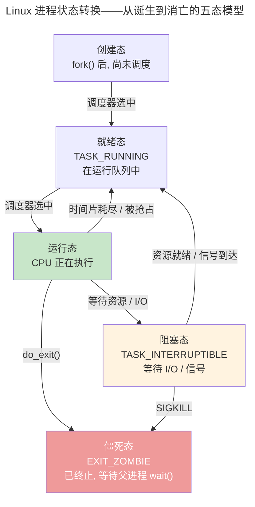
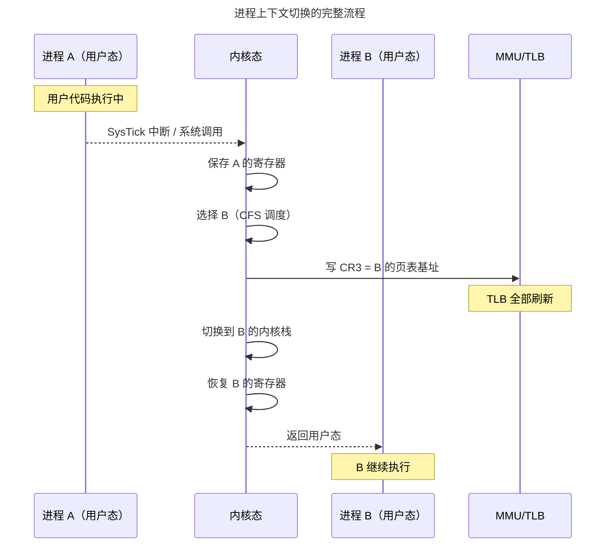
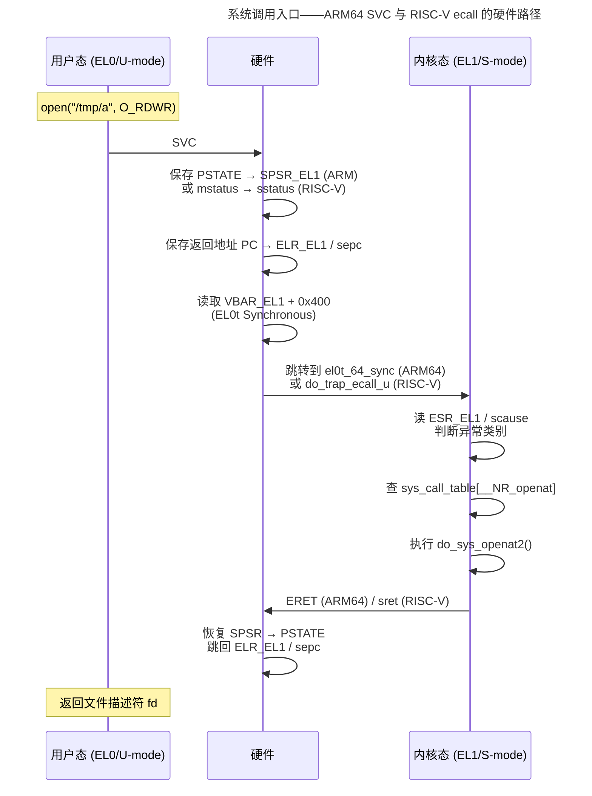

> 操作系统调度万物的基本单位。

如果裸机编程是在一张白纸上用汇编描画整个世界，那么操作系统内核的诞生标志着一个根本性的跃迁——**进程**。进程不是程序本身，而是程序在运行时的动态投影：它的地址空间、它的文件描述符、它的栈和堆、它在 CPU 寄存器中的瞬间切片。

本章从进程模型的基石——PCB——出发，走过线程与轻量级进程的分野，解剖上下文切换的昂贵代价，深入 Linux 的 CFS 调度器和 IPC 通信机制。

---

## 进程模型与 PCB：内核中的任务档案

在 Linux 中，PCB 就是 `task_struct`——内核中最复杂的结构体之一：

| 分类 | 包含字段 | 用途 |
|------|---------|------|
| **调度信息** | `prio`, `se`, `rt`, `policy` | CFS 的红黑树节点、实时优先级 |
| **内存描述符** | `mm_struct *mm` | 页表指针、VMA 链表、地址空间边界 |
| **文件系统** | `fs_struct *fs`, `files_struct *files` | 当前工作目录、打开文件描述符表 |
| **信号处理** | `sigpending`, `sighand` | 挂起信号位图、信号处理函数表 |
| **身份标识** | `pid`, `tgid`, `cred` | 进程 ID、线程组 ID、UID/GID 权限 |

PCB 的精妙之处在于 `mm_struct` 和 `files_struct` 的**引用计数共享**。当 `clone()` 创建线程时，新线程的 `task_struct` 中的 `mm` 指针直接指向同一个 `mm_struct`——这就是线程比进程"轻量"的本质：线程共享地址空间，不需要切换页表。

### 进程状态——生命的轮回

Linux 细化出三种阻塞态：`TASK_INTERRUPTIBLE`（可被信号唤醒——大多数 I/O 等待）、`TASK_UNINTERRUPTIBLE`（不可中断——`vfork()` 等待子进程、直接 I/O 的磁盘等待）、`TASK_KILLABLE`（仅响应致命信号——Linux 2.6.25 引入，解决 D 状态进程无法被杀的问题）。

`ZOMBIE` 的特殊性：进程已释放所有资源（内存、文件、信号），仅保留 `task_struct` 中的退出码——等待父进程 `wait()` 读取。父进程未调用 `wait()` → 僵死进程堆积 → `pid_max` 耗尽。`SIGCHLD` 信号 + `SA_NOCLDWAIT` 或 `prctl(PR_SET_CHILD_SUBREAPER)` 是避免僵死的标准手段。

### fork/exec/clone——进程诞生的三种路径

| 系统调用 | 创建行为 | 共享程度 |
|----------|---------|---------|
| `fork()` | 拷贝父进程的 `task_struct` + `mm_struct`（COW 优化） | PID 和 PPID 不同，其余全拷贝 |
| `vfork()` | 父进程阻塞直到子进程 `exec()` 或 `_exit()` | 共享地址空间（无 COW）——仅用于立即 `exec()` 的场景 |
| `clone()` | 创建新 `task_struct`，按标志位选择性共享 | `CLONE_VM` 共享地址空间（线程），`CLONE_FILES` 共享 fd 表 |

`fork()` 的 COW 优化——子进程并非立即拷贝全部物理页，而是将父进程的所有 PTE 标记为只读。**写时**触发缺页中断，内核才分配新物理页并拷贝内容。现代 Linux 中 `fork()` + `exec()` 的典型开销约 0.2 ms，其中绝大部分用于页表的 COW 标记。

### 线程模型——1:1 vs N:1 vs M:N

| 模型 | 实现 | 代表 | 优势 | 劣势 |
|------|------|------|------|------|
| **1:1** | 每个用户线程 = 1 个内核线程 | Linux `pthread` | 真并行、可独立被调度 | `clone()` 系统调用开销 |
| **N:1** | N 个用户线程复用 1 个内核线程 | 早期 Java 绿线程 | 零系统调用切换 | 一个阻塞全部阻塞、无法利用多核 |
| **M:N** | M 个用户线程映射到 N 个内核线程 | Go goroutine（G:P:M） | 两者折中——轻量 + 真并行 | 调度器复杂 |

Linux 1:1 模型的 "劣势" 在实践中被 futex（`pthread_mutex` 的快路径无系统调用）和 `CLONE_VM`（线程共享地址空间避免页表拷贝）大幅缓解——`pthread_create()` 的延迟已降至 ~10 μs 级别。

---

## 上下文切换：昂贵的角色转换

进程上下文切换是操作系统中最频繁也最昂贵的操作。一次完整的切换包括：

1. **保存硬件上下文**：寄存器保存到 `task_struct->thread`
2. **切换页表**：CR3 指向新进程的页表基地址——TLB 全部失效
3. **切换内核栈**：SP 指向新进程的内核栈
4. **切换 FPU 状态**（延迟切换）：x86 使用 TS 标志位延迟恢复浮点寄存器
5. **恢复硬件上下文**：从新进程的 `task_struct` 恢复寄存器

**切换开销量化**：保存/恢复寄存器 ~0.1 μs，切换页表 ~0.5 μs（TLB flush），TLB 预热 0.5-5 μs，Cache 冷启动 5-50 μs。线程切换省去了"切换页表 + TLB flush"的全套开销——这就是高并发服务器大量使用线程池的原因。

### 上下文切换优化：惰性 FPU 与 PCID

内核为减少上下文切换开销设计了多项优化：

| 优化技术 | 机制 | 节省开销 |
|---------|------|---------|
| **惰性 FPU 切换** | x86 `CR0.TS` 标志位：切换进程时不立即保存/恢复 FPU 寄存器，延迟到新进程首次使用浮点指令时触发 `#NM` 异常 | 512-2048 字节的 XMM/AVX 寄存器拷贝（~0.3 μs） |
| **同进程线程切换** | 线程共享 `mm_struct` → 跳过写 CR3 和 TLB flush | ~0.5 μs（页表切换 + TLB 预热） |
| **PCID / ASID** | x86 PCID（Process Context ID）或 ARM ASID 标记 TLB 条目——切换 CR3 时不全部刷新，同 PCID 的条目保留 | TLB 预热时间从 5 μs 降至接近 0 |
| **内核线程偷懒** | 内核线程无用户地址空间 → 借当前用户进程的页表运行，无需切换 | ~0.5 μs |

其中 PCID 是 Meltdown 漏洞之后最重要的优化——KPTI 强制内核页表和用户页表分离，每次 `syscall` 往返都要切 CR3。PCID 使这种高频切换的成本从"全部 TLB 失效"降为"仅切换标记"。

### 系统调用入口：从 EL0 到 EL1 的硬件路径

前文将系统调用描述为上下文切换的触发器之一。但系统调用本身是如何从用户态进入内核的？答案在不同的 ISA 上有不同的"门"：

ARM64 的 `el0t_64_sync` 入口是内核中最精细的汇编代码之一——它必须在 C 代码运行前完成栈切换（SP_EL0 → SP_EL1）、构造 `pt_regs` 结构体、并保存全部通用寄存器。`ESR_EL1` 的 `EC` 字段（Exception Class）区分 SVC 指令（`0b010101`）、数据中止、指令中止和浮点陷阱——这四个入口共享同一个向量但走不同的处理路径。

### RISC-V 特权级启动链：OpenSBI 到 S-mode

ARM64 的系统调用入口 `el0t_64_sync` 是运行时路径，而 RISC-V 的 M-mode → S-mode 切换则是**启动时**的路径。理解它有助于看清 [RISC-V M-mode 中断委托](../../../02-jiezi/02-interrupts/#risc-v-m-mode-中断委托机制) 的全貌：

1. **上电** → Hart 进入 M-mode，执行 OpenSBI 固件
2. **OpenSBI 初始化**：设置 `mtvec`（M-mode 陷阱向量）、配置 PLIC、初始化 `mideleg`/`medeleg` 委托寄存器
3. **委托**：将绝大部分异常（同步异常、IRQ、缺页）委托给 S-mode——写入 `medeleg` 和 `mideleg` 对应位为 1
4. **跳转**：`mret` 指令将 `mepc` 设为 Linux `_start_kernel` 地址，`mstatus.MPP` 设为 S-mode，执行 `mret` → Hart 进入 S-mode
5. **S-mode 初始化**：Linux 设置 `stvec` 指向自身的陷阱向量（而非 `mtvec`——因为异常已委托）

这就是 [中断系统中的 RISC-V PLIC 讨论](../../../02-jiezi/02-interrupts/#四大中断控制器对比nvic-vs-gic-vs-plic-vs-apic) 中"每个 RISC-V Hart 必须有一个 M-mode"的根因——M-mode 是固件层，S-mode 是 OS 层，启动链的本质是将硬件权力从固件移交给操作系统。

---

## 调度算法：CFS 与 EEVDF

Linux CFS 的哲学：**让每个进程获得与其权重成正比的 CPU 时间**。核心数据结构是一棵按 `vruntime` 排序的红黑树：

$$
\Delta vruntime = \Delta t_{actual} \times \frac{1024}{weight}
$$

调度器始终选择红黑树最左节点（`vruntime` 最小）的进程运行。nice 值 -20 的进程权重约 88761，nice +19 仅约 15——极端情况下 CPU 分配差距近 6000 倍。

Linux 6.6 引入的 EEVDF 在 CFS 基础上增加了**虚拟截止期**（Virtual Deadline）概念。每个进程声明期望的时间片 $T$，调度器计算：

$
\text{vdeadline} = \text{vruntime} + \frac{T}{weight}
$

选择 `vdeadline` 最早的进程运行——而非 `vruntime` 最小的。这意味着：即使某个进程的 `vruntime` 非常低（CPU 时间吃得少），如果它频繁申请极短的时间片（低延迟需求），它也不会"霸占" CPU——因为更大 $T$ 的进程可能有更早的截止期。EEVDF 将 CFS 的 "CPU 公平" 升级为 "**时延公平**"——解决了音频播放、游戏渲染等延迟敏感型负载在 CFS 下的抖动问题。

### 实时调度类：SCHED_FIFO / SCHED_RR / SCHED_DEADLINE

CFS 和 EEVDF 是 Linux 的**默认调度类**（`SCHED_NORMAL`），但 Linux 还有三个**实时调度类**，它们的优先级永远高于 CFS：

| 策略 | 行为 | POSIX 优先级范围 | 典型场景 |
|------|------|-----------------|---------|
| **SCHED_FIFO** | 无时间片，运行直到自愿放弃 CPU 或被更高优先级 RT 任务抢占 | 1-99 | 硬实时控制回路 |
| **SCHED_RR** | 同优先级任务时间片轮转（默认 100ms） | 1-99 | 需要 CPU 分时的实时任务组 |
| **SCHED_DEADLINE** | Earliest Deadline First（EDF），每个任务声明运行时间 $C$、周期 $T$、截止期 $D$ | 内核自动分配 | 音视频编码、机器人控制 |

调度优先级层级（从高到低）：

$$
\text{SCHED\_DEADLINE} > \text{SCHED\_FIFO/RR} (99 \downarrow 1) > \text{SCHED\_NORMAL} (\text{nice } -20 \downarrow +19) > \text{SCHED\_IDLE}
$$

**关键规则**：只要任何 RT 任务处于可运行状态，CFS 任务就绝对不会被调度。这就是为什么 `chrt -f 99 ./my_app` 可以让一个进程独占 CPU——甚至可以抢占内核的 `migration` 内核线程。

CFQ 经常与 CFS 混淆——但 CFQ（Completely Fair Queuing）是**块层 I/O 调度器**，决定磁盘请求的排队顺序，而非 CPU 调度。两者都追求"公平"，只是一个在 CPU 时间域，一个在磁盘带宽域。

---

## 中断下半部：tasklet、workqueue 与 threaded IRQ

进程调度不只管理用户进程——它也负责执行**中断下半部**（Bottom Half）。中断处理分为两半：上半部（ISR）在硬中断上下文中做最少工作（读状态寄存器、清标志、拷贝数据），下半部在更宽松的上下文中完成耗时操作（协议解析、网络包处理、写磁盘）。

| 机制 | 执行上下文 | 可睡眠 | 并发特性 | 适用场景 |
|------|----------|--------|---------|---------|
| **tasklet** | 软中断（softirq）上下文 | ❌ 不可睡眠 | 同一 tasklet 全局串行化（不会与自己并发） | 网络收发包（NAPI）、DMA 完成回调 |
| **workqueue** | 内核线程（`kworker`） | ✅ 可睡眠 | 多核并发执行 | 写磁盘、调用 `mutex_lock()`、长时间计算 |
| **threaded IRQ** | 独立内核线程（`irq/...`） | ✅ 可睡眠 | 每个中断一个线程 | 需要 SPI/I²C 慢速操作的 ISR |

**tasklet** 基于 Linux 的 softirq 机制——内核在 `irq_exit()` 时检查挂起的 softirq 并执行。tasklet 的特殊保证：**同一 tasklet 在任何时刻只在一个 CPU 上执行**，无需加锁。这种"自串行化"设计是网络子系统高效率的关键——`net_rx_action` 和 `net_tx_action` 都是 softirq。

**workqueue** 将工作提交给 `kworker` 内核线程池，由 CFS 正常调度。这意味着 workqueue 中的函数可以调用 `msleep()`、`mutex_lock()`、甚至触发缺页——因为这些发生在进程上下文中。代价是延迟不可控（取决于 CFS 何时调度 kworker）。

**threaded IRQ** 是 Linux 2.6.30 后引入的折衷：`request_threaded_irq()` 将整个 ISR 变成内核线程。硬中断部分仅做"确认中断 + 屏蔽该 IRQ"（原子操作），其余逻辑在线程中执行。这使原本必须用自旋锁保护的 ISR 逻辑可以使用互斥锁和睡眠——[PREEMPT_RT 补丁](../../../02-jiezi/02-interrupts/#中断延迟分析从信号到达-isr-第一行代码) 将所有未显式标记为 threaded 的中断强制转为 threaded IRQ，实现内核全可抢占。

---

## 进程间通信

---

## 进程间通信

| 机制 | 数据单位 | 典型场景 |
|------|---------|---------|
| **管道**（Pipe） | 字节流（64KB 缓冲区） | Shell 管道 `cat \| grep` |
| **消息队列**（POSIX MQ） | 带优先级的离散消息 | 嵌入式任务间通信 |
| **共享内存** | 字节数组 | 高频大数据（零拷贝！） |
| **信号**（Signal） | 1 bit 通知 | SIGINT (Ctrl+C)、SIGKILL |
| **Unix Socket** | 字节流/数据报 | 前后端本地通信 |

---

## 跨卷连接

| 本章概念 | 依赖的底层原理 | 支撑的上层抽象 |
|----------|---------------|---------------|
| PCB 与 task_struct | [RTOS TCB 的最小信息集](../../../02-jiezi/03-rtos-fundamentals/#任务控制块tcb) | [容器与 K8s Pod](../../08-qianli/02-system-design/#容器与-podk8s-最小调度单元) |
| 进程状态机 + fork/exec/clone | [ARM64 异常级：EL0 与 EL1 的切换](../../../02-jiezi/02-interrupts/#arm64-异常级el0-与-el1-的切换) | [Docker `runc` 的 clone 标志位组合](../../08-qianli/03-devops-practices/#runc-与-clone-标志位容器的进程边界) |
| 上下文切换页表更新 | [TLB 结构与地址翻译](../../01-weichen/04-memory-hierarchy/#cache-组织形式容量速度与复杂度的三角博弈) | [Go goroutine G:P:M 调度](../../08-qianli/01-design-patterns-and-principles/#go-并发模型gpm-调度) |
| CFS + EEVDF 调度器 | [RISC-V M-mode 中断委托机制](../../../02-jiezi/02-interrupts/#risc-v-m-mode-中断委托机制) | [分布式任务调度](../../04-yuanhai/05-data-pipelines/#分布式任务调度flink-jobmanager-与-task-slot) |
| 管道与消息队列 | [FreeRTOS 队列拷贝传递](../../../02-jiezi/03-rtos-fundamentals/#消息队列拷贝传递的信使) | [Kafka 分区日志](../../04-yuanhai/05-data-pipelines/#kafka分区化不可变日志) |

:::tip[卷三内部路径]
- [**内存管理**](../02-memory-management/)：`mm_struct` 与页表
- [**同步原语**](../04-synchronization/)：futex——进程间同步的核心机制
- [**网络编程**](../08-network-programming/)：epoll——高并发 I/O 的基石
:::
