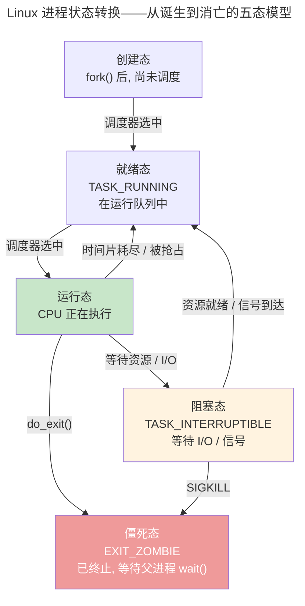
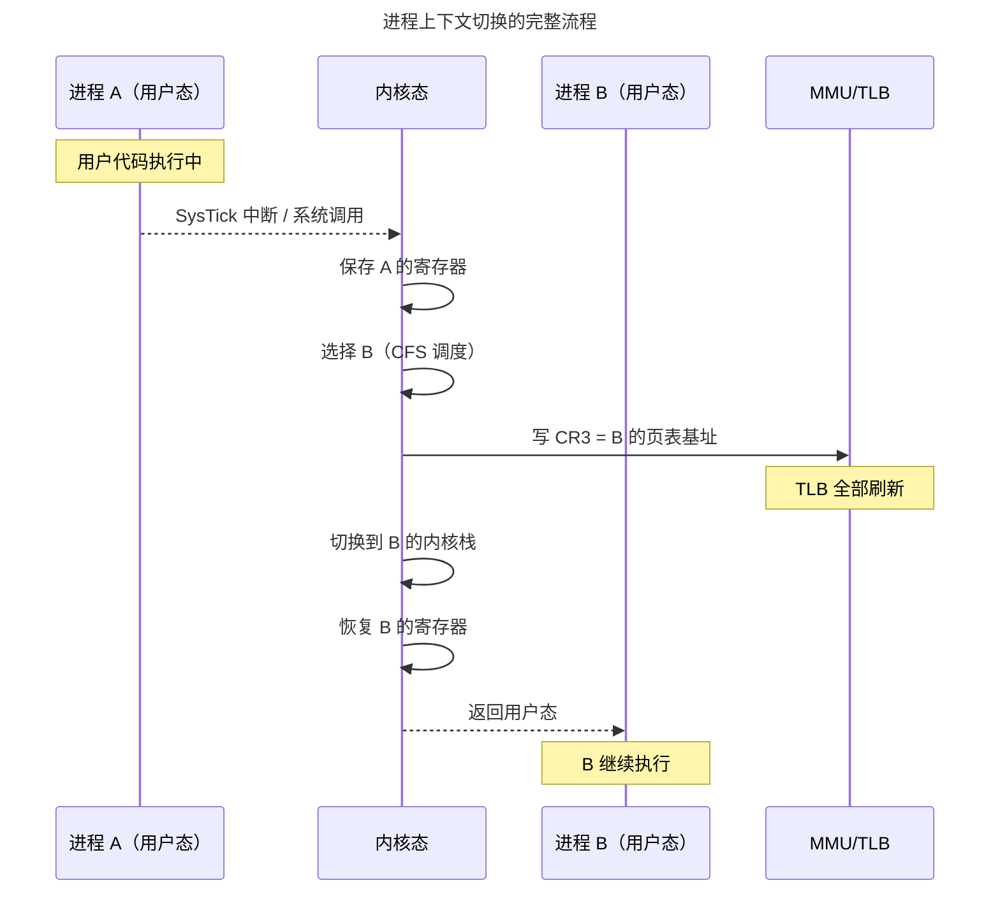

> 操作系统调度万物的基本单位。

如果裸机编程是在一张白纸上用汇编描画整个世界，那么操作系统内核的诞生标志着一个根本性的跃迁——**进程**。进程不是程序本身，而是程序在运行时的动态投影：它的地址空间、它的文件描述符、它的栈和堆、它在 CPU 寄存器中的瞬间切片。

本章从进程模型的基石——PCB——出发，走过线程与轻量级进程的分野，解剖上下文切换的昂贵代价，深入 Linux 的 CFS 调度器和 IPC 通信机制。

---

## 进程模型与 PCB：内核中的任务档案

在 Linux 中，PCB 就是 `task_struct`——内核中最复杂的结构体之一：

| 分类 | 包含字段 | 用途 |
|------|---------|------|
| **调度信息** | `prio`, `se`, `rt`, `policy` | CFS 的红黑树节点、实时优先级 |
| **内存描述符** | `mm_struct *mm` | 页表指针、VMA 链表、地址空间边界 |
| **文件系统** | `fs_struct *fs`, `files_struct *files` | 当前工作目录、打开文件描述符表 |
| **信号处理** | `sigpending`, `sighand` | 挂起信号位图、信号处理函数表 |
| **身份标识** | `pid`, `tgid`, `cred` | 进程 ID、线程组 ID、UID/GID 权限 |

PCB 的精妙之处在于 `mm_struct` 和 `files_struct` 的**引用计数共享**。当 `clone()` 创建线程时，新线程的 `task_struct` 中的 `mm` 指针直接指向同一个 `mm_struct`——这就是线程比进程"轻量"的本质：线程共享地址空间，不需要切换页表。

### 进程状态——生命的轮回

Linux 细化出三种阻塞态：`TASK_INTERRUPTIBLE`（可被信号唤醒——大多数 I/O 等待）、`TASK_UNINTERRUPTIBLE`（不可中断——`vfork()` 等待子进程、直接 I/O 的磁盘等待）、`TASK_KILLABLE`（仅响应致命信号——Linux 2.6.25 引入，解决 D 状态进程无法被杀的问题）。

`ZOMBIE` 的特殊性：进程已释放所有资源（内存、文件、信号），仅保留 `task_struct` 中的退出码——等待父进程 `wait()` 读取。父进程未调用 `wait()` → 僵死进程堆积 → `pid_max` 耗尽。`SIGCHLD` 信号 + `SA_NOCLDWAIT` 或 `prctl(PR_SET_CHILD_SUBREAPER)` 是避免僵死的标准手段。

### fork/exec/clone——进程诞生的三种路径

| 系统调用 | 创建行为 | 共享程度 |
|----------|---------|---------|
| `fork()` | 拷贝父进程的 `task_struct` + `mm_struct`（COW 优化） | PID 和 PPID 不同，其余全拷贝 |
| `vfork()` | 父进程阻塞直到子进程 `exec()` 或 `_exit()` | 共享地址空间（无 COW）——仅用于立即 `exec()` 的场景 |
| `clone()` | 创建新 `task_struct`，按标志位选择性共享 | `CLONE_VM` 共享地址空间（线程），`CLONE_FILES` 共享 fd 表 |

`fork()` 的 COW 优化——子进程并非立即拷贝全部物理页，而是将父进程的所有 PTE 标记为只读。**写时**触发缺页中断，内核才分配新物理页并拷贝内容。现代 Linux 中 `fork()` + `exec()` 的典型开销约 0.2 ms，其中绝大部分用于页表的 COW 标记。

### 线程模型——1:1 vs N:1 vs M:N

| 模型 | 实现 | 代表 | 优势 | 劣势 |
|------|------|------|------|------|
| **1:1** | 每个用户线程 = 1 个内核线程 | Linux `pthread` | 真并行、可独立被调度 | `clone()` 系统调用开销 |
| **N:1** | N 个用户线程复用 1 个内核线程 | 早期 Java 绿线程 | 零系统调用切换 | 一个阻塞全部阻塞、无法利用多核 |
| **M:N** | M 个用户线程映射到 N 个内核线程 | Go goroutine（G:P:M） | 两者折中——轻量 + 真并行 | 调度器复杂 |

Linux 1:1 模型的 "劣势" 在实践中被 futex（`pthread_mutex` 的快路径无系统调用）和 `CLONE_VM`（线程共享地址空间避免页表拷贝）大幅缓解——`pthread_create()` 的延迟已降至 ~10 μs 级别。

---

## 上下文切换：昂贵的角色转换

进程上下文切换是操作系统中最频繁也最昂贵的操作。一次完整的切换包括：

1. **保存硬件上下文**：寄存器保存到 `task_struct->thread`
2. **切换页表**：CR3 指向新进程的页表基地址——TLB 全部失效
3. **切换内核栈**：SP 指向新进程的内核栈
4. **切换 FPU 状态**（延迟切换）：x86 使用 TS 标志位延迟恢复浮点寄存器
5. **恢复硬件上下文**：从新进程的 `task_struct` 恢复寄存器

**切换开销量化**：保存/恢复寄存器 ~0.1 μs，切换页表 ~0.5 μs（TLB flush），TLB 预热 0.5-5 μs，Cache 冷启动 5-50 μs。线程切换省去了"切换页表 + TLB flush"的全套开销——这就是高并发服务器大量使用线程池的原因。

---

## 调度算法：CFS 与 EEVDF

Linux CFS 的哲学：**让每个进程获得与其权重成正比的 CPU 时间**。核心数据结构是一棵按 `vruntime` 排序的红黑树：

$$
\Delta vruntime = \Delta t_{actual} \times \frac{1024}{weight}
$$

调度器始终选择红黑树最左节点（`vruntime` 最小）的进程运行。nice 值 -20 的进程权重约 88761，nice +19 仅约 15——极端情况下 CPU 分配差距近 6000 倍。

Linux 6.6 引入的 EEVDF 在 CFS 基础上增加了**虚拟截止期**（Virtual Deadline）概念。每个进程声明期望的时间片 $T$，调度器计算：

$
\text{vdeadline} = \text{vruntime} + \frac{T}{weight}
$

选择 `vdeadline` 最早的进程运行——而非 `vruntime` 最小的。这意味着：即使某个进程的 `vruntime` 非常低（CPU 时间吃得少），如果它频繁申请极短的时间片（低延迟需求），它也不会"霸占" CPU——因为更大 $T$ 的进程可能有更早的截止期。EEVDF 将 CFS 的 "CPU 公平" 升级为 "**时延公平**"——解决了音频播放、游戏渲染等延迟敏感型负载在 CFS 下的抖动问题。

---

## 进程间通信

| 机制 | 数据单位 | 典型场景 |
|------|---------|---------|
| **管道**（Pipe） | 字节流（64KB 缓冲区） | Shell 管道 `cat \| grep` |
| **消息队列**（POSIX MQ） | 带优先级的离散消息 | 嵌入式任务间通信 |
| **共享内存** | 字节数组 | 高频大数据（零拷贝！） |
| **信号**（Signal） | 1 bit 通知 | SIGINT (Ctrl+C)、SIGKILL |
| **Unix Socket** | 字节流/数据报 | 前后端本地通信 |

---

## 跨卷连接

| 本章概念 | 依赖的底层原理 | 支撑的上层抽象 |
|----------|---------------|---------------|
| PCB 与 task_struct | [RTOS TCB 的最小信息集](../02-jiezi/03-rtos-fundamentals/#任务控制块tcb) | [容器与 K8s Pod](../../08-qianli/02-system-design/) |
| 进程状态机 + fork/exec/clone | [ARM64 EL0→EL1 异常级切换](../02-jiezi/02-interrupts/) | [Docker `runc` 的 clone 标志位组合](../../08-qianli/03-devops-practices/) |
| 上下文切换页表更新 | [TLB 结构与地址翻译](../../01-weichen/04-memory-hierarchy/#cache-组织形式容量速度与复杂度的三角博弈) | [Go goroutine G:P:M 调度](../../08-qianli/01-design-patterns-and-principles/) |
| CFS + EEVDF 调度器 | [RISC-V M-mode 中断](../02-jiezi/02-interrupts/) | [分布式任务调度](../../04-yuanhai/05-data-pipelines/) |
| 管道与消息队列 | [FreeRTOS 队列拷贝传递](../02-jiezi/03-rtos-fundamentals/) | [Kafka 分区日志](../../04-yuanhai/05-data-pipelines/) |

:::tip[卷三内部路径]
- [**内存管理**](../02-memory-management/)：`mm_struct` 与页表
- [**同步原语**](../04-synchronization/)：futex——进程间同步的核心机制
- [**网络编程**](../08-network-programming/)：epoll——高并发 I/O 的基石
:::
