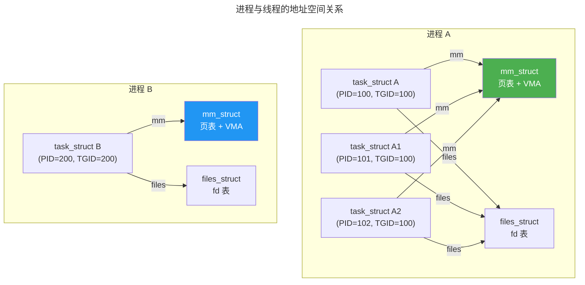
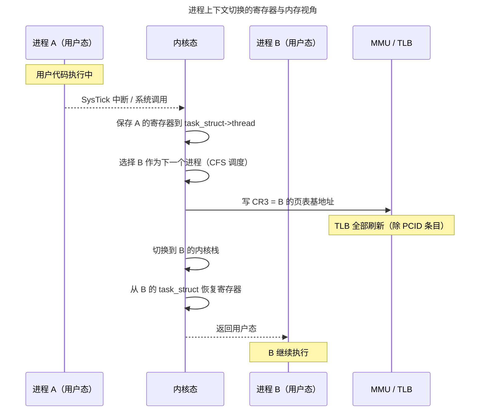

> 操作系统调度万物的基本单位。

如果裸机编程是在一张白纸上用汇编描画整个世界，那么操作系统内核的诞生标志着一个根本性的跃迁——**进程**。进程不是程序本身，而是程序在运行时的动态投影：它的地址空间、它的文件描述符、它的栈和堆、它在 CPU 寄存器中的瞬间切片。内核的存在意义，就是同时管理成百上千个这样的投影，让每一个都误以为自己是整台机器的唯一主人。

本章从进程模型的基石——PCB——出发，走过线程与轻量级进程的分野，解剖上下文切换的昂贵代价，然后深入 Linux 的 CFS 调度器和 IPC 通信机制。卷二的 RTOS 任务模型是本章在嵌入式领域的小型投影——读完本章后，你将理解为什么 RTOS 的 TCB 刻意省略了页表指针。

---

## 进程模型与 PCB：内核中的任务档案

### 进程控制块的结构

操作系统中的每个进程都有一个对应的**进程控制块**（PCB，Process Control Block）。在 Linux 中，PCB 就是 `task_struct`——内核中最复杂、最庞大的结构体之一，包含了描述一个进程所需的全部元数据：

| 分类 | 包含字段 | 用途 |
|------|---------|------|
| **调度信息** | `prio`, `se`, `rt`, `policy` | CFS 调度器的红黑树节点、实时优先级 |
| **内存描述符** | `mm_struct *mm` | 页表指针、VMA 链表、地址空间边界 |
| **文件系统** | `fs_struct *fs`, `files_struct *files` | 当前工作目录、打开文件描述符表 |
| **信号处理** | `sigpending`, `sighand` | 挂起信号位图、信号处理函数表 |
| **身份标识** | `pid`, `tgid`, `cred` | 进程 ID、线程组 ID、UID/GID 权限 |
| **父子关系** | `parent`, `children`, `sibling` | 进程树的双向链表 |

PCB 的精妙之处在于 `mm_struct` 和 `files_struct` 的**引用计数共享**。当 `clone()` 创建线程时，新线程的 `task_struct` 中的 `mm` 指针直接指向同一个 `mm_struct`——这意味着所有线程共享同一套页表，这正是线程比进程"轻量"的本质原因。

:::tip[跨卷链接]
PCB 的 `mm_struct` 指向的页表根地址（x86 的 CR3 寄存器）最终由 [MMU/TLB 硬件](../../01-weichen/04-memory-hierarchy/#cache-组织形式)进行地址翻译。上下文切换时 CR3 的更新自动使 TLB 失效（除非使用 PCID），这一硬件行为直接影响切换开销。
:::

### 进程树与生命周期

Linux 的第一个进程是 `init`（PID 1），由内核在启动过程中手动构造。此后所有进程都由 `fork()` 或 `clone()` 从已有进程复制产生——整个系统的进程形成一棵以 `init` 为根的**进程树**。

进程的五种状态：

| 状态 | 宏 | 含义 |
|------|---|------|
| **Running** | `TASK_RUNNING` | 正在执行或就绪等待 CPU |
| **Interruptible Sleep** | `TASK_INTERRUPTIBLE` | 可被信号唤醒的睡眠 |
| **Uninterruptible Sleep** | `TASK_UNINTERRUPTIBLE` | 无法被信号打断（等待磁盘 I/O 等不可中断操作） |
| **Stopped** | `TASK_STOPPED` | 收到 SIGSTOP 被暂停 |
| **Zombie** | `EXIT_ZOMBIE` | 已终止但父进程尚未 `wait()` |

---

## 上下文切换：昂贵的角色转换

### 切换的完整流程

进程上下文切换是操作系统中最频繁也最昂贵的操作之一。以 Linux 为例，一次完整的进程切换包括：

1. **保存硬件上下文**：将当前进程的寄存器（通用寄存器、PC、SP、标志寄存器）保存到 `task_struct` 的 `thread` 字段
2. **切换页表**：将 CR3 寄存器指向新进程的页表基地址——这一步使 TLB 中属于旧进程的条目全部失效
3. **切换内核栈**：将 SP 指向新进程的内核栈
4. **切换 FPU 状态**（延迟切换）：x86 使用 `TS` 标志位延迟保存/恢复浮点寄存器——如果新进程不使用浮点，则完全跳过
5. **恢复硬件上下文**：从新进程的 `task_struct` 恢复寄存器

### 切换开销的量化分析

一次进程上下文切换的典型开销：

| 成本项 | 典型时间 | 备注 |
|--------|---------|------|
| 保存/恢复寄存器 | ~0.1 μs | 几十条 `mov` 指令 |
| 切换页表（写 CR3） | ~0.5 μs | 触发 TLB flush |
| TLB 预热（重填） | 0.5 ~ 5 μs | 取决于新进程的工作集大小和 Cache 热度 |
| Cache 冷启动 | 5 ~ 50 μs | L1/L2/L3 Cache 逐级重新填充 |

**每次上下文切换的总成本通常在 1-10 μs**，但 TLB 和 Cache 的间接成本可能高达数十微秒。这就是为什么线程切换比进程切换快——线程共享页表，省去了"切换页表 + TLB flush + Cache 预热"的全套开销。

---

## 调度算法：CFS 的红黑树与 EEVDF

### CFS：完全公平调度器

Linux 的 CFS（Completely Fair Scheduler）用一句话概括其哲学：**让每个进程获得与其权重成正比的 CPU 时间，且永远选择虚拟运行时间最小的进程运行**。

核心数据结构是一棵**红黑树**（Red-Black Tree），按 `vruntime`（虚拟运行时间）排序：

- 进程运行时，`vruntime` 增加——增量与实际运行时间成正比，与权重成反比
- 调度器始终选择红黑树最左节点（`vruntime` 最小）的进程运行
- `vruntime` 的增长率公式：

$$
\Delta vruntime = \Delta t_{actual} \times \frac{1024}{weight}
$$

其中 `weight` 由 nice 值（-20 到 +19）映射而来。nice=-20 的进程权重约为 88761，nice=+19 仅约 15——极端情况下，高优先级进程获得近 6000 倍的 CPU 时间。

:::note[nice 值的起源]
`nice` 这个名字的历史可以追溯到 1970 年代的 UNIX：一个"友好"（nice）的进程会主动降低自己的优先级，把 CPU 时间让给其他进程。`nice` 值越高，进程越"友好"，优先级越低——这种反向命名是 UNIX 幽默感的经典范例。
:::

### EEVDF：截止期驱动的下一代

Linux 6.6 引入了 EEVDF（Earliest Eligible Virtual Deadline First）调度器，在 CFS 的基础上增加了**请求时间片**（request）和**虚拟截止期**（virtual deadline）的概念。每个进程声明它期望的时间片长度，调度器计算出该时间片对应的虚拟截止期，始终选择截止期最近的进程运行。EEVDF 解决了 CFS 在某些场景下的延迟抖动问题。

---

## 进程间通信：内核提供的数据通道

| 机制 | 数据单位 | 是否有界 | 是否阻塞 | 典型场景 |
|------|---------|---------|---------|----------|
| **管道**（Pipe） | 字节流 | 有界缓冲区（通常 64KB） | 读空阻塞 / 写满阻塞 | Shell 管道 `cat \| grep` |
| **命名管道**（FIFO） | 字节流 | 同管道 | 同管道 | 无亲缘关系的进程间通信 |
| **消息队列**（POSIX MQ） | 带优先级的离散消息 | 有界 | 可阻塞/非阻塞 | 嵌入式任务间通信 |
| **共享内存** | 字节数组 | 无界（受限于映射大小） | 不阻塞（需同步） | 高频大数据传输 |
| **信号**（Signal） | 1 bit 通知 | 无界 | 接收方异步处理 | `SIGINT`(Ctrl+C)、`SIGKILL` |
| **Unix Domain Socket** | 字节流/数据报 | 有界缓冲区 | 同 TCP/UDP | 前后端本地通信 |

共享内存是**最快的 IPC 机制**——数据拷贝次数为零。但共享内存本身不提供同步，必须配合信号量或 futex 使用。在 RTOS 中，[消息队列](../02-jiezi/03-rtos-fundamentals/#消息队列与事件组任务间的数据流动) 是 IPC 的主力——这是嵌入式单地址空间与 Linux 多地址空间 IPC 模型的根本差异。

---

## 跨卷连接

进程是操作系统的核心抽象，向下连接硬件的 MMU/TLB/中断控制器，向上为分布式系统和 AI 推理引擎提供隔离与调度基础：

| 本章概念 | 依赖的底层原理 | 支撑的上层抽象 |
|----------|---------------|---------------|
| PCB 与 task_struct | [RTOS TCB 的最小信息集](../02-jiezi/03-rtos-fundamentals/#任务控制块tcb) | [容器与 Kubernetes Pod](../../08-qianli/02-system-design/) |
| 上下文切换页表更新 | [TLB 结构与地址翻译](../../01-weichen/04-memory-hierarchy/#cache-组织形式) | [Hypervisor 的 VMCS 切换](../../02-jiezi/01-bare-metal/) |
| CFS 红黑树调度 | [RISC-V 特权级与 M-mode 中断](../02-jiezi/02-interrupts/#中断控制器硬件仲裁者) | [分布式任务调度](../../04-yuanhai/05-data-pipelines/) |
| 管道与消息队列 | [FreeRTOS 队列拷贝传递](../02-jiezi/03-rtos-fundamentals/#消息队列与事件组任务间的数据流动) | [Kafka 消息队列](../../04-yuanhai/05-data-pipelines/) |
| 共享内存 | [Cache 一致性协议 MOESI](../../01-weichen/04-memory-hierarchy/#cache-一致性协议) | [GPU VRAM 共享与 RDMA](../../04-yuanhai/03-distributed-fundamentals/) |
| 信号（Signal） | [中断向量表与 ISR 入口](../02-jiezi/02-interrupts/#向量表与-isr-入口从硬件到软件的一跃) | [Kubernetes Pod 终止信号 SIGTERM](../../08-qianli/03-devops-practices/) |

:::tip[卷三内部路径]
- [**内存管理**](../02-memory-management/)：`mm_struct` 与页表——进程地址空间的底层
- [**文件系统**](../03-filesystem/)：文件描述符——进程 I/O 操作的接口
- [**同步原语**](../04-synchronization/)：futex 与信号量——进程间同步的核心机制
- [**网络协议栈 I**](../05-network-protocol-stack/)：Socket 的本质——进程的网络视图
- [**网络编程**](../08-network-programming/)：epoll/io_uring——高并发进程的 I/O 多路复用
:::
