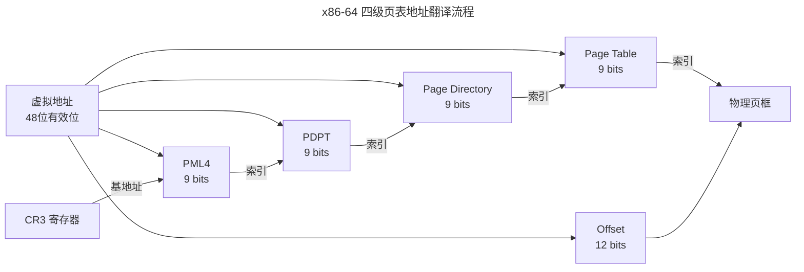

> 虚拟内存是最伟大的抽象之一。

1961 年，曼彻斯特大学的 Atlas 计算机首次实现了**虚拟内存**——程序看到的地址不再是物理内存中的真实位置，而是经过一层硬件翻译的"虚拟地址"。六十年后，从手机 SoC 到数据中心服务器，这层翻译依然存在，层数从一级变成了四级甚至五级。

虚拟内存解决的不是一个问题，而是四个：**隔离**（进程 A 不能访问进程 B 的内存）、**扩展**（程序可以使用比物理内存更大的地址空间）、**简化**（链接器只需处理统一的地址布局）、**保护**（标记页为只读/不可执行）。本章从分段与分页的历史路线之争出发，解剖 x86-64 的四级页表、TLB 的硬件加速和 Linux 的缺页中断处理。

---

## 分段 vs 分页：两条路线的汇合

### 分段：逻辑单元的自然映射

分段（Segmentation）按程序的逻辑结构分配内存——代码段、数据段、栈段各占一段。Intel 8086 的 16 位实模式完全基于分段：`CS:IP` 寻址代码，`SS:SP` 寻址栈，`DS:SI` 寻址数据。但分段的根本问题是**外部碎片**——段与段之间无法利用的空隙积累，最终导致有足够总量内存、却没有足够连续空间的问题。

### 分页：固定大小的均匀划分

分页（Paging）将物理内存分为固定大小的帧（通常 4KB），虚拟地址空间分为同样大小的页。任意虚拟页可以映射到任意物理帧——无需连续，完全消除外部碎片。

现代架构早已将两者结合：x86-64 保留了段寄存器（CS/DS/SS/ES），但段基址被强制设为 0，段长设为最大值——分段实际上被"架空"，所有地址翻译由分页机制完成。唯一的例外是 `FS` 和 `GS` 段寄存器，它们仍然携带非零基址，分别用于线程局部存储（TLS）和每 CPU 数据区。

:::tip[跨卷链接]
页表条目的 PT（Page Table）级别最终指向物理页框号（PFN），这个 PFN 对应的是 [DRAM 存储单元](../../01-weichen/04-memory-hierarchy/#dram-内部结构一个单元的微观世界) 中的行地址和列地址。虚拟地址翻译的终点是 DRAM 控制器的命令序列——ACTIVATE → READ/WRITE → PRECHARGE。
:::

### 页表条目的结构

每个页表条目（PTE，Page Table Entry）不仅包含物理页框号，还包含一组控制位：

| 位 | 名称 | 含义 |
|----|------|------|
| P（Present） | 存在位 | 页在物理内存中？0 = 缺页 |
| R/W | 读写位 | 0 = 只读，1 = 可写 |
| U/S | 用户/超级用户 | 0 = 仅内核可访问 |
| A（Accessed） | 访问位 | 该页被读过或写过（用于页面置换决策） |
| D（Dirty） | 脏位 | 该页被写过（写回磁盘时仅需写回脏页） |
| NX（No-Execute） | 不可执行 | 防止栈上的代码执行（DEP/W^X 的硬件基础） |

---

## TLB：地址翻译的硬件缓存

TLB（Translation Lookaside Buffer）是 MMU 内部的**全相联高速缓存**，缓存近期使用的虚拟页到物理帧的映射。TLB 的容量极小（通常 32-1024 条目），但命中率极高（通常 > 99.9%），因为程序的内存访问模式天然具有[空间局部性](../../01-weichen/04-memory-hierarchy/#局部性原理程序的记忆曲线)。

TLB 未命中时，硬件（x86）或软件（MIPS）必须遍历页表——四级页表的完整遍历需要四次内存访问（PML4 → PDPT → PD → PT）。为了避免这一开销，现代处理器引入**中间页表缓存**（MMU Cache），将部分页表条目缓存在 MMU 内部，减少完整遍历的频率。

:::note[Huge Pages：一个 TLB 条目映射更大的区域]
标准 4KB 页的 TLB 覆盖率有限——即使是 1024 条目的 TLB，也只能覆盖 4MB 的地址空间。2MB 的 Huge Page 将覆盖率提升 512 倍：同样 1024 条目可以覆盖 2GB。这正是数据库和 JVM 等大量使用内存的应用启用 Huge Pages 后性能提升的核心原因——TLB 失效率大幅下降。
:::

---

## 缺页中断与页面置换

### 三种缺页类型

当 CPU 访问一个 PTE 的 Present 位为 0 的虚拟地址时，触发**缺页中断**（Page Fault）。Linux 内核根据缺页的上下文分为三种处理路径：

| 类型 | 触发条件 | 内核处理 |
|------|---------|---------|
| **Minor Fault** | 页已在内存但未映射到当前页表 | 直接映射（如 COW 后的写操作） |
| **Major Fault** | 页不在内存，需从磁盘读取 | 发起磁盘 I/O，进程进入 Uninterruptible Sleep |
| **Invalid Fault** | 访问越界内存或权限错误 | 发送 SIGSEGV，终止进程 |

Minor Fault 极快（~1 μs），Major Fault 涉及磁盘 I/O 代价极高（~10 ms）。虚拟内存的性能秘密在于让 Major Fault 极少发生。

### 页面置换算法

当物理内存耗尽，内核必须选择一页踢出内存。Linux 使用**双链表 LRU 近似算法**（Active + Inactive 链表），基于 PTE 的 Accessed 位进行第二次机会（Second Chance）的近似：

- 扫描 Inactive 链表尾部的页面
- 检查其 Accessed 位——如果为 1，表示最近被访问过，清除 Accessed 位并移到 Active 链表头部
- 如果 Accessed 位为 0，该页被选中换出

这种"时钟算法"的变体避免了全局 LRU 的高开销，但仍保持了对访问模式的合理近似。

---

## mmap：统一文件与内存的接口

`mmap()` 系统调用是 Linux 内存管理最精巧的设计之一——它将文件**直接映射到进程的虚拟地址空间**。之后对映射区域的读写操作透明地转换为对文件的读写，由缺页中断驱动实际 I/O。

`mmap` 的核心优势：

- **零拷贝**：数据从磁盘页缓存直接复制到用户空间，无需经过中间的 `read()` 缓冲区
- **按需加载**：只在实际访问的页上触发 I/O（demand paging）
- **共享映射**：多个进程的同一文件映射指向同一物理页——IPC 的理想选择

---

## 跨卷连接

虚拟内存是操作系统中最具"硬件味"的子系统——每一层页表、每一次 TLB 命中、每一个缺页中断，都直接触及 MMU 硬件的物理极限：

| 本章概念 | 依赖的底层原理 | 支撑的上层抽象 |
|----------|---------------|---------------|
| 四级页表遍历 | [TLB 组相联结构与替换策略](../../01-weichen/04-memory-hierarchy/#cache-组织形式) | [Hypervisor 的嵌套页表（EPT/NPT）](../../02-jiezi/01-bare-metal/) |
| Huge Pages（2MB/1GB） | [DRAM 行缓冲命中与刷新](../../01-weichen/04-memory-hierarchy/#dram-内部结构一个单元的微观世界) | [数据库 Buffer Pool 管理](../../04-yuanhai/01-relational-database/) |
| 缺页中断的磁盘 I/O | [存储金字塔与延迟鸿沟](../../01-weichen/04-memory-hierarchy/#存储金字塔从寄存器到磁带的七重天) | [文件系统 Page Cache](../03-filesystem/) |
| mmap 零拷贝映射 | [DMA 直接访问物理内存](../02-jiezi/04-peripheral-drivers/#dma解放-cpu-的数据搬运工) | [RDMA 远程直接内存访问](../../04-yuanhai/03-distributed-fundamentals/) |
| Accessed / Dirty 位 | [PTE 硬件自动更新机制](../../01-weichen/03-microarchitecture/#流水线处理器将时间维度展开为空间) | [数据库检查点与写回策略](../../04-yuanhai/02-storage-engine/) |
| COW（写时复制） | [fork() 的延迟页表拷贝](../01-process-and-thread/) | [容器镜像的联合文件系统（OverlayFS）](../../08-qianli/02-system-design/) |

:::tip[卷三内部路径]
- [**进程与线程**](../01-process-and-thread/)：`mm_struct`——地址空间的所有者
- [**文件系统**](../03-filesystem/)：Page Cache——缺页中断的磁盘侧
- [**同步原语**](../04-synchronization/)：COW 的原子性保证——多核同步的核心挑战
:::
