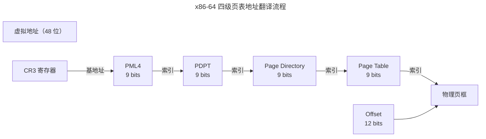

> 虚拟内存是最伟大的抽象之一。

1961 年，Atlas 计算机首次实现了虚拟内存。六十年后，从手机 SoC 到数据中心服务器，这层地址翻译依然存在。虚拟内存解决的四个问题：**隔离**、**扩展**、**简化**、**保护**。本章解剖分段与分页、x86-64 四级页表、TLB 硬件加速和 Linux 缺页中断处理。

---

## 分段 vs 分页

分段按照程序的逻辑结构分配内存——但外部碎片使其难以扩展。分页将物理内存分为固定大小的帧（4KB），虚拟地址空间分为同样大小的页——任意虚拟页可映射到任意物理帧，消除外部碎片。

现代 x86-64 保留了段寄存器但将其基址强制为 0——分段实际上被"架空"，仅 `FS`/`GS` 用于 TLS 和 per-CPU 数据。

---

## x86-64 四级页表

每个 PTE 携带控制位：Present（缺页）、R/W（读写）、U/S（内核/用户）、A（访问过？）、D（写过？）、NX（不可执行）。

---

## TLB：地址翻译的硬件缓存

TLB 是 MMU 内部的**全相联高速缓存**（通常 32-1024 条目）。命中率 > 99.9%，因为程序天然具有[空间局部性](../../01-weichen/04-memory-hierarchy/#局部性原理程序的记忆曲线)。未命中时需遍历四级页表——四次内存访问。现代处理器引入**中间页表缓存**（MMU Cache）减少完整遍历。

**Huge Pages**（2MB/1GB）：一个 TLB 条目覆盖 512 倍于 4KB 页的区域——数据库和 JVM 的 TLB 失效率大幅下降。

---

## 缺页中断与页面置换

| 类型 | 触发 | 延迟 |
|------|------|------|
| **Minor Fault** | 页在内存但未映射到当前页表 | ~1 μs |
| **Major Fault** | 页不在内存，需从磁盘读取 | ~10 ms |
| **Invalid Fault** | 越界或权限错误 | → SIGSEGV |

Linux 使用**双链表 LRU 近似**（Active + Inactive 链表），基于 PTE 的 Accessed 位进行第二次机会近似——改造版的时钟算法。

---

## mmap：统一文件与内存

`mmap()` 将文件直接映射到进程虚拟地址空间。读写映射区域的操作透明转换为文件 I/O，由缺页中断驱动。核心优势：零拷贝（避免 `read()` 的中间缓冲区）、按需加载（demand paging）、共享映射（IPC）。

---

## 跨卷连接

| 本章概念 | 依赖的底层原理 | 支撑的上层抽象 |
|----------|---------------|---------------|
| 四级页表 | [TLB 组相联与替换策略](../../01-weichen/04-memory-hierarchy/) | [Hypervisor 嵌套页表（EPT）](../02-jiezi/01-bare-metal/) |
| Huge Pages | [DRAM 行缓冲命中与刷新](../../01-weichen/04-memory-hierarchy/) | [数据库 Buffer Pool](../../04-yuanhai/01-relational-database/) |
| 缺页中断 | [存储金字塔延迟鸿沟](../../01-weichen/04-memory-hierarchy/) | [文件系统 Page Cache](../03-filesystem/) |
| mmap 零拷贝 | [DMA 直接访问物理内存](../02-jiezi/04-peripheral-drivers/) | [RDMA 远程内存访问](../../04-yuanhai/03-distributed-fundamentals/) |

:::tip[卷三内部路径]
- [**进程与线程**](../01-process-and-thread/)：`mm_struct`——地址空间的所有者
- [**文件系统**](../03-filesystem/)：Page Cache——缺页中断的磁盘侧
- [**同步原语**](../04-synchronization/)：COW——多核同步的核心挑战
:::
