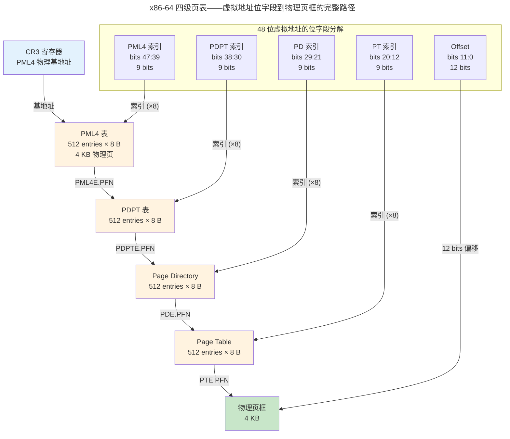
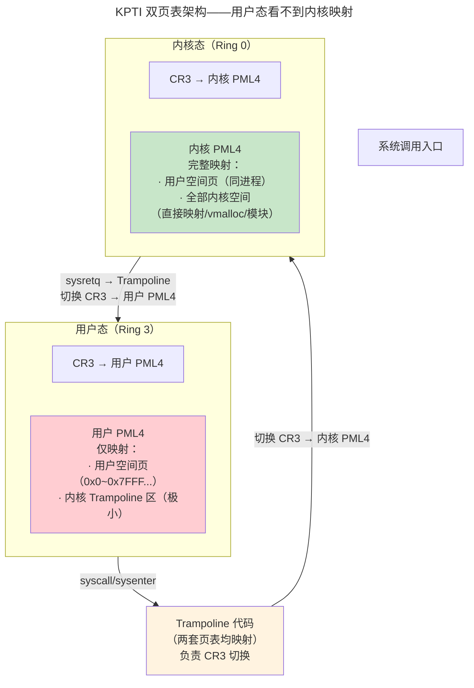
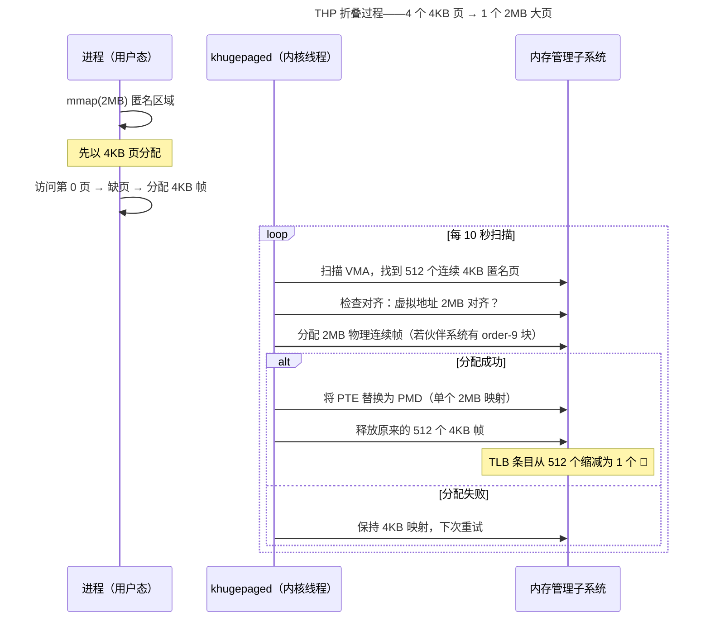
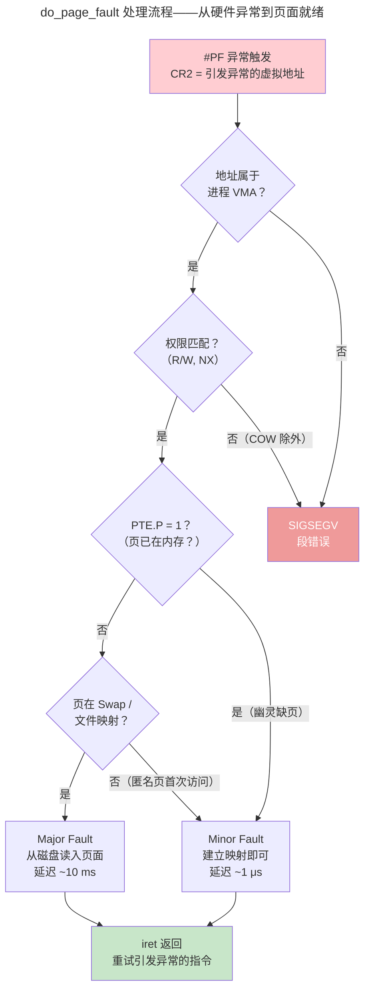
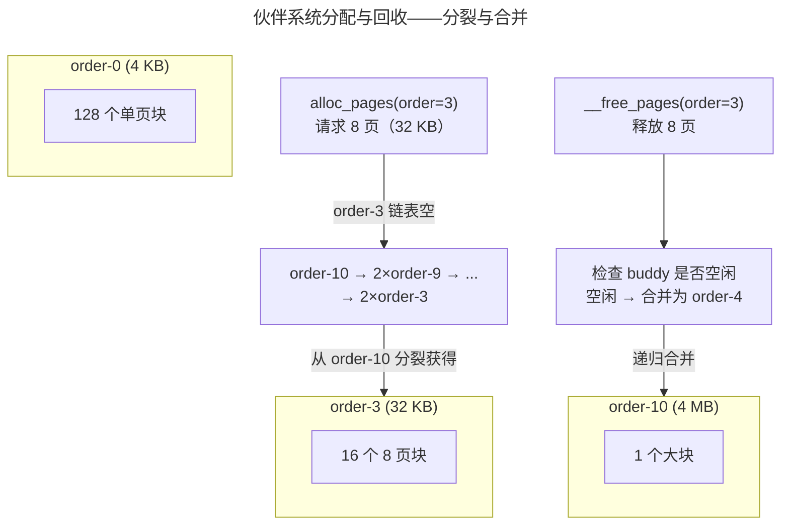

> 虚拟内存是最伟大的抽象之一。

1961 年，Atlas 计算机首次实现了虚拟内存。六十年后，从手机 SoC 到数据中心服务器，这层地址翻译依然存在。虚拟内存解决的四个问题：**隔离**、**扩展**、**简化**、**保护**。本章解剖分段与分页、x86-64/AArch64/RISC-V 三大架构的多级页表、TLB 硬件加速和 Linux 缺页中断处理。

---

## 分段 vs 分页

分段按照程序的逻辑结构分配内存——但外部碎片使其难以扩展。分页将物理内存分为固定大小的帧（4KB），虚拟地址空间分为同样大小的页——任意虚拟页可映射到任意物理帧，消除外部碎片。

现代 x86-64 保留了段寄存器但将其基址强制为 0——分段实际上被"架空"，仅 `FS`/`GS` 用于 TLS 和 per-CPU 数据。

---

## x86-64 四级页表

### 虚拟地址的位字段分解

x86-64 的 48 位虚拟地址被硬件切分为 **4 级索引 + 页内偏移**，每一级索引选择下一级页表中的条目：

```
虚拟地址 (48 bits)
├─ bits 47:39 → PML4 索引 (9 bits) → 选择 PML4E（Page Map Level 4 Entry）
├─ bits 38:30 → PDPT 索引 (9 bits) → 选择 PDPTE（Page Directory Pointer Table Entry）
├─ bits 29:21 → PD   索引 (9 bits) → 选择 PDE（Page Directory Entry）
├─ bits 20:12 → PT   索引 (9 bits) → 选择 PTE（Page Table Entry）
└─ bits 11:0  → 页内偏移 (12 bits) → 4 KB 页内的字节偏移
```

每级页表恰好占据一个 4KB 物理页——容纳 512 个 8 字节条目（$512 \times 8 = 4096$）。9 bits 索引意味着每一级可以索引 $2^9 = 512$ 个条目——这不是巧合，而是**硬件设计约束与页表大小对齐**的精确结果。



> **为什么是 48 位而非 64 位？** 虚拟地址的高 16 位（bits 63:48）必须全为 0 或全为 1（符号扩展）——形成一个"空洞"。这并非浪费：48 位已提供 256 TB 地址空间（128 TB 用户 + 128 TB 内核），足够容纳所有现有工作负载。Intel 在 5 级页表中扩展至 57 位（128 PB）。

每个 PTE 携带控制位：Present（缺页）、R/W（读写）、U/S（内核/用户）、A（访问过？）、D（写过？）、NX（不可执行）。

### PTE 位字段逐位解读

x86-64 的 64 位 PTE 中，低 12 位为标志位，高 40 位（MAXPHYADDR 限制下）为物理页框号（PFN）。关键标志位：

| 位 | 名称 | 作用 |
|----|------|------|
| 0 | **P** (Present) | 0 = 缺页，触发 page fault；MMU 不检查其余位 |
| 1 | **R/W** | 0 = 只读；与 CR0.WP 配合实现 COW 写时复制 |
| 2 | **U/S** | 0 = 仅内核可访问；SMAP/SMEP 依赖此位 |
| 5 | **A** (Accessed) | 硬件自动置 1；OS 周期性清除以追踪"最近访问过"——Clock 算法的核心 |
| 6 | **D** (Dirty) | 硬件在写操作时置 1；页面换出时，D=1 需写回磁盘，D=0 可直接丢弃 |
| 63 | **NX** (No eXecute) | 0 = 可执行；`mmap(PROT_EXEC)` 依赖此位 |

> A 位和 D 位的精妙之处：**硬件自动维护，软件按需清 0** —— 一个 1-bit 的计数器实现了 LRU 近似，无需软件每次内存访问都更新数据结构。

### x86-64 五级页表——56 位虚拟地址的扩展

Ice Lake 服务器处理器引入了 5 级页表（`la57`），在 PML4 之上增加 **PML5** 层，将虚拟地址扩展至 57 位（bits 56:48 为新增的 PML5 索引）。CR4.LA57 控制是否启用。Linux 启动时根据 CPUID 检测 5 级支持——内核镜像同时包含 4 级和 5 级页表的初始映射代码。

### KPTI——Meltdown 如何重塑了页表的结构

2018 年 1 月，Meltdown 漏洞（CVE-2017-5754）暴露了 x86-64 页表设计中的一个根本性缺陷：**即使 PTE 的 U/S 位标为内核页，投机执行仍可暂态地绕过权限检查**，将内核内存的内容泄露到用户态缓存侧信道。

**漏洞原理**：乱序执行核心在等待 U/S 权限检查完成的间隙，已经将内核地址的数据加载到 cache line——即使最终权限检查失败、结果被丢弃，cache 的状态变化仍然可被 Flush+Reload 等侧信道攻击观测。

**KPTI 的核心方案**——每个进程不再只有一套页表，而是**两套**：



Trampoline 是一段极小的内核代码（包含系统调用入口/出口桩、中断描述符表 IDT、per-CPU 变量区和 NMI 栈），在**两套页表中都映射**——这是用户态和内核态之间唯一的"桥梁"。用户 PML4 中内核空间的高 256 个 entry（slots 256-511）几乎全部标记为 P=0——投机执行无法通过不存在的映射读取内存。

**性能代价与 PCID 优化**：每次 CR3 写入都会刷新全部 TLB 条目。若无优化，KPTI 的 syscall 延迟增加 5%-30%（数据库负载尤其严重）。x86-64 的 **PCID**（Process-Context Identifier，12-bit）将每个 TLB 条目与一个 ASID 标签关联——CR3 写入时只刷新当前 PCID 的条目，其他 PCID 的条目保留。KPTI 为每个进程分配两个 PCID（一个用于用户 PML4，一个用于内核 PML4），syscall 切换仅有 ~100 cycles 的额外开销。启用 PCID 后典型性能损失降至 0.5%-5%。

> **ARM64 不受 Meltdown 影响吗？** Cortex-A75 同样存在 Meltdown——但 ARM64 的 TTBR0_EL1/TTBR1_EL1 双寄存器天然隔离了用户态和内核态的地址空间，在硬件层面完成了 KPTI 等效的隔离。但 ARM64 仍需为部分实现启用 KPTI-asid 变体。

`/proc/cpuinfo` 中的 `pti` 标志和 `dmesg | grep 'Kernel/User page tables isolation'` 可确认 KPTI 状态。现代 CPU（Intel Cascade Lake+、AMD Zen 2+）具有硬件 Meltdown 修复，可通过 `nopti` 内核参数关闭 KPTI 以恢复性能。

---

## AArch64 页表——双区翻译与多级可变深度

ARM64 的 MMU 哲学与 x86-64 有根本差异：**页表层数可变**、**颗粒度可选**、**用户态和内核态使用不同的翻译表基址寄存器**。

### 虚拟地址分区——TTBR0 与 TTBR1

AArch64 将 64 位虚拟地址空间一分为二，各自使用独立的根页表：

```
TTBR0_EL1 → 用户空间（0x0000_0000_0000_0000 ~ 0x0000_FFFF_FFFF_FFFF）
TTBR1_EL1 → 内核空间（0xFFFF_0000_0000_0000 ~ 0xFFFF_FFFF_FFFF_FFFF）
```

两个区域各占最高有效位（bit 55）为 0 或 1 的半区，中间是巨大的不可访问空洞。`TCR_EL1.T0SZ` 和 `TCR_EL1.T1SZ` 控制每区实际使用的地址位数——减去高位未使用的 bit 数，即为起始页表层级。

### 翻译颗粒度与表层级

AArch64 支持三种页大小（颗粒度），每级页表容纳的条目数随颗粒度变化：

| 颗粒度 | 页大小 | 每表条目数 | VA 索引位宽/级 | 最大层级 |
|--------|--------|-----------|---------------|---------|
| 4 KB | 4 KB | 512 (9 bits) | 9 bits | 4 级（48-bit VA）|
| 16 KB | 16 KB | 2048 (11 bits) | 11 bits | 4 级（52-bit VA）|
| 64 KB | 64 KB | 8192 (13 bits) | 13 bits | 3 级（52-bit VA）|

> **4 KB 颗粒度下的 48 位 VA 分解**（Linux 默认配置）：
> ```
> bits 47:39 → L0 索引 (9 bits)
> bits 38:30 → L1 索引 (9 bits)
> bits 29:21 → L2 索引 (9 bits)
> bits 20:12 → L3 索引 (9 bits)
> bits 11:0  → 页内偏移 (12 bits)
> ```

AArch64 的层级从 **L0** 开始向下到 L3（x86-64 则从 PML4 向下到 PT），但语义完全等价。`TCR_EL1.T0SZ` 设为 16（64 - 16 = 48 位 VA 已用），起始层级即为 L0——需要遍历全部 4 级。

### 块映射——中间层级的"大页"

AArch64 的独特之处在于**任何非叶级表项都可以直接映射一个块**（Block），无需走到最后一页：

| 层级 | 4KB 颗粒度的块大小 | 16KB 颗粒度 | 64KB 颗粒度 |
|------|-------------------|------------|------------|
| L0 | —（仅 Table 描述符） | — | — |
| L1 | 1 GB（Block） | 32 GB | — |
| L2 | 2 MB（Block） | 32 MB（16KB 颗粒度）/ 512 MB（64KB） | 4 GB |
| L3 | 4 KB（Page） | 16 KB | 64 KB |

表项 bit[1] 决定是 Table（指向下一级）还是 Block/Page（终结点）。这是比 x86-64 Huge Pages 更优雅的设计——**大页不是"特殊配置"，而是翻译路径上自然终止的结果**。

### 双级 TLB——IPA 空间的第二阶段翻译

在虚拟化场景下（EL2 Hypervisor），ARM64 引入第二阶段翻译（Stage-2 Translation）：Guest OS 的"物理地址"实际上是 **IPA**（Intermediate Physical Address），Hypervisor 用另一套页表将 IPA 翻译为真实的物理地址：

```
Guest VA → Stage-1 (Guest OS 管理)  → IPA → Stage-2 (Hypervisor 管理) → PA
```

Stage-1 页表基址在 `TTBR0_EL1`，Stage-2 页表基址在 `VTTBR_EL2`。每次 Guest 内存访问在最坏情况下需要 **24 次内存访问**（4 级 Stage-1 + 4 级 Stage-2）——这就是 ARM 引入 **嵌套 TLB** 和 **合并页表遍历器** 的原因。

---

## RISC-V 页表——S 模式的三级扩展体系

RISC-V 的页表方案命名简洁：**SvX**，其中 X = 虚拟地址位数。当前定义了三种规格：

### Sv39——嵌入式与轻量系统的入门级

```
虚拟地址 (39 bits):
├─ bits 38:30 → VPN[2] (9 bits) → 一级页表（2 MiB 大页终止点）
├─ bits 29:21 → VPN[1] (9 bits) → 二级页表（4 KiB 页终止点）
├─ bits 20:12 → VPN[0] (9 bits) → 三级页表
└─ bits 11:0  → Offset (12 bits)

物理地址空间: 56 bits（由 satp 寄存器的 MODE 字段限制，实际实现可更小）
```

`satp`（Supervisor Address Translation and Protection）寄存器存储根页表物理地址（PPN）和地址模式（ASID）。启用 Sv39 时，`satp.MODE = 8`。

### Sv48——主流 RISC-V 应用处理器的标配

```
虚拟地址 (48 bits):
├─ bits 47:39 → VPN[3] (9 bits) → 新增根级（512 GiB 大页终止点）
├─ bits 38:30 → VPN[2] (9 bits) → 1 GiB 大页终止点
├─ bits 29:21 → VPN[1] (9 bits) → 2 MiB 大页终止点
├─ bits 20:12 → VPN[0] (9 bits) → 4 KiB 页终止点
└─ bits 11:0  → Offset (12 bits)
```
`satp.MODE = 9`。

### Sv57——64 位地址空间的预留扩展

Sv57 在 Sv48 之上增加第 5 级（VPN[4]，bits 56:48），将虚拟地址空间扩展至 128 PB。`satp.MODE = 10`。目前尚未有量产芯片实现。

### RISC-V PTE 格式

| 位 | 名称 | 作用 |
|----|------|------|
| 0 | **V** (Valid) | 0 = 无效，触发 Page Fault |
| 1 | **R** (Read) | 读权限 |
| 2 | **W** (Write) | 写权限 |
| 3 | **X** (eXecute) | 执行权限——与 x86-64 的"默认可执行 + NX 禁止"相反，RISC-V 是"默认不可执行 + X 允许" |
| 4 | **U** (User) | 0 = S-mode only；U=1 且 S-mode 未设置 `sstatus.SUM` 时 S-mode 无法访问 |
| 5 | **G** (Global) | 置 1 时 TLB 条目对所有 ASID 有效——内核页常用 |
| 6 | **A** (Accessed) | 硬件或软件管理（取决于实现） |
| 7 | **D** (Dirty) | 硬件或软件管理 |

RISC-V 的权限模型比 x86-64 更精细：**读/写/执行三权分立**，而非 x86-64 的"读=可执行"默认。`W=1` 隐含 `R=1`，无效组合（如 `W=1, R=0`）保留用于未来扩展。

---

## 三大架构 MMU 对比

| 维度 | x86-64 | AArch64 | RISC-V |
|------|--------|---------|--------|
| **页表基址寄存器** | CR3（每进程一个） | TTBR0_EL1（用户）+ TTBR1_EL1（内核） | satp（每进程一个） |
| **最大层级** | 5 级（PML5→PML4→PDPT→PD→PT） | 4 级（L0→L1→L2→L3） | 5 级（Sv57） |
| **默认层级** | 4 级（48-bit VA） | 3-4 级（取决于颗粒度和 VA 位宽） | 3 级（Sv39）~4 级（Sv48） |
| **页大小** | 4 KB / 2 MB / 1 GB | 4 KB / 16 KB / 64 KB + 块映射 | 4 KB / 2 MB / 1 GB / 512 GB |
| **条目大小** | 8 B（固定） | 8 B（固定） | 8 B（固定） |
| **每表条目数** | 512（固定） | 512 / 2048 / 8192（取决于颗粒度） | 512（固定） |
| **默认权限模型** | 读=可执行，需 NX 禁止 | 指令 fetch 需独立权限检查 | R/W/X 三权分立 |
| **虚拟化支持** | EPT（Extended Page Tables） | Stage-2 Translation（VTTBR_EL2） | 通过 Hypervisor 扩展（H 扩展）定义 |
| **ASID 支持** | PCID（12-bit，4K 上下文） | ASID（8/16-bit 可配置） | ASID（在 satp 中，最多 16 bits） |
| **地址空间标识** | 单个 CR3 覆盖全部地址空间 | TTBR0/TTBR1 各半区 | 单个 satp 覆盖全部地址空间 |

> 设计哲学的分野：x86-64 追求**向后兼容**——段寄存器的幽灵仍在，NX 是后来打上的补丁。AArch64 追求**正交与灵活**——颗粒度可选、块映射天然、双 TTBR 优雅分离用户态和内核态。RISC-V 追求**极简与模块化**——Sv39 仅 3 页就能描述完整的 39 位翻译流程，权限模型无历史包袱。

---

## TLB：地址翻译的硬件缓存

TLB 是 MMU 内部的**全相联高速缓存**（通常 32-1024 条目）。命中率 > 99.9%，因为程序天然具有[空间局部性](../../01-weichen/04-memory-hierarchy/#局部性原理程序的记忆曲线)。未命中时需遍历四级页表——四次内存访问。现代处理器引入**中间页表缓存**（MMU Cache）减少完整遍历。

### 透明大页（THP）——自动化的 Huge Pages

传统 Huge Pages 需要显式配置（`hugetlbfs` 挂载、`/proc/sys/vm/nr_hugepages` 预留），应用必须通过 `MAP_HUGETLB` 显式请求——大多数程序不会使用。**透明大页**（Transparent Huge Pages，THP）的目标是让所有应用自动受益，无需修改一行代码。

**khugepaged 守护线程**在后台周期性扫描进程的虚拟地址空间，寻找连续的 4KB 页满足大页对齐条件，尝试将它们**折叠**（collapse）为一个 2MB PMD 映射：



**Split on Write**——当 COW 或 `mprotect` 需要对 2MB 大页做部分修改时，内核"拆分"大页：将 PMD 条目替换为一个 Page Table（512 个 PTE），大页退化为 512 个 4KB 小页。这是 THP 的主要性能陷阱——频繁拆分/折叠导致**大页抖动**，开销远超收益。

```bash
# 查看 THP 状态
cat /sys/kernel/mm/transparent_hugepage/enabled
# always madvise never

# 通过 madvise 显式提示
madvise(ptr, size, MADV_HUGEPAGE);  # 建议折叠
```

Linux 6.10 引入了 **multi-size THP**（mTHP）——支持 16KB/32KB/64KB/128KB/256KB/512KB 中间尺寸大页，通过 `/sys/kernel/mm/transparent_hugepage/hugepages-<size>kB/enabled` 独立控制每种尺寸的启用。mTHP 大幅降低了传统 2MB THP 的"全有或全无"问题——即使拿不到完整 2MB 连续物理内存，也能获得部分 TLB 收益。

> 传统 2MB/1GB **静态 Huge Pages** 依然存在：`Huge Pages`（2MB/1GB）——一个 TLB 条目覆盖 512 倍（2MB）或 262144 倍（1GB）于 4KB 页的区域。数据库和 JVM 大量使用 `MAP_HUGETLB` 静态预留大页以避免运行时的分配不确定性。

### 有效访问时间（EAT）——TLB 命中率的量化价值

TLB 命中率直接影响平均内存访问延迟。设 $h$ 为 TLB 命中率（通常 > 99.9%），$k$ 为页表层数（x86-64 下 4 层，Huge Pages 2MB 为 3 层，1GB 为 2 层）：

$$
EAT = h \cdot (T_{TLB} + T_{mem}) + (1 - h) \cdot (T_{TLB} + (k+1) \cdot T_{mem})
$$

其中 $T_{TLB}$ ~0.5 ns（L1 TLB 命中），$T_{mem}$ ~50 ns（DDR5 典型延迟）。当 $h = 0.999$ 且 $k = 4$ 时：

$$
EAT = 0.999 \cdot (0.5 + 50) + 0.001 \cdot (0.5 + 5 \cdot 50) \approx 50.45 + 0.25 = 50.7\text{ ns}
$$

TLB 未命中（page walk）代价约为命中路径的 5 倍——这正是现代 CPU 配备 **L2 TLB**（512-2048 条目）和中间页表缓存（MMU Cache）的原因。

---

## NUMA——当内存延迟不再是常数

TLB 命中时间的讨论假设所有内存访问延迟相同。在多路服务器上，这个假设彻底崩溃——**Non-Uniform Memory Access**（非一致内存访问）意味着访问"近端"DIMM 和"远端"DIMM 的延迟可能相差 2-4 倍。

### NUMA 拓扑——节点、距离与互联

```
NUMA Node 0 (Socket 0)          NUMA Node 1 (Socket 1)
┌─────────────────────┐         ┌─────────────────────┐
│  CPU Cores 0-15     │  UPI/   │  CPU Cores 16-31    │
│  L3 Cache (32 MB)   │  Infinity│  L3 Cache (32 MB)   │
│  Memory Controller 0│──Fabric─│  Memory Controller 1│
│  256 GB DDR5 (本地)  │         │  256 GB DDR5 (本地)  │
└─────────────────────┘         └─────────────────────┘

访问 Node 0 本地内存: ~80 ns
访问 Node 1 远程内存: ~140 ns  ← 跨 UPI 链路，延迟 +75%
```

内核通过 ACPI **SLIT**（System Locality Information Table）获取节点间距离矩阵，供内存分配策略决策。`numactl --hardware` 显示节点拓扑和距离：

```
$ numactl -H
node distances:
node   0   1
  0:  10  21    ← 本地访问代价 10，远程 21（2.1 倍）
  1:  21  10
```

### 内存分配策略——`mempolicy`

| 策略 | 标志 | 行为 |
|------|------|------|
| **MPOL_BIND** | 严格绑定到指定节点 | 仅从指定节点分配；失败则 OOM，不回退 |
| **MPOL_PREFERRED** | 优先指定节点 | 优先从节点 X 分配；X 满后回退到其他节点 |
| **MPOL_PREFERRED_MANY** | 多个优先节点 | Linux 6.9+：在多个节点间分配，但优先指定的集合 |
| **MPOL_INTERLEAVE** | 轮询交错 | 在指定节点间轮询分配——优化带宽均匀分布 |
| **MPOL_DEFAULT** | 本地优先（默认） | 从当前 CPU 所在节点分配 |

### Auto-NUMA 平衡——页面迁移的自治系统

进程的线程可能跨 NUMA 节点迁移——但已分配的物理页仍留在原节点。Auto-NUMA（`/proc/sys/kernel/numa_balancing`）通过**NUMA 提示缺页**（PROTNONE）机制自动迁移页面：

1. 内核周期性清除 PTE 的 P 位并标记为 PROT_NONE——触发后续访问的缺页中断
2. 缺页处理中检查"当前 CPU 的 NUMA 节点是否与页的物理节点匹配"
3. 若不匹配——将页面迁移到当前 CPU 的本地节点
4. 若匹配——恢复 PTE.P=1——"虚假缺页"，仅几个 CPU 周期的开销

```bash
# 查看 NUMA 迁移统计
grep numa_ /proc/vmstat
# numa_pte_updates 6291456     ← PTE 扫描和更新次数
# numa_hint_faults  3145728    ← 因 NUMA hint 触发的缺页
# numa_pages_migrated 524288   ← 实际迁移的页数
```

扫描速率是自适应的：`numa_balancing_scan_size_mb`（默认 256 MB）控制每次扫描的地址范围，`numa_balancing_scan_period_min/max_ms`（默认 1000/60000 ms）控制扫描间隔。

> **何时关闭 Auto-NUMA？** 进程锁定在单个 NUMA 节点（`numactl --membind=0 --cpunodebind=0 ./myapp`）时，内核仍在无关地扫描和触发伪缺页——应设置 `numa_balancing=0` 避免无用开销。

---

缺页中断是虚拟内存的核心驱动力——MMU 在页表遍历中遇到 P=0 的 PTE 时，硬件触发 #PF 异常，将控制权交给内核的 `do_page_fault()`：



> **幽灵缺页**（Ghost Fault）：多线程场景下，线程 T1 正在缺页处理中（PTE.P 尚未置 1），线程 T2 也访问该页——T2 看到的 P=0，进入缺页处理，却发现页面已在内存中。`do_page_fault()` 中 `pte_present()` 的二次检查避免重复 I/O。

| 类型 | 触发条件 | 延迟 | 处理 |
|------|---------|------|------|
| **Minor Fault** | 页已在内存但未映射到当前页表（如 COW 后首次写、mmap 后首次读） | ~1 μs | 填充 PTE、设置适当权限 |
| **Major Fault** | 页不在内存，需从磁盘/swap 读取 | ~10 ms | 分配物理帧 → 发起磁盘 I/O → 阻塞进程 → I/O 完成后填充 PTE |
| **Invalid Fault** | 地址越界或权限错误 | → 立即 | 发送 SIGSEGV，`si_addr` 指向 CR2 |

### 页面置换算法——物理内存紧缺时的决策

当 `alloc_pages()` 返回 NULL、物理内存耗尽时，内核必须选择一个"受害者"页面换出到磁盘。

**理想置换（OPT）**——替换未来最晚使用的页面。这是理论最优解，但不可实现（需要预知未来内存访问序列）。价值在于作为其他算法的上界参考。

**工作集时钟算法（WSClock）——Linux 的选择**。Linux 使用 Active + Inactive 双链表 + PTE 的 Accessed 位实现工作集时钟算法：

1. 物理页挂在 Active 或 Inactive 链表（`struct page->lru`）
2. 后台 `kswapd` 线程周期性扫描 Inactive 链表的尾部页面
3. 检查页面的 PTE.A 位：若 A=1 → 清除 A 位，将页面移到 Inactive 链表头部（给第二次机会）；若 A=0 且 D=0（clean）→ 直接回收；若 A=0 且 D=1（dirty）→ 写回磁盘后回收
4. Active 链表中的热页面周期性降级到 Inactive

```c
// 时钟算法的伪代码——第二次机会
while (target_not_found) {
    if (page->pte_accessed == 1) {
        page->pte_accessed = 0;   // 清除访问位，给第二次机会
        move_to_list_tail(page);
    } else {
        victim = page;             // A=0 —— 久未访问，选中！
        break;
    }
}
```

与纯 LRU（每次访问都更新链表，开销极大）相比，时钟算法只依赖硬件自动维护的 A 位——**O(1) 的访问记录 + 近似公平的替换决策**。

---

## 内存 Overcommit 与 OOM Killer——当物理内存真正耗尽

页面置换和伙伴系统处理的是"内存紧张"——但无论回收多激进，物理内存终有硬上限。此时启动 **OOM Killer**，强制终止进程以释放内存。

### Overcommit——许下可能无法兑现的承诺

Linux 默认允许进程 `malloc()` 超过 `RAM + Swap` 的内存——这叫 **overcommit**。理由是大多数程序申请的内存远大于实际使用量（稀疏分配）。三种 overcommit 策略由 `vm.overcommit_memory` 控制：

| 值 | 策略 | 行为 |
|----|------|------|
| **0** | 启发式（默认） | 内核估算剩余内存；拒绝"明显不合理"的请求 |
| **1** | 永远允许 | 任何 `malloc()` 都成功——即使请求 1 TB 在 8 GB 机器上 |
| **2** | 严格限制 | 不超过 `Swap + RAM × vm.overcommit_ratio / 100` |

`vm.overcommit_ratio`（默认 50）在严格模式下定义 RAM 的可分配比例。

### OOM Killer 的 Badness 算法

当内核耗尽了物理内存、swap、可回收缓存后，调用 `oom_kill_process()`。选择牺牲品的核心函数是 `oom_badness()`：

```
badness = (RSS + 页表内存 + swap 占用) / 总内存 × 1000
        - (root 进程享有 3% 的内存"折扣")
        + oom_score_adj × 总内存 / 1000
```

关键影响因素：

| 因素 | 影响 | 机制 |
|------|------|------|
| **RSS**（Resident Set Size） | 内存占用越大，badness 越高 | `/proc/[pid]/status` 的 `VmRSS` 字段 |
| **`oom_score_adj`** | `-1000` = 免疫；`+1000` = 首选牺牲品 | `echo -1000 > /proc/[pid]/oom_score_adj` |
| **root 权限** | 3% 的 badness 折扣——略微不易被杀 | `CAP_SYS_RESOURCE` 才可降低自身的 adj |
| **子进程继承** | fork 时子进程继承父进程的 `oom_score_adj` | 意味着 systemd 的子服务也受保护 |

```bash
# 保护关键服务
echo -1000 > /proc/$(pidof sshd)/oom_score_adj    # 永不杀 sshd

# 主动牺牲批处理任务
choom -p $(pidof nightly_batch) --adjust 500       # 优先被杀

# 查看当前 badness 分数（0-1000，越高越危险）
cat /proc/$(pidof postgres)/oom_score
```

OOM Killer 发送 `SIGKILL`——进程无任何清理机会。内核日志中留下 `Out of memory: Killed process X (postgres)` 的记录，包含 `total-vm`、`anon-rss`、`file-rss` 等详细诊断信息。

> **cgroup 内存限制下的 OOM**：容器场景中 `memory.max` 限制的是 cgroup 而非全局内存。每个 cgroup 有独立的 OOM 逻辑——先杀本 cgroup 内的进程。这使 Kubernetes Pod 的 `memory.limits` 驱逐行为不同于节点级 OOM。

---

## 内核内存分配：伙伴系统与 Slab

用户空间使用 `malloc()`，但内核需要为自身数据结构（`task_struct`、`inode`、页表、网络缓冲区）分配内存——且要求比 `malloc` 更严格：**物理连续、DMA 友好、无缺页**。

### 伙伴系统——物理页框的分配器

伙伴系统的核心操作只有两个：**分裂**（大的空闲块一分为二）和**合并**（两个相等的空闲兄弟块合并为更大的块）。Linux 维护 11 个 `free_area` 链表（order 0 到 order 10），`order-n` 链表中每个空闲块包含 $2^n$ 个连续物理页：



**外部碎片**被完全消除——任何释放操作都能通过合并恢复大块。但**内部碎片**依然存在：分配 33 KB 需消耗 order-4（64 KB），浪费 31 KB。这就是 slab 分配器登场的原因。

### Slab 分配器——小对象的缓存工厂

伙伴系统以页（4 KB）为最小分配单位——但内核中绝大多数对象远小于 4 KB：`struct file`（~384 B）、`struct dentry`（~192 B）、`struct task_struct`（~7 KB）。Slab 分配器在伙伴系统分配的"大块"（slab page）上切分固定大小的 slot，缓存同类型对象：

```
kmem_cache_create("dentry", sizeof(struct dentry), ...)
          ↓
从伙伴系统分配 2^order 个物理页 → 切分为 N 个 dentry-size slot
          ↓
kmem_cache_alloc() → 返回空闲 slot（无需初始化——构造函数已调用）
          ↓
kmem_cache_free()  → slot 回到 per-CPU 缓存（不释放给伙伴系统）
```

核心优势：
- **零初始化开销**：同类型对象复用同一 slot，构造/析构函数只调用一次
- **per-CPU 缓存**：`kmem_cache_cpu` 持有少量热 slot，无锁分配/释放
- **着色**（cache coloring）：不同 slab 的起始偏移错开，减少 L1 cache 冲突

伙伴系统 + slab 的二元结构是 Linux 内核内存管理的基石——前者管理物理页框，后者管理内核对象。

---

## mmap：统一文件与内存

`mmap()` 将文件直接映射到进程虚拟地址空间。读写映射区域的操作透明转换为文件 I/O，由缺页中断驱动。核心优势：零拷贝（避免 `read()` 的中间缓冲区）、按需加载（demand paging）、共享映射（IPC）。

---

## 跨卷连接

| 本章概念 | 依赖的底层原理 | 支撑的上层抽象 |
|----------|---------------|---------------|
| x86-64/AArch64/RISC-V 多级页表 + KPTI | [TLB 组相联与替换策略——所有架构共用](../../01-weichen/04-memory-hierarchy/) | [Meltdown/Spectre——投机执行的代价](../../07-tianshu/05-system-security/) |
| 三大架构 MMU 对比 | [指令集架构——RISC-V ISA 特权模式](../../01-weichen/05-instruction-set-architecture/) | [Hypervisor VMCS 切换](../02-jiezi/01-bare-metal/) |
| THP + Huge Pages + EAT 公式 | [DRAM 行缓冲命中与刷新](../../01-weichen/04-memory-hierarchy/) | [数据库 Buffer Pool 的大页优化](../../04-yuanhai/01-relational-database/) |
| Overcommit + OOM Killer | [RTOS 固定内存分配——无 overcommit 的世界](../02-jiezi/05-low-power-design/) | [K8s Pod 内存驱逐——cgroup OOM](../../08-qianli/03-devops-practices/) |
| NUMA + Auto-NUMA 页面迁移 | [UPI/Infinity Fabric 互联拓扑](../../01-weichen/03-microarchitecture/) | [分布式一致性——CAP 的延迟权衡](../../04-yuanhai/03-distributed-fundamentals/) |
| 缺页中断 + 时钟算法 | [存储金字塔延迟鸿沟](../../01-weichen/04-memory-hierarchy/) | [文件系统 Page Cache](../03-filesystem/) |
| 伙伴系统 + Slab | [CMOS 门电路——SRAM 位单元物理](../../01-weichen/02-digital-logic/) | [Go 内存分配器——类似设计](../../08-qianli/01-design-patterns-and-principles/) |
| mmap 零拷贝 | [DMA 直接访问物理内存](../02-jiezi/04-peripheral-drivers/) | [RDMA 远程内存访问](../../04-yuanhai/03-distributed-fundamentals/) |

:::tip[卷三内部路径]
- [**进程与线程**](../01-process-and-thread/)：`mm_struct`——地址空间的所有者
- [**文件系统**](../03-filesystem/)：Page Cache——缺页中断的磁盘侧
- [**同步原语**](../04-synchronization/)：COW——多核同步的核心挑战
:::
