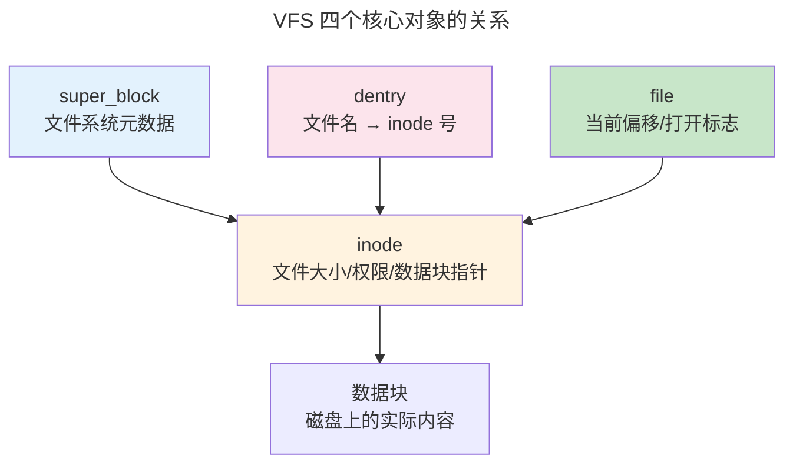

> 持久化的组织艺术。

进程在内存中出生也在内存中死亡——断电后一切化为虚无。文件系统提供了跨越断电周期的持久化能力，用 `open-read-write-close` 五个系统调用操作一切。本章从 VFS 抽象层出发，解剖 inode 与 ext4 磁盘布局，深入日志崩溃一致性机制。

---

## VFS：一切皆文件的基石

VFS 定义了统一的接口——`struct file_operations`、`struct inode_operations`——每个具体文件系统实现这些接口的一个子集：

```
用户空间:  open() / read() / write() / close()
              ↓
VFS 层:   struct file_operations { .read = ext4_file_read, ... }
              ↓
实现层:   ext4 / XFS / Btrfs / NFS / procfs / FUSE
```



---

## ext4 磁盘布局

ext4 使用 **extent 树**取代间接块——每个 extent 描述一个连续的块范围，一个 extent 可覆盖数千个块。inode 包含文件的所有元数据，**唯独不包含文件名**（文件名在目录项中）。

---

## 日志：崩溃一致性的保证

文件系统操作通常是多步骤的——创建文件需分配 inode、写入目录项、更新空闲计数。日志以数据库式的写前日志保护一致性：

1. 将修改写入日志区域（journal commit）
2. 执行实际修改（checkpoint）
3. 标记日志条目已应用

崩溃后重启，文件系统重放日志中未标记为已应用的条目。ext4 默认**有序模式**：元数据通过日志保护，数据块直接写入——性能与安全的最佳平衡。

---

## Page Cache：内存与磁盘的桥梁

`read()` 首先查找 Page Cache；命中则直接从内存返回。未命中则分配物理页并发起磁盘 I/O。`write()` 写到 Page Cache 标记为脏页，由后台 `flusher` 线程异步写回。直接 I/O（`O_DIRECT`）绕过 Page Cache——数据库引擎保留对数据放置和写时序的完全控制。

---

## 跨卷连接

| 本章概念 | 依赖的底层原理 | 支撑的上层抽象 |
|----------|---------------|---------------|
| Page Cache | [DRAM 刷新周期](../../01-weichen/04-memory-hierarchy/) | [数据库 Buffer Pool](../../04-yuanhai/01-relational-database/) |
| ext4 日志 | [WAL 的 REDO Log 语义](../02-jiezi/04-peripheral-drivers/) | [Raft 的 RSM 日志复制](../../04-yuanhai/04-consensus-protocols/) |
| COW 写时复制 | [虚拟内存 COW 语义](../02-memory-management/) | [Docker OverlayFS 镜像分层](../../08-qianli/03-devops-practices/) |
| 直接 I/O | [DMA 零拷贝传输](../02-jiezi/04-peripheral-drivers/) | [io_uring 内核旁路 I/O](../08-network-programming/) |

:::tip[卷三内部路径]
- [**内存管理**](../02-memory-management/)：Page Cache 与 mmap
- [**网络编程**](../08-network-programming/)：`sendfile()`——Page Cache → Socket 零拷贝
:::
