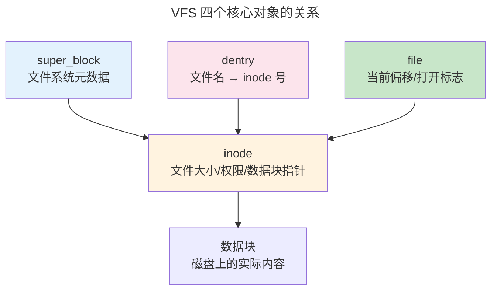
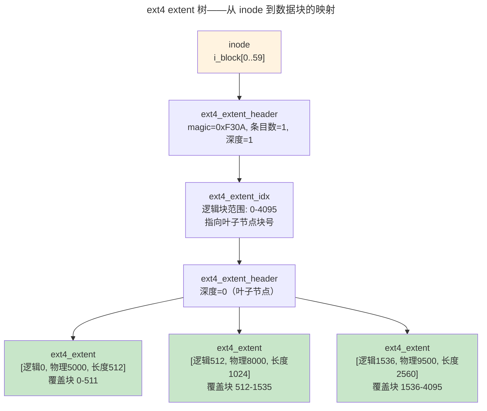

> 持久化的组织艺术。

进程在内存中出生也在内存中死亡——断电后一切化为虚无。文件系统提供了跨越断电周期的持久化能力，用 `open-read-write-close` 五个系统调用操作一切。本章从 VFS 抽象层出发，解剖 inode 与 ext4 磁盘布局，深入日志崩溃一致性机制。

---

## VFS：一切皆文件的基石

VFS 定义了统一的接口——`struct file_operations`、`struct inode_operations`——每个具体文件系统实现这些接口的一个子集：

```
用户空间:  open() / read() / write() / close()
              ↓
VFS 层:   struct file_operations { .read = ext4_file_read, ... }
              ↓
实现层:   ext4 / XFS / Btrfs / NFS / procfs / FUSE
```



---

## ext4 磁盘布局：inode 与 extent 树

ext4 的 inode 是一切元数据的容器——**唯独不包含文件名**（文件名在目录项 `struct ext4_dir_entry_2` 中）。关键字段：

| 字段 | 位宽 | 作用 |
|------|------|------|
| `i_mode` | 16 | 文件类型（`S_IFREG`/`S_IFDIR`/`S_IFLNK`）+ 权限位（`rwxrwxrwx`） |
| `i_uid` / `i_gid` | 32 | 所有者 UID/GID |
| `i_size` | 64 | 文件实际大小（字节） |
| `i_atime` / `i_mtime` / `i_ctime` | 64×3 | 访问时间 / 修改时间 / 元数据变更时间 |
| `i_links_count` | 16 | **硬链接计数**——归零时文件才真正删除 |
| `i_block[]` | 60 字节 | **extent 树的根节点**（容纳 4 个 extent 描述符或 1 个索引节点） |

ext4 用 **extent 树**取代 ext2/ext3 的间接块——一个 extent 描述 `[起始逻辑块号, 物理块号, 连续块数]`，单条记录可覆盖数千个块：



> ext3 需要 3 级间接块才能描述大文件（4KB 块大小下最大 ~4TB），且每次访问最后一个字节需 4 次磁盘读取。ext4 的 extent 树只需 2 次（读 inode → 读 extent 叶子节点），大文件随机访问速度快 2-4 倍。

### 硬链接与软链接——两个名字的两种哲学

```bash
$ echo "hello" > target.txt
$ ln target.txt hardlink     # 硬链接——同一个 inode
$ ln -s target.txt softlink  # 软链接——存路径字符串的独立 inode
$ ls -li
123456 -rw-r--r-- 2 user ... hardlink     ← i_links_count=2
123456 -rw-r--r-- 2 user ... target.txt    ← 同一个 inode 号
123457 lrwxr-xr-x 1 user ... softlink -> target.txt
```

| 特性 | 硬链接 | 软链接（符号链接） |
|------|--------|------------------|
| 本质 | 目录项指向同一 inode | 存目标路径字符串的特殊 inode |
| 跨文件系统 | ❌ | ✅ |
| 指向目录 | ❌（防环，root 除外） | ✅ |
| 原文件删除后 | 仍可访问（inode 未释放） | **悬空链接**——指向不存在的路径 |
| 底层调用 | `link()` | `symlink()` 创建，`readlink()` 读取 |

---

## 日志：崩溃一致性的保证

文件系统操作通常是多步骤的——创建文件需分配 inode、写入目录项、更新空闲计数。日志以数据库式的写前日志保护一致性：

1. 将修改写入日志区域（journal commit）
2. 执行实际修改（checkpoint）
3. 标记日志条目已应用

崩溃后重启，文件系统重放日志中未标记为已应用的条目。ext4 支持三种日志模式，在性能与安全的光谱上各有取舍：

| 模式 | 元数据保护 | 数据保护 | 写入顺序 | 典型场景 |
|------|-----------|---------|---------|---------|
| **journal** | ✅ 日志 | ✅ 日志（数据也写入日志区） | 所有写入先到日志 | `/var/log`、`/etc` 等关键元数据 |
| **ordered**（默认） | ✅ 日志 | ✅ 先写数据块，再写元数据到日志 | 数据 > 元数据日志 > 实际位置 | 通用——大多数部署 |
| **writeback** | ✅ 日志 | ❌ 无顺序保证 | 元数据日志独立 | 非关键临时文件 |

> **ordered 模式的"崩溃窗口"**：若数据写入后、元数据日志提交前崩溃——重放时 inode 指向旧数据块，但新数据已写入。结果？文件大小正确但内容包含崩溃前的垃圾数据（**陈旧块暴露**）。安全要求高的系统应用 `journal` 模式或采用 COW 文件系统（Btrfs/ZFS）。

---

## Page Cache：内存与磁盘的桥梁

`read()` 首先查找 Page Cache；命中则直接从内存返回。未命中则分配物理页并发起磁盘 I/O。`write()` 写到 Page Cache 标记为脏页，由后台 `flusher` 线程异步写回。直接 I/O（`O_DIRECT`）绕过 Page Cache——数据库引擎保留对数据放置和写时序的完全控制。

---

## 跨卷连接

| 本章概念 | 依赖的底层原理 | 支撑的上层抽象 |
|----------|---------------|---------------|
| Page Cache | [DRAM 刷新周期](../../01-weichen/04-memory-hierarchy/) | [数据库 Buffer Pool](../../04-yuanhai/01-relational-database/) |
| ext4 extent 树 + 日志三模式 | [WAL 的 REDO Log 语义](../../04-yuanhai/02-storage-engine/) | [Raft 的 RSM 日志复制](../../04-yuanhai/04-consensus-protocols/) |
| 硬链接 / 软链接 | [inode 引用计数——类似智能指针](../02-memory-management/) | [Docker OverlayFS 镜像分层——硬链接白名单](../../08-qianli/03-devops-practices/) |
| COW 写时复制 | [虚拟内存 COW 语义](../02-memory-management/) | [Btrfs snapshot——文件系统级 COW](../../04-yuanhai/02-storage-engine/) |
| 直接 I/O | [DMA 零拷贝传输](../../02-jiezi/04-peripheral-drivers/) | [io_uring 内核旁路 I/O](../08-network-programming/) |

:::tip[卷三内部路径]
- [**内存管理**](../02-memory-management/)：Page Cache 与 mmap
- [**网络编程**](../08-network-programming/)：`sendfile()`——Page Cache → Socket 零拷贝
:::
