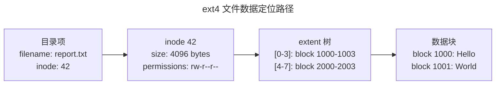
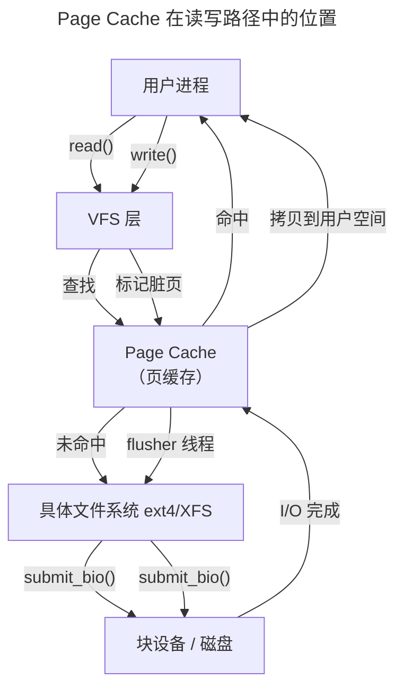

> 持久化的组织艺术。

进程在内存中出生也在内存中死亡——断电后一切化为虚无。**文件系统**提供了跨越断电周期的持久化能力：它将磁盘上的比特组织为文件、目录、权限和元数据，通过一整套精妙的抽象，让用户程序用 `open-read-write-close` 五个系统调用操作一切——从本地 ext4 分区到远程 NFS 挂载，从 `/dev/null` 设备文件到 `/proc/cpuinfo` 伪文件。

本章从 VFS 抽象层出发，解剖 inode 与目录项的关系，深入 ext4 的磁盘布局与日志机制，最后以 FUSE 用户态文件系统和 Page Cache 收尾。

---

## VFS：一切皆文件的基石

**虚拟文件系统**（VFS，Virtual File System）是 Linux 内核中最优雅的抽象层之一。它定义了一组统一的接口——`struct file_operations`、`struct inode_operations`、`struct address_space_operations`——每个具体文件系统只需实现这些接口的一个子集：

```
用户空间:    open() / read() / write() / close()
                  ↓
VFS 层:     struct file_operations {
                .open  = ext4_file_open,
                .read  = ext4_file_read,
                .write = ext4_file_write,
            }
                  ↓
具体实现:    ext4 / XFS / Btrfs / NFS / procfs / sysfs / FUSE
```

VFS 的四个核心对象：

| 对象 | 结构体 | 生命周期 | 磁盘表示 |
|------|--------|---------|---------|
| **超级块** | `super_block` | 挂载时创建，卸载时销毁 | 文件系统的全局元数据 |
| **inode** | `inode` | 文件打开时从磁盘加载 | 文件大小、权限、数据块指针 |
| **目录项** | `dentry` | 路径名查找时创建，LRU 缓存 | 文件名到 inode 号的映射 |
| **文件** | `file` | `open()` 创建，`close()` 销毁 | 不存盘——仅内存对象（当前偏移、打开标志） |

:::note[dentry cache 的路径加速]
路径名查找（如 `/usr/share/doc/README`）需要逐级解析目录——如果每次都从磁盘读取将是灾难性的性能瓶颈。dentry cache（dcache）将最近访问的目录项缓存在内存中，使得后续的同路径访问只需查找哈希表（dentry_hashtable），完全避开磁盘 I/O。
:::

---

## inode 与 ext4 磁盘布局

### inode：文件的元数据身份证

在 ext4 文件系统中，每个文件和目录都有一个 inode 号——文件系统的内部"身份证号"。inode 包含文件的所有元数据，**唯独不包含文件名**（文件名在目录项中）：



ext4 使用 **extent 树**（而非传统的间接块）来定位数据块。每个 extent 描述一个连续的块范围——对于大文件，一个 extent 可能覆盖数千个块，避免了为每个块单独维护指针的代价。

---

## 日志：崩溃一致性的保证

文件系统操作通常是**多步骤**的——创建一个文件需要分配 inode、写入目录项、更新超级块中的空闲 inode 计数。如果在这三步之间断电，文件系统将处于不一致状态。

**日志**（Journaling）以数据库式的写前日志解决这个问题：

1. 将即将进行的修改写入日志区域（journal commit）
2. 执行实际的文件系统修改（checkpoint）
3. 标记日志条目已应用

崩溃后重启，文件系统**重放**日志中尚未标记为已应用的条目——要么完成操作，要么回滚到一致状态。ext4 默认使用**有序模式**（data=ordered）：元数据通过日志保护，数据块直接写入——在性能和安全性之间取得平衡。

---

## Page Cache：内存与磁盘的桥梁

文件的读写并非直接操作磁盘——Linux 通过 **Page Cache**（页缓存）在内存中缓存文件数据。`read()` 首先查找 Page Cache；如果命中，直接拷贝到用户空间。如果未命中，内核分配新的物理页，发起磁盘 I/O 填充该页，然后返回数据。

`write()` 写到 Page Cache 中标记为脏的页面，由后台的 `flusher` 线程异步写回磁盘。这种**缓冲 I/O** 模型在大多数场景下大幅提升性能——但数据库和某些应用选择**直接 I/O**（`O_DIRECT` 标志）绕过 Page Cache，以获得对数据放置和写时序的完全控制。



---

## 跨卷连接

文件系统是"内存中的数据结构持久化到磁盘"的学科——它同时也是数据库存储引擎、容器镜像和分布式存储系统的基础：

| 本章概念 | 依赖的底层原理 | 支撑的上层抽象 |
|----------|---------------|---------------|
| Page Cache | [DRAM 行列地址与刷新周期](../../01-weichen/04-memory-hierarchy/#dram-内部结构一个单元的微观世界) | [数据库 Buffer Pool](../../04-yuanhai/01-relational-database/) |
| ext4 日志 | [数字逻辑中的原子操作保证](../../01-weichen/02-digital-logic/#建立时间与保持时间) | [共识协议的 WAL（Write-Ahead Log）](../../04-yuanhai/04-consensus-protocols/) |
| 写时复制（COW） | [虚拟内存的 COW 语义](../02-memory-management/) | [Btrfs/ZFS 快照与 Docker OverlayFS](../../08-qianli/02-system-design/) |
| dentry cache | [Cache 组相联与替换策略](../../01-weichen/04-memory-hierarchy/#cache-组织形式) | [分布式元数据缓存](../../04-yuanhai/03-distributed-fundamentals/) |
| 直接 I/O（O_DIRECT） | [DMA 零拷贝传输](../02-jiezi/04-peripheral-drivers/#dma解放-cpu-的数据搬运工) | [io_uring 的内核旁路 I/O](../08-network-programming/) |
| FUSE 用户态文件系统 | [用户态/内核态切换的代价](../01-process-and-thread/#上下文切换昂贵的角色转换) | [S3-FUSE 云存储挂载](../../04-yuanhai/05-data-pipelines/) |

:::tip[卷三内部路径]
- [**内存管理**](../02-memory-management/)：Page Cache 的物理页分配与 mmap 映射
- [**同步原语**](../04-synchronization/)：inode 锁与目录项锁——文件系统的并发控制
- [**网络编程**](../08-network-programming/)：`sendfile()` 零拷贝——从 Page Cache 直接发送到 Socket
:::
