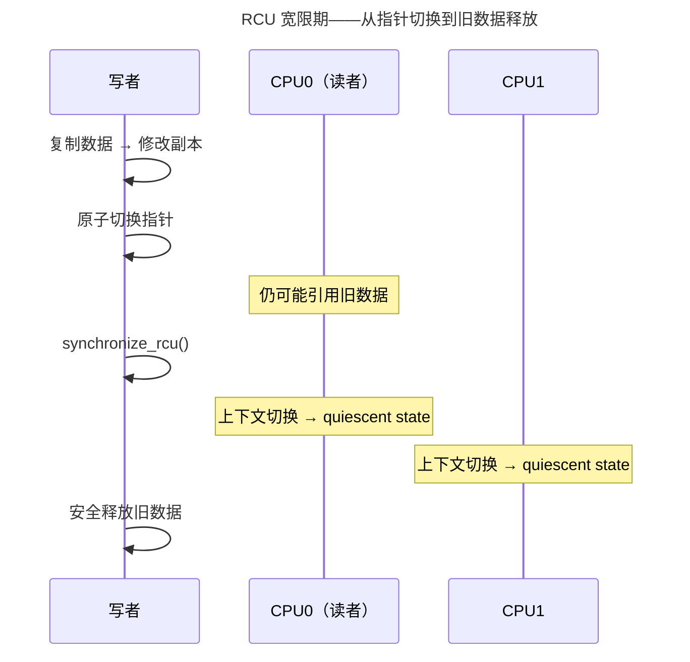

> 并发的基石，死锁的克星。

多核时代，同步是内核中最核心也最容易出错的子系统。本章从自旋锁出发，走过互斥锁、读写锁、RCU 的演进，深入 futex 的用户态-内核态协作，抵达无锁数据结构的 CAS/ABA 世界。

---

## 自旋锁与互斥锁：忙等 vs 睡眠

| 特性 | 自旋锁（Spinlock） | 互斥锁（Mutex） |
|------|-------------------|----------------|
| 失败行为 | `while (locked)` 忙等 | 睡眠，让出 CPU |
| 适用场景 | 极短临界区（< 几 μs） | 中长临界区 |
| 中断上下文 | 可用（需关抢占） | 不可用 |
| 持有期间 | 禁止睡眠 | 可睡眠 |

`cpu_relax()`（x86 `PAUSE` 指令）降低自旋功耗并避免内存序过度投机。

---

## RCU：零开销读取的革命

RCU 使读者完全无锁——`rcu_read_lock()` 在大多数配置下为空操作。写者复制数据副本、原子切换指针后，等待**宽限期**（所有 CPU 都经历上下文切换）——然后安全释放旧数据。



---

## futex：用户态快速路径 + 内核态慢速路径

绝大多数锁操作没有竞争——应该极快、不进入内核。futex 的设计：用户态 CAS 成功 → 直接返回（零系统调用），CAS 失败 → `futex(FUTEX_WAIT)` 进入内核睡眠。`pthread_mutex` 的默认实现基于 futex。

---

## 无锁数据结构：CAS 与 ABA 陷阱

```c
// 无锁栈出栈——CAS 重试循环
void *pop(Node **head) {
    Node *old_head;
    do {
        old_head = *head;
        if (old_head == NULL) return NULL;
    } while (!CAS(head, old_head, old_head->next));
    return old_head->data;
}
```

**ABA 问题**：线程 T1 读到 head=A，准备 CAS。T2 弹出 A、弹出 B、重新压入 A。T1 的 CAS 成功，但 `A->next` 已被修改——链表损坏。解决：指针 + 版本号（128 位 CAS）。

---

## 跨卷连接

| 本章概念 | 依赖的底层原理 | 支撑的上层抽象 |
|----------|---------------|---------------|
| 自旋锁 CAS | [RISC-V lr.w/sc.w 原子指令](../../01-weichen/05-instruction-set-architecture/) | [数据库无锁索引](../../04-yuanhai/02-storage-engine/) |
| RCU 宽限期 | [per-CPU 变量与上下文切换](../01-process-and-thread/) | [内核网络栈路由表 RCU 保护](../05-network-protocol-stack/) |
| futex | [用户态/内核态切换代价](../01-process-and-thread/) | [Go runtime.mutex](../../08-qianli/01-design-patterns-and-principles/) |

:::tip[卷三内部路径]
- [**进程与线程**](../01-process-and-thread/)：上下文切换——RCU 宽限期的检测基础
- [**内存管理**](../02-memory-management/)：COW 的原子性——多核同步要求
:::
