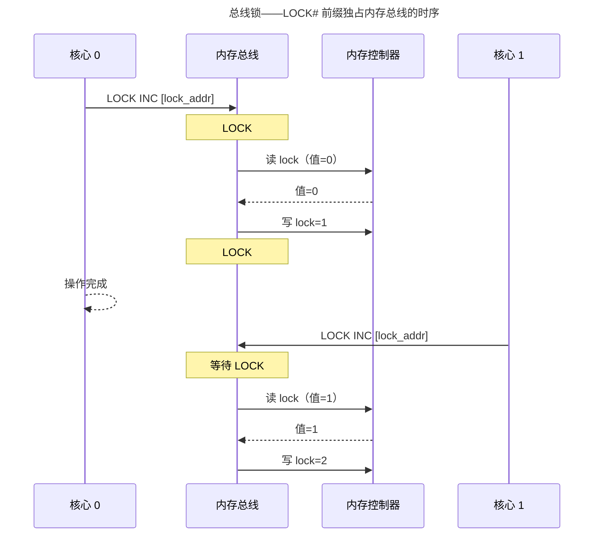
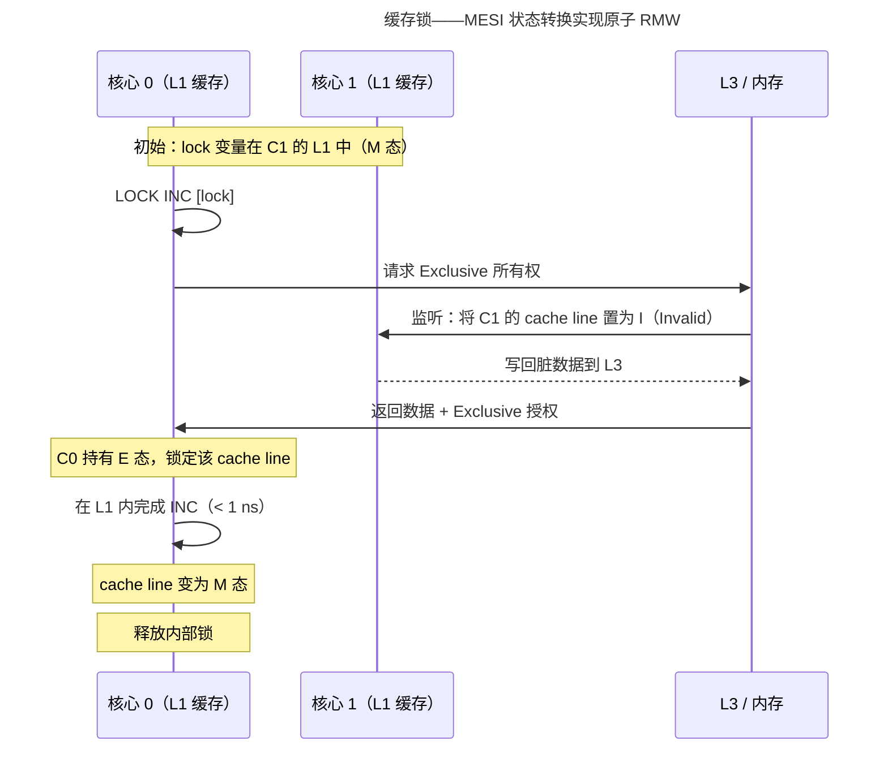
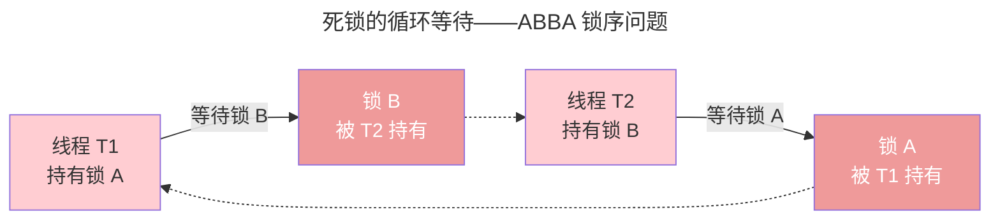
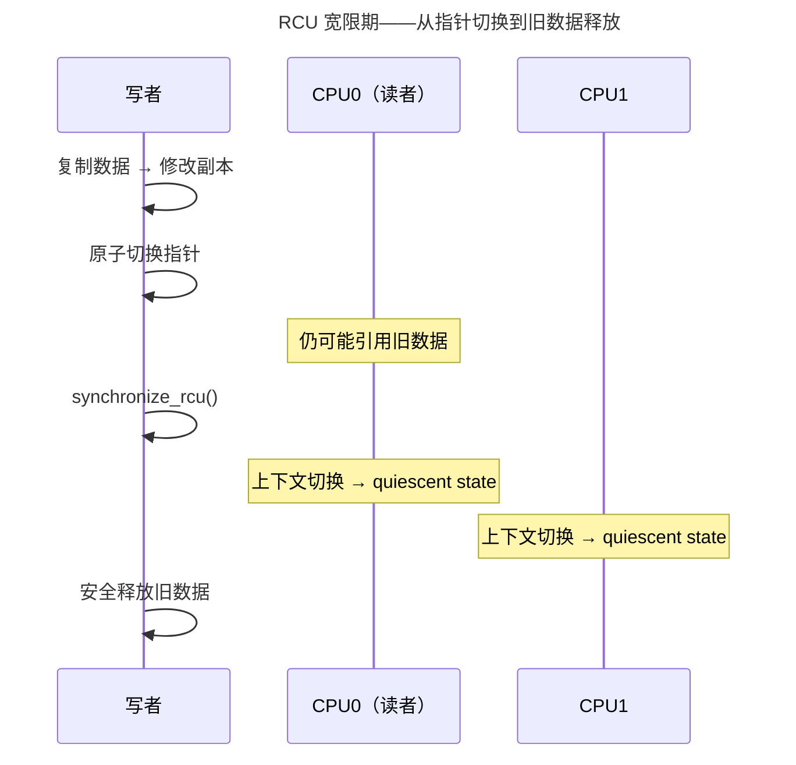

> 并发的基石，死锁的克星。

多核时代，同步是内核中最核心也最容易出错的子系统。但在讨论任何锁原语之前，必须回答一个根本问题：**锁本身是如何实现的？** 多核 CPU 共享同一组内存总线——当两个核心同时执行"读-改-写"操作时，谁先谁后？这个看似简单的问题，驱动了从总线锁到缓存一致性协议的半个世纪的硬件进化。

---

## 锁的硬件基石——从总线锁到缓存一致性

### 问题的本质：读-改-写的间隙

`lock = lock + 1` 在汇编层面是三条指令：`load → add → store`。双核同时执行时：

```
核心 0: load lock (值=0)    add (值=1)    store lock (值=1)
核心 1:      load lock (值=0)    add (值=1)    store lock (值=1)
                                              ↑ 期望结果=2，实际结果=1
```

**核心 1 在核心 0 的 store 完成之前读了旧值**。这不是软件 bug——即使编译器生成单条 `inc [lock]` 指令，CPU 微码仍将其分解为内部 load 和 store 微操作。需要硬件层面的原子性保证。

### 方案一：总线锁——最原始的互斥

x86 的 **LOCK#** 前缀信号是最直观的方案：在执行 `LOCK INC [addr]` 期间，CPU 通过拉低 LOCK# 引脚**物理锁定整个内存总线**——其他所有核心的总线请求被阻塞，直至当前操作完成：



总线锁保证了绝对正确性——但代价巨大：被锁期间**所有内存访问**（包括无关地址的访问）都被阻塞。对于 100 ns 的原子操作，总线锁实际上将多核系统暂时退化为了单核。现代 x86 仅在无法使用缓存锁时回退到总线锁——例如操作数跨越 cache line 边界、或目标地址在不可缓存区域（MMIO）。

### 方案二：缓存锁 + MESI——现代多核的基础

绝大多数原子操作的目标地址在 L1 缓存中。x86 的优化策略：与其锁总线，不如**锁缓存行**。机制依赖 MESI 缓存一致性协议：



关键点：**在持有 Exclusive/Modified 态的 cache line 上执行 RMW，CPU 内部锁定该 cache line 直至操作完成**——不涉及总线锁，不阻塞无关地址的访问。MESI 监听（snoop）机制保证在转让所有权前，前持有者的脏数据被写回。

| 锁类型 | 锁定范围 | 延迟 | 适用场景 | 回退条件 |
|--------|---------|------|---------|---------|
| **总线锁**（LOCK#） | 整个内存总线 | ~100 ns+ | 跨 cache line / MMIO | 操作数非缓存对齐时自动触发 |
| **缓存锁**（Cache Lock） | 单个 cache line | ~1 ns（L1 内） | 绝大多数原子操作 | 现代 CPU 的默认路径 |
| **LL/SC**（ARM/RISC-V） | 单个缓存行 + 硬件监视器 | ~1 ns | 无 LOCK# 的 RISC 架构 | 监视器检测到冲突 → 重试 |

### 方案三：LL/SC——RISC 架构的乐观原子原语

ARM 和 RISC-V 没有 x86 的 LOCK# 前缀。它们使用 **Load-Link / Store-Conditional** 对——硬件在 load 时设置"独占监视器"，store 时检查监视器是否仍然有效：

```c
// ARM64 自旋锁的 LL/SC 实现
acquire:
    ldaxr  w1, [x0]        // Load-Exclusive: 读 lock 值，设置监视器
    cbnz   w1, acquire      // 锁已被持有 → 重试
    mov    w2, #1
    stxr   w3, w2, [x0]    // Store-Conditional: 仅在监视器有效时写入
    cbnz   w3, acquire      // stxr 返回 1 → 监视器失效，重试

release:
    stlr   wzr, [x0]        // Store-Release: 释放锁 + 内存屏障
```

LL/SC 的哲学与 CAS 不同：

| 维度 | x86 LOCK CMPXCHG | ARM LDREX/STREX | RISC-V LR/SC |
|------|-----------------|-----------------|-------------|
| **原子性来源** | 缓存锁（硬件保证 RMW 不完全不可打断） | 监视器检测冲突（软件重试） | 同 ARM |
| **失败处理** | CAS 返回 false，软件判断 | STREX 返回 1，软件重试 | SC 返回非零，软件重试 |
| **ABA 风险** | 存在（需 128-bit CAS） | 监视器跟踪地址——任何对该地址的写都清除监视器 | 同 ARM |
| **内存序** | 默认全屏障（`mfence`），可选 `acquire`/`release` | `ldaxr`（acquire）/ `stlxr`（release）语义 | `lr.w.aq` / `sc.w.rl` |

> **LL/SC 与 ABA**：理论上 LL/SC 的硬件监视器检测"任何对该地址的写"，从而天然免疫 ABA——即使值被改回原值，中间的写入也清除了监视器。但这受限于硬件监视器的实现范围（通常仅跟踪 1-4 个地址），且不保证跨上下文切换的检测。

### 从硬件到软件——同步的谱系

```
纯硬件保证                           纯软件构造
    │                                   │
总线锁 ──→ 缓存锁(MESI) ──→ LL/SC ──→ CAS ──→ 自旋锁 ──→ futex ──→ 信号量
 (LOCK#)  (x86默认)    (ARM/RISC-V)  (无锁)   (忙等)   (休眠)   (计数同步)
    │                                   │
  "CPU 物理独占总线"              "操作系统调度器接管等待"
```

理解了这层硬件基础，自旋锁的 `while (locked)` 就不再是魔法——它依赖的是 LOCK CMPXCHG 在缓存一致性协议下原子地完成"读-比较-交换"，确保只有一个核心能看到"旧值为 0 → 新值为 1"的瞬间。

---

## 自旋锁与互斥锁：忙等 vs 睡眠

| 特性 | 自旋锁（Spinlock） | 互斥锁（Mutex） |
|------|-------------------|----------------|
| 失败行为 | `while (locked)` 忙等 | 睡眠，让出 CPU |
| 适用场景 | 极短临界区（< 几 μs） | 中长临界区 |
| 中断上下文 | 可用（需关抢占） | 不可用 |
| 持有期间 | 禁止睡眠 | 可睡眠 |

`cpu_relax()`（x86 `PAUSE` 指令）降低自旋功耗并避免内存序过度投机。

### 读写锁——读者并发的折中方案

当数据结构被频繁读取、偶尔写入（如内核路由表、文件系统 inode 缓存），读写锁让多个读者同时持有锁——写者独占：

| 操作 | 自旋锁 | 读写锁 |
|------|--------|--------|
| 读-读并发 | ❌ 互斥 | ✅ 共享 |
| 读-写并发 | ❌ 互斥 | ❌ 写者阻塞 |
| 写-写并发 | ❌ 互斥 | ❌ 互斥 |
| 开销 | 单原子变量 | 读-修改-写 + 读者计数 |

Linux `rwlock_t` 使用一个 `atomic_t` 的高位作为写锁标志：读者 CAS 递增低位计数（当高位为 0），写者设置高位并等待计数归零。但读写锁在读者密集场景下存在**写者饥饿**风险——连续到来的读者可能无限期推迟写者。RCU 正是为解决这个问题而诞生。

### 死锁——并发编程的头号杀手

死锁的发生需要四个条件**同时满足**：

1. **互斥**（Mutual Exclusion）：资源一次只能被一个线程持有
2. **持有并等待**（Hold and Wait）：线程持有已分配资源，同时等待新资源
3. **不可剥夺**（No Preemption）：已分配资源不能被强制释放
4. **循环等待**（Circular Wait）：存在线程-资源的环形依赖链 $T_1 \to R_1 \to T_2 \to R_2 \to T_1$



**预防死锁的经典策略**：

| 策略 | 破坏的条件 | 实践 |
|------|-----------|------|
| **锁排序**（Lock Ordering） | 循环等待 | 始终以相同顺序获取锁：先 A 后 B，绝不先 B 后 A。Linux 内核定义了锁的层级——`mmap_sem` > `i_mutex` > `page_lock` |
| **trylock + 回退** | 持有并等待 | `spin_trylock()` 失败则释放已持有锁，重新尝试 |
| **锁超时** | 不可剥夺 | `mutex_lock_interruptible()` 可被信号打断 |
| **银行家算法** | 全部四个 | 预先声明资源需求，系统只在"安全状态"下分配——静态资源分配场景（如嵌入式） |

**银行家算法**的核心思想：假设所有线程最终都能完成并释放资源，模拟资源分配后系统是否仍存在安全序列。设 $Available$ 为可用资源向量，$Max$ 为各线程最大需求矩阵，$Allocation$ 为已分配矩阵，$Need = Max - Allocation$：

```
Safe 检查算法（O(m·n²)）:
  Work = Available
  Finish[i] = false
  while 存在 i 满足 Finish[i]=false 且 Need[i] <= Work:
      Work += Allocation[i]; Finish[i] = true
  若全部 Finish[i]=true → 安全状态
```

> 银行家算法在实践中因"预先声明最大需求"的约束过于严苛而较少用于通用 OS，但其"安全状态"概念深刻影响了数据库锁管理器（如 PostgreSQL 的 `DeadLockCheck`）。

---

## RCU：零开销读取的革命

RCU 使读者完全无锁——`rcu_read_lock()` 在大多数配置下为空操作。写者复制数据副本、原子切换指针后，等待**宽限期**（所有 CPU 都经历上下文切换）——然后安全释放旧数据。



---

## futex：用户态快速路径 + 内核态慢速路径

绝大多数锁操作没有竞争——应该极快、不进入内核。futex 的设计：用户态 CAS 成功 → 直接返回（零系统调用），CAS 失败 → `futex(FUTEX_WAIT)` 进入内核睡眠。`pthread_mutex` 的默认实现基于 futex。

---

## 内存屏障与内存序——无锁编程的硬件前提

在讨论 CAS 之前，必须理解**内存序**（Memory Ordering）。编译器优化和 CPU 流水线会在不改变单线程语义的前提下**重排**内存操作——多线程场景下，这种重排是致命的。

```c
// 线程 T1
data = 42;          // (1) 写 data
flag = 1;           // (2) 写 flag

// 线程 T2
while (flag == 0);  // (3) 读 flag —— 循环等待
printf("%d", data); // (4) 读 data —— 期望看到 42
```

直觉上 T2 应打印 42——但 CPU 可能将 `flag=1` 先于 `data=42` 提交到缓存（Store-Store 重排）。T2 看到 `flag=1` 时，`data` 可能仍是旧值（0）——**写-写重排**。正确的做法是插入**写屏障**：

```c
data = 42;
smp_wmb();  // 写屏障：确保 data 的写入在 flag 之前全局可见
flag = 1;
```

### 四种内存屏障

| 屏障 | x86 指令 | 作用 | 等价语义 |
|------|---------|------|---------|
| **写屏障** | `sfence` | 确保屏障前的 store 先于屏障后的 store 完成 | Store-Store 序 |
| **读屏障** | `lfence` | 确保屏障前的 load 先于屏障后的 load 完成 | Load-Load 序 |
| **全屏障** | `mfence` | 确保屏障前后的所有内存操作严格有序 | Store-Load 序 |
| **编译器屏障** | `barrier()` | 阻止编译器重排，不生成 CPU 指令 | `asm volatile("":::"memory")` |

> **x86 的特殊性**：x86 是 TSO（Total Store Order）模型——Store-Load 之外的重排被硬件禁止，`mov` 到内存自带 release 语义。ARM/RISC-V 是弱内存序模型——几乎所有重排都可能发生。在 ARM 上写无锁代码而省略屏障，是生产环境中最难复现的并发 bug 来源。

### Acquire/Release 语义

现代多核编程不直接使用 `mfence`，而是用高级抽象：

- **Acquire**（获取语义）：`load-acquire`——后续所有内存操作不会被重排到此操作之前。用于锁的获取侧。
- **Release**（释放语义）：`store-release`——此前所有内存操作不会被重排到此操作之后。用于锁的释放侧。

对于 CAS，C11 的 `atomic_compare_exchange_strong()` 可指定 `memory_order_acquire`（成功时）、`memory_order_release`（失败时），精确控制所需的屏障强度——避免全屏障的昂贵代价。

---

## 无锁数据结构：CAS 与 ABA 陷阱

```c
// 无锁栈出栈——CAS 重试循环
void *pop(Node **head) {
    Node *old_head;
    do {
        old_head = *head;
        if (old_head == NULL) return NULL;
    } while (!CAS(head, old_head, old_head->next));
    return old_head->data;
}
```

**ABA 问题**：线程 T1 读到 head=A，准备 CAS。T2 弹出 A、弹出 B、重新压入 A。T1 的 CAS 成功，但 `A->next` 已被修改——链表损坏。解决：指针 + 版本号（128 位 CAS）。

---

## 跨卷连接

| 本章概念 | 依赖的底层原理 | 支撑的上层抽象 |
|----------|---------------|---------------|
| 自旋锁 CAS + 内存屏障 | [RISC-V lr.w/sc.w 原子指令与弱内存序](../../01-weichen/05-instruction-set-architecture/) | [数据库无锁索引](../../04-yuanhai/02-storage-engine/) |
| 死锁四条件 + 银行家算法 | [图论——资源分配图与环检测](../../00-lingxi/04-algorithm-theory/) | [PostgreSQL DeadLockCheck](../../04-yuanhai/01-relational-database/) |
| RCU 宽限期 | [per-CPU 变量与上下文切换](../01-process-and-thread/) | [内核网络栈路由表 RCU 保护](../05-network-protocol-stack/) |
| futex + 读写锁 | [用户态/内核态切换代价](../01-process-and-thread/) | [Go runtime.mutex](../../08-qianli/01-design-patterns-and-principles/) |

:::tip[卷三内部路径]
- [**进程与线程**](../01-process-and-thread/)：上下文切换——RCU 宽限期的检测基础
- [**内存管理**](../02-memory-management/)：COW 的原子性——多核同步要求
:::
