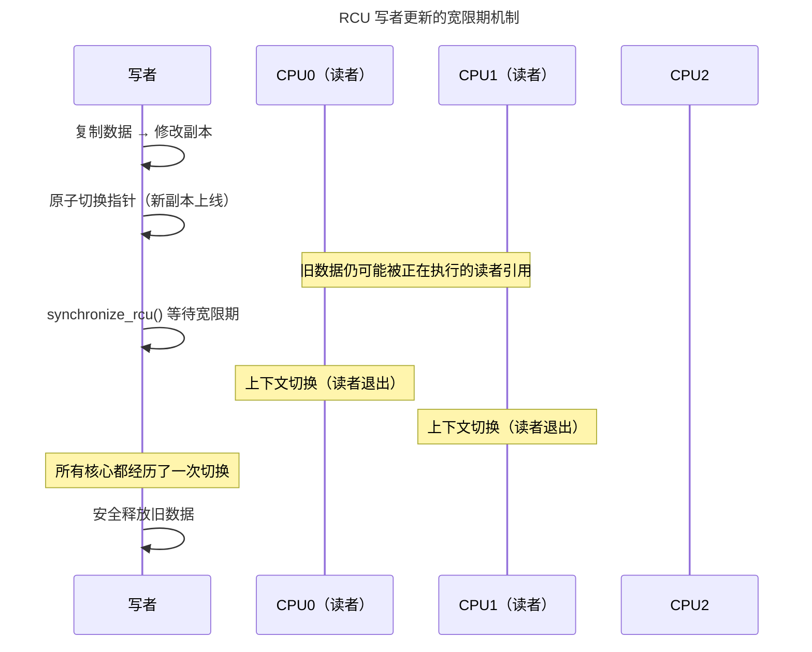

> 并发的基石，死锁的克星。

多核时代，同步是操作系统内核中最核心也最容易出错的子系统。一个未被正确保护的共享变量，可能导致数据损坏、死锁、优先级反转甚至内核 panic。本章从最基础的自旋锁出发，走过互斥锁、读写锁、RCU 的演进路线，深入 futex 的用户态-内核态协作机制，最终抵达无锁数据结构的 CAS 原子操作和 ABA 陷阱。

---

## 自旋锁与互斥锁：忙等与睡眠的分野

### 自旋锁：极短临界区的选择

自旋锁（Spinlock）在获取失败时**不会睡眠**——它在 `while (locked)` 循环中反复执行原子比较并交换（CAS）指令，直到锁可用。自旋锁的核心规则：

- **只能在内核态使用**（持有锁期间禁止抢占）
- **临界区必须极短**（微秒级以内）
- **持有锁期间禁止睡眠**（可能导致死锁）

```c
/* Linux 自旋锁的底层实现 */
static inline void arch_spin_lock(arch_spinlock_t *lock) {
    while (atomic_cmpxchg(&lock->val, 0, 1) != 0) {
        /* 在等待期间执行 PAUSE 指令（x86）降低功耗 */
        while (READ_ONCE(lock->val) != 0)
            cpu_relax(); // PAUSE / YIELD 指令
    }
}
```

`cpu_relax()` 是自旋锁设计的精髓——x86 的 `PAUSE` 指令向 CPU 提示当前处于自旋等待状态，CPU 可以降低功耗并避免内存序的过度投机。在多核系统中，持续执行 `PAUSE` 的自旋核心对总线带宽的占用极小。

### 互斥锁：睡眠等待的高层次选择

互斥锁（Mutex）在获取失败时**让出 CPU**——将当前任务放入等待队列并触发调度。睡眠等待比自旋的上下文切换开销更大（~1-10 μs），但释放了 CPU 供其他任务使用。规则：

- **适合中长临界区**（几百条指令以上）
- **不能在中断上下文使用**（中断没有可睡眠的"任务"概念）
- 支持**优先级继承**防止优先级反转（与 [RTOS 互斥量](../02-jiezi/03-rtos-fundamentals/#互斥量与优先级继承) 相同原理）

---

## 读写锁与 RCU：读者优先的极致优化

### 读写锁：读者并行、写者互斥

读写锁（rwlock）允许多个读者同时持有锁，但写者独占访问。这非常适合**读多写少**的场景——如内核中的 VMA 链表（进程地址空间映射），绝大多数操作是查找，极少修改。

读锁的获取只递增一个原子计数器（无需排队），写锁等待所有读者释放后才进入。但读写锁的代价是**写者饥饿**——如果读者持续到达，写者可能永远等不到执行机会。

### RCU：零开销读取的革命性设计

**读-拷贝-更新**（RCU，Read-Copy-Update）将读写锁的哲学推向极致：**读者完全无锁**。RCU 的核心机制：

1. **写者复制**：写者复制一份数据的副本，在副本上完成修改
2. **切换指针**：写者用原子指针操作将旧数据指针替换为新副本
3. **宽限期**（Grace Period）：写者等待所有可能"看到"旧数据的 CPU 核心都经历了一次上下文切换后，安全释放旧数据

读者只需调用 `rcu_read_lock()` / `rcu_read_unlock()`——这两个宏在大多数配置下**什么也不做**（空操作）。读者读取共享数据时的开销为零，这正是 RCU 成为 Linux 内核中性能最高的同步机制的根源。



:::tip[跨卷链接]
RCU 的宽限期检测依赖于每个 CPU 核心的[上下文切换计数器](../../01-weichen/03-microarchitecture/#流水线处理器将时间维度展开为空间)。当一个核心经历了上下文切换，内核记录其"经过了一个静止状态"（quiescent state）——因为上下文切换保证了该核心上没有任何 RCU 读者仍在引用旧数据指针。
:::

---

## futex：用户态与内核态的协作减速带

**futex**（Fast Userspace muTEX）是 Linux 最精巧的同步设计之一。它解决了这样一个矛盾：绝大多数锁操作在获取时**没有竞争**（锁是空闲的），应该速度极快、不进入内核；但少数竞争场景下必须让等待者睡眠——这需要内核介入。

futex 的设计：**快速路径在用户态，慢速路径在内核态**。

- **获取锁**（`futex(FUTEX_WAIT)` 变体）：用户态先执行原子 CAS。如果成功，函数直接返回——零系统调用开销。如果失败，才进入内核，内核将当前线程放入等待队列并睡眠。
- **释放锁**（`futex(FUTEX_WAKE)`）：用户态原子清除锁值，然后通过 `futex(FUTEX_WAKE)` 唤醒最多一个等待者——仅一次系统调用。

这个设计使无竞争情况下的加锁/解锁仅需几十个 CPU 周期，而竞争场景下的代价与互斥锁相当。`pthread_mutex` 在 Linux 上的默认实现（NPTL）基于 futex。

---

## 无锁数据结构：CAS 与 ABA 陷阱

### CAS 原子操作

CAS（Compare-And-Swap）是实现无锁数据结构的基础指令：

```c
/* 伪代码：如果 *ptr 等于 old_val，则写入 new_val 并返回 true */
bool CAS(int *ptr, int old_val, int new_val) {
    if (*ptr == old_val) {
        *ptr = new_val;
        return true;
    }
    return false;
}
```

x86 的 `CMPXCHG` 和 RISC-V 的 `lr.w`/`sc.w` 指令直接支持这一语义。无锁栈的出栈操作使用 CAS：

```c
void *pop(Node **head) {
    Node *old_head;
    do {
        old_head = *head;
        if (old_head == NULL) return NULL;
    } while (!CAS(head, old_head, old_head->next));
    return old_head->data;
}
```

:::danger[ABA 问题——无锁编程的经典陷阱]
假设出栈过程中：head 指向 A → B → C。线程 T1 读到 head = A，准备 CAS。在线程 T1 的 CAS 执行前，线程 T2 执行了三个操作：弹出 A、弹出 B、将 A 重新压入。现在 head 又指向了 A。T1 的 CAS 成功（`*head == A` 仍然成立），但它将 head 更新为 `A->next`——此时 `A->next` 可能已经被 T2 修改，导致链表损坏。解决方案：在指针上附加版本号（x86 的 `CMPXCHG16B` 或 128 位 CAS）。
:::

---

## 跨卷连接

同步是并发世界的语言——它在单核中断禁用和多核原子指令之间架起桥梁，在用户态 futex 和内核态调度器之间建立协议：

| 本章概念 | 依赖的底层原理 | 支撑的上层抽象 |
|----------|---------------|---------------|
| 自旋锁 CAS 原子指令 | [RISC-V A 扩展 lr.w/sc.w](../../01-weichen/05-instruction-set-architecture/#cisc-与-risc两套哲学的五十年对决) | [数据库无锁索引（跳表/B+树）](../../04-yuanhai/02-storage-engine/) |
| RCU 宽限期 | [上下文切换与 per-CPU 变量](../01-process-and-thread/) | [内核网络协议栈的路由表 RCU 保护](../05-network-protocol-stack/) |
| futex 快速路径 | [用户态原子操作与内存屏障](../../01-weichen/04-memory-hierarchy/#cache-一致性协议) | [Go goroutine 的 runtime.mutex](../../08-qianli/01-design-patterns-and-principles/) |
| 优先级继承 | [RTOS 互斥量优先级继承](../02-jiezi/03-rtos-fundamentals/#互斥量与优先级继承) | [实时 Linux PREEMPT_RT 补丁](../01-process-and-thread/) |
| 死锁四条件（互斥/持有等待/非抢占/循环等待） | [硬件死锁——总线互锁](../../01-weichen/03-microarchitecture/#流水线冒险打破时空的魔咒) | [分布式死锁检测（Wait-for Graph）](../../04-yuanhai/03-distributed-fundamentals/) |

:::tip[卷三内部路径]
- [**进程与线程**](../01-process-and-thread/)：上下文切换——RCU 宽限期的检测基础
- [**内存管理**](../02-memory-management/)：COW 的原子性——多核内存共享的同步要求
- [**文件系统**](../03-filesystem/)：inode 锁与目录项锁——文件系统的同步实践
:::
