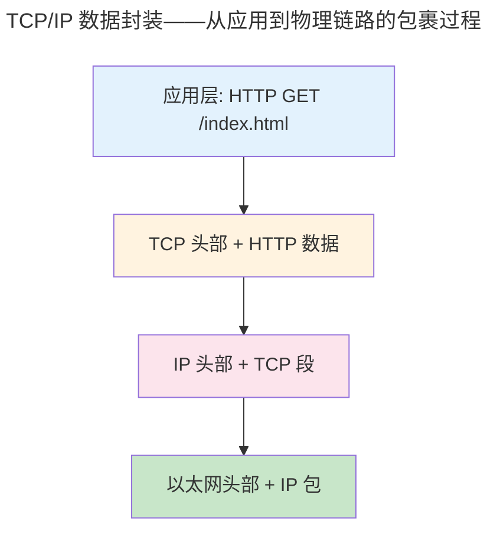

> 分层是网络设计的核心哲学。

1974 年，Cerf 和 Kahn 在 TCP 奠基论文中定义了分层模型。半个世纪后，这一模型依然是全球互联网的骨架。分层的本质是**封装与解封装**——每层将上层数据包裹在自己的头部中，对端逐层剥离。

---

## TCP/IP 四层模型



| TCP/IP 层 | 协议 | PDU | 核心功能 |
|-----------|------|-----|---------|
| 应用层 | HTTP, DNS, TLS | 数据 | 应用语义 |
| 传输层 | TCP, UDP, QUIC | 段 | 端口 + 可靠性 |
| 网络层 | IP, ICMP, OSPF | 包 | 寻址 + 路由 |
| 链路层 | Ethernet, ARP, Wi-Fi | 帧 | 相邻跳传输 |

### 以太网帧——链路层的"信封"

每一层封装都从链路层的帧开始。以太网帧是网络世界的原子传输单元：

**基本帧（DIX Ethernet II）**——无 VLAN 标签的最简格式：

```
 0                   6                   12       14                                                  Variable+4
┌───────────────────┬───────────────────┬───────────────┬──────────────────────────────────────────┬──────────┐
│  目标 MAC (6 B)    │   源 MAC (6 B)    │ EtherType (2B)│           负载 Payload (46-1500 B)         │ FCS (4 B)│
│                   │                   │ 0x0800 = IPv4 │          IP 包 / ARP 包                    │  CRC32   │
└───────────────────┴───────────────────┴───────────────┴──────────────────────────────────────────┴──────────┘
       │                   │
       │                   └─ bit 1 (G/L): 1=本地管理, 0=全球唯一 (OUI)
       └─ bit 0 (I/G): 1=组播/广播, 0=单播

最小帧长 64 字节（含 FCS）= 14 头 + 46 负载 + 4 FCS
最大帧长 1518 字节（标准）/ 1522 字节（单层 802.1Q Tag）
```

**802.1Q VLAN 帧**——在源 MAC 和 EtherType 之间插入 4 字节 Tag：

```
 0                   6                   12       14       16       18                                      Variable+4
┌───────────────────┬───────────────────┬───────────────┬───────────────┬──────────────────────────────┬──────────┐
│  目标 MAC (6 B)    │   源 MAC (6 B)    │ TPID = 0x8100 │ TCI (2 bytes) │  EtherType (2B)              │ 负载 (46-│
│                   │                   │ (2 bytes)     │ PCP│DEI│ VID  │  0x0800 = IPv4              │1500 B) + │
│                   │                   │               │(3b)│(1b)│(12b) │                              │ FCS (4B) │
└───────────────────┴───────────────────┴───────────────┴───────────────┴──────────────────────────────┴──────────┘
                                                   └──── 802.1Q Tag (4 bytes) ────┘
                                                   TPID 标识"后面是 VLAN 信息"
                                                   TCI 承载优先级 + VLAN ID
```

| 字段 | 位宽 | 作用 |
|------|------|------|
| **TPID** (Tag Protocol Identifier) | 16 | 固定值 `0x8100`——MAC 层通过它区分"下一个字段是 VLAN TCI"还是"上层 EtherType"。QinQ 外层用 `0x88A8` |
| **PCP** (Priority Code Point) | 3 | 802.1p QoS 优先级：0（尽力而为）~7（网络控制）。VoIP 通常标记为 5 |
| **DEI** (Drop Eligible Indicator) | 1 | 拥塞时可丢弃标记——与 IP 层 ECN 协同 |
| **VID** (VLAN Identifier) | 12 | VLAN ID 范围 1-4094（0=无 VLAN 标签，4095=保留）。`ip link add eth0.100 type vlan id 100` |

> **为什么 Tag 插在源 MAC 之后？** 交换机转发需要目标 MAC，但 VLAN 改变了帧的归属域——同一 MAC 在不同 VLAN 中应隔离。将 Tag 放在源 MAC 之后、EtherType 之前，使交换机在做 MAC 查找前就能提取 VID，进行 `(MAC, VID) → 端口` 的联合查找。不支持 802.1Q 的老设备将 `0x8100` 误读为未知 EtherType 而丢弃帧——保证了向后兼容。

**QinQ（802.1ad，双层 VLAN）**——运营商在客户 VLAN 外再封装一层：

```
[Dst MAC][Src MAC][SP-TPID=0x88A8][SP-TCI][C-TPID=0x8100][C-TCI][EtherType][Payload][FCS]
                   └─── Service Provider Tag ──┘└── Customer Tag ──┘
```

帧穿过运营商网络时，边缘交换机在入口推入外层 Tag（SP-Tag），在出口弹出——客户的 VLAN（C-Tag）全程透明。

---

## IP 协议——网络层的"邮戳"

### IPv4 头部结构（20-60 字节）

```raw
 0               4               8              12              16              20              24              31
┌───────────────┬───────────────┬───────────────┬───────────────┬───────────────┬───────────────┬───────────────┬───────────────┐
│ Version (4)   │  IHL (4)      │    DSCP (6)   │   ECN (2)     │              总长度 Total Length (16 bits)              │
├───────────────┴───────────────┴───────────────┴───────────────┼───────────────┴───────────────┼───────────────┬───────────────┤
│         标识 Identification (16 bits)                          │ 标志 Flags (3) │  分片偏移 Fragment Offset (13)  │               │
├───────────────┬───────────────┬───────────────────────────────┼───────────────┴───────────────┴───────────────┴───────────────┤
│   TTL (8)     │ 协议 (8)      │         头部校验和 Header Checksum (16 bits)                                            │
│               │6=TCP 17=UDP   │                                                                                       │
├───────────────┴───────────────┼───────────────────────────────┴───────────────────────────────────────────────────────┤
│                              源 IP 地址 Source Address (32 bits)                                                     │
├───────────────────────────────┼───────────────────────────────────────────────────────────────────────────────────────┤
│                              目标 IP 地址 Destination Address (32 bits)                                              │
├───────────────────────────────┴───────────────────────────────────────────────────────────────────────────────────────┤
│                              选项 Options (0-40 bytes，4 字节对齐)                                                     │
└───────────────────────────────────────────────────────────────────────────────────────────────────────────────────────┘
```

| 字段 | 位宽 | 作用 |
|------|------|------|
| **Version** | 4 | 4 = IPv4，6 = IPv6 |
| **IHL** | 4 | 头部长度（以 4 字节为单位），最小值 5（20 字节），最大值 15（60 字节） |
| **Total Length** | 16 | 整个 IP 包的长度（含头部），最大 65535 字节 |
| **Identification** | 16 | 分片标识——同一原始包的所有分片共享此 ID |
| **Flags** | 3 | bit 0 保留；bit 1 DF（Don't Fragment——PMTUD 的关键）；bit 2 MF（More Fragments） |
| **Fragment Offset** | 13 | 分片在原始包中的偏移（以 8 字节为单位） |
| **TTL** | 8 | 每跳减 1，归零时路由器丢弃并返回 ICMP Time Exceeded——`traceroute` 的核心机制 |
| **Protocol** | 8 | 上层协议编号：1=ICMP, 6=TCP, 17=UDP——实现 IP 层的多路分解 |
| **Header Checksum** | 16 | **仅覆盖 IP 头部**（逐跳递减的 TTL 迫使每路由器重新计算校验和），IPv6 已移除此字段 |
| **Source / Dest IP** | 32×2 | IPv4 地址 |

IPv4 地址是 32 位整数。CIDR 无类域间路由取代了 A/B/C 类地址的僵化分类。

## ICMP——IP 的控制面信使

ICMP（Internet Control Message Protocol）是 IP 层错误报告和诊断协议——`ping` 和 `traceroute` 都依赖它：

| 类型 | 代码 | 含义 | 触发场景 |
|------|------|------|---------|
| 0 | 0 | Echo Reply | `ping` 的目标主机响应 |
| 3 | 3 | Destination Unreachable (Port) | UDP 端口无监听——`traceroute` 借此判断到达终点 |
| 8 | 0 | Echo Request | `ping` 发送的探测包 |
| 11 | 0 | Time Exceeded | TTL 归零——`traceroute` 逐跳探测的核心 |

> `traceroute` 的巧妙之处：依次发送 TTL=1,2,3... 的 UDP 包。第 i 跳路由器因 TTL=0 返回 ICMP Time Exceeded——暴露其 IP 地址。最终目标返回 ICMP Port Unreachable——至此路径完整。

### ICMP 报文格式——藏在 IP 负载中的控制消息

ICMP 报文封装在 IP 包的负载中（IP Protocol=1）。所有 ICMP 报文共享统一的头部：

```raw
ICMP 报文结构（封装在 IP 负载中）

 0               8              16                              31
┌───────────────┬───────────────┬───────────────────────────────────────────────┐
│   类型 (8)    │   代码 (8)     │           校验和 Checksum (16 bits)           │
├───────────────┴───────────────┴───────────────────────────────────────────────┤
│                        消息体（变长，取决于类型和代码）                          │
│  例如：Echo Request/Reply → Identifier (16) + Sequence (16) + 数据            │
│       Time Exceeded → 未使用 (32) + 原始 IP 头 + 原始数据的前 8 字节           │
│       Destination Unreachable → 未使用 (32) + 原始 IP 头 + 原始数据前 8 字节   │
└───────────────────────────────────────────────────────────────────────────────┘
```

| 类型 | 代码 | 消息体内容 | 典型工具 |
|------|------|-----------|---------|
| **0** (Echo Reply) | 0 | Identifier + Sequence + 回显的原数据 | `ping` 接收端 |
| **8** (Echo Request) | 0 | Identifier + Sequence + 任意负载 | `ping` 发送端 |
| **3** (Dest Unreachable) | 0-15 | 原始 IP 头 + 8B | `traceroute` 终点检测 |
| **11** (Time Exceeded) | 0=TTL, 1=分片重组超时 | 原始 IP 头 + 8B | `traceroute` 中间跳 |

---

## 路由——最长前缀匹配

路由表的本质是 `(前缀, 子网掩码, 下一跳, 出接口)` 的映射。当包到达时，路由器执行**最长前缀匹配**（Longest Prefix Match）——找"前缀长度最长"的匹配项：

```raw
路由表示例：
192.168.0.0/16    → via 10.0.0.1    (16 位匹配)
192.168.5.0/24    → via 10.0.0.2    (24 位匹配 —— 比 /16 更长，命中此项！)
0.0.0.0/0         → via 10.0.0.254  (默认路由, 0 位匹配)
```

**距离向量**（Bellman-Ford）：每个路由器向邻居通告距离估计——RIP 使用此算法。**链路状态**（Dijkstra）：每个路由器洪泛链路状态，独立计算全拓扑最短路径——OSPF 使用此算法。硬件路由表使用 **TCAM**（三态内容寻址存储器）实现 O(1) 并行匹配——所有条目在单周期内比较。

---

## ARP 缓存投毒——无状态信任的代价

### ARP 报文结构——IP 到 MAC 的翻译请求

ARP 报文直接封装在以太网帧的负载中（EtherType=0x0806），不经过 IP 层：

```raw
ARP 报文结构（28 字节，封装在以太网帧负载中）

 0               8              16                              31
┌───────────────┬───────────────┬───────────────┬───────────────┬───────────────┐
│ 硬件类型 (16) │ 协议类型 (16) │ 硬件地址长度  │ 协议地址长度  │   操作码 (16) │
│ 1=Ethernet    │ 0x0800=IPv4   │    (8 bits)   │    (8 bits)   │ 1=Req 2=Reply│
├───────────────┴───────────────┴───────────────┴───────────────┴───────────────┤
│                      发送方 MAC 地址 (6 bytes)                                  │
├───────────────────────────────────────────────────────────────────────────────┤
│       发送方 MAC (续 2B)       │            发送方 IP 地址 (4 bytes)            │
├───────────────────────────────┼───────────────────────────────────────────────┤
│                       目标 MAC 地址 (6 bytes)          │   目标 IP 地址 (4B)    │
│                     （请求时为全 0）                    │                       │
└───────────────────────────────────────────────────────┴───────────────────────┘
```

ARP 的无状态特性——**任何主机可主动发送回应（Gratuitous ARP）声称某 IP 的 MAC 是自己**——是局域网攻击的根源：

- **ARP 缓存投毒**：攻击者发送伪造的 ARP 回应（操作码=2），将网关 IP 映射到自己的 MAC，实施中间人攻击
- **Gratuitous ARP**：主机主动广播自己的 IP-MAC 映射（目标 IP=源 IP），用于 IP 冲突检测和高可用集群的虚拟 IP 接管
- **防御**：交换机 DAI（动态 ARP 检测）+ DHCP Snooping 绑定表是标准对策

NAT 将私有地址替换为网关公网地址，通过端口映射实现多主机共享一个公网 IP。

---

## 跨卷连接

| 本章概念 | 依赖的底层原理 | 支撑的上层抽象 |
|----------|---------------|---------------|
| 分层封装 + IP 头部字段 | [链接脚本的段布局](../02-jiezi/01-bare-metal/) | [HTTP/2 帧封装](../07-application-protocols/) |
| 最长前缀匹配 + ICMP | [图算法最短路径](../../00-lingxi/04-algorithm-theory/) | [BGP 策略路由](../../04-yuanhai/03-distributed-fundamentals/) |
| ARP 缓存投毒 | [无状态协议的信任缺陷——对称加密认证](../../07-tianshu/01-symmetric-cryptography/) | [容器 CNI 端口映射](../../08-qianli/02-system-design/) |
| NAT | IP conntrack 连接跟踪表 | [容器 CNI 端口映射](../../08-qianli/02-system-design/) |

:::tip[卷三内部路径]
- [**传输层**](../06-transport-tcp-udp-quic/)：TCP——IP 之上的端到端可靠性
- [**网络编程**](../08-network-programming/)：Socket API——IP 的用户态接口
:::
