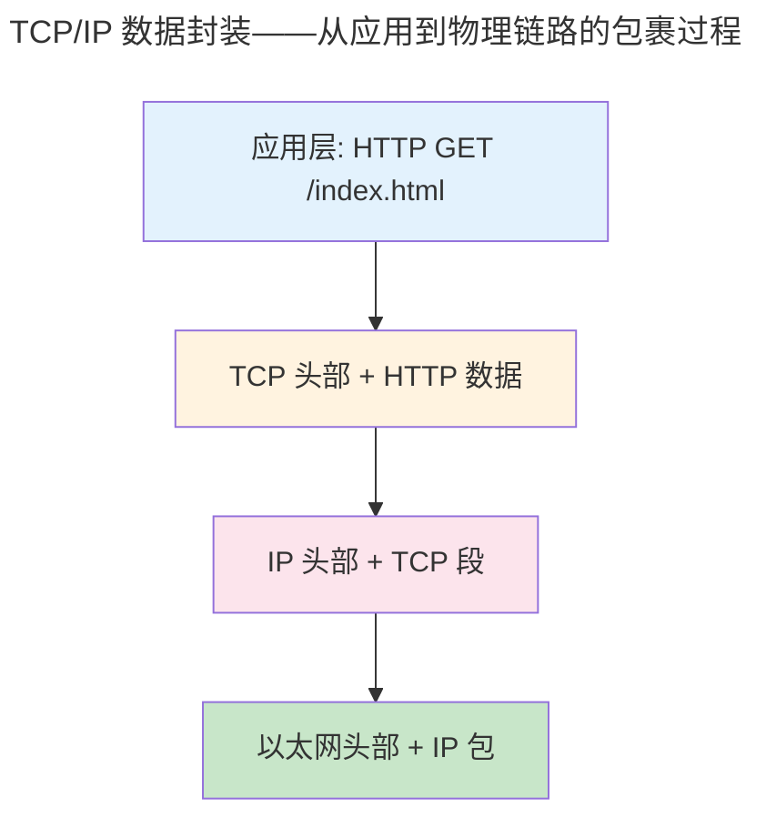

> 分层是网络设计的核心哲学。

1974 年，Cerf 和 Kahn 在 TCP 奠基论文中定义了分层模型。半个世纪后，这一模型依然是全球互联网的骨架。分层的本质是**封装与解封装**——每层将上层数据包裹在自己的头部中，对端逐层剥离。

---

## TCP/IP 四层模型

| TCP/IP 层 | 协议 | PDU | 核心功能 |
|-----------|------|-----|---------|
| 应用层 | HTTP, DNS, TLS | 数据 | 应用语义 |
| 传输层 | TCP, UDP, QUIC | 段 | 端口 + 可靠性 |
| 网络层 | IP, ICMP, OSPF | 包 | 寻址 + 路由 |
| 链路层 | Ethernet, ARP, Wi-Fi | 帧 | 相邻跳传输 |

---

## IP 协议

IPv4 地址是 32 位整数。CIDR 无类域间路由取代了 A/B/C 类地址的僵化分类。当包超过路径 MTU（通常 1500 字节），IP 分片将包分割——IPv6 强制使用路径 MTU 发现避免中间路由器分片。

---

## 路由算法

**距离向量**（Bellman-Ford）：每个路由器向邻居通告距离估计——RIP 使用此算法。**链路状态**（Dijkstra）：每个路由器洪泛链路状态，独立计算全拓扑最短路径——OSPF 使用此算法。

---

## ARP 与 NAT

ARP 广播 `who-has 192.168.1.5?` 获取目标 MAC。NAT 将私有地址替换为网关公网地址，通过端口映射实现多主机共享一个公网 IP。

---

## 跨卷连接

| 本章概念 | 依赖的底层原理 | 支撑的上层抽象 |
|----------|---------------|---------------|
| 分层封装 | [链接脚本的段布局](../02-jiezi/01-bare-metal/) | [HTTP/2 帧封装](../07-application-protocols/) |
| Bellman-Ford 路由 | [图算法最短路径](../../00-lingxi/04-algorithm-theory/) | [BGP 策略路由](../../04-yuanhai/03-distributed-fundamentals/) |
| NAT | [IP conntrack 连接跟踪表](#) | [容器 CNI 端口映射](../../08-qianli/02-system-design/) |

:::tip[卷三内部路径]
- [**传输层**](../06-transport-tcp-udp-quic/)：TCP——IP 之上的端到端可靠性
- [**网络编程**](../08-network-programming/)：Socket API——IP 的用户态接口
:::
