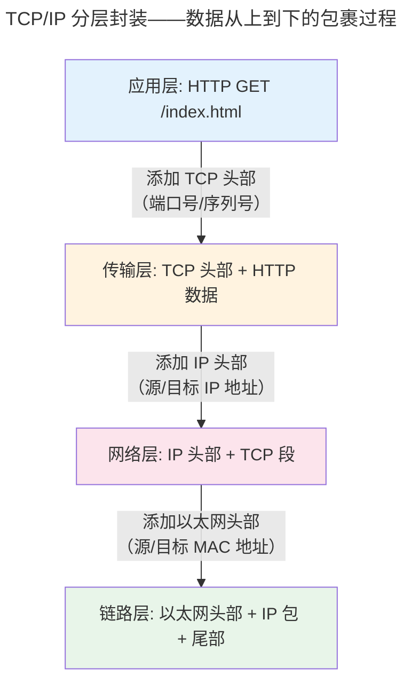

> 分层是网络设计的核心哲学。

1974 年，Vint Cerf 和 Bob Kahn 在 IEEE Transactions on Communications 上发表了 TCP 协议的奠基论文 *A Protocol for Packet Network Intercommunication*。半个世纪后，这篇论文中定义的"分层模型"依然是全球互联网运行的骨架。分层的本质是**封装与解封装**——每一层将上层的数据包裹在自己的头部中，经过物理介质的传输后，对端逐层剥离头部，最终将原始数据交付给目标应用。

本章从 OSI 七层模型和 TCP/IP 四层模型的分层哲学出发，深入 IP 协议的寻址与分片机制，走过路由算法的距离向量与链路状态之争，最后剖析 ARP、NAT 和 ICMP 的协作。

---

## 分层模型：为什么七层变成了四层

| OSI 七层模型 | TCP/IP 四层模型 | 协议实例 | PDU 名称 |
|-------------|----------------|---------|---------|
| 应用层 | 应用层 | HTTP, DNS, SMTP, TLS | 数据 |
| 表示层 | ↑ | TLS, MIME | ↑ |
| 会话层 | ↑ | Socket | ↑ |
| 传输层 | 传输层 | TCP, UDP, QUIC | 段（Segment） |
| 网络层 | 网络层 | IP, ICMP, OSPF | 包（Packet） |
| 数据链路层 | 链路层 | Ethernet, ARP, Wi-Fi | 帧（Frame） |
| 物理层 | ↑ | 双绞线, 光纤, 无线电 | 比特 |

OSI 的上三层（应用/表示/会话）在 TCP/IP 中合并为一层——因为在 IP 网络的实践中，数据格式协商（表示层）和会话管理（会话层）通常由单个应用协议（如 HTTP + TLS）一并处理。

---

## IP 协议：互联网的"邮递员"

### 寻址与子网划分

IPv4 地址是一个 32 位整数，通常写作点分十进制 `192.168.1.1`。子网掩码决定一个地址的"网络部分"和"主机部分"：

- `192.168.1.0/24`：前 24 位是网络部分（`192.168.1`），后 8 位是主机部分
- CIDR（无类域间路由）取代了 A/B/C 类地址的僵化分类，使地址分配更加灵活

### IP 分片：当包大于 MTU

以太网的 MTU（最大传输单元）通常为 1500 字节。当 IP 包超过路径上的某段链路的 MTU 时，路由器将包**分片**——分割为多个较小的 IP 包，每个携带相同的 Identification 字段，由目标主机的 IP 层重新组装。分片是 IP 协议中性能最低的操作之一——IPv6 强制要求发送方使用**路径 MTU 发现**（Path MTU Discovery），避免中间路由器执行分片。

---

## 路由算法：寻找最佳路径

### 距离向量：RIP 与 Bellman-Ford

距离向量路由（Distance Vector）的核心思想：每个路由器向邻居通告自己到达所有目标网络的距离（跳数）。RIP（Routing Information Protocol）使用这一算法，最大跳数限制为 15（16 表示不可达）——限制了 RIP 只能用于小型网络。Bellman-Ford 方程：

$$
D_x(y) = \min_{v \in N(x)} [c(x, v) + D_v(y)]
$$

其中 $D_x(y)$ 是路由器 $x$ 到目标 $y$ 的最佳距离估计，$N(x)$ 是 $x$ 的邻居集合。

### 链路状态：OSPF 与 Dijkstra

链路状态路由（Link State）的核心思想：每个路由器向**整个网络**洪泛（flood）自己到邻居的链路状态，所有路由器共享同一张完整的网络拓扑图，各自运行 Dijkstra 最短路径算法。OSPF（Open Shortest Path First）是链路状态路由的代表协议，广泛应用于企业网络。

---

## ARP、NAT 与 ICMP

**ARP**（Address Resolution Protocol）：当主机知道目标 IP 但不知道目标 MAC 时，广播 ARP 请求 `who-has 192.168.1.5?`，目标主机回应其 MAC 地址。ARP 响应被缓存以减少广播开销——ARP 投毒攻击正是利用了这一缓存机制。

**NAT**（Network Address Translation）：私有 IP 地址无法在公网路由。NAT 网关将内部主机的私有地址替换为网关的公网地址，通过端口映射实现多台主机共享一个公网 IP。NAT 穿透（UDP 打洞、STUN/TURN）是 P2P 通信的必要技术。

---

## 跨卷连接

IP 网络的分层设计是对[分层存储体系](../../01-weichen/04-memory-hierarchy/#存储金字塔从寄存器到磁带的七重天)的直接呼应——每一层解决一个问题，层与层之间通过标准接口通信：

| 本章概念 | 依赖的底层原理 | 支撑的上层抽象 |
|----------|---------------|---------------|
| 分层的封装/解封装 | [链接脚本的段布局与封装](../02-jiezi/01-bare-metal/#链接脚本给二进制一张地图) | [HTTP/2 帧封装与多路复用](../07-application-protocols/) |
| IP 路由 Bellman-Ford | [图算法与最短路径](../../00-lingxi/04-algorithm-theory/) | [BGP 策略路由与 SDN 控制面](../../04-yuanhai/03-distributed-fundamentals/) |
| ARP 广播与二层转发 | [总线仲裁与多主通信](../02-jiezi/04-peripheral-drivers/#i²c双线承载万物的哲学) | [以太网交换机自学习 MAC 表](../05-network-protocol-stack/) |
| NAT 端口映射 | IP 连接跟踪表（conntrack） | [容器网络的端口映射与 CNI](../../08-qianli/02-system-design/) |
| ICMP 差错报告 | [异常与中断的异步通知机制](../02-jiezi/02-interrupts/#中断异常与系统调用三类非常规控制流) | [应用层健康检查与 Ping 探测](../../08-qianli/04-observability/) |

:::tip[卷三内部路径]
- [**传输层**](../06-transport-tcp-udp-quic/)：TCP/UDP——IP 之上端到端可靠性
- [**应用层协议**](../07-application-protocols/)：HTTP/DNS——TCP/UDP 之上的万维网
- [**网络编程**](../08-network-programming/)：Socket API——IP/TCP 的用户态接口
:::
