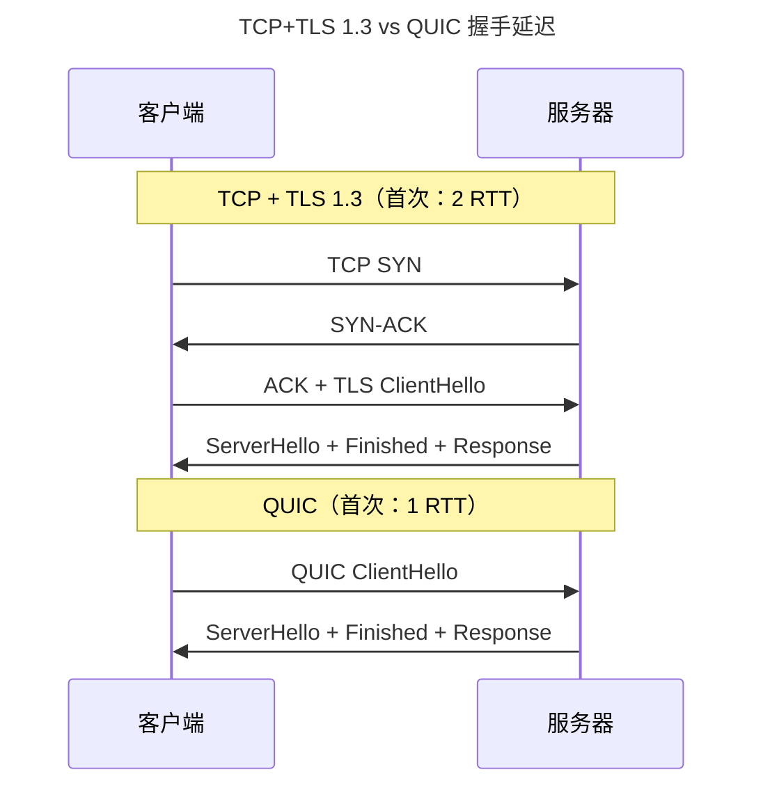

> 端到端的可靠与速度博弈。

IP 协议忠实地投递数据包但不保证顺序、不检测丢失、不限制速率。传输层在不可靠的 IP 之上构建端到端的可靠性、顺序保证和拥塞控制。

---

## TCP：可靠传输的基石

三次握手保证双方确认通信能力。滑动窗口实现流量控制——`EffectiveWindow = AdvertisedWindow - (LastByteSent - LastByteAcked)`。当接收方通告窗口为 0，发送方启动定时器周期性探测窗口。

---

## 拥塞控制：从 Tahoe 到 BBR

| 算法 | 诞生 | 核心创新 | 拥塞信号 |
|------|------|---------|---------|
| **Reno** | 1990 | 快速重传 + 快速恢复 | 丢包 |
| **CUBIC** | 2008 | 三次函数窗口增长 | 丢包（Linux 默认） |
| **BBR** | 2016 | **带宽-延迟积建模** | 不依赖丢包！测量可用带宽 |

BBR 的革命性：不将丢包等同于拥塞——Wi-Fi 随机丢包不等于网络拥塞。BBR 通过周期性探测瓶颈带宽和 RTT，计算 BDP = BtlBw × RTprop，保持发送量恰好等于 BDP。

---

## QUIC：下一代传输协议

QUIC 在 UDP 之上整合了 TCP 可靠性和 TLS 加密：

关键创新：0-RTT 重连、无队头阻塞（独立流）、连接迁移。

---

## 跨卷连接

| 本章概念 | 关联 |
|----------|------|
| TCP 滑动窗口 | [环形缓冲区读写指针](../02-jiezi/04-peripheral-drivers/) |
| BBR 带宽探测 | [分支预测的投机执行](../../01-weichen/03-microarchitecture/) |
| QUIC 连接迁移 | [TCP 五元组绑定](../05-network-protocol-stack/) |

:::tip[卷三内部路径]
- [**网络协议栈 I**](../05-network-protocol-stack/)：IP 路由——TCP 的承载层
- [**应用层协议**](../07-application-protocols/)：HTTP/3 over QUIC
:::
