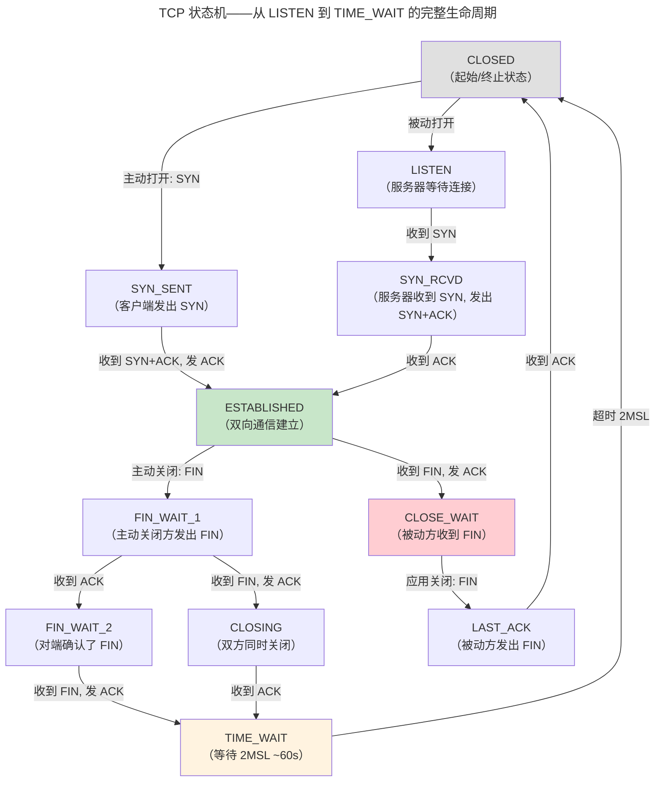
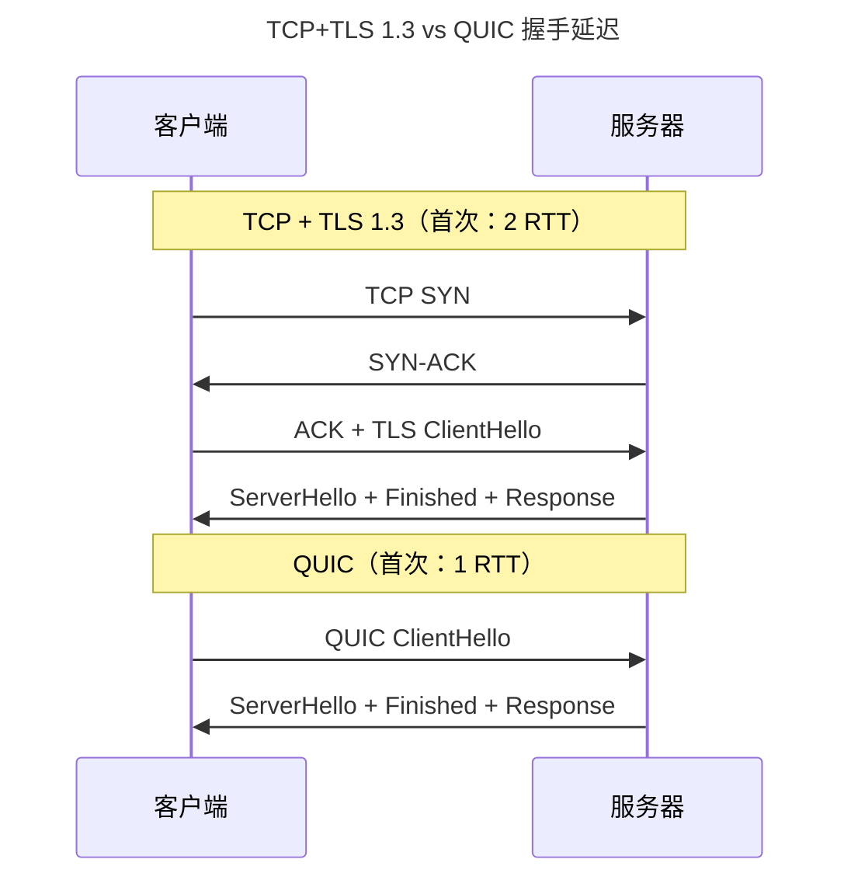

> 端到端的可靠与速度博弈。

IP 协议忠实地投递数据包但不保证顺序、不检测丢失、不限制速率。传输层在不可靠的 IP 之上构建端到端的可靠性、顺序保证和拥塞控制。

---

## TCP：可靠传输的基石

### TCP 段头部结构（20-60 字节）

```
TCP 头部结构（最小 20 字节，不含选项）

 0               4               8              12              16              20              24              31
┌───────────────┬───────────────┬───────────────┬───────────────┬───────────────┬───────────────┬───────────────┬───────────────┐
│          源端口 (16)          │         目标端口 (16)          │                                                                 │
├───────────────┴───────────────┴───────────────┴───────────────┤                                                                 │
│                         序列号 Sequence Number (32 bits)        │                       32-bit 字对齐                       │
├───────────────────────────────────────────────────────────────┤                                                                 │
│                         确认号 Acknowledgment Number (32 bits) │                                                                 │
├───────────────┬───────────────┬───────────────┬───────────────┼───────────────┬───────────────┬───────────────┬───────────────┤
│ 数据偏移 (4)  │ 保留 (3)      │ N(1) │ C(1) │ E(1) │ U(1) │ A(1) │ P(1) │ R(1) │ S(1) │ F(1) │         窗口大小 (16)           │
│ (头部长度/4)  │               │  NS  │ CWR  │ ECE  │ URG  │ ACK  │ PSH  │ RST  │ SYN  │ FIN  │                               │
├───────────────┴───────────────┴───────────────┴───────────────┼───────────────┴───────────────┴───────────────┴───────────────┤
│          校验和 (16)           │        紧急指针 (16)           │                                                                 │
├───────────────────────────────┴───────────────────────────────┤                                                                 │
│                        选项 Options (0-40 bytes)                │                                                                 │
│  · MSS (2+2B)：最大段大小，协商避免分片                          │                                                                 │
│  · Window Scale (2+1B)：窗口左移位数，突破 64KB 窗口上限         │                                                                 │
│  · SACK Permitted (2B)：声明支持选择性确认                       │                                                                 │
│  · Timestamps (2+8B)：RTT 测量 + PAWS 防回绕                    │                                                                 │
└───────────────────────────────────────────────────────────────┴───────────────────────────────────────────────────────────────┘
```

| 字段 | 位宽 | 作用 |
|------|------|------|
| **SEQ / ACK** | 32×2 | SEQ=本段首字节在字节流中的偏移；ACK=期望接收的下一个字节序号（累积确认） |
| **Flags**（9 bits） | 9 | SYN（建连）/ FIN（关连）/ RST（重置）/ PSH（立即推送）/ ACK（确认有效）/ URG（紧急） |
| **Window** | 16 | 接收方剩余缓冲区大小——流量控制的唯一依据。结合 Window Scale 选项可扩展到 1 GB |
| **Checksum** | 16 | 涵盖伪头部（源/目标 IP + 协议号 + TCP 段长度）+ TCP 头部 + 数据 |
| **数据偏移** | 4 | 头部长度以 4 字节为单位——定位 TCP 数据的起始位置 |

三次握手保证双方确认通信能力。滑动窗口实现流量控制——`EffectiveWindow = AdvertisedWindow - (LastByteSent - LastByteAcked)`。当接收方通告窗口为 0，发送方启动定时器周期性探测窗口。

### TCP 选项——头部扩展的协商机制

TCP 选项的格式为 `[Kind(1B)][Length(1B)][Value(Length-2 B)]`，填充至 4 字节边界：

| 选项 | Kind | 长度 | 何时出现 | 作用 |
|------|------|------|---------|------|
| **MSS** | 2 | 4 B | SYN 段 | 声明本端最大可接收的 TCP 段数据长度，避免 IP 分片——通常为 MTU-40 |
| **Window Scale** | 3 | 3 B | SYN 段 | 窗口左移位数（0-14）：实际窗口 = Window 字段 × 2^shift——将 64KB 限制扩展到 1 GB |
| **SACK Permitted** | 4 | 2 B | SYN 段 | 声明支持选择性确认 |
| **SACK** | 5 | 变长 (10-34 B) | 数据段 | 携带已接收的不连续块列表——最多 4 个块 |
| **Timestamps** | 8 | 10 B | 多数数据段 | TSval + TSecr：精确 RTT 测量 + PAWS（防序列号回绕） |

> **没有 Window Scale 的后果**：16-bit 窗口字段限制最大窗口为 64KB——在 100ms RTT 的跨洋链路上，吞吐量上限仅 $64\text{KB} \times 8 / 0.1\text{s} \approx 5.2\text{ Mbps}$。启用 Window Scale（shift=7）后，相同链路可达 ~670 Mbps。

### UDP 头部——极简的不可靠传输

UDP 的哲学是"够用即可"——头部仅 8 字节，无连接、无确认、无重传：

```
UDP 头部结构（8 字节，固定长度）

 0                             16                              31
┌───────────────────────────────┬───────────────────────────────┐
│        源端口 (16 bits)        │       目标端口 (16 bits)       │
├───────────────────────────────┼───────────────────────────────┤
│        长度 (16 bits)          │       校验和 (16 bits)         │
│     (头部+数据，最小 8)        │  (伪头部+UDP 头+数据；可选)     │
└───────────────────────────────┴───────────────────────────────┘
```

| 特性 | TCP | UDP |
|------|-----|-----|
| 头部大小 | 20-60 B | 8 B（固定） |
| 连接模型 | 面向连接（三次握手） | 无连接——`sendto()` 即发送 |
| 可靠性 | 确认/重传/排序 | 无——应用层自建（QUIC 正是基于 UDP 自建可靠性） |
| 适用场景 | HTTP, SSH, 文件传输 | DNS, 流媒体, 在线游戏, QUIC |
| 分片 | TCP 自行分段（MSS），避免 IP 分片 | 依赖 IP 分片——超过 MTU 则由网络层切分 |

三次握手保证双方确认通信能力。滑动窗口实现流量控制——`EffectiveWindow = AdvertisedWindow - (LastByteSent - LastByteAcked)`。当接收方通告窗口为 0，发送方启动定时器周期性探测窗口。

### TCP 状态机——连接的一生



> **TIME_WAIT 为什么是 2MSL（Maximum Segment Lifetime）？** 确保最后一个 ACK 能到达对端（若 ACK 丢失，对端重传 FIN 能在 2MSL 内到达），且让网络中残余的旧连接报文过期。`net.ipv4.tcp_tw_reuse` 可安全复用 TIME_WAIT 端口。

### RTO——重传超时的自适应计算

超时重传是 TCP 可靠性的最后防线。RTO 必须大于 RTT，但不能过大（否则丢包恢复太慢）。Jacobson 算法使用 RTT 平滑值和偏差的指数加权移动平均：

$$
SRTT_{n} = (1 - \alpha) \cdot SRTT_{n-1} + \alpha \cdot RTT_n \quad (\alpha = 1/8)
$$

$$
DevRTT_{n} = (1 - \beta) \cdot DevRTT_{n-1} + \beta \cdot |RTT_n - SRTT_{n-1}| \quad (\beta = 1/4)
$$

$$
RTO = SRTT + 4 \cdot DevRTT
$$

Karn 算法额外规定：重传的段不用于更新 RTT 估计——因为无法区分 ACK 对应的是原始段还是重传段。Linux 使用 TCP 时间戳选项（`net.ipv4.tcp_timestamps`）解决此问题。

### SACK——选择性确认的精确重传

累积 ACK 的问题是：窗口内丢了一个段，发送方必须重传该段后续所有段（即使它们已被接收）。SACK（Selective ACK，RFC 2018）在 TCP 选项中携带已接收的不连续块范围：

```
传统累积 ACK：ACK=1000（期望下一个字节）——即使 1000-2000 丢失但 2000-3000 已收到
SACK：ACK=1000, SACK=2000-3000 —— 发送方精确重传 1000-2000 即可
```

配合 `PRR`（比例速率缩减），SACK 在高带宽-延迟积网络中将重传量从 窗口大小 降至实际丢包数。

---

## 拥塞控制：从 Tahoe 到 BBR

| 算法 | 诞生 | 核心创新 | 拥塞信号 |
|------|------|---------|---------|
| **Reno** | 1990 | 快速重传 + 快速恢复 | 丢包 |
| **CUBIC** | 2008 | 三次函数窗口增长 | 丢包（Linux 默认） |
| **BBR** | 2016 | **带宽-延迟积建模** | 不依赖丢包！测量可用带宽 |

BBR 的革命性：不将丢包等同于拥塞——Wi-Fi 随机丢包不等于网络拥塞。BBR 通过周期性探测瓶颈带宽和 RTT，计算 BDP = BtlBw × RTprop，保持发送量恰好等于 BDP。

---

## QUIC：下一代传输协议

QUIC 在 UDP 之上整合了 TCP 可靠性和 TLS 加密：



关键创新：0-RTT 重连、无队头阻塞（独立流）、连接迁移。

---

## 跨卷连接

| 本章概念 | 关联 |
|----------|------|
| TCP 状态机 + TIME_WAIT | [进程状态机的调度转换](../01-process-and-thread/) |
| RTO Jacobson/Karn 算法 | [卡尔曼滤波——状态估计的递归平滑](../../00-lingxi/01-mathematical-foundations/) |
| SACK 选择性确认 | [RAID 5 的奇偶校验局部更新](../../04-yuanhai/02-storage-engine/) |
| BBR 带宽探测 | [分支预测的投机执行——延迟不报错](../../01-weichen/03-microarchitecture/) |
| QUIC 连接迁移 | [TCP 五元组绑定](../08-network-programming/) |

:::tip[卷三内部路径]
- [**网络协议栈 I**](../05-network-protocol-stack/)：IP 路由——TCP 的承载层
- [**应用层协议**](../07-application-protocols/)：HTTP/3 over QUIC
:::
