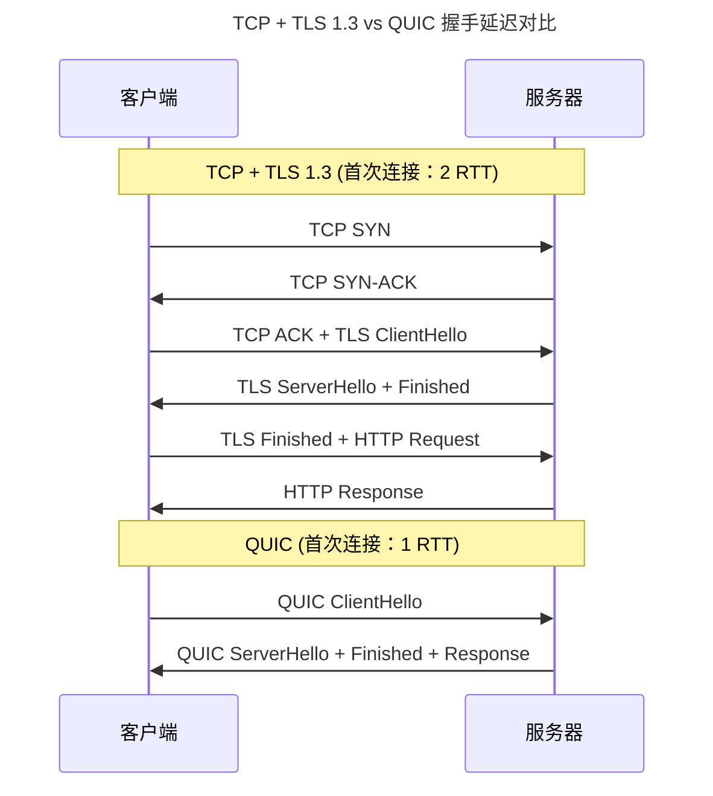

> 端到端的可靠与速度博弈。

IP 协议忠实地将数据包从源地址投递到目标地址——但它不保证包的顺序、不检测包的丢失、不限制发送速率。**传输层**在这些"不可靠"的 IP 服务之上，构建了端到端的可靠性、顺序保证和拥塞控制。

本章从 TCP 的经典状态机和三次握手出发，解剖滑动窗口与流量控制的精巧设计，追踪拥塞控制算法的三十年进化——从 Tahoe 到 BBR，然后走过 UDP 的极简主义，最终抵达 QUIC——Google 设计的下一代传输协议。

---

## TCP：可靠传输的基石

### 三次握手与四次挥手

TCP 连接的建立使用**三次握手**——SYN → SYN-ACK → ACK。三次而非两次的原因：防止历史连接请求（delayed SYN）意外建立连接。四次挥手（FIN → ACK → FIN → ACK）的"四次"源于 TCP 全双工的本质——每个方向独立关闭。

### 滑动窗口与流量控制

TCP 接收方通过**窗口字段**告诉发送方自己还有多少接收缓冲区空间。发送方的发送数据量不能超过窗口大小——这是**流量控制**（Flow Control），防止快发送方淹没慢接收方。

$$
\text{EffectiveWindow} = \text{AdvertisedWindow} - (\text{LastByteSent} - \text{LastByteAcked})
$$

当接收方通告窗口为 0，发送方停止发送并启动**持续定时器**（Persist Timer），周期性探测窗口是否重新打开——防止窗口更新报文丢失导致的死锁。

---

## 拥塞控制：从 Tahoe 到 BBR

### AIMD：加法增、乘法减

TCP 的经典拥塞控制遵循 AIMD（Additive Increase, Multiplicative Decrease）原则：

- **慢启动**（Slow Start）：拥塞窗口（cwnd）从 1 MSS 开始，每收到一个 ACK 就增加 1——指数增长，直到超过慢启动阈值（ssthresh）
- **拥塞避免**（Congestion Avoidance）：线性增长，每 RTT 增加 1 MSS
- **快速重传**（Fast Retransmit）：收到 3 个重复 ACK 时立即重传丢失的包，不等超时
- **快速恢复**（Fast Recovery）：将 cwnd 减半（乘法减）而非重置为 1

### 三大经典算法比较

| 算法 | 诞生 | 核心创新 | 瓶颈探测方式 | 适用场景 |
|------|------|---------|------------|---------|
| **Reno** | 1990 | 快速重传 + 快速恢复 | 丢包 = 拥塞信号 | 低丢包率有线网络 |
| **CUBIC** | 2008 | 三次函数窗口增长 | 丢包驱动 | Linux 默认，高 BDP 网络 |
| **BBR** | 2016 | **带宽-延迟积建模** | 不依赖丢包！测量可用带宽 | 高丢包链路（如 Wi-Fi/4G） |

BBR 的革命性在于它**不再将丢包等同于拥塞**——在有损链路（如 Wi-Fi）上，随机丢包不等于网络拥塞，传统算法会错误地降低发送速率。BBR 通过周期性探测 RTT 和带宽瓶颈，精确估计链路的真实可用带宽：

$$
\text{BDP} = \text{BtlBw} \times \text{RTprop}
$$

其中 $\text{BtlBw}$ 是瓶颈链路的可用带宽，$\text{RTprop}$ 是往返传播延迟（不含排队延迟）。BBR 的目标是保持 inflight 数据量等于 BDP——不多不少，恰好填满链路但不产生排队。

:::tip[跨卷链接]
TCP 拥塞控制算法本质上是[反馈控制系统](../../00-lingxi/04-algorithm-theory/)——发送方根据网络反馈信号（丢包/RTT 变化）调整发送速率。BBR 的瓶颈带宽探测类似于[处理器的分支预测器](../../01-weichen/03-microarchitecture/#推测取指与分支预测)——通过历史行为建模预测未来状态，在不确定性中做出最优决策。
:::

---

## UDP：极简主义的力量

UDP 抛弃了 TCP 所有的可靠性机制——没有握手、没有确认、没有重传、没有流量控制。它只提供了两个额外服务：**端口号**（多路复用/解多路复用）和**校验和**（检测数据损坏）。UDP 头部仅 8 字节（TCP 头部为 20-60 字节），处理开销极低。

UDP 的"不可靠"反而成为优势场景：

- **实时音视频**：丢失一帧画面远好于重传导致的延迟抖动
- **DNS 查询**：一个包即可完成请求-响应，无需建立连接
- **QUIC**：在 UDP 之上重新实现了可靠性——传输层创新的"用户态实验田"

---

## QUIC：下一代传输协议

QUIC（Quick UDP Internet Connections）本质是将 TCP、TLS 和 HTTP/2 多路复用的功能整合到单个协议中，运行在 UDP 之上。其关键创新：

1. **0-RTT 握手**：已连接过的客户端可以在 Hello 包中直接携带业务数据
2. **无队头阻塞**：每个 HTTP 请求有独立的流，一个流的丢包不影响其他流
3. **连接迁移**：连接 ID 独立于 IP 地址/端口，Wi-Fi 切换到 4G 时连接不断

---

## 跨卷连接

传输层是"网络协议栈中最有算法味的一层"——它的拥塞控制、流控和可靠传输都是经典的自适应控制问题：

| 本章概念 | 依赖的底层原理 | 支撑的上层抽象 |
|----------|---------------|---------------|
| TCP 滑动窗口 | [环形缓冲区与读写指针](../02-jiezi/04-peripheral-drivers/#uart跨越时间的异步对话) | [Kafka 分区的 Offset 滑动窗口](../../04-yuanhai/05-data-pipelines/) |
| BBR 带宽探测 | [处理器分支预测的投机执行](../../01-weichen/03-microarchitecture/#推测取指与分支预测) | [自适应比特率流媒体（ABR）](../../05-wanxiang/04-data-visualization/) |
| QUIC 连接迁移 | [TCP 连接的五元组绑定](../../05-network-protocol-stack/) | [gRPC 的双工流与连接池](../../08-qianli/02-system-design/) |
| UDP 最小化设计 | [RISC 设计哲学：少即是多](../../01-weichen/05-instruction-set-architecture/#cisc-与-risc两套哲学的五十年对决) | [DNS 单包查询协议](../07-application-protocols/) |
| 0-RTT 握手安全 | [重放攻击与 TLS 1.3 的 PSK 机制](../07-application-protocols/) | [OAuth 2.0 Token 与重放防护](../../07-tianshu/05-system-security/) |

:::tip[卷三内部路径]
- [**网络协议栈 I**](../05-network-protocol-stack/)：IP 路由——TCP 段的承载层
- [**应用层协议**](../07-application-protocols/)：HTTP/3 over QUIC——传输层创新驱动应用层变革
- [**网络编程**](../08-network-programming/)：Socket——TCP/UDP 的用户态编程接口
:::
