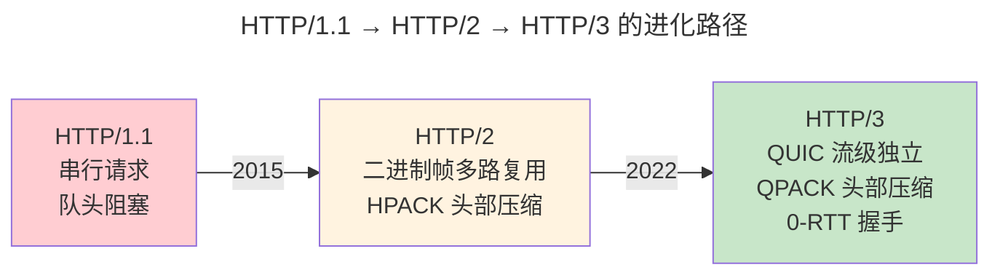

> Web 世界的通用语言。

传输层提供端到端的字节流，应用层定义了字节流的语义：HTTP 的请求/响应模型、DNS 的分层查询、TLS 的加密握手。本章以 DNS 递归解析为起点，走过 HTTP/1.1 到 HTTP/3 的三代进化。

---

## DNS：互联网的电话簿

DNS 递归解析路径：客户端 → 本地解析器 → 根 → .com TLD → example.com 权威 → A 记录。每个响应携带 TTL，中间解析器据此缓存。

常用记录类型决定了 DNS 能回答什么问题：

| 类型 | 含义 | 示例 |
|------|------|------|
| **A** | IPv4 地址 | `example.com. 300 IN A 93.184.216.34` |
| **AAAA** | IPv6 地址 | `example.com. 300 IN AAAA 2606:2800:220:1::` |
| **CNAME** | 别名（Canonical Name） | `www.example.com. CNAME example.com.` |
| **MX** | 邮件服务器 + 优先级 | `example.com. MX 10 mail.example.com.` |
| **NS** | 权威域名服务器 | `example.com. NS ns1.example.com.` |
| **TXT** | 任意文本——SPF/DKIM/DMARC 邮件验证 | `example.com. TXT "v=spf1 include:_spf.google.com ~all"` |

DoH（DNS over HTTPS）和 DoT（DNS over TLS）将 DNS 查询加密在 TLS 隧道中——防止 ISP 窥探你的浏览记录，代价是额外 1 RTT 的 TLS 握手。`/etc/resolv.conf` 中的 `nameserver 8.8.8.8` 正被 `systemd-resolved` 和浏览器的内置 DoH 取代。

### DNS 报文线格式——查询与应答的统一结构

DNS 报文承载在 UDP（标准查询，512 字节限制）或 TCP（大响应/区域传输）的负载中。所有 DNS 报文共享统一头部：

```
DNS 报文结构（12 字节固定头 + 变长 Section）

 0                             16                              31
┌───────────────────────────────┬───────────────────────────────┐
│       事务 ID Transaction ID (16 bits)│QR │ Opcode│AA│TC│RD  │
│       (请求-应答匹配)          │(1)│ (4)   │(1)│(1)│(1)    │
├───────────────────────────────┼───────────────────────────────┤
│ RA│ Z │ AD│ CD│   RCODE (4)   │       问题计数 QDCOUNT       │
│(1)│(1)│(1)│(1)│ (0=OK)        │                               │
├───────────────────────────────┼───────────────────────────────┤
│       回答计数 ANCOUNT         │      权威计数 NSCOUNT          │
├───────────────────────────────┼───────────────────────────────┤
│       附加计数 ARCOUNT         │                               │
├───────────────────────────────┴───────────────────────────────┤
│                  Question Section（变长）                       │
│  QNAME：域名（标签格式：长度+字节，以 \x00 终止）                │
│  QTYPE (16)：A=1, AAAA=28, MX=15, NS=2, CNAME=5, TXT=16       │
│  QCLASS (16)：1=IN（Internet）                                  │
├───────────────────────────────────────────────────────────────┤
│                  Answer / Authority / Additional Sections       │
│  NAME（压缩指针或完整域名）+ TYPE + CLASS + TTL (32) +          │
│  RDLENGTH (16) + RDATA（变长——A=4B IP, AAAA=16B, MX=2B 优先级+域名）│
└───────────────────────────────────────────────────────────────┘
```

> **DNS 域名压缩**：为了在 512 字节限制内容纳大响应，DNS 使用指针压缩——`RDATA` 中重复出现的域名后缀用 2 字节指针（高 2 bits=11）代替，指向报文中先前出现的域名位置。例如 `www.example.com` 在 Answer Section 中可能被压缩为 `www` + 指向 Question Section 中 `example.com` 的 2 字节指针。

---

## HTTP：从 1.1 到 3.0



| 版本 | 传输层 | 队头阻塞 | 首发 |
|------|--------|---------|------|
| HTTP/1.1 | TCP（串行） | TCP + 应用层 | 1997 |
| HTTP/2 | TCP（多路复用） | TCP 层仍有 | 2015 |
| HTTP/3 | QUIC (UDP) | **无** | 2022 |

HTTP 状态码的三个区间定义了响应的语义：2xx（成功——`200 OK`、`201 Created`）、3xx（重定向——`301 Moved Permanently`、`302 Found`）、4xx（客户端错误——`404 Not Found`、`429 Too Many Requests`）、5xx（服务端错误——`502 Bad Gateway`、`503 Service Unavailable`）。

### HTTP/2 帧格式——多路复用的结构化基础

HTTP/2 将所有通信分解为二进制帧，每个帧属于一个流（Stream ID），这是其多路复用能力的实现基础：

```
HTTP/2 帧结构（9 字节固定头 + 变长负载）

 0                             24                              31
┌───────────────────────────────┬───────────────┬───────────────┐
│         长度 Length (24 bits)  │  类型 Type (8)│ 标志 Flags (8)│
├───────────────────────────────┴───────────────┴───────────────┤
│                   R│         流标识符 Stream ID (31 bits)       │
│                  (1)│                                          │
├────────────────────────────────────────────────────────────────┤
│                   帧负载 Frame Payload (变长)                    │
└────────────────────────────────────────────────────────────────┘

帧类型 (Type)：
  · 0x0 = DATA         —— HTTP 请求/响应体
  · 0x1 = HEADERS      —— 压缩的 HTTP 头部（HPACK）
  · 0x2 = PRIORITY     —— 流优先级（已弃用，RFC 9113）
  · 0x3 = RST_STREAM   —— 终止流（取消请求）
  · 0x4 = SETTINGS     —— 连接级参数协商（头部表大小、初始窗口、最大并发流）
  · 0x5 = PUSH_PROMISE —— 服务器推送承诺（已弃用）
  · 0x6 = PING         —— 心跳 + RTT 测量
  · 0x7 = GOAWAY       —— 优雅关闭连接
  · 0x8 = WINDOW_UPDATE—— 流级别/连接级别流量控制
  · 0x9 = CONTINUATION —— HEADERS 的延续帧
```

### TLS 记录格式——加密通道的原子传输单元

---

## TLS 1.3：1-RTT 握手的极简主义

TLS 1.3 移除了静态 RSA——所有密钥交换必须使用前向安全性（ECDHE）。1-RTT 握手：客户端猜测服务器支持的密钥共享参数，猜对则 1 RTT 完成。

### TLS 记录层——加密通道的原子传输单元

TLS 协议分为两层：**握手层**（协商密钥和参数）和**记录层**（传输加密数据）。记录层是所有 TLS 通信的基本单元：

```
TLS 记录结构（通用格式，最多 16 KB 明文/记录）

 0               8              16                              31
┌───────────────┬───────────────┬───────────────┬───────────────────────────────┐
│ 内容类型 (8)  │ 协议版本 (16) │        记录长度 Length (16 bits)              │
├───────────────┴───────────────┴───────────────┴───────────────────────────────┤
│                         协议消息 Protocol Message (变长)                       │
│                                                                               │
│  内容类型:                                                                    │
│    · 20 = ChangeCipherSpec (TLS 1.3 中仅用于兼容)                             │
│    · 21 = Alert (关闭通知/错误)                                                │
│    · 22 = Handshake (ClientHello/ServerHello/Certificate/Finished)            │
│    · 23 = Application Data (加密的应用数据)                                    │
│                                                                               │
│  TLS 1.3 简化:                                                                 │
│    · 版本字段在记录中固定为 0x0303 (TLS 1.2)，实际版本在握手中协商              │
│    · 应用数据记录后附加 AEAD 认证标签 (GCM: 16B, ChaCha20-Poly1305: 16B)       │
│    · 加密涵盖: 载荷 + 认证标签 —— 记录尾部无单独 MAC 字段                      │
└───────────────────────────────────────────────────────────────────────────────┘
```

在实现层面，TLS 记录是 `struct iovec` 数组通过 `sendmsg()` 零拷贝发送的经典案例——头部、载荷、认证标签各自分散在 kernel 内存中，由网卡 Scatter-Gather DMA 在一次操作中将它们拼接为完整的以太网帧。

### 证书信任链——TLS 的信任根基

浏览器信任的不是你的服务器证书，而是签发它的 **CA（证书颁发机构）**。信任链的结构：

```
根 CA（自签名，预装在操作系统/浏览器信任库中）
  └─ 中间 CA（由根 CA 签名）
       └─ 叶证书（你的 example.com，由中间 CA 签名）
```

验证过程沿链向上——每个证书的签名用上一级的公钥验证，直至根 CA。根 CA 的公钥以自签名证书形式预装在 `/etc/ssl/certs/`（Linux）、Keychain（macOS）或 Windows 证书存储中。**任何一级被攻破，整条链作废**——这是 2011 年 DigiNotar 和 2016 年 WoSign 事件的教训。Certificate Transparency（RFC 6962）通过公开日志审计所有签发的证书，使 CA 的恶意或错误签发可被检测。

0-RTT 重连：使用预共享密钥（PSK）直接携带应用数据——但有重放攻击风险，因此仅允许幂等请求。

---

## 跨卷连接

| 概念 | 关联 |
|----------|------|
| DNS 记录类型 + DoH | [IP TTL——缓存的生存周期](../05-network-protocol-stack/) | [CDN Anycast DNS——智能解析](../../04-yuanhai/03-distributed-fundamentals/) |
| HTTP 状态码 + 多路复用 | [epoll 事件驱动 I/O 多路复用](../08-network-programming/) | [gRPC——基于 HTTP/2 的微服务通信](../../08-qianli/02-system-design/) |
| TLS 1.3 证书链 + CT | [非对称加密 ECC/DH 算法](../../07-tianshu/02-asymmetric-cryptography/) | [零知识证明——无需泄露的信任](../../07-tianshu/04-zero-knowledge-proofs/) |
| QPACK 头部压缩 | [Huffman 编码——HPACK 的熵编码](../../00-lingxi/04-algorithm-theory/) | [Protobuf 变长编码——另一种紧凑表示](../../08-qianli/01-design-patterns-and-principles/) |

:::tip[卷三内部路径]
- [**传输层**](../06-transport-tcp-udp-quic/)：QUIC——HTTP/3 的传输基础
- [**网络编程**](../08-network-programming/)：Socket——HTTP 服务的底层 API
:::
