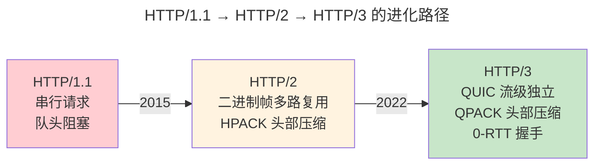

> Web 世界的通用语言。

传输层提供端到端的字节流，应用层定义了字节流的语义：HTTP 的请求/响应模型、DNS 的分层查询、TLS 的加密握手。本章以 DNS 递归解析为起点，走过 HTTP/1.1 到 HTTP/3 的三代进化。

---

## DNS：互联网的电话簿

DNS 递归解析路径：客户端 → 本地解析器 → 根 → .com TLD → example.com 权威 → A 记录。每个响应携带 TTL，中间解析器据此缓存。DoH/DoT 将 DNS 查询加密在 TLS 隧道中，防止窥探和篡改。

---

## HTTP：从 1.1 到 3.0

| 版本 | 传输层 | 队头阻塞 | 首发 |
|------|--------|---------|------|
| HTTP/1.1 | TCP（串行） | TCP + 应用层 | 1997 |
| HTTP/2 | TCP（多路复用） | TCP 层仍有 | 2015 |
| HTTP/3 | QUIC (UDP) | **无** | 2022 |

---

## TLS 1.3：1-RTT 握手的极简主义

TLS 1.3 移除了静态 RSA——所有密钥交换必须使用前向安全性（ECDHE）。1-RTT 握手：客户端猜测服务器支持的密钥共享参数，猜对则 1 RTT 完成。0-RTT 重连：使用预共享密钥直接携带应用数据——但有重放攻击风险。

---

## 跨卷连接

| 概念 | 关联 |
|----------|------|
| HTTP/2 多路复用 | [RTOS 任务时间片轮转](../02-jiezi/03-rtos-fundamentals/) |
| TLS 1.3 DH 密钥交换 | [非对称加密 ECC/DH 算法](../../07-tianshu/02-asymmetric-cryptography/) |
| QPACK 头部压缩 | [Huffman 编码——HPACK 的熵编码](../../00-lingxi/04-algorithm-theory/) |

:::tip[卷三内部路径]
- [**传输层**](../06-transport-tcp-udp-quic/)：QUIC——HTTP/3 的传输基础
- [**网络编程**](../08-network-programming/)：Socket——HTTP 服务的底层 API
:::
