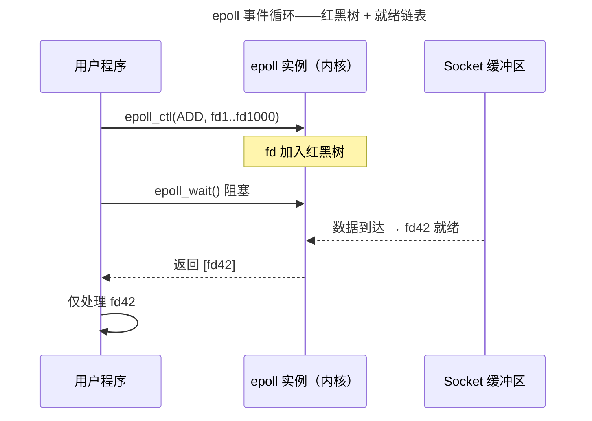

> 从系统调用到内核旁路。

网络编程的进化史就是不断将"内核参与"推向"用户态直接操作硬件"的历史。从 Socket API 到 epoll 事件驱动，从 io_uring 异步革命到 DPDK 内核旁路。

---

## Socket API：阻塞与非阻塞 I/O

TCP 连接由五元组唯一标识：`(源IP, 源端口, 目标IP, 目标端口, 协议)`。服务器调用链：`socket() → bind() → listen() → accept()`——`accept()` 返回新的 `client_fd`，与 `listen_fd` 分离。

**阻塞 I/O** 是默认模式——`read()` 在有数据到达前挂起线程。当需要同时服务多个连接时，单线程阻塞模型不可行：要么每个连接一个线程（线程数 = 连接数，上下文切换成为瓶颈），要么使用 I/O 多路复用。

**非阻塞 I/O** —— `fcntl(fd, F_SETFL, O_NONBLOCK)` —— 让 `read()` 在没有数据时立即返回 `EAGAIN`。这使单线程可以在多个 fd 间轮询，但纯轮询浪费 CPU。epoll 正是为"等待"而非"轮询"而设计——epoll_wait() 阻塞直到至少一个 fd 就绪。

---

## I/O 多路复用：select → poll → epoll

| 特性 | select | poll | epoll |
|------|--------|------|-------|
| 最大 fd | 1024 | 无限制 | 无限制 |
| 扫描方式 | O(n) 全扫描 | O(n) 全扫描 | O(1) 仅就绪 |
| 注册/触发 | 不分离 | 不分离 | 分离（一次注册） |



---

## io_uring：零系统调用的异步 I/O

io_uring 的核心是两块**共享环形缓冲区**：SQ（用户写入请求）、CQ（内核写入完成结果）。高吞吐场景下用户态向 SQ 写入请求无需进入内核——一个内存屏障后内核轮询消费 SQ。

```c
// io_uring 提交 read 请求——零系统调用
struct io_uring_sqe *sqe = io_uring_get_sqe(&ring);
io_uring_prep_read(sqe, fd, buf, size, offset);
io_uring_submit(&ring);  // 内存屏障，内核读 SQ
```

### 边缘触发 vs 水平触发——epoll 最常见的使用陷阱

epoll 提供两种触发模式：

| 模式 | 行为 | `epoll_wait` 返回条件 |
|------|------|----------------------|
| **水平触发**（LT，默认） | fd 可读时就绪通知 | 只要缓冲区非空，**每次** `epoll_wait` 都返回该 fd |
| **边缘触发**（ET，`EPOLLET`） | fd 状态变化时通知 | 仅在"不可读→可读"的**边沿**返回一次 |

ET 模式下，必须循环 `read()` 直到返回 `EAGAIN`——否则剩余数据永远不会触发新的就绪通知：

```c
// EPOLLET 的正确使用——耗尽读缓冲区
ev.events = EPOLLIN | EPOLLET;  // 边沿触发
epoll_ctl(epfd, EPOLL_CTL_ADD, fd, &ev);

// 事件循环中
while (1) {
    n = read(fd, buf, sizeof(buf));
    if (n == -1 && errno == EAGAIN) break;  // 耗尽！
    // 处理 buf...
}
```

> 新手最常见的 bug：ET 模式下只 `read()` 一次——TCP 流中部分数据被遗留，且永远不会再次触发就绪通知。

### Reactor vs Proactor——I/O 设计的两种哲学

| 模式 | 事件通知 | I/O 执行者 | 代表 |
|------|---------|-----------|------|
| **Reactor** | "数据就绪了，你来读" | 应用程序执行 `read()` | `epoll` + `read()` |
| **Proactor** | "数据已读完，给你" | 内核执行 I/O | `io_uring` + SQ/CQ |

epoll 是经典的 Reactor——内核通知你"fd 可读"，你仍要自己调用 `read()`。io_uring 是 Proactor——你把 `read` 请求写入 SQ，内核完成后在 CQ 中写入结果。Proactor 天然适配异步编程，消除了 Reactor 中"通知就绪→实际读取"之间的同步开销。

---

`sendfile(sock_fd, file_fd, &offset, size)` 在内核空间直接将 Page Cache 数据推送到 Socket 缓冲区——零用户态拷贝。底层依赖 DMA 引擎和网卡 Scatter-Gather DMA。

---

## DPDK 与 XDP：内核旁路的两条路线

- **DPDK**：通过 UIO/VFIO 将网卡 PCI BAR 映射到用户态——应用程序直接操作网卡寄存器，内核完全不知包的存在。适合 5G UPF、高频交易网关。
- **XDP + eBPF**：在内核网络栈之前的网卡驱动层运行 eBPF 程序——比内核栈快得多（旁路大部分处理），但比 DPDK 更安全（内核监管）。适合 DDoS 防御、容器网络加速。

---

## 跨卷连接

| 概念 | 关联 |
|------|------|
| 阻塞 vs 非阻塞 + EPOLLET | [自旋锁忙等 vs 互斥锁睡眠——同一哲学](../04-synchronization/) | [Go netpoller——epoll 的 goroutine 封装](../../08-qianli/01-design-patterns-and-principles/) |
| epoll 红黑树 | [CFS 调度器的红黑树](../01-process-and-thread/) | [Kafka 索引跳跃表](../../04-yuanhai/05-data-pipelines/) |
| reactor vs proactor | [中断上半部 vs 下半部——同步通知 vs 异步完成](../../02-jiezi/02-interrupts/) | [Node.js libuv——跨平台 reactor 抽象](../../05-wanxiang/03-frontend-engineering/) |
| io_uring 环形缓冲 | [DMA 乒乓缓冲环形描述符](../../02-jiezi/04-peripheral-drivers/) | [DPDK 无锁环形队列（rte_ring）](../../08-qianli/02-system-design/) |
| sendfile 零拷贝 | [DMA 分散-聚集模式](../../02-jiezi/04-peripheral-drivers/) | [RDMA 远程直接内存访问](../../04-yuanhai/03-distributed-fundamentals/) |
| XDP eBPF | [中断向量表的硬件跳转](../../02-jiezi/02-interrupts/) | [Landlock——eBPF 的安全策略框架](../../07-tianshu/05-system-security/) |

:::tip[卷三内部路径]
- [**文件系统**](../03-filesystem/)：`sendfile()` 依赖 Page Cache
- [**同步原语**](../04-synchronization/)：io_uring 的无锁 SQ/CQ——CAS 的应用
:::
