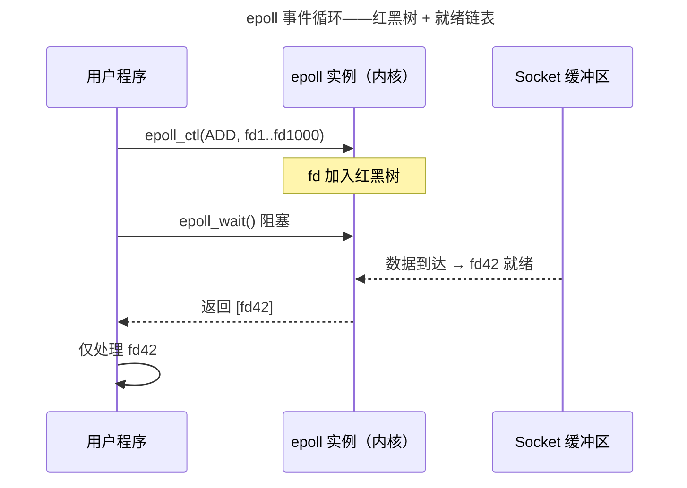

> 从系统调用到内核旁路。

网络编程的进化史就是不断将"内核参与"推向"用户态直接操作硬件"的历史。从 Socket API 到 epoll 事件驱动，从 io_uring 异步革命到 DPDK 内核旁路。

---

## Socket API：五元组

TCP 连接由五元组唯一标识：`(源IP, 源端口, 目标IP, 目标端口, 协议)`。服务器调用链：`socket() → bind() → listen() → accept()`——`accept()` 返回新的 `client_fd`，与 `listen_fd` 分离。

---

## I/O 多路复用：select → poll → epoll

| 特性 | select | poll | epoll |
|------|--------|------|-------|
| 最大 fd | 1024 | 无限制 | 无限制 |
| 扫描方式 | O(n) 全扫描 | O(n) 全扫描 | O(1) 仅就绪 |
| 注册/触发 | 不分离 | 不分离 | 分离（一次注册） |



---

## io_uring：零系统调用的异步 I/O

io_uring 的核心是两块**共享环形缓冲区**：SQ（用户写入请求）、CQ（内核写入完成结果）。高吞吐场景下用户态向 SQ 写入请求无需进入内核——一个内存屏障后内核轮询消费 SQ。

```c
// io_uring 提交 read 请求——零系统调用
struct io_uring_sqe *sqe = io_uring_get_sqe(&ring);
io_uring_prep_read(sqe, fd, buf, size, offset);
io_uring_submit(&ring);  // 内存屏障，内核读 SQ
```

---

## sendfile：零拷贝文件传输

`sendfile(sock_fd, file_fd, &offset, size)` 在内核空间直接将 Page Cache 数据推送到 Socket 缓冲区——零用户态拷贝。底层依赖 DMA 引擎和网卡 Scatter-Gather DMA。

---

## DPDK 与 XDP：内核旁路的两条路线

- **DPDK**：通过 UIO/VFIO 将网卡 PCI BAR 映射到用户态——应用程序直接操作网卡寄存器，内核完全不知包的存在。适合 5G UPF、高频交易网关。
- **XDP + eBPF**：在内核网络栈之前的网卡驱动层运行 eBPF 程序——比内核栈快得多（旁路大部分处理），但比 DPDK 更安全（内核监管）。适合 DDoS 防御、容器网络加速。

---

## 跨卷连接

| 概念 | 关联 |
|------|------|
| epoll 红黑树 | [CFS 调度器的红黑树](../01-process-and-thread/) |
| io_uring 环形缓冲 | [DMA 乒乓缓冲环形描述符](../02-jiezi/04-peripheral-drivers/) |
| sendfile 零拷贝 | [DMA 分散-聚集模式](../02-jiezi/04-peripheral-drivers/) |
| XDP eBPF | [中断向量表的硬件跳转](../02-jiezi/02-interrupts/) |

:::tip[卷三内部路径]
- [**文件系统**](../03-filesystem/)：`sendfile()` 依赖 Page Cache
- [**同步原语**](../04-synchronization/)：io_uring 的无锁 SQ/CQ——CAS 的应用
:::
