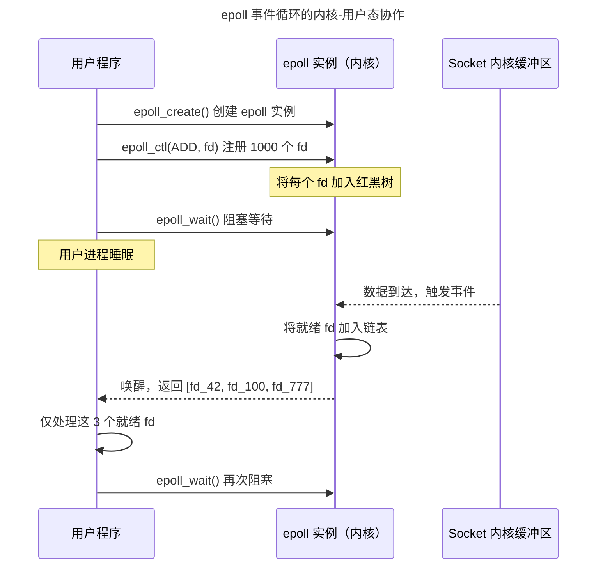

> 从系统调用到内核旁路。

网络协议栈定义了数据在链路上的传输规则，而**网络编程**定义了应用程序如何操作这些规则。从 Berkeley Socket API 的经典五元组，到 epoll 的事件驱动模型，再到 io_uring 的异步 I/O 革命，最后抵达 DPDK 的内核旁路——网络编程的进化史就是不断将"内核参与"推向"用户态直接操作硬件"的历史。

本章从最基本的 Socket 创建和连接出发，走过 I/O 多路复用的三代系统调用（select → poll → epoll），深入 io_uring 的共享环形缓冲区机制，最终抵达 DPDK 和 XDP/eBPF 的内核旁路世界。

---

## Socket API：一切的起点

### 五元组与连接建立

Socket 是内核提供给用户态的网络编程接口。一个 TCP 连接由**五元组**唯一标识：`(源IP, 源端口, 目标IP, 目标端口, 协议)`。服务器端的典型调用链：

```c
int listen_fd = socket(AF_INET, SOCK_STREAM, 0); // 创建 TCP Socket
bind(listen_fd, &addr, sizeof(addr));            // 绑定端口
listen(listen_fd, BACKLOG);                       // 监听
int client_fd = accept(listen_fd, NULL, NULL);   // 接受连接
```

`accept()` 返回的 `client_fd` 是一个新的 Socket——与 `listen_fd` 不同，它绑定到特定的客户端连接上。内核维护了两类 Socket 的分离，使服务器可以同时接受新连接和处理已建立的连接。

---

## I/O 多路复用：从 select 到 epoll

### 三代系统调用的比较

| 特性 | select | poll | epoll |
|------|--------|------|-------|
| **最大 fd 数** | 1024（`FD_SETSIZE`） | 无限制 | 无限制 |
| **数据结构** | 固定大小位图 | 变长 pollfd 数组 | 红黑树 + 就绪链表 |
| **扫描方式** | 线性扫描所有 fd | 线性扫描所有 fd | 仅遍历就绪 fd |
| **注册/触发分离** | 不分离 | 不分离 | 分离（注册一次，反复触发） |
| **复杂度** | $O(n)$ | $O(n)$ | $O(1)$（返回就绪 fd 数） |

`epoll` 的性能优势在于**事件驱动**——通过 `epoll_ctl()` 预先注册感兴趣的文件描述符，内核将其插入红黑树。当事件发生时，内核将对应的 epoll 条目加入就绪链表。`epoll_wait()` 只需遍历这个就绪链表（通常很短），而非扫描所有 fd。



---

## io_uring：异步 I/O 的革命

io_uring 是 Linux 5.1 引入的下一代异步 I/O 接口，与 epoll 的关键区别是**零系统调用**的数据传输路径：

### 共享环形缓冲区

io_uring 的核心是两块在内核和用户态之间共享的环形缓冲区：

- **SQ**（Submission Queue）：用户态写入 I/O 请求，内核读取
- **CQ**（Completion Queue）：内核写入 I/O 完成结果，用户态读取

用户态向 SQ 写入请求时**不需要进入内核**——只需递增 SQ 的尾指针，然后通过一个内存屏障（`io_uring_enter` 或 `IORING_SETUP_SQPOLL` 内核线程）通知内核。高吞吐场景下，内核通过轮询模式主动消费 SQ 条目——用户态全程零系统调用：

```c
/* 向 io_uring 提交一个 read 请求——无需切换到内核 */
struct io_uring_sqe *sqe = io_uring_get_sqe(&ring);
io_uring_prep_read(sqe, fd, buf, size, offset);
io_uring_sqe_set_data(sqe, user_data);
io_uring_submit(&ring); /* 内存屏障后内核读 SQ */

/* 之后从 CQ 获取完成结果——也无需切换到内核 */
struct io_uring_cqe *cqe;
io_uring_wait_cqe(&ring, &cqe);
handle_completion(cqe);
```

---

## 零拷贝：sendfile 与 splice

传统 `read() + write()` 将数据从磁盘读到用户态缓冲区，再写到 Socket——**四次上下文切换，两次数据拷贝**。`sendfile()` 系统调用在内核空间直接将 Page Cache 中的文件数据推送到 Socket 缓冲区——零用户态拷贝，上下文切换减半：

```c
/* 零拷贝文件传输：4次切换 → 2次切换，2次拷贝 → 1次拷贝 */
ssize_t sent = sendfile(socket_fd, file_fd, &offset, file_size);
```

:::note[sendfile 的硬件基础]
`sendfile()` 的底层依赖于 [DMA 引擎](../02-jiezi/04-peripheral-drivers/#dma解放-cpu-的数据搬运工) 直接从磁盘控制器传输数据到内存，以及网卡的 SG（Scatter-Gather）DMA 从不连续的物理页框中收集数据发送。零拷贝不是没有拷贝——而是将拷贝操作从 CPU 转移到 DMA 控制器。
:::

---

## DPDK 与 XDP：内核旁路的两条路线

### DPDK：用户态协议栈

DPDK（Data Plane Development Kit）将网卡完全从内核手中"抢夺"过来——通过 `uio` 或 `vfio-pci` 驱动将网卡的 PCI BAR 映射到用户态，应用程序直接操作网卡寄存器、DMA 描述符环和包缓冲区。内核完全不知道这些包的存在。

代价是：用户态必须自己实现一整套协议栈（ARP、IP、TCP 或至少 UDP）——DPDK 只提供包的收发，不提供传输层语义。这使 DPDK 适合电信级包转发（如 5G UPF、高频交易网关），但不适合通用服务器。

### XDP + eBPF：内核内的安全旁路

XDP（eXpress Data Path）运行在内核中，但在网络协议栈之前——在网卡驱动接收到包的最早时刻，eBPF 程序就可以处理并决定丢弃/转发/传递给协议栈。它比 DPDK 更安全（内核监管）、比内核协议栈更快（旁路了大部分内核网络栈），是 DDoS 防御、负载均衡和容器网络加速的理想选择。

---

## 跨卷连接

网络编程是"从寄存器到分布式系统"的最后一环——它让应用层协议不再仅仅是纸上规范，而是可执行、可优化的代码：

| 本章概念 | 依赖的底层原理 | 支撑的上层抽象 |
|----------|---------------|---------------|
| epoll 红黑树 + 就绪链表 | [CFS 调度器的红黑树](../01-process-and-thread/#调度算法cfs-的红黑树与-eevdf) | [Kubernetes 控制器的事件驱动模型](../../08-qianli/03-devops-practices/) |
| io_uring 共享环形缓冲区 | [DMA 乒乓缓冲环形描述符](../02-jiezi/04-peripheral-drivers/#dma解放-cpu-的数据搬运工) | [RDMA 发送/接收队列对（QP）](../../04-yuanhai/03-distributed-fundamentals/) |
| sendfile 零拷贝 | [DMA 分散-聚集模式](../02-jiezi/04-peripheral-drivers/#乒乓缓冲与分散-聚集) | [CDN 边缘节点的零拷贝分发](../../04-yuanhai/05-data-pipelines/) |
| DPDK PMD 轮询模式 | [裸机轮询 vs 中断驱动模型](../02-jiezi/01-bare-metal/) | [高频交易 FPGA 网关](../../05-wanxiang/05-human-computer-interaction/) |
| XDP eBPF 钩子 | [中断向量表的硬件跳转机制](../02-jiezi/02-interrupts/#向量表与-isr-入口从硬件到软件的一跃) | [Cilium 的 eBPF 容器网络策略](../../08-qianli/02-system-design/) |

:::tip[卷三内部路径]
- [**进程与线程**](../01-process-and-thread/)：`select`/`epoll` 阻塞的进程状态——TASK_INTERRUPTIBLE
- [**文件系统**](../03-filesystem/)：`sendfile()` 依赖 Page Cache——文件系统与网络栈的交汇点
- [**同步原语**](../04-synchronization/)：io_uring 的无锁 SQ/CQ 环形缓冲区——原子操作的应用
:::
