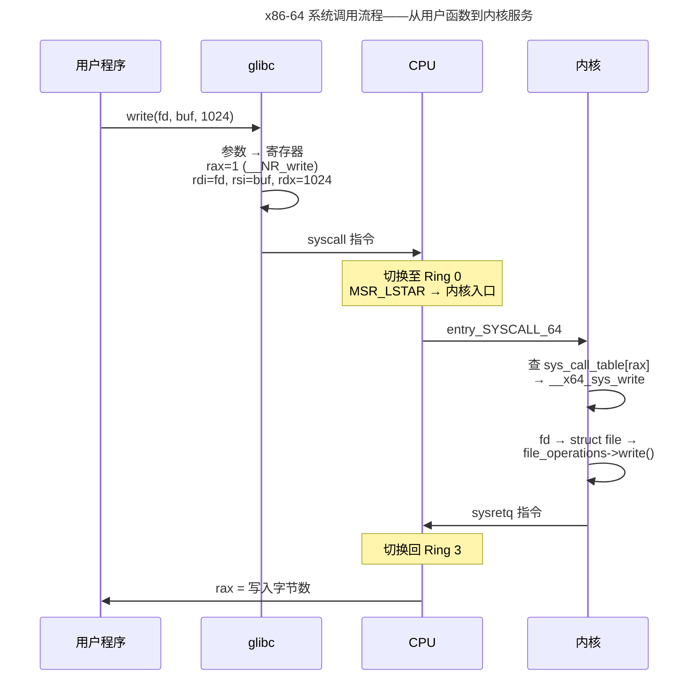

> 定乾坤，理乱象，调度万物。

乾坤者，天地之序。此卷聚焦操作系统内核与网络协议栈——前者管理硬件资源、调度万千进程；后者连接孤岛、编织通信之网。理解内核，方能理解一切上层软件的边界与可能。

## 系统调用的本质——穿越用户态到内核态的边界

所有应用程序对硬件的访问——读写文件、收发网络包、分配内存——最终都汇聚为一个共同入口：**系统调用**。它的工作机制是理解操作系统的第一块基石：



关键开销来源：**特权级切换**（Ring 3 → Ring 0，CPU 保存/恢复 MSR/段寄存器）、**页表切换**（用户页表到内核页表——x86-64 上内核映射到高 128TB，PTI 补丁使切换不可避免）、**TLB 污染**（内核代码/数据驱逐用户 TLB 条目）。一次空系统调用（`getpid()`）的典型代价约 150-250 ns。

## 内核启动——从固件到第一个进程

```
固件  →  引导加载器 →  内核  →  init
  │         │         │        │
UEFI    GRUB2     bzImage    systemd (PID 1)
设置    加载内核    解压→       挂载 rootfs
内存    到内存      start_     启动服务
映射               kernel()    → 登录提示符
```

`start_kernel()` 依次初始化：中断描述符表（IDT）→ 内存管理（伙伴系统 + slab）→ 调度器 → VFS → 网络栈 → 最后启动 `init` 进程（PID 1）。`init` 是所有用户进程的祖先——`pstree` 的根。

## cgroups 与 namespace——容器的 OS 底座

容器不是虚拟化——它是 Linux 两个老特性的组合：

| 特性 | 作用 | 容器对应 |
|------|------|---------|
| **namespace** | 隔离——让进程"看到"不同的系统视图 | `docker run --network=bridge`（net ns）、`--pid=host`（PID ns） |
| **cgroups v2** | 限制——控制进程组可使用的资源量 | `--memory=512m`（memory cgroup）、`--cpus=2`（cpu cgroup） |

七种 namespace（Mount/PID/Net/IPC/UTS/User/Cgroup）各自独立，`clone()` 时通过标志位选择性加入。cgroups v2 使用统一的层级模型（`/sys/fs/cgroup/`），通过 `memory.max`、`cpu.max` 等文件进行声明式资源控制。

---

## 章节导览

- [**进程与线程**](./01-process-and-thread/)：创建、调度、上下文切换、进程间通信
- [**内存管理**](./02-memory-management/)：虚拟内存、分页、缺页中断、内存映射
- [**文件系统**](./03-filesystem/)：VFS、ext4、FUSE、日志与一致性
- [**同步原语**](./04-synchronization/)：互斥锁、读写锁、RCU、futex
- [**网络协议栈 I · TCP/IP**](./05-network-protocol-stack/)：分层模型、IP 路由、转发
- [**网络协议栈 II · 传输层**](./06-transport-tcp-udp-quic/)：TCP 拥塞控制、UDP、QUIC
- [**网络协议栈 III · 应用层**](./07-application-protocols/)：DNS、HTTP/1/2/3、TLS
- [**网络编程**](./08-network-programming/)：Socket、epoll、io_uring、DPDK

:::tip[跨卷链接]
虚拟地址翻译 → [卷一 · 微尘](../../01-weichen/) 中的 MMU 与 TLB
分布式一致性 → [卷四 · 渊海](../../04-yuanhai/) 中的共识算法
容器与隔离 → [卷八 · 千里](../../08-qianli/) 中的 DevOps 实践
:::
