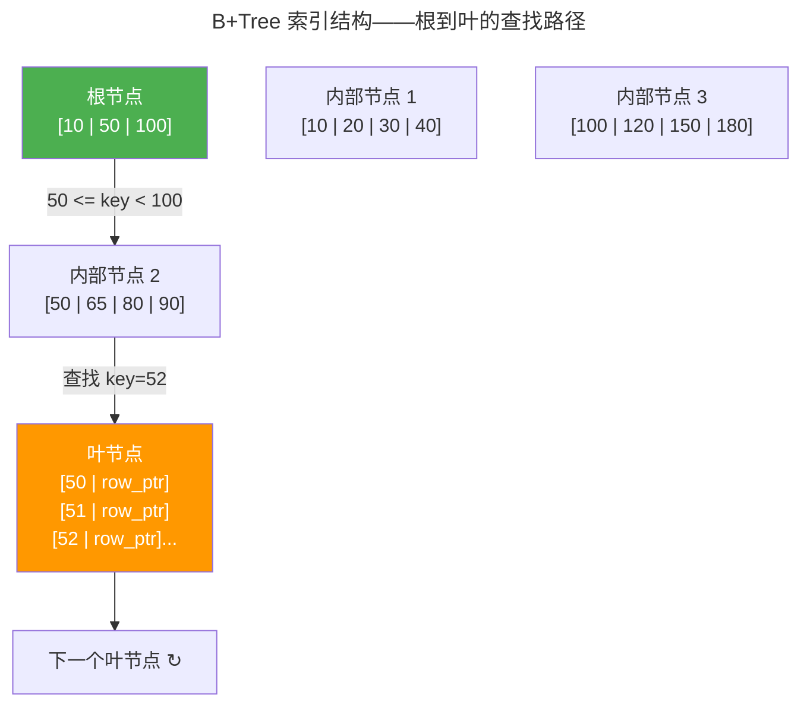

> 关系代数如何统治世界。

1970 年，Edgar F. Codd 发表了 *A Relational Model of Data for Large Shared Data Banks*，提出用**关系**（Relation）——数学意义上的表——来组织数据。五十年后，关系型数据库依然是数据存储的绝对主流。不是因为它的查询语言优雅，而是因为它提供了一个极其强大的承诺：**ACID 事务**——原子性、一致性、隔离性和持久性。

本章从 SQL 查询的执行计划出发，深入 B+Tree 索引的磁盘布局，解剖查询优化器的成本模型与谓词下推，最后以 MVCC 多版本并发控制和隔离级别收尾。读完本章，你将理解为什么一个简单的 `SELECT` 语句背后可能涉及数百次磁盘 I/O 的精妙编排。

---

## SQL 查询计划：从声明到执行

SQL 是一种**声明式语言**——你说"我要什么"，而不是"怎么做"。查询优化器负责把声明式的 SQL 翻译为高效的执行计划。一个简单的查询可能有多达数千种等价的执行方式，优化器的任务是在合理时间内找到代价最小的那个。

### B+Tree 索引：磁盘友好的查找树

B+Tree 是数据库索引的事实标准。它与二叉搜索树的关键区别在于**节点的高扇出**——每个节点包含数百个键值对，使整棵树的高度通常只有 2-4 层。在机械硬盘时代，这意味着一次索引查找最多只需 2-4 次磁盘寻道：



所有数据指针只存在于叶节点——内部节点仅用于导航。叶节点之间通过双向链表连接，使范围查询（`WHERE id BETWEEN 100 AND 200`）在找到起始键后只需沿链表顺序扫描，无需回溯上层节点。

---

## 查询优化器：成本和选择性估算

优化器的核心是**成本模型**（Cost Model）：它为每个候选执行计划估算一个代价（通常是磁盘 I/O 次数和 CPU 时间），选择代价最小的计划。成本估算的关键输入是**统计信息**——表行数、列的不同值数量（cardinality）、最常见的值（MCV）和值的分布直方图。

**谓词下推**（Predicate Pushdown）是优化器最重要的一条规则：将 WHERE 条件的求值尽可能早地执行——在扫描数据之前先过滤掉不相关行。例如：

```sql
-- 原始查询
SELECT * FROM orders
WHERE order_date > '2026-01-01' AND status = 'shipped';

-- 优化器推演：先按 order_date 过滤，再按 status 过滤
-- 如果 order_date 上有索引，直接索引扫描跳过无关行
```

---

## 事务与 ACID

**事务**（Transaction）将一组操作打包为一个原子单元——要么全部成功，要么全部不执行。ACID 是这个原子单元的四个保证：

| 属性 | 含义 | 实现机制 |
|------|------|---------|
| **Atomicity** | 全部成功或全部回滚 | Undo Log（回滚日志） |
| **Consistency** | 事务前后的数据满足所有约束 | 主键、外键、CHECK 约束 |
| **Isolation** | 并发事务互相不可见 | MVCC + 锁 |
| **Durability** | 已提交的事务永不丢失 | WAL（Write-Ahead Log） + 磁盘 fsync |

---

## MVCC：多版本并发控制

MVCC 的核心思想简单但强大：**读不阻塞写，写不阻塞读**。每个事务看到的是数据库在某个时间点的**快照**（Snapshot），而不是当前最新的数据。实现机制：

- 每行数据携带创建该版本的事务 ID（`xmin`）和删除该版本的事务 ID（`xmax`）
- 事务开始时获取一个全局递增的快照 ID
- 查询只返回 `xmin < snapshot_id < xmax` 的行——即"在这个快照时刻存在"的版本

**隔离级别**定义了事务之间可见性的严格程度：

| 隔离级别 | 脏读 | 不可重复读 | 幻读 | PostgreSQL 实现 |
|---------|------|-----------|------|----------------|
| Read Uncommitted | ✓ | ✓ | ✓ | 等同于 Read Committed |
| Read Committed | ✗ | ✓ | ✓ | 每个语句看到最新提交的快照 |
| Repeatable Read | ✗ | ✗ | ✓（PG 中 ✗） | 事务开始时刻的快照 |
| Serializable | ✗ | ✗ | ✗ | SSI（串行化快照隔离） |

---

## 跨卷连接

数据库是卷三文件系统的"上层建筑"——它将 B+Tree 写入磁盘的方式、WAL 的崩溃恢复机制，都是对文件系统的 Page Cache 和 fsync 的深度依赖：

| 本章概念 | 依赖的底层原理 | 支撑的上层抽象 |
|----------|---------------|---------------|
| B+Tree 页分裂与合并 | [ext4 extent 树的连续块分配](../03-qiankun/03-filesystem/#inode-与-ext4-磁盘布局) | [LSM Tree 的 SSTable 分层合并](../02-storage-engine/) |
| WAL 预写日志 | [ext4 日志的崩溃一致性](../03-qiankun/03-filesystem/#日志崩溃一致性的保证) | [共识协议的 Raft Log](../04-consensus-protocols/) |
| MVCC 多版本 | [Page Cache 脏页管理与回写](../03-qiankun/03-filesystem/#page-cache内存与磁盘的桥梁) | [Git 的内容寻址版本控制](../../08-qianli/03-devops-practices/) |
| 查询优化器成本模型 | [CFS 调度器的 vruntime 公平性计算](../03-qiankun/01-process-and-thread/#调度算法cfs-的红黑树与-eevdf) | [Spark Catalyst 优化器规则引擎](../05-data-pipelines/) |
| 谓词下推 | [流水线前递——数据在流水级间提前可用](../../01-weichen/03-microarchitecture/#流水线冒险打破时空的魔咒) | [列式存储的谓词向量化执行](../02-storage-engine/) |

:::tip[卷四内部路径]
- [**存储引擎**](../02-storage-engine/)：B+Tree 与 LSM Tree——索引的物理实现
- [**分布式基础**](../03-distributed-fundamentals/)：CAP 定理——单机 ACID 到分布式一致性的跃迁
- [**共识协议**](../04-consensus-protocols/)：Raft——分布式事务的提交依赖共识
- [**数据流水线**](../05-data-pipelines/)：Kafka——事务日志的流式消费
:::
