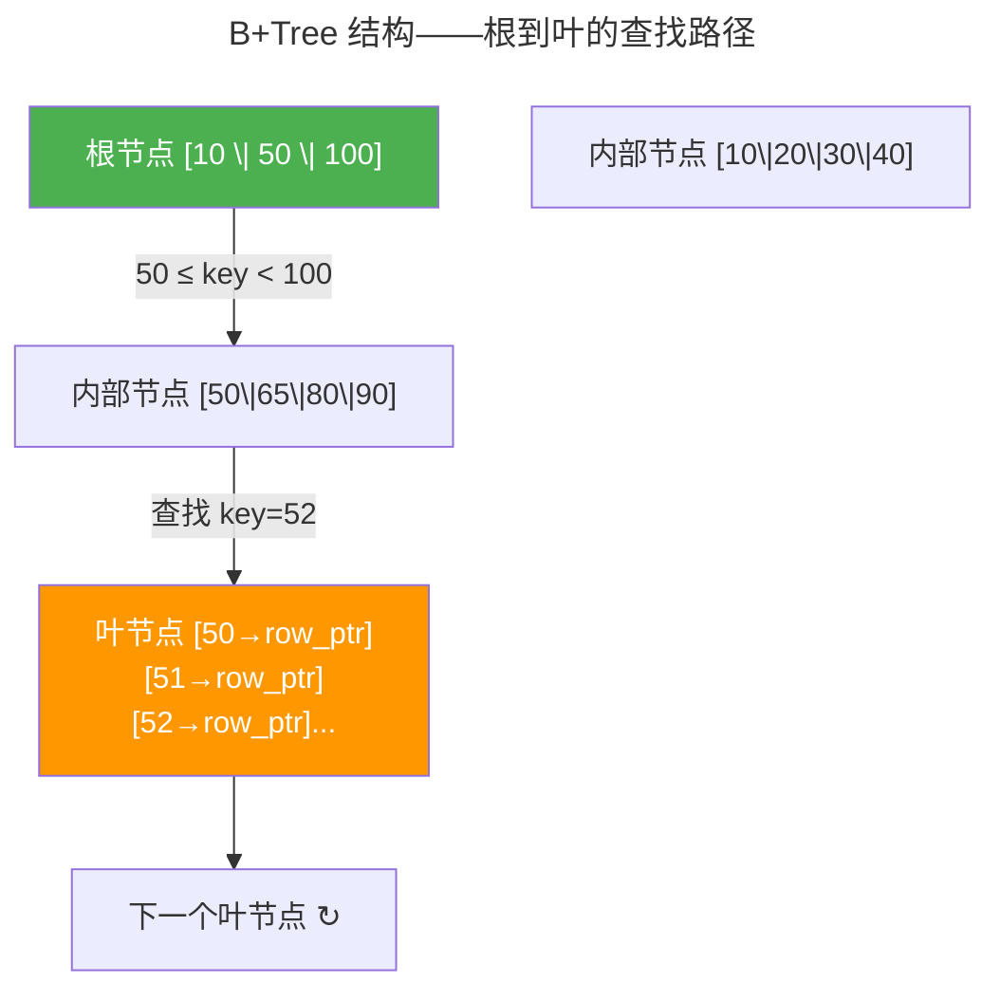

> 关系代数如何统治世界。

1970 年 Codd 提出关系模型。五十年后，关系型数据库依然是数据存储的主流——因为它提供了**ACID 事务**这一强大承诺。本章深入 B+Tree 索引、查询优化器与 MVCC 多版本并发控制。

---

## B+Tree 索引：磁盘友好的查找树

B+Tree 每个节点包含数百个键，使整棵树高度仅 2-4 层。所有数据指针只存在于叶节点——叶节点通过双向链表连接，范围查询沿链表顺序扫描。

写入时触发**页分裂**：页填满后被一分为二，父节点更新键范围。这就是为什么自增主键（总是插入最右叶节点）比随机 UUID 高效——随机 UUID 导致频繁的页分裂。

---

## 查询优化器

优化器的核心是**成本模型**：为每个候选计划估算 I/O + CPU 代价。**谓词下推**将 WHERE 条件尽可能早执行——在扫描前先过滤掉无关行。如果 `WHERE status = 'shipped'` 且 status 上有索引，优化器直接索引扫描跳过无关行。

---

## 事务与 MVCC

ACID 的四个保证：**原子性**（Undo Log）、**一致性**（约束）、**隔离性**（MVCC + 锁）、**持久性**（WAL + fsync）。

MVCC 的核心：每行携带 `xmin`（创建该版本的事务 ID）和 `xmax`（删除该版本的事务 ID）。事务看到的是开始时刻的快照——**读不阻塞写，写不阻塞读**。

| 隔离级别 | 脏读 | 不可重复读 | 幻读 |
|---------|------|-----------|------|
| Read Committed | ✗ | ✓ | ✓ |
| Repeatable Read | ✗ | ✗ | ✓（PG 中 ✗） |
| Serializable | ✗ | ✗ | ✗ |

---

## 跨卷连接

| 概念 | 关联 |
|----------|------|
| B+Tree 页分裂 | [ext4 extent 树连续块分配](../03-qiankun/03-filesystem/) |
| WAL 预写日志 | [ext4 日志的崩溃一致性](../03-qiankun/03-filesystem/) |
| MVCC 快照隔离 | [Git 内容寻址版本控制](../../08-qianli/03-devops-practices/) |
| 谓词下推 | [流水线前递——数据提前可用](../../01-weichen/03-microarchitecture/) |

:::tip[卷四内部路径]
- [**存储引擎**](../02-storage-engine/)：B+Tree vs LSM Tree
- [**共识协议**](../04-consensus-protocols/)：分布式事务提交依赖共识
:::
